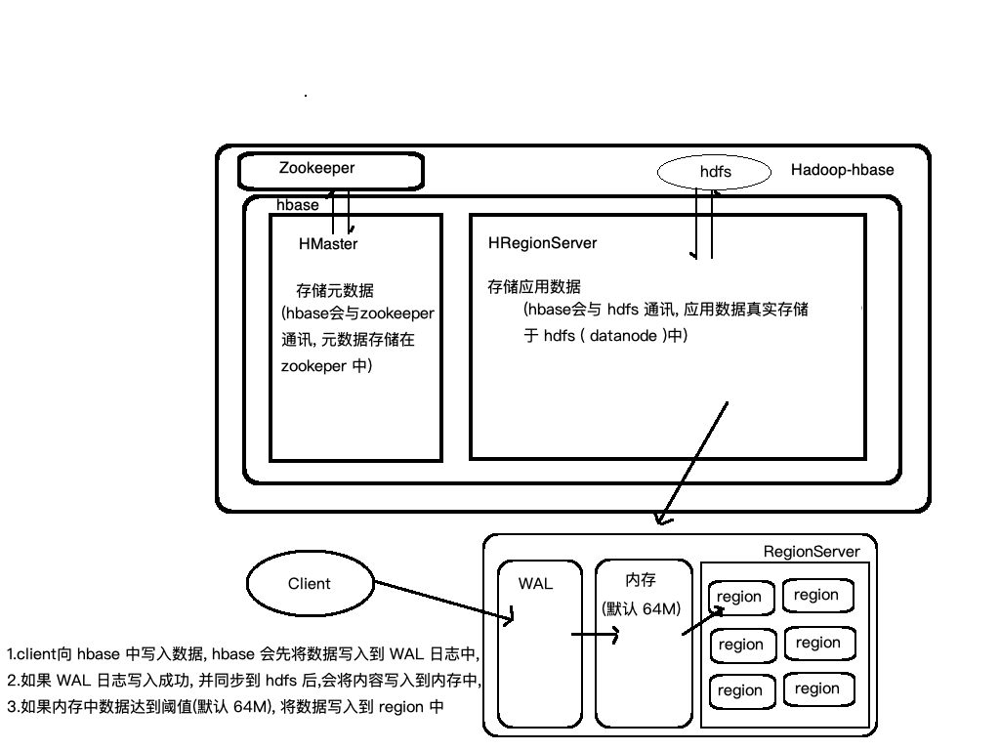
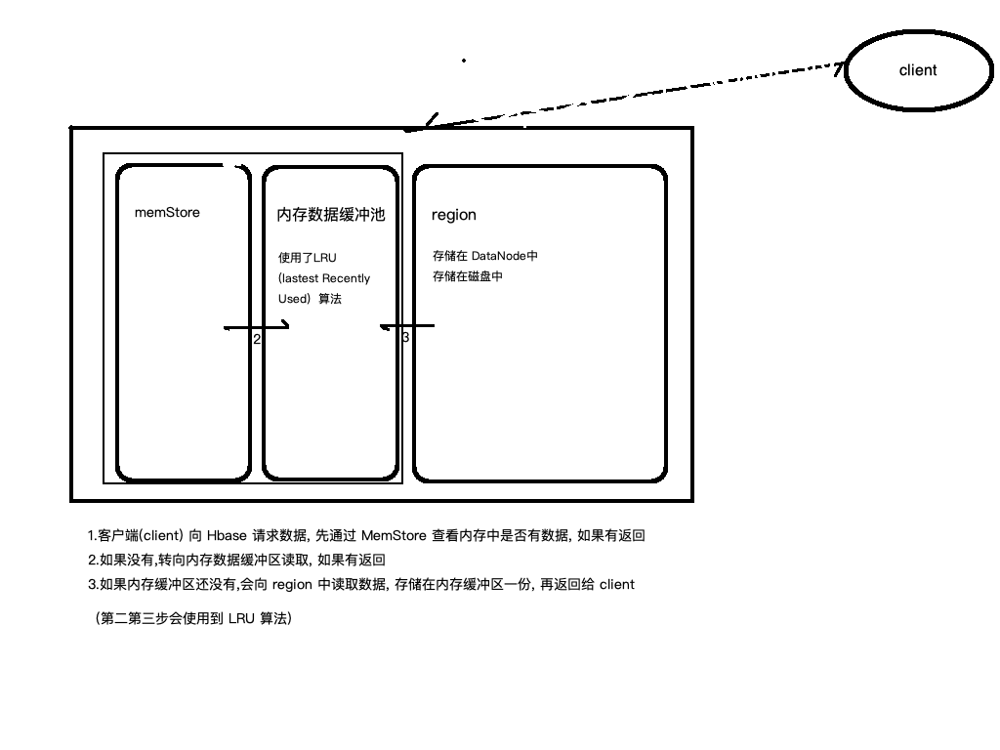
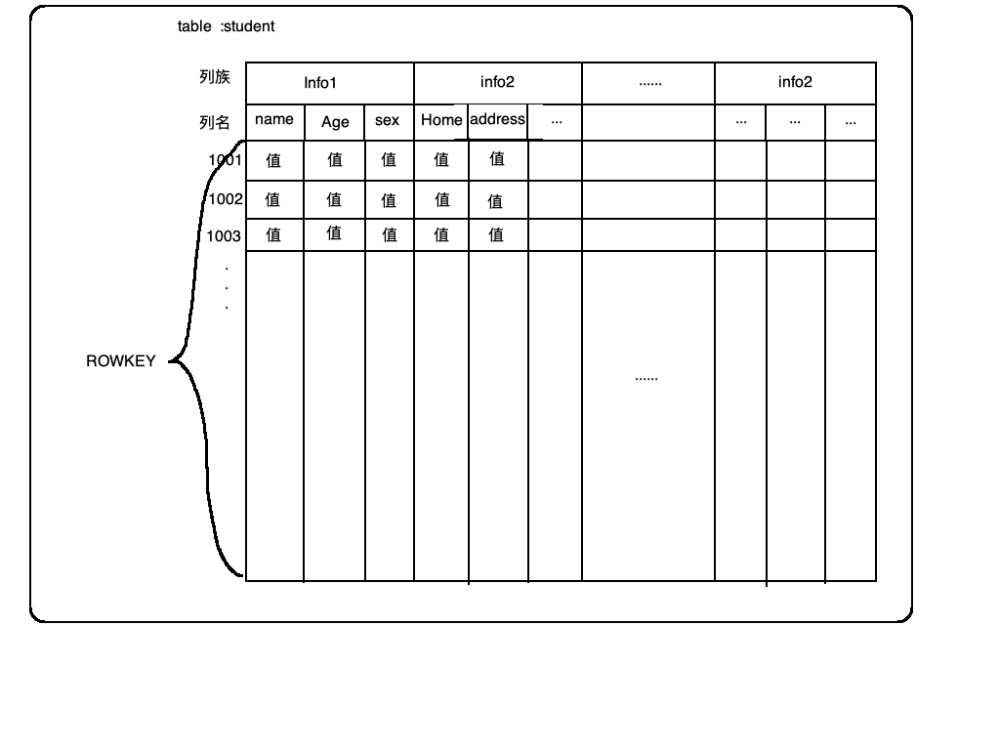
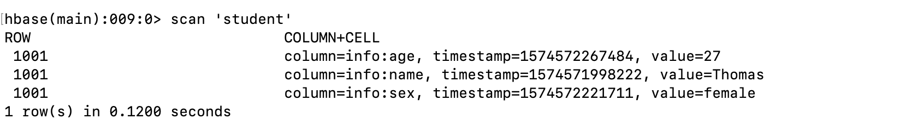
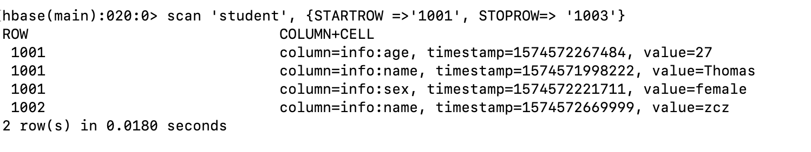
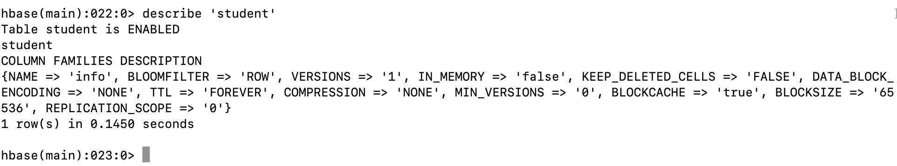
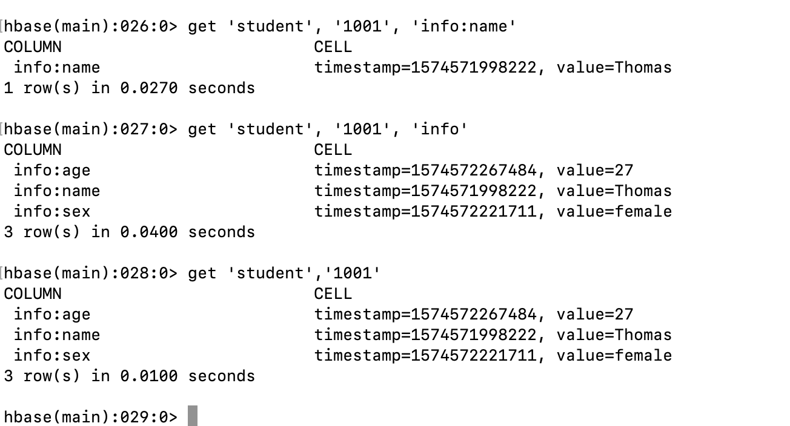

# Hbase 学习笔记


### hbase架构


### hbase 数据安全性

hbase 的数据安全性 依赖于 wal (wirte-ahead-log)机制



**WAL:** (Write-Ahead-Log) 预写入日志;  确保完整数据丢失后的恢复数据; wal 机制可开启可关闭

**Hlog**:WAL 写入的日志

hlog和内存中的数据,仅表示档次操作的写入, 最终同步到 region 成功后, hlog和内存数据会删除

### hbase 数据读取优化



**LRU** 最多最近使用算法;对使用最频繁和最仅使用数据缓存

**LSM** (Log-Structure-Meger-tree) 周期性闲时合并小文件为大文件, 降低 namenode 压力, 提高数据访问速度

### hbase数据存储结构




### hbase操作

1. hbase 控制台操作

   * 进入 hbase shell

     ```shell
     $ hbase shell
     ```

   * list 查看表

     ```shell
     > list
     ```

   * 创建表

     ```shell
     > create 'student', 'info'
     ```

     student :  表名

     info: 列族名

   * 插入数据

     ```shell
     > put 'student','1001','info:name', 'Thomas'
     ```

     ​	插入	'表名'		'ROWKEY'	'列族名:列名'	'值'

   * 查询表数据

     ```shell
     > scan 'student'
     ```

     

     返回的值格式  列族:列名, 时间戳, 值

   * 根据 rowkey 取范围

     ```shell
     > scan 'student', {STARTROW=>'1001', STOPROW=>'1003'}
     ```

     

   * 查看表结构

     ```shell
     > describe 'student'
     ```

     

   * 获取数据

     ```shell
     > get 'student', '1001', 'info:name'
     > get 'student', '1001', 'info'
     > get 'student', '1001'
     ```

     

   * 删除数据

     * 删除整个 ROWKEY

       ```shell
       > deleteall 'student', '1003'
       ```

     * 删除某个 ROWKEY 中某一列的数据

       ```shell
       > delete 'student', '1001', 'info:sex'
       ```

     * 清空表数据

       ```shell
       > truncate 'student'
       ```

     * 删除表

       ```shell
       > disable 'student'
       > drop 'student'
       ```

     * 聚合查询

       ```shell
       > count 'student'
       ```

       

2. 