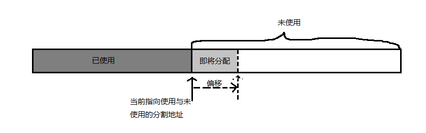

# JVM 学习

## jVM内存

### java内存模型

- 方法区
  - 运行时常量池
- java堆

- 程序计数器
- Java虚拟机栈
- 本地方法栈
- 直接内存: 不属于Java虚拟机的内存模型, nio可以使用native方法直接分配堆外内存, 可以使用存储再Java堆中的DirectByteBuffer对象 操作堆外的对象引用

### Java对象的内存分配与访问定位

#### 对象的创建

1. 虚拟机遇到一条`new`指令时, 先去检查这个指令的参数能否再常量池中定位到一个类的符号引用, 并且检查这个符号引用代表的类是否亦被加载、 解析和初始化过, 如果没有则进行类加载

2. 虚拟机为新生对象分配内存。(对象所需内存再类加载完后便可确定)

   - 假设Java堆内存是绝对规整的, 用过的在一边, 没用过的在一边, 中间以指针指向作为分割, 分配内存仅仅是将指针向未使用方向滑动所需内存大小即可, 这种内存分配方式叫做`'指针碰撞'`

     

   - 如果Java堆内存不是规整的, 虚拟机要维护一个列表,记录上哪些内存是可用的, 选择一段足够大的内存, 划分给新对象, 并刷新记录表, 这种分配方式叫做`'空闲列表'`

     

   选择哪种分配方式由Java堆是否规整决定, 而Java堆是否规整由GC回收是否带有压缩整理正能决定

   

3. 对于创建对象是非常频繁的, 即使是简单的操作指针位置, 也不是线程安全的, 解决这个问题有两种方案

   - 一种是对分配内存空间进行同步处理,  实际虚拟机采用的是CAS配上失败重试的方式保证更新操作的原子性
   - 第二种是对每一个线程进行内存划分, 划分后的内存被称为`本地线程分配缓冲区(Thread Local Allocation Buffer)`当存在某个TLAB使用完并重新分配TLAB时, 才进行内存同步, 虚拟机是否使用TLAB,可以通过 `-XX:+/-UseTLAB`参数设定

4. 内存分配完后, 对分配的内存存储实例部分初始化为零值,如果使用TLAB,这个过程在分配TLAB时完成, 这个操作保证了对象在不赋初始值情况下可以使用访问零值

5. 虚拟机对刚创建的对象进行初始设置, 在对象头(Object Header)设置相应数据: 对象所属类, 类的元数据寻址, 对象哈希码, 对象GC分代年龄等信息, 此时 `new`指令完成

6. `new`指令的完成并不代表对象的创建完成, 接下来会执行`init`指令进行数据初始化, 按照程序员的意愿执行`init`初始化数据, 此时一个对象创建完成

#### 对象的内存布局

HotSpot虚拟机中, 对象的存储分为三个区域: **对象头(Header)**, **实例数据(Instance Data)**, **对象填充(Padding)**

- 对象头(Header) 分为两部分或三部分

  - 第一部分存储对象自身运行时数据, 如:哈希码, GC分代年龄, 锁状态标志, 线程持有的锁, 偏向线程ID, 偏向时间戳等
  - 另一部分存储类型指针, 即对象指向它的类元数据的指针, 虚拟机通过这个指针确定这个对象是哪个类的实例 
  - 如果对象时Java数组, 那么header会有一部分存储数组的长度

- 实例数据(Instance Data) 存储程序员指定的对象类字段属性值内容,  存储的顺序会受到虚拟机的分配策略参数和字段定义顺序的影响

  - HotSpot默认分配策略 longs/doubles、ints、 shorts/chars、bytes/booleans、oops(Ordinary Object Pointers), 相同宽度的字段总是排在一起
  - 满足以上策略的同时, 父类中定义的变量会出现在子类变量的前面

- 填充对齐(Padding), HotSpot虚拟机规定, 对象存储的首地址必须是8位的倍数, 所以当header和Instance Data不能保证占用8倍数时, padding作为数据填充, 保证数据对齐

  

#### 对象的访问定位

在Java程序中通过操作虚拟机栈中的referance来操作堆中的实际对象, 虚拟机规范之规定了referance存储一个对象的人引用, 没有指定如何定位访问堆中对象, 所以对象访问有多种方式, 主流的有两种`句柄`, `直接指针`

- **句柄: ** 如果时`句柄`的话, 在堆内存中会分配出一部分为句柄池, 存储句柄, , referance存储句柄地址, 句柄则存储到对象实例数据的指针, 和对象类型数据的指针

  

- **直接指针: ** referance直接存储对象地址, 需要考虑如何获取类元数据

  

#### 内存溢出与内存管理

​	**虚拟机内存中, 除了程序计数器外, 其它区都可能发生内存溢出`OutOfMemoryError`**

- java堆溢出

  - `-Xmx20m -Xms20m -XX:+HeadDumpOnOutOfMemoryError` 参数配置可限制堆内存自动扩容, 和发生溢出后, 保存溢出状态快照, 以便后续排查

  - 配置堆最大存储空间与最小存储空间相同, 可以控制堆不自动扩容

  - 出现内存泄漏,异常提示`java.lang.OutOfMemoryError`, 后面会跟着`java head space`表示堆内存溢出

  - 首先实用工具查看异常转储快照, 查看是否是内存溢出或者是内存泄漏, 如果是内存泄漏, 查找泄露对象的GCRoot引用链, 确定溢出代码位置, 如果是内存溢出, 则考虑是否通过-Xmx分配更大堆内存

    

- 栈溢出

  - 栈包括虚拟机栈和本地方法栈, 在HotSpot虚拟机中不区分虚拟机栈和本地方法栈
  - 栈溢出有两种异常错误
    - `StackOverFlowError`: 当线程内栈深度需求超过虚拟机限制的线程最大栈深度时抛出此异常
    - `OutOfMemoryError`:当虚拟机扩展线程栈深度容量时, 无法申请到足够内存时抛出此异常
  - 当程序处于单线程时, 抛出的都会是`StackOverFlowError`
  - 当程序不局限与单线程时, 当无法申请到所需内存扩充栈深度会抛出`OutOfMemoryError`, 也就是说, 如果线程数不定, 单个线程所申请的最大栈深度越大, 约容易产生`OutOfMemoryError`,
  - 虚拟机栈容量受最大堆内存影响, 方法区最大内存, 线程数等影响. 
  - 调整栈溢出`OutOfMemoryError` 可以通过减小最大对内存和减小栈深度调节
    - -Xmx   调整堆内存最大值
    - -Xss     调整栈深度值

  

- 方法区与运行时常量池溢出

  - 当有使用CGLib等字节码技术动态产生类时, 或大量JSP或动态生成JSP时或基于OSGi的应用时会发生方法区溢出
  - 常量池中产生大量常量时会发生常量池溢出, 
  - 常量池存在于方法区, 所以异常相同

  

- 本机内存直接溢出

  - DirectMemory容量可通过-XX: maxDirectMemorySize指定, 如果不指定 默认等于 -Xmx 堆最大容量
  - 产生`OutOfMemoryError`时, 转储快照文件会特别小, 考虑可能时使用NIO造成的这种溢出

- 

