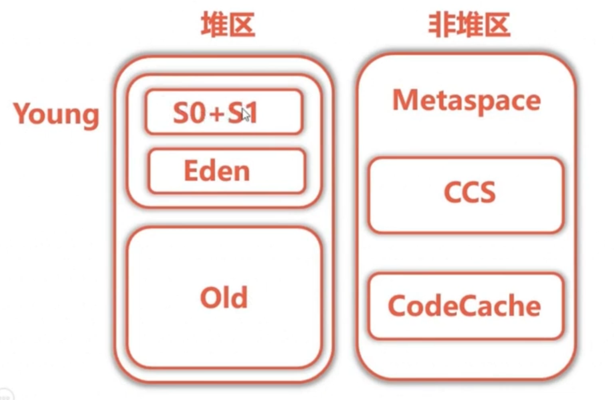
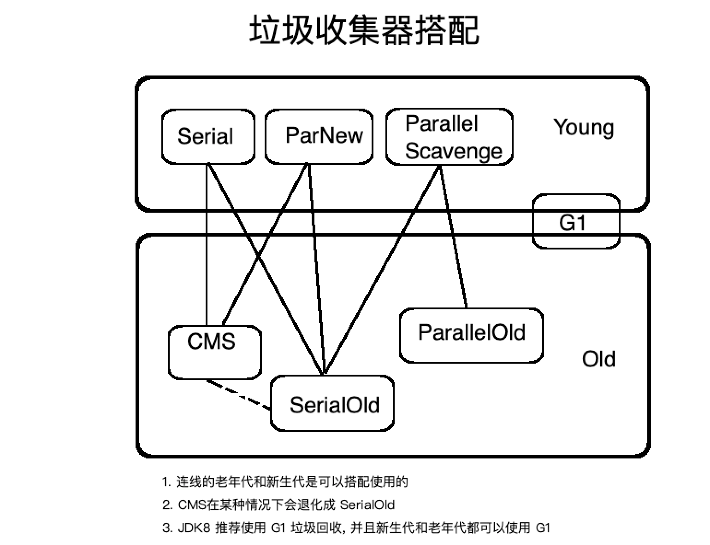
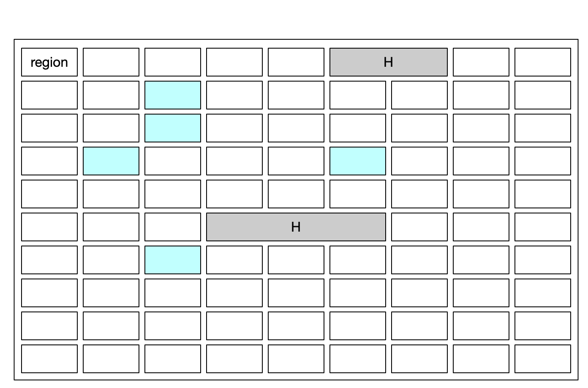
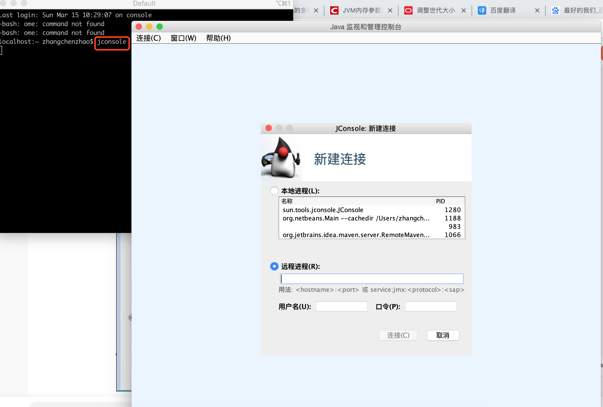
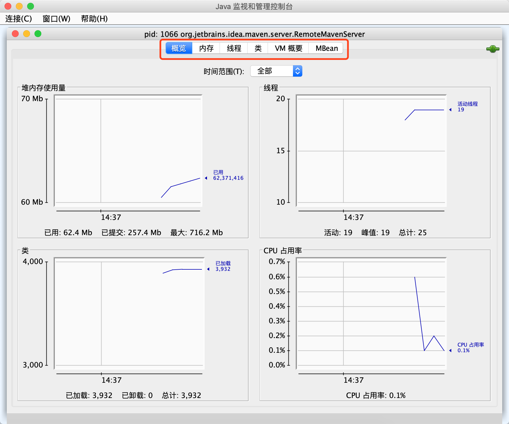
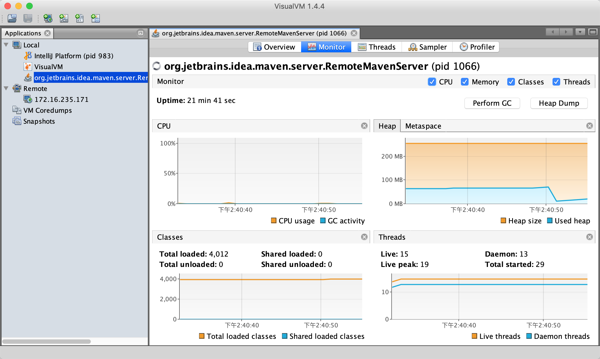

#  JVM 调优

[命令博客](https://mp.weixin.qq.com/s?__biz=MzAxODcyNjEzNQ==&mid=2247488758&idx=1&sn=22c85fc8d774a14ac73be99c82eb1d0a&chksm=9bd0b96eaca73078e0f1da9979d3c90facf734c0279c69478aeab737eea43b287242cdf1b544&mpshare=1&scene=23&srcid=&sharer_sharetime=1572830028774&sharer_shareid=fe443da7e2b002d46d24a5e4deda39f5#rd)


## GC 选择

如果想要最小化地使用内存和并行开销, 使用 serialGC

如果想要最大化应用程序的吞吐量, 使用 parallel GC

如果想要最小化 GC 的中断或停顿时间, 使用 CMS GC


## 常用参数

堆

-Xmx  -Xms

-XX:NewSize 新生代内存    -XX:MaxNewSize   最大新生代内存

-XX:NewRatio 新生代老年代比例    

-XX:SurvivorRatio   Survivor区比例

-XX:OldSize   老年代大小


-XX:MinHeapFreeRatio     -XX:MaxHeapFreeRatio


非堆(metaspace, 方法区)

-XX:MetaspaceSize  -XX:MaxMetaspaceSize

-XX:+UseCompressedClassPointers  使用压缩类空间

-XX:CompressedClassSpaceSize 压缩类空间大小

-XX:InitialCodeCacheSize  初始化 CodeCache 大小

-XX:ReservedCodeCacheSize  CodeCache 最大大小


GC

-XX:+PrintGCDetails  打印 GC 详细信息

-XX:+PrintCommandLineFlags: 查看命令行相关参数(包含使用的垃圾收集器)

CMS

-XX:+UseConcMartSweepGC

-XX:CMSInitiatingOccupancyFraction=68 （jdk6以前默认是 68, jdk6 之后 92） //内存占用率达到 68% 做 GC

-XX:+UseCMSInitiatingOccupancyOnly 只是用设定的回收阈值(上面指定的70%),如果不指定,JVM仅在第一次使用设定值,后续则自动调整 与CMSInitiatingOccupancyFraction 结合使用

-XX:ParallelCMSThreads  线程数量, (ParallelGCThreads+3)/4,  ParallelGCThreads parallelGC线程数量

-XX:+UseCMSCompactAtFullCollection：允许在 Full GC 时，启用压缩式 GC

-XX:CMSFullGCBeforeCompaction=n     在进行 n 次，CMS 后，进行一次压缩的 Full GC，用以减少 CMS 产生的碎片

CMS弊端: 

1. 产生内存碎片:  标记清除算法
2. 收集器对 CPU 资源非常敏感:  虽然不会导致用户停顿, 但是会因为占用了一部分线程, 导致应用程序变慢, 总吞吐量降低
3. CMS 收集器无法处理浮动垃圾:  初始标记—> 并发标记—>重新标记—>并发清理—>线程整理   在并发标记到重新标记之间会产生垃圾, 此时产生的垃圾不会被重新标记记录, 后续不会清理, 导致只能下次垃圾回收清理


-XX:PreternureSizeThreshold 大对象直接分配到老年代: 

-XX:MaxTenuringThreshold  长期存活对象进入老年代:设置对象年龄进入老年代

- -XX:MaxGCPauseMillis=<n>   最大停顿时间, STW时间, 毫秒, 
- -XX:GCTimeRatio=<n>   最大吞吐量 取值(0, 100)    默认 99,   垃圾回收占 1%,   操作设置尽量不要超过 1%

* -XX:+UseAdaptiveSizePolicy   设置 Parallel Scavenge 收集器具有自适应调节策略, 默认开启


ParNew

-XX:+ParNewGC


Parallel Scavenge

-XX:+UseParallelGC

-XX:+UseParallelOldGC 

-XX:ParallelGCThreads 限制线程数量, 默认开启和 CPU 相同核数线程


G1 

-XX:+UseStringDeduplication 开启 String 去重, 默认不开启, 需要手动开启

-XX:+PrintStringDeduplicationStatistics   打印详细的去重统计信息

-XX:StringDeduplicationAgeThreshold= 达到这个年龄的 String 对象被认定为去重的候选对象

-XX:G1HeapRegionSize 使劲儿中,饿哦个 Region的大小, 值是 2 的幂, 范围是 1MB 到 32MB 之间,  目标是根据最小的 java 堆大小划分出的 2048 个区域, 默认是堆内存的 1/2000

-XX:MaxGCPauseMillis  设置期望达到的最大 GC 停顿时间, 默认 200ms, JVM 会尽力实现, 但不保证

-XX:ParallelGCThread 设置 STW 工作线程输的值, 最多设置为 8

-XX:ConcGCThreads 设置并发标记的线程数

-XX:InitialingHeapOccupancyPercent 设置触发并发 GC 周期的 java 堆占用率阈值, 超过此值 触发 GC 默认 45


并行与并发

分代收集

空间整合

可预测的停顿时间模型


常量池:

-XX:+PrintstringTablesStatistics  打印字符串常量池的统计信息


-XX:+HeapDumpOnOutOfMemoryError

-XX:HeapDumpPath=./


### JVM

堆

-Xmx  -Xms

-XX:NewSize 新生代内存    -XX:MaxNewSize   最大新生代内存

-XX:NewRatio 新生代老年代比例    

-XX:SurvivorRatio   Survivor区比例

-XX:OldSize   老年代大小


-XX:MinHeapFreeRatio     -XX:MaxHeapFreeRatio


非堆(metaspace, 方法区)

-XX:MetaspaceSize  -XX:MaxMetaspaceSize

-XX:+UseCompressedClassPointers  使用压缩类空间

-XX:CompressedClassSpaceSize 压缩类空间大小

-XX:InitialCodeCacheSize  初始化 CodeCache 大小

-XX:ReservedCodeCacheSize  CodeCache 最大大小


GC

-XX:CMSInitiatingOccupancyFraction=68 （默认是 68）

-XX:+UseCMSInitiatingOccupancyOnly

-XX:+UseCMSCompactAtFullCollection：允许在 Full GC 时，启用压缩式 GC

-XX:CMSFullGCBeforeCompaction=n     在进行 n 次，CMS 后，进行一次压缩的 Full GC，用以减少 CMS 产生的碎片

-XX:PreternureSizeThreshold 大对象直接分配到老年代: 

-XX:MaxTenuringThreshold  长期存活对象进入老年代:设置对象年龄进入老年代

- -XX:MaxGCPauseMillis=<n>   最大停顿时间
- -XX:GCTimeRatio=<n>   最大吞吐量


-XX:+HeapDumpOnOutOfMemoryError

-XX:HeapDumpPath=./


[jvm命令](https://docs.oracle.com/javase/8/docs/technotes/tools/unix/index.html)

jinfo    jstat   jmap   jstack 

## JVM 的参数类型

### 标准参数


### 非标准参数

* 相对稳定

  

* 相对不稳定

  * Bool 类型

    格式: -XX:[+-]<name> 表示启用或禁用 name 属性

    例如: -XX:+UseG1GC

    ​		  -XX:+UseConcMarkSweepGC

  * key-value 类型

    格式: -XX:<name>=<value> 表示 name 属性的值是 value

    比如: -XX:MaxGCPauseMillis=500

    ​		  -XX:GCTimeRatio=19

  * -Xmx     -Xms   

    这两个是非标准相对不稳定参数 -XX:

    -Xmx 等价于 -XX:MaxHeapSize

    -Xms 等价于 -XX:InitialHeapSize

    

## 查看JVM运行时参数

* -XX:+PrintFlagsInitial   查看初始值
* -XX:+PrintFlagsFinal    查看最终值
* -XX:+UnlockExperimentalVMOptions    解锁实验参数
* -XX:+UnlockDiagnosticVMOptions    解锁诊断参数
* -XX:+PrintCommandLineFlags    打印命令行参数


## jstat 查看 JVM 统计信息

* 类装载
* 垃圾收集
* JIT 编译

例如: 

``` shell
jstat -flags PID  #查看进行所有参数状态
jstat -flag -gc PID 1000 10   #PID 进程 每 1 秒 输出一次 GC 信息  输出 10 次
```


### jmap + MAT 实战内存溢出



* 内存溢出自动导出

  -XX:+HeapDumpOnOutOfMemoryError

  -XX:HeapDumpPath=./

* 使用 jmap 手动导出

  ```shell
  jmap [-F] -dump:format=b,file=/path/filename.hprof PID  #命令导出 PID进行内存信息到文件, 若无法导出增加-F 参数
  ```

  jhat 命令可以分析 hprof文件, 但文件过大会分析失败


## jstack 检查线程状态

top -p PID -H 查看进程中线程信息


## Btrace

`btrace` 可以动态地向目标应用程序的字节码注入追踪代码

设计到的技术: `JavaComplierApi`, `JVMTI`, `Agent`, `Instrumentation+ASM`


## JDWP(Java Debug Wire Protocol) 远程调试

远程启动项目

```shell
java -jar -agentlib:jdwp=transport=dt_socket,server=y,suspend=n,address=7015 **.jar
```


## JVM 调优监控软件安装程序安装

### jprofiler


###jvisualVM+Btrace


## 垃圾回收器

Young 区使用复制算法

Old 区使用标记清除或标记整理算法


对象优先分配在 Eden 区

大对象直接分配到老年代: -XX:PreternureSizeThreshold 大对象标准参数指定

长期存活对象进入老年代:-XX:MaxTenuringThreshold  设置对象年龄进入老年代

​										   -XX:+PrintTenuringDistribution  打印存活对象年龄分布情况

​											-XX:TargetSurvivorRatio 设置Survivor区占比 超过占比计算年龄超出部分进入老年代

### 分类

* 串行收集器Serial: Serial,  Serial Old

* 并行收集器Parallel: Parallel Scavenge, Parallel Old, 吞吐量

  指多条垃圾收集线程并行工作, 但此时用户线程仍然处于等待状态, 适合科学计算, 后台处理等弱交互场景

* 并发收集器Concurrent: CMS, G1, 停顿时间

  指用户线程与垃圾收集线程同时执行(但不一定是并行的, 可能会交替执行), 垃圾收集线程在执行的时候不会停顿用户程序的运行.适合对相应时间有要求的场景, 比如 web


### 停顿时间 VS 吞吐量

* 停顿时间: 垃圾收集器做垃圾回收终端应用执行的时间.   -XX:MaxGCPauseMillis
* 吞吐量: 花在垃圾收集的时间和花在应用时间的占比. -XX:GCTimeRatio=<n>


### 串行收集器

-XX:+UseSerialGC 新生代串行 GC          -XX:+UseSerialOldGC   老年代串行 GC

### 并行收集器(吞吐量优先)

* -XX:+UseParallelGC    新生代并行收集器    -XX:+UseParallelOldGC 老年代并行收集器

* 开启UseParallelGC   默认会开启UseParallelOldGC

* 进行 Server 模式  默认使用UseParallelGC

### 并发收集器(响应优先)

* CMS: -XX:+UseConcMarkSweepGC 老年代使用并发标记清除 GC      -XX:+UseParNewGC  相应年轻代默认使用
* G1: -XX:+UseG1GC


### 搭配



* 连线的老年代和新生代是可以搭配使用的

* CMS在某种情况下会退化成 SerialOld

* JDK8 推荐使用 G1 垃圾回收, 并且新生代和老年代都可以使用 G1


### 如何选择垃圾收集器

[GC调优指南](Https://docs.oracle.com/javase/8/docs/technotes/guides/vm/gctuning/toc.html)

[如何选择垃圾回收器](Https://docs.oracle.com/javase/8/docs/technotes/guides/vm/gctuning/collectors.html)

* 优先调整堆的大小 让服务器自己来选择
* 如果内存小于 100M. 使用串行收集器
* 如果是单核, 并且没有停顿时间的要求, 串行或者 JVM 自己选
* 如果允许停顿时间超过 1 秒, 选择并行或者 JVM 自己选
* 如果相应时间最重要, 并且不能超过 1 秒, 使用并发收集器


### 并行垃圾回收(parallel )

-XX:+UseParallelGC手动开启, Server 默认开启

-XX:ParallelGCThreads=<n> 多少个 GC 线程

CPU>8   n=5/8

CPU<8  n=CPU


* 并行 GC 有自适应功能
  * -XX:MaxGCPauseMillis=<n>   最大停顿时间
  * -XX:GCTimeRatio=<n>   最大吞吐量
  * -Xms<n>    最大堆大小

* 动态内存调整 每次调整大小
  * -XX:YoungGnerationSizeIncrement=<n>  young 区增大调整     默认 20%
  * -XX:TenuredGenerationSizeIncrement=<n> old 区增大调整     默认 20%
  * -XX:AdaptiveSizeDecrementScaleFactor=<n> 减小调整


### CMS

并发收集, 低停顿, 低延迟, 用于老年代 

* 过程
  * CMS initial mark: 初始标记 Root, STW    (此过程应用程序停止, 初始化标记后继续运行)
  * CMS concurrent mark : 并发标记
  * CMS-concurrent-preclean: 并发预清理
  * CMS remark: 重新标记. STW
  * CMS concurrent sweep: 并发清除
  * CMS-concurrent-reset: 并发重置

* CMS 缺点
  * CPU 敏感
  * 浮动垃圾
  * 控件碎片
* CMS 相关参数
  * -XX:ConcGCThreads: 并发的 GC线程数
  * -XX:+UseCMSCompactAtFullCollection: FullGC 之后做压缩, 减少产生的内存碎片
  * -XX:CMSFullGCsBeforeCompaction: 多少次 FullGC 之后压缩一次
  * -XX:CMSInitiatingOccupancyFraction: 老年代内存占用多少触发 FullGC, 默认 90%多
  * -XX:+UseCMSInitiatingOccupancyOnly:  CMSInitiatingOccupancyFraction是否动态可调
  * -XX:CMSScavengeBeforeRemark: FullGC 之前先做 yong GC
  * -XX:+CMSClassUnloadingEnabled: 启用回收 Perm(jdk7 之前)
* iCMS

### G1 垃圾回收器



上图为 G1 垃圾回收内存管理示意图

1. 在 G1 垃圾回收器中, 依然存在 young 和 old 区, 但仅仅只是逻辑上的分区
2. G1 中的单位为 region, 每一个小块是一个 region
3. G1 中对于大数据的存储还有一个 H 区, 当对象大小大于 region 的一半时被认定为大对象
4. G1 中有一个 SATB(Snapshot-At-The-Beginning), 他是通过 Root Tracing 得到的, GC 开始的时候存活对象的快照. 进行垃圾回收时, 是在这个基础上进行的
5. Rset: 记录了其他 Region 中的对象引用本 Region 中对象的关系, 属于 points-into 结构(谁引用了我的对象)


* MixedGC

  * G1中不存在 FullGC 了, 改为 MixedGC, 用来回收所有 Young 和部分 Old 区
  * global concurrent marking 全局并发标记
    1. Initial marking phase : 标记 GC Root, STW
    2. Root region scanning phase: 标记存活 Region
    3. Concurrent marking phase: 标记存活的对象
    4. Remark phase: 重新标记 STW
    5. Cleanup phase: 部分 STW

*  MixedGC 时机

  * InitiatingHeapOccupancyPercent:

    堆占有率达到这个数值则触发 global concurrent marking, 默认 45% (这里只是标记)

  * G1HeapWastePercent:

    在 global concurrent marking 结束之后, 可以知道有多少控件要被回收, 在每次 YoungGC 之后和再次发生 MixedGC 之前, 会检查垃圾占比是否达到这个参数值, 只有达到了, 下次才会发生 MixedGC

* MixedGC 相关参数

  * G1MixedGCLiveThresholdPercent: Old 区的 region 被回收时候的存活对象占比
  * G1MixedGCCountTarget: 一次 global concurrent marking 之后, 最多执行 MixedGC 的次数(1 次MixedGC 可能不能使垃圾对象占比降低到G1HeapWastePercent值之下)
  * G1OldCSetRegionThresholdPercent: 一次 MixedGC 中能被选入 CSet 的最多 old 区的 region 数量(每次清理MixedGC能处理的最大 region 数量)

* 常用参数

  * -XX:+UseG1GC 开启 G1
  * -XX:G1HeapRegionSize=n, region的大小, 1-32M, 2048 个
  * -XX:MaxGCPauseMillis=n  最大停顿时间
  * -XX:G1NewSizePercent        -XX:G1MaxNewSizePercent
  * -XX:G1ReservePercent=n   保留防止 to space 溢出
  * -XX:ParallelGCThreads=n   SWT 线程数
  * -XX:ConcGCThreads=n 并发线程数=1/4* 并行


## GC 日志分析工具

在线工具: http://gceasy.io

GCViewer

### 打印日志相关参数

-XX:+PringGCDetails   输出 GC 详细信息

-XX:+PrintGCTimeStamps  输出 GC 时间

-XX:+PrintGCDateStamps  输出 GC 日期

-Xloggc:${path}  输出到文件路径

-XX:+PrintHeapAtGC  输出 GC 堆信息

-XX:+PrintTenuringDistribution  输出年轻代对象年龄分布

## GC 调优步骤

1. 打印 GC 日志
2. 根据日志得到关键性能指标
3. 分析 GC 原因, 调优 JVM 参数

-XX:+DisableExplicitGC   debug 环境开启代码控制GC     System.GC();


### Parallel GC 调优的知道原则

* 除非确定, 否则不要设置最大堆内存
* 优先设置吞吐量目标
* 如果吞吐量目标达不到, 调大最大内存, 不让 OS 使用 Swap, 如果仍然达不到, 降低目标
* 吞吐量能达到, GC 时间太长, 设置停顿时间的目标

### G1 GC调优

* 年轻代大小: 避免使用 -Xmn, -XX:NewRatio 等显示设置Young 区大小, 会覆盖暂停时间目标
* 暂停时间目标: 暂停时间不要太严苛, 其吞吐量目标是 90%的应用程序时间和 10%的垃圾回收时间, 太严苛会直接影响到吞吐量

#### 关于 MixGC调优: 

-XX:InitiatingHeapOccupancyPercent

-XX:G1MixedGCLiveThresholdPercent, -XXG1HeapWastePercent

-XX:G1MixedGCCountTarget

-XX:G1OldCsetRegionThresholdPercent


## JVM 字节码指令与 javaP

javap -verbose ${java文件}

[常量池文档](https://docs.oracle.com/javase/specs/jvms/se8/html/jvms-4.html#jvms-4.4)

[本地变量表文档](https://docs.oracle.com/javase/specs/jvms/se8/html/jvms-2.html#jvms-2.6.1)

[java 虚拟机规范](https://docs.oracle.com/javase/specs/jvms/se8/html/index.html)


## 远程监控

两种工具 jconsole,  jvisualVM

操作类似, jconsole 是 jdk 自带的命令

终端输入  `jconsole `命令



 

功能还是非常全的, 我们也可以下载 jvisualVM 工具进行对 JVM 的监控(jdk7以后就不需要下载了, jdk 中已经将它集成了, 只需要安装 jdk7 以后的 jdk 并配置环境变量, 或到 bin 目录下)

键入  jvisualvm


jvisualVM 演示效果




开启远程监控端口地址

`-Dcom.sun.management.jmxremote.port=10099` 是远程连接时候的端口，默认是1099

`-Djava.rmi.server.hostname=10.132.6.77` 是远程连接时候的地址

```shell
java  \
-Djava.rmi.server.hostname=10.132.6.77 \
-Dcom.sun.management.jmxremote \
-Dcom.sun.management.jmxremote.port=10099 \
-Dcom.sun.management.jmxremote.authenticate=false \
-Dcom.sun.management.jmxremote.ssl=false \
-jar demo.jar --spring.profiles.active=pro & 
```


