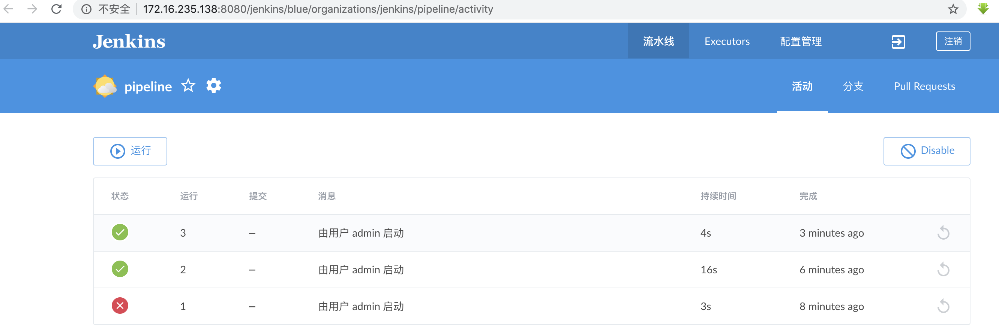

#devops


##Gitlab

安装gitlab依赖

```shell
yum install -y curl policycoreutils-python openssh-server git patch
```

下载gitlab，rpm包

```shell
#下载12.3.5版本(汉化包也是12.3.5，两个要一样)
wget https://mirrors.tuna.tsinghua.edu.cn/gitlab-ce/yum/el7/gitlab-ce-12.3.5-ce.0.el7.x86_64.rpm
#安装gitlab
rpm -ivh gitlab-ce-12.3.5-ce.0.el7.x86_64.rpm
```

修改配置文件

```shell
vim /etc/gitlab/gitlab.rb
external_url修改为你的ip或域名:端口号
```

汉化 可跳过

```shell
git clone https://gitlab.com/xhang/gitlab.git
cd gitlab
gitlab_version=$(sudo cat /opt/gitlab/embedded/service/gitlab-rails/VERSION) && echo $gitlab_version
git diff v${gitlab_version} v${gitlab_version}-zh > ../${gitlab_version}-zh.diff

patch -d /opt/gitlab/embedded/service/gitlab-rails -p1 < ../${gitlab_version}-zh.diff
```

启动服务

```shell
gitlab-ctl reconfigure
gitlab-ctl restart
```

添加项目,  进入项目  进入 settings, Integrations页面  可以看到 Webhooks


URL 是 Jenkins 触发构建的回调 url, 需要安装 gitlab 插件


## SonarQube

1. 安装依赖 jdk mysql  unzip

   ```shell
   yum install -y unzip
   ```

2. 准备安装包 sonarqube-7.4.zip

3. 解压到/opt/modules 目录

   ```shell
   unzip sonarqube-7.4.zip -d /opt/modules/
   ```

4. 创建用户用户组 sonar, sonarqube 的启动必须是由普通用户启动

   ```shell
   groupadd sonar
   useradd -m -g sonar sonar
   ```

5. 修改 sonarqube 包的用户所属权限

   ```shell
   shown sonar:sonar -R sonarqube
   ```

6. 修改 sonar 配置文件, 增加数据库配置 5.7

   ```shell
   vim sonar/conf/sonar.properties
   
   sonar.jdbc.username=root
   sonar.jdbc.password=zcz920518
   
   sonar.jdbc.url=jdbc:mysql://localhost:3306/sonar?useUnicode=true&characterEncoding=utf8&rewriteBatchedStatements=true&useConfigs=maxPerformance&useSSL=false
   ```

7. 创建数据库 sonar

   ```sql
   create database sonar;
   ```

8. 启动

   ```shell
   su - sonar -c "/opt/modules/sonarqube/bin/linux-x86-64/sonar.sh start"
   ```

9. 访问: host:9000

10. 登录 admin : admin

    * 提示生成 token: 可以通过外部持有 token 访问 sonarqube 执行操作. 例如 jenkin 拿到 token 进行代码扫描

      ```
      jenkins: 52293117bb86b474ee2d7db6e5e09cdad9e38a1d
      ```

    * 提示对哪种代码进行扫描: 可以生成相应的扫描脚本

      ```shell
      mvn sonar:sonar \
        -Dsonar.host.url=http://172.16.235.137:9000 \
        -Dsonar.login=52293117bb86b474ee2d7db6e5e09cdad9e38a1d
      ```

      

11. 集成 p3c 

    1. 下载p3c插件 (这个不是官方插件)

       https://github.com/rhinoceros/sonar-p3c-pmd/releases/tag/pmd-3.2.0-beta-with-p3c1.3.6-pmd6.10.0

       

    2. 将插件放入 sonarqube 的插件路径下 以普通用户权限重启

    3. 配置 p3c 规则

       

    4. 搜索p3c 规则

       

    5. 设置 p3c 为默认规则

       

    6. IDEA中配置 maven 打包检测 插件 

       ```xml
          <profiles>
       
               <profile>
                   <id>sonar</id>
                   <activation>
                       <activeByDefault>true</activeByDefault>
                   </activation>
                   <properties>
                       <sonar.host.url>http://172.16.235.137:9000/</sonar.host.url>
                   </properties>
               </profile>
       
           </profiles>
       
           <build>
               <plugins>
                   <plugin>
                       <groupId>org.sonarsource.scanner.maven</groupId>
                       <artifactId>sonar-maven-plugin</artifactId>
                       <version>3.6.0.1398</version>
                   </plugin>
               </plugins>
           </build>
       ```

    7. IDEA 打包检测及上传检测报告

       

    8. 查看 sonarqube

       

    9. IDEA 中不加插件  直接使用 maven 进行扫描

       ```shell
       mvn sonar:sonar \
         -Dsonar.host.url=http://172.16.235.137:9000 \
         -Dsonar.login=52293117bb86b474ee2d7db6e5e09cdad9e38a1d
       ```

12. Jenkins 配置

    1. jenkins 安装插件 sonarqube for jenkins

    

    2. 配置 sonarqube 服务端信息: 系统管理—> 系统设置

       

    3. 配置 sonarQube以及凭证

       

       

    4. 配置 sonarqube 客户端信息: 系统配置—> 全局配置

       

       

    5. 构建项目

       

    6. 在构建前增加步骤: 两种方式  一种是使用 sonar-scanner  一种是使用 maven 命令

       1. 使用 Sonar-scanner

          ```
          sonar.projectName=${JOB_NAME} sonar.projectKey=java sonar.sources=. sonar.java.binaries=target/devops
          ```

       2. 使用 maven

          ```shell
          mvn sonar:sonar \
            -Dsonar.host.url=http://172.16.235.137:9000 \
            -Dsonar.login=52293117bb86b474ee2d7db6e5e09cdad9e38a1d
          ```

          

13. 安装sonar-scanner 客户端

    [下载地址](https://binaries.sonarsource.com/Distribution/sonar-scanner-cli/)

    解压到指定目录

    ```shell
    unzip -d /opt/modules/ sonar-scanner-cli-4.3.0.2102-linux.zip
    cd /opt/modules/
    mv sonar-scanner-cli-4.3.0.2102 sonar-scanner
    ```

    配置环境变量

    ```shell
    vim /etc/profile
    export SONAR_SCANNER_HOME=/opt/modules/sonar-scanner
    export PATH=$PATH:$SONAR_SCANNER_HOME/bin
    ```

    配置客户端连接的服务端地址

    ```shell
    cd /opt/modules/
    vim sonar-scanner/conf/sonar-scanner.properties
    
    sonar.host.url=http://172.16.235.137:9000
    sonar.sourceEncoding=UTF-8
    ```

    进入项目目录执行测试检测 java 代码

    ```
    sonar-scanner -Dsonar.projectName=pipeline -Dsonar.projectKey=java -Dsonar.sources=. -Dsonar.java.binaries=.
    ```

    


## jenkins

Jenkins 修改国内镜像

```shell
find / -name 'default.json'
```

cd {你的Jenkins工作目录}/updates

执行命令

```shell
sed -i 's/http:\/\/updates.jenkins-ci.org\/download/https:\/\/mirrors.tuna.tsinghua.edu.cn\/jenkins/g' default.json && sed -i 's/http:\/\/www.google.com/https:\/\/www.baidu.com/g' default.json
```

镜像源 https://mirrors.tuna.tsinghua.edu.cn/jenkins/updates/update-center.json

https://blog.csdn.net/ZhaoJa/article/details/84876711


安装   下载 jenkins.war,  tomcat, maven, jdk, git

1. 安装 maven, jdk, git

2. jenkins.war 直接扔进 tomcat

3. 启动 tomcat

4. 访问 jenkin host:port/jenkins, 查看初始密码

   ```shell
   cat /root/.jenkins/secrets/initialAdminPassword
   ```

5. 进入后选择安装推荐插件或跳过安装推荐插件, 一般是选择安装推荐插件(此时网络极差, 装了好几个小时都下不下来)

6. 进入插件管理, 安装插件 git, maven等插件

7. 进入全局工具管理, 配置 jdk, maven, git. 这里都选择本地安装的, 不用 jenkins 安装

8. 创建项目, maven 风格项目

9. 源码管理,配置项目的 git 地址: url, 凭证: git 账号密码, 分支

10. Builder trigger: 可以通过 url 的方式触发构建, 集成 gitlab hooks 需要增加 gitlab 插件

11. Pre Step: 可以以脚本的方式作为构建项目前的准备操作, 没有可以不写

12. Build: 构建操作 指定 pom, 和 maven 构建指令, 如 clean package 

13. Post Step:  构建后操作, 可以以脚本的方式操作构建后的工作, 如将 jar 分发到指定服务器运行

    1. 可以使用 ssh 远程免密操作 ssh-keygen -t rsa     ssh-copy-id host  (安装 ssh 插件)
    2. 多个服务器可以在各个服务器上独立存在运行脚本, 让 jenkins 调用


### 构建触发器


```
http://172.16.235.138:8080/jenkins/job/freestyle-test1/build?token=freestyle-test1
```

### jenkins 流水线

是一套插件, 以声明式或脚本化的方式将构建, 测试, 交付等一套流水化工作以代码的方式表示出来

两种语法:

* 声明式

  ```groovy
  Jenkinsfile(Declarative Pipline)
  pipline{ //所有代码包裹在 pipeline{} 层内
    agent any  //agent{} 定义任务在哪台主机上运行, 可以使 any、 node 等
    environment{ //变量名称= 变量值 用于定义环境变量
      para='sss'
    }
  	stages{ //类似于一个大的项目的操作集合, 主要用来包含所有 stage 任务
  		stage('Build'){ //一个项目中的单个操作任务, 主要包含 step 子层
  			steps{ //用来执行具体的操作
  				sh '' 
  			}
  		}
  		stage('Test'){
  			steps{
  				Junit ''
  			}
  		}
  		stage('Deploy'){
  			steps{
  				sh ''
  			}
  		}
  	}
  }
  ```

  

* 脚本式

  ```groovy
  Jenkinsfile(Scripted Pipline)
  pipline{
  	node{
  		stage('Build'){
  			step{
  				sh '' 
  			}
  		}
  		stage('Test'){
  			step{
  				Junit ''
  			}
  		}
  		stage('Deploy'){
  			step{
  				sh ''
  			}
  		}
  	}
  }
  ```

* 含义

  ```
  pipeline 是声明式流水线的一种特定语法，他定义了包含执行整个流水线的所有内容和指令的 "block" 。
  
  agent是声明式流水线的一种特定语法，它指示 Jenkins 为整个流水线分配一个执行器 (在节点上)和工作区。
  
  stage 是一个描述 stage of this Pipeline的语法块。在 Pipeline syntax 页面阅读更多有关声明式流水线语法的`stage`块的信息。如 above所述, 在脚本化流水线语法中，stage 块是可选的。
  
  steps 是声明式流水线的一种特定语法，它描述了在这个 stage 中要运行的步骤。
  
  sh 是一个执行给定的shell命令的流水线 step (由 Pipeline: Nodes and Processes plugin提供) 。
  
  junit 是另一个聚合测试报告的流水线 step (由 JUnit plugin提供)。
  
  node 是脚本化流水线的一种特定语法，它指示 Jenkins 在任何可用的代理/节点上执行流水线 (和包含在其中的任何阶段)这实际上等效于 声明式流水线特定语法的`agent`。
  ```

* 新建一个流水线项目

  

  

* 编写脚本

  ```
  pipeline{
      agent any
      stages{
          stage('获取代码'){
              steps{
                  echo 'get code'
              }
          }
          stage('代码质检'){
              steps{
                  echo 'check code'
              }
          }
          stage('代码构建'){
              steps{
                  echo 'build code'
              }
          }
          stage('代码部署'){
              steps{
                  echo 'deploy code'
              }
          }
      }
  }
  ```

  

* 构建流水线

  

* 查看 blue Ocean

  

  

  

* 构建 java 脚本模板

  ```groovy
  pipeline{
      agent any
      stages{
          stage('获取代码'){
              steps{
                  checkout([$class: 'GitSCM', branches: [[name: '*/master']], doGenerateSubmoduleConfigurations: false, extensions: [], submoduleCfg: [], userRemoteConfigs: [[credentialsId: '7f33e95f-3502-402c-87e7-9160ff33105c', url: 'git@172.16.235.137:test/test-project.git']]])
              }
          }
          stage('代码质检'){
              steps{
                  withSonarQubeEnv('sonarQube') { //这个sonarQube 与 jenkins 配置 sonarqube 服务端name 一致
                      sh '/opt/modules/sonar-scanner/bin/sonar-scanner -Dsonar.projectName=${JOB_NAME} -Dsonar.projectKey=java -Dsonar.sources=. -Dsonar.java.binaries=.'        
                  }
                  script {
                      timeout(3) { //超时时间  获取状态 提示代码检测异常 需要打开服务端 webhook
                          def qg = waitForQualityGate()
                          if (qg.status != 'OK') {
                              error "未通过 Sonnarqube 的代码检查"
                          }
                      }
                  }
              }
          }
          stage('代码构建'){
              steps{
                  echo '执行代码构建脚本'
  
              }
          }
          stage('代码部署'){
              steps{
                  sh '执行代码部署脚本'
              }
          }
      }
      post{
          failure{
              emailext body: '失败', recipientProviders: [developers()], subject: '部署', to: 'youya_cz@163.com'
          }
          success{
              emailext body: '成功', recipientProviders: [developers()], subject: '部署', to: 'youya_cz@163.com'
          }
          
      }
  }
  ```

  

* 