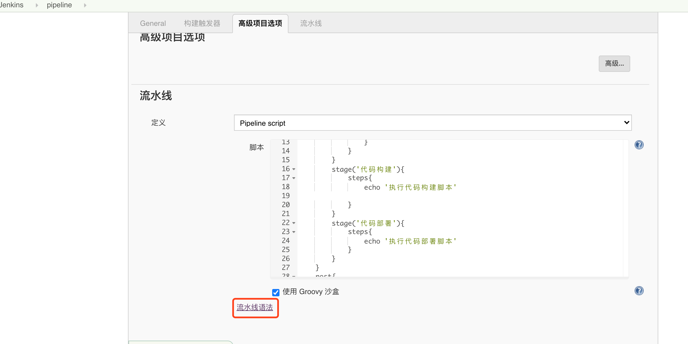
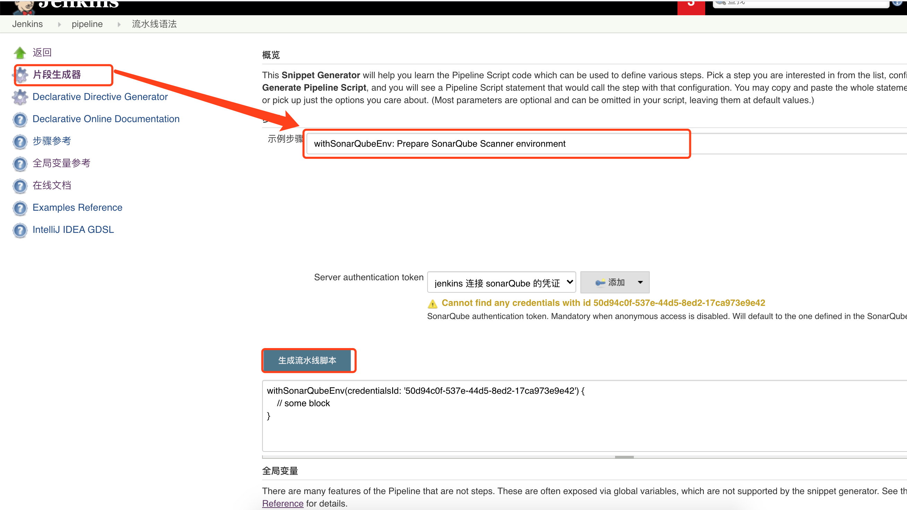

## jenkinsfile

[jenkins 学习](https://www.jenkins.io/zh/doc/book/pipeline/multibranch/)

jenkinsfile 有两种格式   `声明式`和 `脚本式`

主要学习`声明式`

```
pipeline {
	agent any //提供代理执行流水线
	environment {
		//设置整个流水线的环境变量
	}
	stages {
		stage('步骤名') {
			when {
				//条件判断	
			}
			steps{
				//步骤具体执行
			}
		}
	}
	post{
		
	}
}
```

### agent:

指定运行代理环境

位置: 

1. 在 pipeline 内的最前, 必填

   指定整个 pipeline 的运行代理环境

2. 在 stage 内的最前, 非必填

   指定当前 stage 的运行代理环境

选项:

1. any: 在任何可用的代理上执行 pipeline 或 stage

2. lable: 根据 jenkins 集群节点名称设置代理, 

   ```
   pipeline {
   	agent {label 'master'}
   	stages {
   		stage('步骤名') {
   			steps{
   				//步骤具体执行
   			}
   		}
   	}
   }
   ```

3. node: 指定 jenkins 集群节点设置代理, lable指定集群节点名称  customWorkspace自定义工作空间

   ```
   pipeline {
   	agent {node {
       label 'master'
       customWorkspace '/opt/modules/workspace/'
       }
   	}
   	stages {
   		stage('步骤名') {
   			steps{
   				//步骤具体执行
   			}
   		}
   	}
   }
   ```

4. none: 

   pipeline 中使用 `agent none` 表示全局不指定代理, 但每个 stage 需要指定自己的 agent

    ```
   pipeline {
   	agent none
   	stages {
   		stage('步骤名') {
   			agent {
   				lable 'slave-1'
         }
   			steps{
   				//步骤具体执行
   			}
   		}
   	}
   }
    ```

5. docker

6. dockerfile

### environment

设置环境变量

位置: 用在 pipeline中 或 stage中

选项: 

1. 在 pipeline 中定义 environment, 表示 pipeline 全局使用的环境变量

2. 在 stage 中定义 environment, 表示当前 stage 的环境变量

3. environment 中提供了一个 credentials()辅助方法, 用以获取 jenkins 中预先定义的凭证

   ```groovy
   pipeline {
   	agent any
     environment {
       EVN_PARAM='env-param'
       ONE_ACCESS_KEY=credentials('custom-secret')
     }
   	stages {
   		stage('步骤名') {
   			steps{
   				//步骤具体执行
   			}
   		}
   	}
   }
   ```

   

### options

在 pipeline 内或 stage 内 提供附加的控制

位置: 

1. pipeline 内, 最多只能出现一次
2. stage内, 选项只能是 stage 相关: skipDefaultCheckout,  timeout, retry, timestamps

选项:

1. buildDiscarder

   持久化工件和控制台输出，用于保存Pipeline最近几次运行的数据例如：`options { buildDiscarder(logRotator(numToKeepStr: '1')) }`

2. checkoutToSubdirectory

   在工作区的子目录中执行源代码检出。例如：`options { checkoutToSubdirectory('foo') }`

3. disableConcurrentBuilds

   不允许并行执行Pipeline。可用于防止同时访问共享资源等。例如：`options { disableConcurrentBuilds() }`

4. preserveStashes

   保留已完成构建的存储，用于stage重新启动。例如：`options { preserveStashes() }`保存最近完成的构建中的stash，或者`options { preserveStashes(5) }`保留最近五个完成的构建中的stash。

5. quietPeriod

   设置pipeline的静默期（以秒为单位），覆盖全局默认值。例如：`options { quietPeriod(30) }`

6. retry

   pipline 或 stage 如果失败，请按指定的次数重试。例如：`options { retry(3) }`

7. skipDefaultCheckout

   在pipline 或 stage指令中默认跳过源代码检出。例如：`options { skipDefaultCheckout() }`

8. skipStagesAfterUnstable

   一旦构建状态进入了“不稳定”状态，就跳过stage。例如：`options { skipStagesAfterUnstable() }`

9. timeout

   设置Pipeline或 stage运行的超时时间，之后Jenkins应该中止Pipeline。例如：`options { timeout(time: 1, unit: 'HOURS') }`

10. timestamps

    当执行时，预处理由Pipeline或 stage生成的所有控制台输出运行时间。例如：`options { timestamps() }`


### parameters

启动 pipeline 之前可以输入的参数

位置: pipeline 内

选项:

1. string

   字符串类型的参数，例如： `parameters { string(name: 'DEPLOY_ENV', defaultValue: 'staging', description: '') }`

2. text

   文本参数，例如： `parameters { text(name: 'DEPLOY_TEXT', defaultValue: 'One\nTwo\nThree\n', description: '') }`

3. booleanParam

   布尔参数，例如： `parameters { booleanParam(name: 'DEBUG_BUILD', defaultValue: true, description: '') }`

4. choice

   选项参数，例如： `parameters { choice(name: 'CHOICES', choices: ['one', 'two', 'three'], description: '') }`

5. file

   文件参数，指定用户在计划构建时要提交的文件，例如： `parameters { file(name: 'FILE', description: 'Some file to upload') }`

6. password

   密码参数，例如： `parameters { password(name: 'PASSWORD', defaultValue: 'SECRET', description: 'A secret password') }

```groovy
Jenkinsfile
pipeline {
    agent any
    parameters {
        string(name: 'PERSON', defaultValue: 'Mr Jenkins', description: 'Who should I say hello to?')
        text(name: 'BIOGRAPHY', defaultValue: '', description: 'Enter some information about the person')
        booleanParam(name: 'TOGGLE', defaultValue: true, description: 'Toggle this value')
        choice(name: 'CHOICE', choices: ['One', 'Two', 'Three'], description: 'Pick something')
        password(name: 'PASSWORD', defaultValue: 'SECRET', description: 'Enter a password')
        file(name: "FILE", description: "Choose a file to upload")
    }
    stages {
        stage('Example') {
            steps {
                echo "Hello ${params.PERSON}"
                echo "Biography: ${params.BIOGRAPHY}"
                echo "Toggle: ${params.TOGGLE}"
                echo "Choice: ${params.CHOICE}"
                echo "Password: ${params.PASSWORD}"
            }
        }
    }
}
```


### when

在 stage 内根据 when 条件决定是否执行

位置: stage 内

选项:

1. branch: 表示分支条件

   ```groovy
   stage{ 
     when {branch 'master'} 
     steps{echo '分支是 master 才执行'}
   }
   ```

2. environment: 环境变量条件

   ```groovy
   stage{ 
     when {environment name: 'EVN_PARAM', value:'env-param'} 
     steps{echo '环境变量 EVN_PARAM == env-param 才执行'}
   }
   ```

3. expression: 表达式条件

   ```groovy
   stage{ 
     when {expression { return true }} 
     steps{echo '表达式求值为 true 时 执行'}
   }
   ```

4. not: 条件不成立时执行, 条件嵌套使用

   ```groovy
   stage{ 
     when { not {branch 'master'}}
     steps{echo '非 master 才执行'}
   }
   ```

5. allOf: 复合条件都成立执行, 条件嵌套使用, 多个条件; 分割

   ```groovy
   stage {
     when {allOf {branch 'master'; environment name:'ENV_PARAM', value:'env-param' }}
     steps {echo '条件都成立执行'}
   }
   ```

6. anyOf: 复合条件存在成立的就执行, 条件嵌套使用

   ```groovy
   stage {
     when {anyOf {branch 'master'; environment name:'ENV_PARAM', value:'env-param' }}
     steps {echo '条件存在成立执行'}
   }
   ```

   

### stages stage parallel

stages 可以包含多个 stage

parallel 可以包含多个 stage

stage只能包含一个 steps 或 stages 或 parallel

parallel 是并行执行的, 包含 parallel 的 stage 不能声明 agent 和 tools, 因为此处声明与 steps 没有关系

```groovy
pipeline {
  agent any
  environment {
    SYSTEM_PARA='abc'
  }
  stages{
    stage('none parallel') {
      agent{label 'master'}
      steps{
        echo '这不是并行步骤'
      }
    }
    stage('parallel') {
      parallel{
        stage('parallel-1'){
      		agent{label 'salve-1'}
          steps{
            echo '并行步骤-1'
          }
        }
        stage('parallel-2'){
      		agent{label 'salve-2'}
          steps{
            echo '并行步骤-2'
          }
        }
        stage('parallel-3'){
      		agent{label 'salve-3'}
          steps{
            echo '并行步骤-3'
          }
        }
      }
    }
  }
}
```


### post

表示 pipeline 执行结束后需要做的操作

位置: 放在 pipeline 最后 或 stage 最后

选项: 

1. always: 无论什么情况下都会运行
2. changed: 只有当前运行结果状态与之前运行结果状态不同时才会执行
3. failure: 只有 pipeline 执行失败时才会执行
4. success: 只有 pipeline 执行成功时才会执行
5. unstable: 
6. aborted: 手动终止 pipeline 时执行, 一般 webUI 显示为灰色的图标
7. cleanup: 无论 pipeline 执行如何, 其它所有 post条件执行结束后执行 `cleanup`

```groovy
pipeline {
	agent any
	stages {
		stage('步骤名') {
			steps{
				//步骤具体执行
			}
		}
	}
  post {
    always {
      echo 'pipeline 执行完'
    }
    faiure {
      echo '执行失败'
    }
    success { 
    	echo '执行成功'
    }
    cleanup {
      echo '清理'
    }
  }
}
```

可以使用 post 部分执行通知操作, 如邮件通知等


### 环境变量

| 环境变量                   | 解释                                                         |
| -------------------------- | ------------------------------------------------------------ |
| BUILD_NUMBER               | 唯一标识一次build                                            |
| BUILD_ID                   | 基本上等同于BUILD_NUMBER，但是是字符串,用于在1.597+中创建的构建, 旧版本使用时间戳 |
| JOB_NAME                   | 创建的 jenkins 任务的名称                                    |
| JOB_BASE_NAME              | 此建立项目的名称将剥离文件夹路径                             |
| BUILD_TAG                  | “jenkins- \$ {JOB_NAME} - \$ {BUILD_NUMBER} ”的字符串。JOB_NAME中的所有正斜杠（/）都会用破折号（ - ）替换。方便放入资源文件，jar文件等，以方便识别。 |
| NODE_NAME                  | 代理的名称                                                   |
| NODE_LABELS                | 空格分隔的节点分配的标签列表。                               |
| JAVA_HOME                  |                                                              |
| WORKSPACE                  | 分配给构建作为工作区的目录的绝对路径                         |
| HUDSON_URL                 | 等同于 JENKINS_URL                                           |
| JENKINS_URL                | 完整的Jenkins网址                                            |
| BUILD_URL                  | 此任务当前构建的完整URL                                      |
| JOB_URL                    | 此任务的完整URL                                              |
| BRANCH_NAME                | 对于多分支项目，这将被设置为正在构建的分支的名称             |
| CHANGE_ID                  | 对于与某种更改请求相对应的多分支项目，这将被设置为更改ID，例如拉取请求号。 |
| CHANGE_URL                 | 对于与某种更改请求相对应的多分支项目，这将被设置为更改URL。  |
| CHANGE_TITLE               | 对于对应于某种变更请求的多分支项目，这将被设置为更改的标题。 |
| CHANGE_AUTHOR              | 对于对应于某种变更请求的多分支项目，这将被设置为拟议更改的作者的用户名。 |
| CHANGE_AUTHOR_DISPLAY_NAME | 对于对应于某种变更请求的多分支项目，这将被设置为作者的人名。 |
| CHANGE_AUTHOR_EMAIL        | 对于对应于某种变更请求的多分支项目，这将被设置为作者的电子邮件地址。 |
| CHANGE_TARGET              | 对于对应于某种变更请求的多分支项目，这将被设置为可以合并更改的目标或基本分支。 |
| BUILD_DISPLAY_NAME         | 当前版本的显示名称                                           |
| EXECUTOR_NUMBER            | 识别执行此构建的当前执行程序（在同一台计算机的执行程序中）的唯一编号。这是您在“构建执行者状态”中看到的数字，但数字从0开始，而不是1。 |
| NODE_LABELS                | 空格分隔的节点分配的标签列表。                               |
| JENKINS_HOME               | Jenkins主节点上分配的目录绝对路径存储数据。                  |


### 各类插件脚本

创建 pipeline, 编写 jenkinsfile 下有流水线语法, 可以通过这里生成各种插件的集成语法. 并且还有 docker, scm, param等的全局环境变量解释



