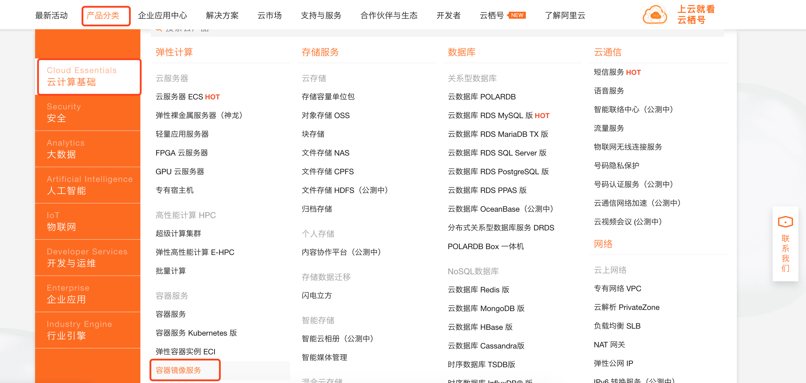
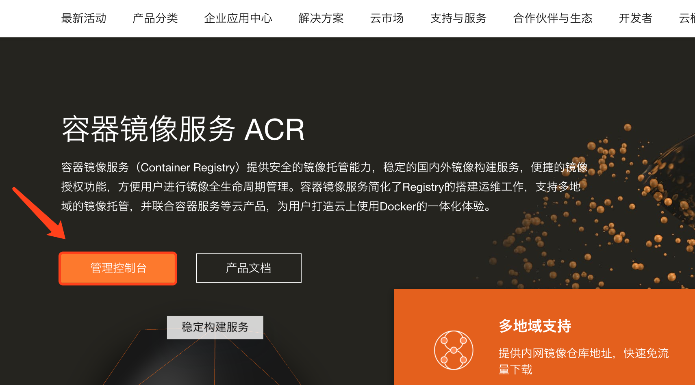
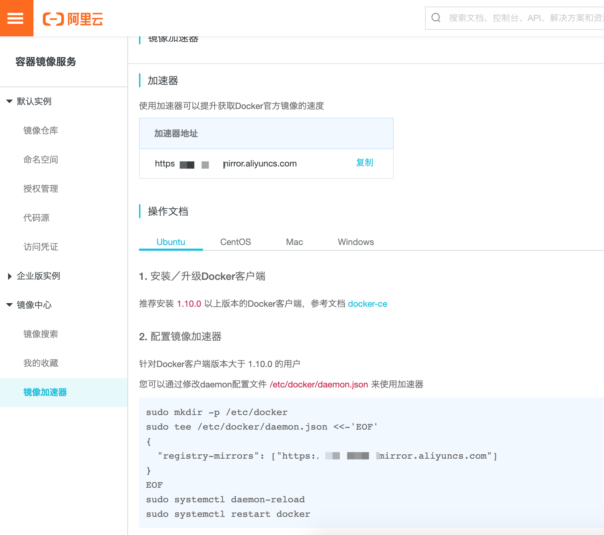
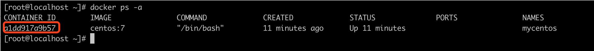

# docker笔记

## 安装

### centOS7

```shell
yum remove docker \
                  docker-client \
                  docker-client-latest \
                  docker-common \
                  docker-latest \
                  docker-latest-logrotate \
                  docker-logrotate \
                  docker-engine
```

```shell
yum install -y yum-utils \
  device-mapper-persistent-data \
  lvm2
```

```shell
yum-config-manager \
    --add-repo \
    https://download.docker.com/linux/centos/docker-ce.repo
```

```shell
yum install docker-ce docker-ce-cli containerd.io
```

指定版本安装

```shell
yum list docker-ce --showduplicates | sort -r
已加载插件：fastestmirror
可安装的软件包
 * updates: mirror.bit.edu.cn
Loading mirror speeds from cached hostfile
 * extras: mirror.bit.edu.cn
docker-ce.x86_64            3:19.03.5-3.el7                     docker-ce-stable
docker-ce.x86_64            3:19.03.4-3.el7                     docker-ce-stable
docker-ce.x86_64            3:19.03.3-3.el7                     docker-ce-stable
docker-ce.x86_64            3:19.03.2-3.el7                     docker-ce-stable
docker-ce.x86_64            3:19.03.1-3.el7                     docker-ce-stable
```

```shell
yum install docker-ce-18.06.3.ce
```

配置阿里镜像加速器

```shell
vim /etc/docker/daemon.json
```

```json
{
  "registry-mirrors": [
      "https://******.mirror.aliyuncs.com"
      ]
}
```








## 操作笔记

### 命令

* --help

  帮助参数, 查看命令内容

  ```shell
  docker --help
  docker <command> --help
  ```

  

* run

  -i: 启动交互模式

  -t:打开控制台 

  -d: 后台启动

  

  --name: 起别名

  一般-i 和 -t一起使用, 但不加-p 属于前台启动容器, 当使用 exit 退出时,容器也就关闭了 可以使用`ctl+P+Q` 退出保证容器不关闭, 或者直接使用-p 后台运行容器

  ```shell
  docker run -it --name mycentos centos:7  #交互模式前台启动容器, 随机生成一个容器 id
  ```

  

  此时操作控制台在 mycentos 容器中, 使用`ctl+P+Q` 退出不关闭容器

  

  ```shell
  docker attach a1dd917a9b57  #进入容器交互模式
  ```

  

  ```shell
  docker run -d --name mycentos1 centos:7 #后台运行启动容器
  ```

  

* 

