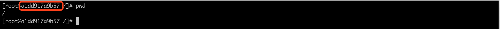

# docker笔记

## 安装 

环境 centOS7

### 安装 docker

```shell
yum remove docker \
                  docker-client \
                  docker-client-latest \
                  docker-common \
                  docker-latest \
                  docker-latest-logrotate \
                  docker-logrotate \
                  docker-engine
```

```shell
yum install -y yum-utils \
  device-mapper-persistent-data \
  lvm2
```

```shell
yum-config-manager \
    --add-repo \
    https://download.docker.com/linux/centos/docker-ce.repo
```

```shell
yum install docker-ce docker-ce-cli containerd.io
```

指定版本安装

```shell
yum list docker-ce --showduplicates | sort -r
已加载插件：fastestmirror
可安装的软件包
 * updates: mirror.bit.edu.cn
Loading mirror speeds from cached hostfile
 * extras: mirror.bit.edu.cn
docker-ce.x86_64            3:19.03.5-3.el7                     docker-ce-stable
docker-ce.x86_64            3:19.03.4-3.el7                     docker-ce-stable
docker-ce.x86_64            3:19.03.3-3.el7                     docker-ce-stable
docker-ce.x86_64            3:19.03.2-3.el7                     docker-ce-stable
docker-ce.x86_64            3:19.03.1-3.el7                     docker-ce-stable
```

```shell
yum install docker-ce-18.06.3.ce
```

配置阿里镜像加速器

```shell
vim /etc/docker/daemon.json   
```

```json
{
  "registry-mirrors": [
      "https://******.mirror.aliyuncs.com"
      ]
}
```


### 安装 docker-compose

1. 第一种: 受网络限制

   ```
   # curl -L https://github.com/docker/compose/releases/download/1.24.1/docker-compose-`uname -s`-`uname -m` > /usr/local/bin/docker-compose 
   
   # chmod +x /usr/local/bin/docker-compose
   # docker-compose --version
   ```

2. 如果第一种不行, 使用 python-pip安装 docker-compose


## 操作笔记

### 命令

* --help

  帮助参数, 查看命令内容

  ```shell
  docker --help
  docker <command> --help
  ```

  

* run

  -i: 启动交互模式

  -t:打开控制台 

  -d: 后台启动

  -p:  `-p 8888:8080` 指定端口 8888 表示 docker 端口, 8080 表示容器端口, 理解为外部通过 8888 访问映射容器的 8080 端口

  -P: 随机分配端口

  -v: 容器数据卷

  

  --name: 起别名

  一般-i 和 -t一起使用, 但不加-p 属于前台启动容器, 当使用 exit 退出时,容器也就关闭了 可以使用`ctl+P+Q` 退出保证容器不关闭, 或者直接使用-d 后台运行容器

  ```shell
  docker run -it --name mycentos centos:7  #交互模式前台启动容器, 随机生成一个容器 id
  ```

  

  此时操作控制台在 mycentos 容器中, 使用`ctl+P+Q` 退出不关闭容器

  

  ```shell
  docker attach a1dd917a9b57  #进入容器交互模式
  ```

  

  ```shell
  docker run -d --name mycentos1 centos:7 #后台运行启动容器
  ```

  

* commit 将本地容器重新打包成一个新的镜像

  ```shell
  docker commit -a="作者" -m="备注" f79889df69fb zcz/tomcat:1
  ```

  f79889df69fb是本地容器id    zcz/tomcat:1新的容器名和 tag

* exec  宿主机通过 docker 执行容器内部命令

  ```shell
  docker exec #{containerId} #{command}
  ```

* cp 从容器内拷贝文件到主机

  ```
  docker cp #{containerId:容器内路径} 目的主机路径 
  ```

  

* inspect 以 json 串格式查看容器

  ```shell
  docker inspect #{containerId} 
  ```

  docker.cnf  mysql.cnf  mysqldump.cnf

* attach 重新进入容器

  ```shell
  docker attach #{containerId} 
  ```

* pull

* push

* export 将容器导出

  ```shell
  docker export mysql > mysql.tar #导出到本地的一个 tar 包
  ```

* import

  ```shell
  docker import mysql.tar #把通过容器导出的 tar 包导入到镜像
  ```

* save

  ```shell
  docker save mysql > mysql.tar  #将镜像导出 tar 包
  ```

* load

  ```shell
  docker load mysql.tar #将镜像导出的 tar 包 导入到 docker 镜像
  ```

  

### 容器数据卷

* 概念
  * docker 容器数据持久化
  * docker 容器间间数据共享或 与主机间的数据共享

* 使用容器数据卷的方式

  * 命令添加

    ```shell
    docker run -it -v  #{/宿主机绝对目录}:#{/容器内目录:ro} --privileged=true #{镜像名}
    ```

    :ro 可选参数  表示 read-only 只读

    --privileged=true 可选参数, Docker 挂在主机目录 Docker 访问出现 cannot open directory.:Permission denied 时增加此参数

  *  dockerFile添加

    ```shell
    docker build -f #{Dockerfile} -t #{imageName:tag} .
    ```

    **注意最后的点表示路径** 

    ```shell
    FROM centos:7
    VOLUME ["/share-data1", "/share-data2"]
    CMD echo "finish.....success"
    CMD /bin/bash
    ```

    

* 数据卷容器

  `命名的容器挂载数据卷`, 其它容器通过`挂载这个(父容器)`实现数据共享, 挂载数据卷的容器, 程志文数据卷容器

  容器间的数据共享与传递

  ```shell
  docker run -it --name #{containerName} --volumes-from #{FromContainerName} #{imageName}
  ```

  

### dockerfile

* **Dockerfile 是用来构建 Docker 镜像的构建文件, 是由一系类命令和参数构成的脚本**

* Dockerfile中每条指令都会创建一个新的镜像层, 并对镜像进行提交

* Dockerfile 执行流程
  * docker 从基础镜像运行一个容器
  * 执行一条指令并对容器作出修改
  * 执行类似 docker commit 的操作提交一个新的镜像层
  * docker 再给予刚提交的镜像运行一个新容器
  * 执行 dockerfile 中的下一条指令直到所有指令都执行完成

* docker 保留字指令

  * `FROM` 基础镜像,当前新镜像是基于哪个镜像的

    最基本的镜像`scratch`

  * `MAINTAINER` 镜像维护者的信息

  * `RUN` 容器构建时需要运行的命令

  * `EXPOSE` 当前容器运行后对外暴露的端口

  * `WORKDIR` 指定当前镜像启动后的容器, 控制台进入容器的工作目录

  * `ENV` 用来构建镜像设置环境变量

  * `ADD` 将宿主机目录下的文件拷贝进镜像且 ADD 命令会自动处理 URL 和解压缩 tar 压缩包

  * `COPY` 类似于 ADD, 拷贝文件和目录到镜像, 但不做处理

    `COPY src dest` 或COPY ["src", "dest"]

  * `VOLUME` 容器数据卷

  * `CMD` 指定容器启动时要运行的命令; Dockerfile 中可以有多个 CMD 指定, 但只有最后一个生效, CMD 会被 docker run 之后的参数替换 

  * `ENTRYPOINT` 指定容器启动时要运行的命令; 不会被覆盖

  * `ONBUILD` 当构建一个被继承的 Dockerfile 时运行命令, 当前镜像的ONBUILD指定在被其它镜像继承构建时触发

    | BUILD             | BOTH    | RUN        |
    | ----------------- | ------- | ---------- |
    | FROM              | WORKDIR | CMD        |
    | MAINTAINER        | USER    | ENV        |
    | COPY              |         | EXPOSE     |
    | ADD               |         | VOLUME     |
    | RUN               |         | ECTRYPOINT |
    | ONBUILD           |         |            |
    | .dockerfileignore |         |            |

* 练习 1

  ```shell
  FROM centos:7
  MAINTAINER zcz<youya_cz@163.com>
  
  ENV workdir=/workdir
  RUN mkdir -p  $workdir
  RUN yum install -y net-tools
  RUN yum install -y vim
  
  WORKDIR $workdir
  
  EXPOSE 80
  CMD echo "====success===="
  CMD /bin/bash
  ```

  ```shell
  docker build -f /opt/container/mycentosDockerfile -t mycentos:1.0 .
  ```

  ```shell
  docker run -it --name mycentos mycentos:1.0
  ```

  

* 练习 2 CMD 与 ENTRYPOINT

  ```shell
  FROM centos:7
  
  MAINTAINER zcz<youya_cz@163.com>
  
  RUN ["yum","install", "-y", "curl"]
  
  
  CMD ["echo", "====success==="]
  ENTRYPOINT ["curl", "-s", "https://ip.cn/"]
  ```

  ```shell
  docker build -f /opt/container/Dockerfile3 -t myip
  ```

  


## 安装案例

### mysql

```shell
docker pull mysql:5.7
docker run -p 3306:3306 --name mysql5.7 -v /test/mysql/conf:/etc/mysql/mysql.conf.d -v /test/mysql/data:/var/lib/mysql -v /test/mysql/logs:/logs -e MYSQL_ROOT_PASSWORD=zcz920518 -d mysql:5.7
docker exec -it #{containerId} /bin/bash
```

进入容器

```shell
mysql -uroot -p
```

```shell
# Copyright (c) 2014, 2016, Oracle and/or its affiliates. All rights reserved.
#
# This program is free software; you can redistribute it and/or modify
# it under the terms of the GNU General Public License, version 2.0,
# as published by the Free Software Foundation.
#
# This program is also distributed with certain software (including
# but not limited to OpenSSL) that is licensed under separate terms,
# as designated in a particular file or component or in included license
# documentation.  The authors of MySQL hereby grant you an additional
# permission to link the program and your derivative works with the
# separately licensed software that they have included with MySQL.
#
# This program is distributed in the hope that it will be useful,
# but WITHOUT ANY WARRANTY; without even the implied warranty of
# MERCHANTABILITY or FITNESS FOR A PARTICULAR PURPOSE.  See the
# GNU General Public License, version 2.0, for more details.
#
# You should have received a copy of the GNU General Public License
# along with this program; if not, write to the Free Software
# Foundation, Inc., 51 Franklin St, Fifth Floor, Boston, MA  02110-1301 USA

#
# The MySQL  Server configuration file.
#
# For explanations see
# http://dev.mysql.com/doc/mysql/en/server-system-variables.html
[mysql]
default-character-set=utf8

[mysql.server]
default-character-set=utf8

[mysql_safe]
default-character-set=utf8

[client]
default-character-set=utf8

[mysqld]
pid-file        = /var/run/mysqld/mysqld.pid
socket          = /var/run/mysqld/mysqld.sock
datadir         = /var/lib/mysql
character_set_server=utf8
collation-server=utf8_general_ci
default-storage-engine=INNODB
lower-case-table-names=1

#log-error      = /var/log/mysql/error.log
# By default we only accept connections from localhost
#bind-address   = 127.0.0.1
# Disabling symbolic-links is recommended to prevent assorted security risks
symbolic-links=0
```


### redis

[redis.conf](./resource/redis.conf)

```shell
docker pull redis:5
docker run -d -p 6379:6379 --name=redis1 -v /opt/modules/redis/data/:/data -v /opt/modules/redis/conf/redis.conf:/conf/redis.conf --restart always redis:5 redis-server /conf/redis.conf --appendonly yes
```

### rabbitmq

```shell
docker pull rabbitmq:3.8.2


#!/bin/bash
docker run -d --name rabbitmq1 --restart always -p 5672:5672 -p 15672:15672 -v /opt/modules/rabbitmq/data:/var/lib/rabbitmq --hostname rabbit142 -e RABBITMQ_DEFAULT_VHOST=rabbit_142 -e RABBITMQ_DEFAULT_USER=admin -e RABBITMQ_DEFAULT_PASS=admin rabbitmq:3.8.2

docker exec -it rabbitmq1 rabbitmq-plugins enable rabbitmq_management
```

### jenkins

```shell
docker pull jenkins
mkdir -p /opt/modules/jenkins/data
#需要修改下目录权限, 因为当映射本地数据卷时，/home/docker/jenkins目录的拥有者为root用户，而容器中jenkins user的uid为1000
chown -R 1000:1000 /opt/modules/jenkins/data

docker run -d -p 8080:8080 -p 50000:50000 --name=jenkins -v /opt/modules/jenkins/data/:/var/jenkins_home jenkins

#初始化密码
docker exec -it jenkins cat /var/jenkins_home/secrets/initialAdminPassword
```


