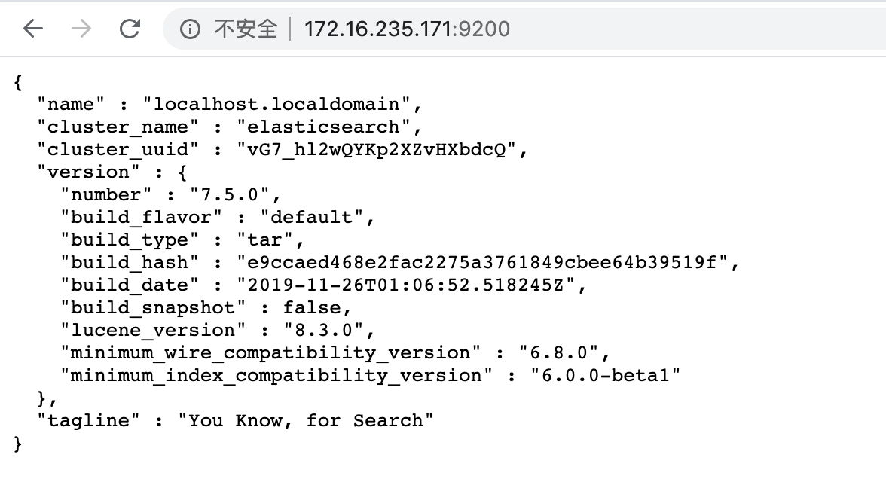
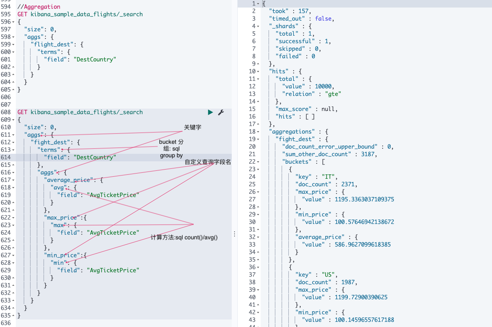
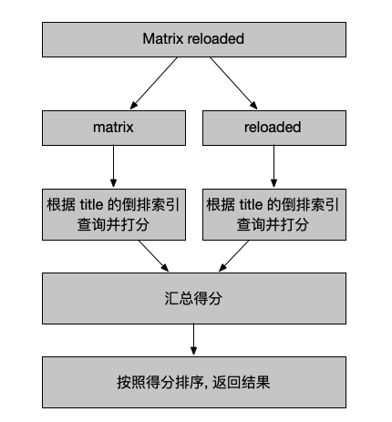

# ElasticStack

## 安装

### elasticSearch 安装配置


#### 目录结构

| 目录    | 配置文件          | 描述                                                        |
| ------- | ----------------- | ----------------------------------------------------------- |
| bin     |                   | 脚本文件, 包括启动 elasticsearch, 安装插件.  运行统计数据等 |
| config  | elasticsearch.yml | 集群配置文件, user, role based 相关配置                     |
| JDK     |                   | java 运行环境                                               |
| data    | path.data         | 数据文件                                                    |
| lib     |                   | java 类库                                                   |
| logs    | path.log          | 日志文件                                                    |
| modules |                   | 包含所有 ES 模块                                            |
| plugins |                   | 包含所有已安装插件                                          |

####JVM 配置

* 修改 JVM-config/jvm.options
  * 7.1 下载的默认配置是 1GB
* 配置的建议
  * Xms 和 Xmx 设置一样
  * Xmx 不要草果机器内存的一半
  * 不要超过 30GB - https://www.elastic.co/blog/a-heap-of-trouble

#### 配置项

```yaml
cluster.name: elasticsearch
# 配置的集群名称，默认是elasticsearch，es服务会通过广播方式自动连接在同一网段下的es服务，通过多播方式进行通信，同一网段下可以有多个集群，通过集群名称这个属性来区分不同的集群。

node.name: "Franz Kafka"
# 当前配置所在机器的节点名，你不设置就默认随机指定一个name列表中名字，该name列表在es的jar包中config文件夹里name.txt文件中，其中有很多作者添加的有趣名字。

node.master: true
指定该节点是否有资格被选举成为node（注意这里只是设置成有资格， 不代表该node一定就是master），默认是true，es是默认集群中的第一台机器为master，如果这台机挂了就会重新选举master。

node.data: true
# 指定该节点是否存储索引数据，默认为true。

index.number_of_shards: 5
# 设置默认索引分片个数，默认为5片。

index.number_of_replicas: 1
# 设置默认索引副本个数，默认为1个副本。如果采用默认设置，而你集群只配置了一台机器，那么集群的健康度为yellow，也就是所有的数据都是可用的，但是某些复制没有被分配
# （健康度可用 curl 'localhost:9200/_cat/health?v' 查看， 分为绿色、黄色或红色。绿色代表一切正常，集群功能齐全，黄色意味着所有的数据都是可用的，但是某些复制没有被分配，红色则代表因为某些原因，某些数据不可用）。

path.conf: /path/to/conf
# 设置配置文件的存储路径，默认是es根目录下的config文件夹。

path.data: /path/to/data
# 设置索引数据的存储路径，默认是es根目录下的data文件夹，可以设置多个存储路径，用逗号隔开，例：
# path.data: /path/to/data1,/path/to/data2

path.work: /path/to/work
# 设置临时文件的存储路径，默认是es根目录下的work文件夹。

path.logs: /path/to/logs
# 设置日志文件的存储路径，默认是es根目录下的logs文件夹 

path.plugins: /path/to/plugins
# 设置插件的存放路径，默认是es根目录下的plugins文件夹, 插件在es里面普遍使用，用来增强原系统核心功能。

bootstrap.mlockall: true
# 设置为true来锁住内存不进行swapping。因为当jvm开始swapping时es的效率 会降低，所以要保证它不swap，可以把ES_MIN_MEM和ES_MAX_MEM两个环境变量设置成同一个值，并且保证机器有足够的内存分配给es。 同时也要允许elasticsearch的进程可以锁住内# # 存，linux下启动es之前可以通过`ulimit -l unlimited`命令设置。

network.bind_host: 192.168.0.1
# 设置绑定的ip地址，可以是ipv4或ipv6的，默认为0.0.0.0，绑定这台机器的任何一个ip。

network.publish_host: 192.168.0.1
# 设置其它节点和该节点交互的ip地址，如果不设置它会自动判断，值必须是个真实的ip地址。

network.host: 192.168.0.1
# 这个参数是用来同时设置bind_host和publish_host上面两个参数。

transport.tcp.port: 9300
# 设置节点之间交互的tcp端口，默认是9300。

transport.tcp.compress: true
# 设置是否压缩tcp传输时的数据，默认为false，不压缩。

http.port: 9200
# 设置对外服务的http端口，默认为9200。

http.max_content_length: 100mb
# 设置内容的最大容量，默认100mb

http.enabled: false
# 是否使用http协议对外提供服务，默认为true，开启。

gateway.type: local
# gateway的类型，默认为local即为本地文件系统，可以设置为本地文件系统，分布式文件系统，hadoop的HDFS，和amazon的s3服务器等。

gateway.recover_after_nodes: 1
# 设置集群中N个节点启动时进行数据恢复，默认为1。

gateway.recover_after_time: 5m
# 设置初始化数据恢复进程的超时时间，默认是5分钟。

gateway.expected_nodes: 2
# 设置这个集群中节点的数量，默认为2，一旦这N个节点启动，就会立即进行数据恢复。

cluster.routing.allocation.node_initial_primaries_recoveries: 4
# 初始化数据恢复时，并发恢复线程的个数，默认为4。

cluster.routing.allocation.node_concurrent_recoveries: 2
# 添加删除节点或负载均衡时并发恢复线程的个数，默认为4。

indices.recovery.max_size_per_sec: 0
# 设置数据恢复时限制的带宽，如入100mb，默认为0，即无限制。

indices.recovery.concurrent_streams: 5
# 设置这个参数来限制从其它分片恢复数据时最大同时打开并发流的个数，默认为5。

discovery.zen.minimum_master_nodes: 1
# 设置这个参数来保证集群中的节点可以知道其它N个有master资格的节点。默认为1，对于大的集群来说，可以设置大一点的值（2-4）

discovery.zen.ping.timeout: 3s
# 设置集群中自动发现其它节点时ping连接超时时间，默认为3秒，对于比较差的网络环境可以高点的值来防止自动发现时出错。

discovery.zen.ping.multicast.enabled: false
# 设置是否打开多播发现节点，默认是true。

discovery.zen.ping.unicast.hosts: ["host1", "host2:port", "host3[portX-portY]"]
# 设置集群中master节点的初始列表，可以通过这些节点来自动发现新加入集群的节点。
```

elasticsearch7版本引入的[新集群协调子系统了解一哈](https://www.infoq.cn/article/hefb1QQsWF2NHoRQ-tL0),新增两个如下配置项

```
discovery.seed_hosts
cluster.initial_master_nodes
```


#### 启动

```shell
$ cd /opt/modulet/elasticsearch/bin
$ ./elasticsearch # 前台启动
$ ./elasticsearch -d # 后台启动
```

**注意:** 此时报错

```
[2020-03-10T02:03:32,844][WARN ][o.e.b.ElasticsearchUncaughtExceptionHandler] [localhost.localdomain] uncaught exception in thread [main]
org.elasticsearch.bootstrap.StartupException: java.lang.RuntimeException: can not run elasticsearch as root
	at org.elasticsearch.bootstrap.Elasticsearch.init(Elasticsearch.java:163) ~[elasticsearch-7.5.0.jar:7.5.0]
	at org.elasticsearch.bootstrap.Elasticsearch.execute(Elasticsearch.java:150) ~[elasticsearch-7.5.0.jar:7.5.0]
	at org.elasticsearch.cli.EnvironmentAwareCommand.execute(EnvironmentAwareCommand.java:86) ~[elasticsearch-7.5.0.jar:7.5.0]
	at org.elasticsearch.cli.Command.mainWithoutErrorHandling(Command.java:125) ~[elasticsearch-cli-7.5.0.jar:7.5.0]
	at org.elasticsearch.cli.Command.main(Command.java:90) ~[elasticsearch-cli-7.5.0.jar:7.5.0]
	at org.elasticsearch.bootstrap.Elasticsearch.main(Elasticsearch.java:115) ~[elasticsearch-7.5.0.jar:7.5.0]
	at org.elasticsearch.bootstrap.Elasticsearch.main(Elasticsearch.java:92) ~[elasticsearch-7.5.0.jar:7.5.0]
Caused by: java.lang.RuntimeException: can not run elasticsearch as root
	at org.elasticsearch.bootstrap.Bootstrap.initializeNatives(Bootstrap.java:105) ~[elasticsearch-7.5.0.jar:7.5.0]
	at org.elasticsearch.bootstrap.Bootstrap.setup(Bootstrap.java:172) ~[elasticsearch-7.5.0.jar:7.5.0]
	at org.elasticsearch.bootstrap.Bootstrap.init(Bootstrap.java:349) ~[elasticsearch-7.5.0.jar:7.5.0]
	at org.elasticsearch.bootstrap.Elasticsearch.init(Elasticsearch.java:159) ~[elasticsearch-7.5.0.jar:7.5.0]
	... 6 more
```

*elasticSearch 不允许使用 root 用户启动*

所以要创建用户启动

```shell
$ groupadd elastic
$ useradd -g elastic elastic
$ passwd elastic
```

**注意:** 由于我是在虚拟机安装的, 直接在主机上通过 ip:9200 访问不到, 需要修改配置

```yml
network.host ip  # 打开配置, 改为虚拟机 ip
```

…… 单机启动后面还有好几个错误, 遇到解决就行了, 最后 ip:9200 查看启动成功




#### 安装插件

1. 查看本机安装插件

   ```
   ./elasticsearch-plugin list
   ```

2. 安装插件

   ```shell
   ./elasticsearch-plugin install analysis-icu # analysis-icu是国际化分析插件
   ```

3. 查看安装的插件

   ```
   http://ip:9200/_cat/plugins
   ```

#### 单机启动多节点

```shell
bin/elasticsearch -E node.name=node1 -E cluster.name=mycluster -E path.data=node1_data -d
bin/elasticsearch -E node.name=node2 -E cluster.name=mycluster -E path.data=node2_data -d
bin/elasticsearch -E node.name=node3 -E cluster.name=mycluster -E path.data=node3_data -d
bin/elasticsearch -E node.name=node4 -E cluster.name=mycluster -E path.data=node4_data -d

# 删除进程
ps grep | elastic /kill pid
```

查看集群节点

```
http://ip:9200/_cat/node
```

#### 集群配置

```yaml
#集群名称
cluster.name: elasticsearch
#节点名称
node.name: node-a
#是不是有资格竞选主节点
node.master: true
#是否存储数据
node.data: true
#最大集群节点数
node.max_local_storage_nodes: 3
#网关地址
network.host: 0.0.0.0
#端口
http.port: 9200
#内部节点之间沟通端口
transport.tcp.port: 9300
#es7.x 之后新增的配置，写入候选主节点的设备地址，在开启服务后可以被选为主节点
discovery.seed_hosts: ["172.16.235.171","172.16.235.172","172.16.235.173"]
#es7.x 之后新增的配置，初始化一个新的集群时需要此配置来选举master
cluster.initial_master_nodes: ["node-a", "node-b","node-c"]
#数据存储路径
path.data: /home/es/software/es/data
#日志存储路径
path.logs: /home/es/software/es/logs
```


### Kibana

1. 解压, 修改文件用户组

2. 修改配置文件

   ```
   # 放开注释,将默认配置改成如下：
   server.port: 5601
   server.host: "0.0.0.0"
   elasticsearch.url: "http://172.16.235.171:9200"
   kibana.index: ".kibana"
   ```

3. 启动

   ```shell
   $ bin/kibana
   $ nohup bin/kibana &  #后台运行
   ```

4. 汉化

   5、6 版本需要下载补丁包  https://github.com/anbai-inc/Kibana_Hanization

   7 版本已经支持了中文 只需要在配置文件 kibana.yml 中加入

   ```
   i18n.locale: "zh-CN"
   ```

5. 

### logstash

1. 下载 movielens 数据集 测试数据

2. 编写 logstash.conf

   ```
   filter {
     csv {
       separator => ","
       columns => ["id","content","genre"]
     }
     mutate {
       split => { "genre" => "|" }
       remove_field => ["path", "host","@timestamp","message"]
     }
     mutate {
       split => ["content", "("]
       add_field => { "title" => "%{[content][0]}"}
       add_field => { "year" => "%{[content][1]}"}
     }
     mutate {
       convert => {
         "year" => "integer"
       }
       strip => ["title"]
       remove_field => ["path", "host","@timestamp","message","content"]
     }
   }
   output {
      elasticsearch {
        hosts => "10.5.250.168:9200"
        index => "movies"
        document_id => "%{id}"
      }
     stdout {}
   }
   ```

3. 启动 logstash

   ```
   $ bin/logstash -f conf/logstash.conf
   ```

   **注意:** 因为我是在一个虚拟机上安装的 elasticsearsh, kibana, logstash; elasticsearch 使用安装包内的 jdk, logstash 找不到 java 指令 JAVACMD

   编辑 bin/logstash 增加 JAVACMD的值

   ```
   JAVACMD=/home/elastic/elasticsearch/jdk/bin/java
   ```

4. 重新导入成功

### cerebro 

监控 elasticsearch 集群 需要 java 环境


## ElasticSearch

### 概念

集群 节点 索引 分片 副本


### CRUD 操作

* 说明

  | 操作   | 示例                                                         |
  | ------ | ------------------------------------------------------------ |
  | Index  | PUT my_index/_doc/1<br/>{"user":"mike", "comment":"You know, for search"} |
  | Create | PUT my_index/_create/1<br/>{"user":"mike", "comment":"You know, for search"}<br/>POST my_index/\_doc/1<br/>{"user":"mike", "comment":"You know, for search"} |
  | Read   | GET my_index/_doc/1                                          |
  | Update | POST my_index/_update/1<br/>{"doc":{"user":"mike", "comment":"You know, ElasticSearch"}} |
  | Delete | DELETE my_index/_doc/1                                       |

  ```
  method 索引/_type/id
  PUT    my_index/_doc/id
  7.0 版本开始_type 都使用_doc 指定
  ```

  ```
  - _type名: 约定都用_doc
  - Create: 如果 ID 已经存在, 会执行失败
  - Index: 如果 ID 已经存在, 删除现有文档,并重新创建,版本会增加; 如果不存在,直接创建
  - Update: 文档必须已经存在, 更新会对相应字段做增量修改
  ```

  

* 操作- CREATE

  支持两种方式  - 第一种自动生成文档 id

  ​						 - 第二种指定文档 id

  ```http
  //create document 自动生成 _id
  POST users/_doc
  {
    "user":"mike",
    "post_date": "2019-04-15T14:12:12",
    "message": "trying out Kibana"
  }
  
  //create document 指定 id, 如果存在, 报错
  PUT users/_doc/1?op_type=create
  {
    "user":"jack",
    "post_date": "2019-04-15T14:12:12",
    "message": "trying out ElasticSearch"
  }
  ```

* 操作- GET

  ```
  GET users/_doc/1
  ```

* 操作- INDEX

  ```
  PUT users/_doc/1
  {
    "user":"Mike"
  }
  GET users/_doc/1
  ```

* 操作- UPDATE

  ```
  POST users/_update/1
  {
    "doc":{
      "post_date": "2019-04-15T14:12:12",
    "message": "trying out ElasticSearch"
    }
  }
  GET users/_doc/1
  ```

* 操作- DELETE

  ```
  DELETE users/_doc/1
  ```

  

* Bulk API

  * 支持在一次 API 调用中, 对不同的索引进行操作

  * 支持四种类型操作
      * Index
      * Create
      * Update
      * Delete
  * 可以在 URI 中指定 Index, 也可以在请求的 Payload 中进行
  * 操作中单条操作失败, 并不会影响其他操作
  * 返回结果包括了每一条操作执行的结果

  ```
  POST _bulk
  {"index" : {"_index":"test", "_id":"1"}}
  {"field1": "value1"}
  {"delete": {"_index":"test", "_id":"2"}}
  {"create": {"_index":"test2", "_id":"3"}}
  {"field1": "value3"}
  {"update": {"_index":"test", "_id":"1"}}
  {"doc": {"field2":"value2"}}
  ```

* 操作- mget  

  批量获取

  ```
  GET _mget
  {
    "docs":[
        {
          "_index":"user",
          "_id":"1"
        },
        {
          "_index":"comment",
          "_id":1
        }
      ]
  }
  ```

* 操作- msearch

  批量查询

  ```
  POST kibana_sample_data_ecommerce/_msearch
  {}
  {"query": {"match_all": {}}, "size": 1}
  {"index": "kibana_sample_data_flights"}
  {"query": {"match_all": {}}, "size": 2}
  ```

  

###  Analyzer 分词器

​	analyzer 由 character filter, tokenizer, token Filter

* 中文分词器

  Icu

  ```
  bin/elasticsearch install analysis-icu
  ```

  ik

  ```
  bin/elasticsearch install https://github.com/medcl/elasticsearch-analysis-ik/releases/download/v7.1.1/elasticsearch-analysis-ik-7.1.1.zip
  ```

  THULAC

  ```
  https://github.com/microbun/elasticsearch-thulac-plugin
  ```

  

* 其它分词器


###Search API

* URI Search

  在 URL中指定查询条件

  | 语法                   | 范围                   |
  | ---------------------- | ---------------------- |
  | /_search               | 查询所有               |
  | /index1/_search        | 对 index1 索引进行查询 |
  | /index1,index2/_search | 对多个索引进行查询     |
  | /index*/_search        | 对索引通配符模糊查询   |

  ```http
  #get 方法查询kibana_sample_data_ecommerce索引下字段customer_first_name为 Eddie 的相关内容
  #用q 作为查询内容
  curl -XGET "http:172.16.235.171:9200/kibana_sample_data_ecommerce/_search?q=customer_first_name:Eddie"
  ```

  

* Request Body Search

  ```http
  #同时可以使用 GET 或 POST
  curl -XGET "http:172.16.235.171:9200/kibana_sample_data_ecommerce/_search" -H
  'Content-Type:application/json' -d '
  {
  	"query":{
  		"match_all":{}
  	}
  }'
  ```

* 通过 URI Search 实现搜索

  ```
  GET /movies/_search?q=2012&df=title&sort=year:desc&from=0&size=10&timeout=1s
  ```

  * q: 指定查询语句参数
  * df: 默认字段, 不指定时,会对所有字段进行查询
  * sort: 排序字段
  * from/size: 分页
  * Profile:可以查看查询是如何被执行的

  ```
  //URI Search
  
  GET /movies/_search?q=2012&df=title&sort=year:desc&from=0&size=10&timeout=1s
  
  
  GET movies/_search?q=2012&df=title
  {
    "profile": "true"
  }
  
  GET /movies/_search?q=2012
  {"profile": "true"}
  
  GET /movies/_search?q=title:2012
  {
    "profile": "true"
  }
  
  GET /movies/_search?q=title:Beautiful Mind
  {
    "profile": "true"
  }
  
  GET /movies/_search?q=title:"Beautiful Mind"
  {
    "profile": "true"
  }
  
  GET /movies/_search?q=title:(Beautiful AND Mind)
  {
    "profile": "true"
  }
  
  GET /movies/_search?q=title:Beautiful OR Mind
  {
    "profile": "true"
  }
  
  GET /movies/_search?q=title:(Beautiful NOT Mind)
  {
    "profile": "true"
  }
  
  GET /movies/_search?q=title:(Beautifule Mind)
  {
    "profile": "true"
  }
  
  GET /movies/_search?q=year:>=2012
  {
    "profile": "true"
  }
  
  GET /movies/_search?q=title:b*
  {
    "profile": "true"
  }
  
  GET /movies/_search?q=title:beautil~2
  {
    "profile": "true"
  }
  
  GET /movies/_search?q=title:"Lord Rings"~2
  {
    "profile": "true"
  }
  ```

* URI Search Request Body

  ```
  GET /kibana_sample_data_ecommerce/_search
  {
    "profile": "true",
    "sort": [{"order_date": "desc"}],
    "query": {
      "match_all": {}
    }
  }
  
  GET /kibana_sample_data_ecommerce/_search
  {
    "profile": "true",
    "_source": ["order_date"],
    "from": 0,
    "size": 10
  }
  
  GET kibana_sample_data_ecommerce/_search
  {
    "profile": "true",
    "script_fields": {
      "new_filed": {
        "script": {
          "lang": "painless",
          "source": "doc['order_date'].value+' hello'"
        }
      }
    },
    "from": 0,
    "size": 20
  }
  
  GET /movies/_search
  {
    "profile": "true",
    "query": {
      "match": {
        "title":"Last Christmas"
      }
    }
    
  }
  
  GET /movies/_search
  {
    "profile": "true",
    "query": {
      "match": {
        "title": {
          "query": "Last Christmas",
          "operator": "and"
        }
      }
    }
  }
  
  GET /movies/_search
  {
    "profile": "true",
    "_source": "title", 
    "query": {
      "match_phrase": {
        "title": {
          "query": "Who Christmas",
          "slop": 1
        }
      }
    }
  }
  ```

* Query String 和 Simple Query String

  ```
  // query String Simple Query String
  PUT /users/_doc/1
  {
    "name": "Chenzhao Zhang",
    "about": "java, OC, swift, python"
  }
  
  PUT /users/_doc/2
  {
    "name": "zcz",
    "about": "hadoop"
  }
  
  
  GET /users/_search
  {
    "query": {
      "query_string": {
        "fields": ["name"], 
        "query": "(Chenzhao AND zhang) OR zcz"
      }
    }
  }
  
  GET /users/_search
  {
    "query": {
      "simple_query_string": {
        "query": "zhang zcz",
        "fields": ["name", "about"]
        , "default_operator": "OR"
      }
    }
  }
  ```


### Mapping

* dynamic mapping

  

* Mapping 设置

  elastic 提供了四种不同级别的 `index_options` 配置, 可以控制倒排索引记录的内容

  * docs - 记录 doc id
  * freqs - 记录 doc id / term frequencies
  * positions - 记录 doc id /term frequencies / term position
  * offsets - 记录 doc id / term frequencies / term position / character offsets

  Text 类型默认记录 positions, 其他默认 docs

  记录内容越多, 占用存储空间越大

  ```
  PUT users
  {
    "mappings": {
      "properties": {
        "firstName":{
          "type": "text"
        },
        "lastName":{
          "type": "text"
        },
        "mobile":{
          "type": "text",
          "index": false
        },
        "bio":{
          "type": "text",
          "index_options": "offsets"
        }
      }
    }
  }
  ```

  如果某字段记录的数据可能为 null , 而在搜索中, 需要查询 null 的值可以用`null_value`设置属性该字段存储值为 null 时存储"NULL" 字符串

  ```
  PUT users
  {
    "mappings": {
      "properties": {
        "firstName": {
          "type": "text"
        },
        "lastName":{
          "type": "text"
        },
        "mobile":{
          "type": "text",
          "null_value": "NULL"
        }
      }
    }
  }
  ```

  联合字段查询

  如果希望将多个字段当做一个字段进行查询匹配,可以使用 `copy_to` 指定联合字段名(这个联合字段不是真实存在的)

  ```
  PUT users
  {
    "mappings": {
      "properties": {
        "firstName":{
          "type": "text",
          "copy_to": "fullName"
        },
        "lastName":{
          "type": "text",
          "copy_to": "fullName"
        }
      }
    }
  }
  ```


### Template

* Index Template

  当一个索引被创建时

  * 应用 Elasticsearch 默认的 settings 和 mappings
  * 应用 order 数值低的 Index Template中的设定
  * 应用 order 数值高的 Index Template 中的设定
  * 应用创建索引时,用户指定的 settings 和 mappings
  * 后者覆盖前者

  ```
  // Index Template
  
  PUT ttemplate/_doc/1
  {
    "someNumber": "1",
    "someDate": "2019/01/01"
  }
  
  GET ttemplate/_mapping
  
  //create a default template
  PUT _template/template_default
  {
    "index_patterns":["*"],
    "order": 0,
    "version":1,
    "settings":{
      "number_of_shards":1,
      "number_of_replicas":1
    }
  }
  
  PUT _template/template_test
  {
    "index_patterns":["test*"],
    "order":1,
    "settings":{
      "number_of_shards":1,
      "number_of_replicas":2
    },
    "mappings":{
      "date_detection":false,
      "numeric_detection":true
    }
  }
  
  GET _template/template_default
  GET _template/temp*
  
  
  PUT testtemplate/_doc/1
  {
    "someNumber":"1",
    "someDate":"2019/02/02"
  }
  GET testtemplate/_mapping
  GET testtemplate/_settings
  
  PUT testmy
  {
    "settings": {
      "number_of_replicas": 3
    }
  }
  
  GET testmy/_settings
  
  
  DELETE testmy
  DELETE _template/template_default
  DELETE _template/template_test
  ```

  

* Dynamic Template

  * 它是定义在某个索引的 mapping 中的

  * template 有一个名称

  * 匹配规则是一个数组

  * 为匹配到字段设置 Mapping

  ```
  // dynamic template
  
  PUT my_index
  {
    "mappings": {
      "dynamic_templates":[
        {
          "string_as_boolean":{
            "match_mapping_type":"string",
            "match":"is*",
            "mapping":{
              "type":"boolean"
            }
          }
        },
        {
          "string_as_keyword":{
            "match_mapping_type":"string",
            "mapping":{
              "type":"keyword"
            }
          }
        }
        ]
    }
  }
  
  PUT my_index/_doc/1
  {
    "firstname":"zcz",
    "isVIP":"false"
  }
  GET /my_index/_mapping
  DELETE /my_index
  
  PUT my_index
  {
    "mappings": {
      "dynamic_templates":[
        {
          "full_name":{
            "path_match":"name.*",
            "path_unmatch":"*.middle",
            "mapping":{
              "type":"text",
              "copy_to":"full_name"
            }
          }
        }
        ]
    }
  }
  
  PUT my_index/_doc/2
  {
    "name":{
      "first":"John",
      "middle":"Winston",
      "last":"Lennon"
    }
  }
  
  GET my_index/_mapping
  GET my_index/_search?q=full_name:John
  ```


### Aggregation 聚合

聚合分类:

* Bucket Aggregation - 一些列满足特定条件的文档的集合  -  类似于sql 中的 group by
* Metric Aggregation - 一些数学运算, 可以对文档字段进行统计分析 - 类似于sql 中的 count()
* Pipline Aggregation - 对其他的聚合结果进行二次聚合
* Matix Aggregation - 支持多个字段的的操作并提供一个结果矩阵

#### bucket + metric 聚合

聚合之间可以嵌套



```
GET kibana_sample_data_flights/_search
{
  "size": 0,
  "aggs": {
    "flight_dest": {
      "terms": {
        "field": "DestCountry"
      }
    }
  }
}

GET kibana_sample_data_flights/_search
{
  "size": 0,
  "aggs": {
    "flight_dest": {
      "terms": {
        "field": "DestCountry"
      }, 
      "aggs": {
        "avg_price": {
          "avg": {
            "field": "AvgTicketPrice"
          }
        }
      }
    }
  }
}


GET kibana_sample_data_flights/_search
{
  "size": 0,
  "aggs": {
    "fight_dest": {
      "terms": {
        "field": "DestCountry"
      },
      "aggs": {
        "average_price": {
          "avg": {
            "field": "AvgTicketPrice"
          }
        },
        "max_price":{
          "max": {
            "field": "AvgTicketPrice"
          }
        },
        "min_price":{
          "min": {
            "field": "AvgTicketPrice"
          }
        },
        "weather":{
          "terms": {
            "field": "DestWeather"
          }
        }
      }
    }
  }
}

```


###term/match

基于词项和基于全文本的搜索

term 属于基于词项的查询, 查询时不会进行分词,term 也可以使用 keyword 进行分词查询

match/ match phrase/ query string query 属于基于全文本的搜索, 查询会进行分词, 然后匹配

* 基于 term 的查询

  * term 是表达语义的最小单位, 搜索和利用统计语言模型进行孜然语言处理都需要处理 term

  * 特点
    * term level query: Term Query / Range Query / Exists Query / Prefix Query / Wildcard Query
    * 在 ES 中, term 查询, 对输入不做分词, 会将输入作为一个整体, 在倒排索引中查找准确的词项, 并且使用相关度算分公式为每个包含该词项的文档进行相关度算分
    * 可以通过 Constant Score 想查询转换成一个 Filtering, 避免算分, 并利用缓存, 提高性能

  ```
  PUT /products/_bulk
  {"index":{"_id": 1}}
  {"productID":"XHDK-A-1293-#fJ3", "desc":"iPhone"}
  {"index":{"_id":2}}
  {"productID":"KDKE-B-9947-#kL5", "desc":"iPad"}
  {"index":{"_id":3}}
  {"productID":"JODL-X-1937-#pV7", "desc":"MBP"}
  
  GET products/_search
  {
    "query": {
      "term": {
        "desc": {
          "value": "iphone"
          //"value": "iPhone"
        }
      }
    }
  }
  
  GET products/_search
  {
    "query": {
      "term": {
        "productID": {
          //"value": "XHDK-A-1293-#fJ3"
          "value": "xhdk"
        }
      }
    }
  }
  
  GET products/_search
  {
    "query": {
      "term": {
        "productID.keyword": {
          "value": "XHDK-A-1293-#fJ3"
        }
      }
    }
  }
  
  GET products/_search
  {
    "query": {
      "match": {
        "productID": "XHDK"
      }
    }
  }
  
  GET products/_search
  {
    "query": {
      "constant_score": {
        "filter": {
          "term": {
            "productID.keyword":"XHDK-A-1293-#fJ3"
          }
        }
      }
    }
  }
  ```

  

* 基于全文本的查询

  match query 过程

  

  * 基于全文本的查询  match/ match phrase/ query string query
  * 特点
    * 索引和搜索时都会进行分词, 查询字符串先传递到一个合适的分词器, 然后生成一个插下一步的词项列表
    * 查询会对每个词逐个进行底层的查询, 再将结果进行合并, 并未每个文档生成一个算分

* 结构化查询

  ```
  //结构化查询
  POST /products/_bulk
  {"index":{"_id":1}}
  {"price": 10, "avaliable": true, "date": "2018-01-01", "productID":"XHDK-A-1293-#fJ3"}
  {"index":{"_id":2}}
  {"price": 20, "avaliable": true, "date": "2019-01-01", "productID":"KDKE-B-9947-#kL5"}
  {"index":{"_id":3}}
  {"price": 30, "avaliable": false,  "productID":"JODL-X-1937-#pV7"}
  {"index":{"_id":4}}
  {"price": 30, "avaliable": false,  "productID":"QQPX-R-3956-#aD8"}
  
  GET products/_mapping
  
  //boolean  查询
  GET products/_search
  {
    "query": {
      "term": {
        "avaliable": {
          "value": false
        }
      }
    }
  }
  //不算分
  GET products/_search
  {
    "query": {
      "constant_score": {
        "filter": {
          "term": {
            "avaliable": false
          }
        }
      }
    }
  }
  
  
  //数字 Range 查询
  GET products/_search
  {
    "query": {
      "constant_score": {
        "filter": {
          "range": {
            "price": {
              "gte": 10,
              "lte": 20
            }
          }
        },
        "boost": 1.2
      }
    }
  }
  
  // 日期 range
  GET products/_search
  {
    "query": {
      "constant_score": {
        "filter": {
          "range": {
            "date": {
              "gte": "now-2y"
            }
          }
        },
        "boost": 1.2
      }
    }
  }
  
  ```

  * 日期 range

    |      |      |
    | ---- | ---- |
    | y    | 年   |
    | M    | 月   |
    | w    | 周   |
    | d    | 天   |
    | H/h  | 小时 |
    | m    | 分钟 |
    | s    | 秒   |

  ```
  
  //exists  不存在某字段
  GET products/_search
  {
    "query": {
      "constant_score": {
        "filter": {
          "exists": {
            "field": "date"
          }
        },
        "boost": 1.2
      }
    }
  }
  
  //处理多值字段
  POST movies/_bulk
  {"index":{"_id":1}}
  {"title":"Father of the Bridge Part II", "year": 1995, "genre":"Comedy"}
  {"index":{"_id":2}}
  {"title":"Dave", "year": 1995, "genre":["Comedy", "Romance"]}
  
  DELETE movies/_doc/1
  
  //处理多值字段 term 查询是包含, 而不是等于
  GET movies/_search
  {
    "query": {
      "constant_score": {
        "filter": {
          "term": {
            "genre.keyword": "Comedy"
          }
        },
        "boost": 1.2
      }
    }
  }
  ```

  多值查询 term 是包含而不是等于, 解决精确查询, 可以增加一个 genre_count 字段进行计数结合 booleal query 匹配

### 相关性算分

es5 之前默认使用 TF-IDF算法  es5 之后默认使用 BM25 算法

*  TF-IDF

  | 词     | 出现次数 | 文档数 | 算分方法      |
  | ------ | -------- | ------ | ------------- |
  | 区块链 | 200万    | 10 亿  | log(200)=8.96 |
  | 的     | 10 亿    | 10 亿  | log(1)=0      |
  | 应用   | 5 亿     | 10 亿  | log(2)=1      |

* BM25

  ```
  PUT my_index
  {
    "settings": {
      "similarity":{
        "custom_similarity":{
          "type":"BM25",
          "b":0,
          "k1":2
        }
      }
    },
    "mappings": {
      "doc":{
        "properties": {
          "custom_text": {
            "type": "text",
            "similarity": "custom_similarity"
          },
          "default_text": {
            "type": "text"
          }
        }
      }
    }
  }
  ```

  缺公式

  K默认值是 1.2, 数值越小, 饱和度越高, b 默认值是 0.75(取值范围 0-1), 0 代表禁止 Normalization

* explain api

  ```
  PUT testscore/_bulk
  {"index":{"_id":1}}
  {"content": "we use Elasticsearch to power the search"}
  {"index":{"_id":1}}
  {"content": "we like elasticsearch"}
  {"index":{"_id":1}}
  {"content": "The scoring of documents is caulated by the scoring formula"}
  {"index":{"_id":1}}
  {"content": "you know, for search"}
  
  POST testscore/_search
  {
    "explain": true, 
    "query": {
      "match": {
        "content": "you"
        //"content": "elasticsearch"
        //"content": "the"
        //"content": "the elasticsearch"
        
      }
    }
  }
  
  ```

  Boosting 是控制相关度的一种手段

  * 索引, 字段 或查询子条件

  参数 boost 的含义

  * 当 boost > 1 时, 打分的相关度相对性提高
  * 当 0< boost<1 时, 打分的权重相对性降低
  * 当 boost < 0 时, 贡献负分

  ```
  //复合查询
  GET testscore/_search
  {
    "query": {
      "boosting": {
        "positive": {
          "term": {
            "content": "elasticsearch"
          }
        }, 
        "negative": {
          "term": {
            "content": "like"
          }
        }, 
        "negative_boost": 0.2
      }
    }
  }
  ```

  

* 