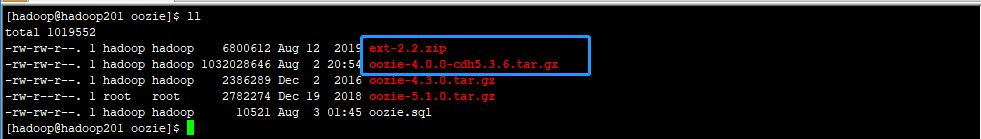

# hadoop 环境安装文档

## hadoop 


## zookeeper 


## hive 


## sqoop


## flume


## oozie
### 安装准备

- 环境: Linux(CentOS 7)

- hadoop 集群环境   (nameNode 节点)

- jdk8

- 关系型数据库(Mysql)

- 安装包

  - oozie  [oozie-4.0.0-cdh5.3.6.tar.gz](http://archive.cloudera.com/cdh5/cdh/5/oozie-4.0.0-cdh5.3.6.tar.gz)
  - ext-2.2.zip [ext-2.2.zip](http://archive.cloudera.com/gplextras/misc/ext-2.2.zip)
  - mysql-connector-java-5.1.45.jar

  下载相应的安装包后

  

  

**说明:**oozie这里用的安装包是cloudera oozie-4.0.0-cdh5.3.6.tar.gz 版本, 不需要自己编译, 如果想要使用原生版本的可以使用原生oozie 自己编译安装包 [oozie-4.3.1.tar.gz ](https://mirrors.tuna.tsinghua.edu.cn/apache/oozie/4.3.1/oozie-4.3.1.tar.gz)


### 安装

1. 解压oozie-4.0.0-cdh5.3.6.tar.gz到安装目录  并修改解压后的文件夹名为cdh

   ```shell
   tar -zxvf oozie-4.0.0-cdh5.3.6.tar.gz -C /opt/modules/
   cd /opt/modules
   mv oozie-4.0.0-cdh5.3.6 oozie-cdh
   ```

   

2. 在oozie-cdh目录下创建libext文件夹, 然后复制hadoop/share 目录下的.jar复制到libext下

   ```shell
   cp $HADOOP_HOME/share/hadoop/*/lib/*.jar libext/
   cp $HADOOP_HOME/share/hadoop/*/*.jar libext/
   ```

3. 将ext-2.2.zip 和数据库驱动包也复制到libext下

   ```shell
   cp /opt/modules/oozie/ext-2.2.zip libext/
   cp /opt/modules/mysql/mysql-connector-java-5.1.45.jar libext/
   ```

   

4. 修改oozie配置文件   conf/oozie-site.xml   增加配置

   ```shell
      <property>
           <name>oozie.service.HadoopAccessorService.hadoop.configurations</name>
           <value>*=/opt/modules/hadoop/hadoop-2.9.2/etc/hadoop</value>
           <description>hadoop配置文件的位置</description>
       </property>
    
    
       <property>
           <name>oozie.service.JPAService.jdbc.password</name>
           <value>oozie</value>
           <description>数据库驱动类</description>
       </property>
       <property>
           <name>oozie.service.JPAService.jdbc.url</name>
           <value>jdbc:mysql://hadoop201:3306/oozie</value>
           <description>数据库url</description>
       </property>
   
       <property>
           <name>oozie.service.JPAService.jdbc.username</name>
           <value>oozie</value>
           <description>数据库用户名</description>
       </property>
   
       <property>
           <name>oozie.service.JPAService.jdbc.password</name>
           <value>oozie</value>
           <description>数据库密码</description>
       </property>
   ```

   

5. 在hadoop的配置文件中增加oozie的配置 core-site.xml

   ```shell
     <!--oozie-->
     <property>
       <name>hadoop.proxyuser.${userName}.hosts</name>
       <value>*</value>
     </property>
     <property>
       <name>hadoop.proxyuser.${groupName}.groups</name>
       <value>*</value>
     </property>
   ```

   **${}表示操作hadoop的用户和用户组, 配置时替换成服务器的用户和用户组**

6. 服务器安装zip 和unzip工具

   ```shell
   #检验工具是否安装
   rpm -qa zip
   rpm -qa unzip
   #如果没有安装过
   yum install -y zip
   yum install -y unzip
   ```

   

7. oozie 打包

   ```shell
   bin/oozie-setup.sh prepare-war
   ```

   成功后会提示war包位置

8. 上传sharelib压缩包到hdfs上 

   ```shell
   bin/oozie-setup.sh sharelib create -fs hdfs://hadoop201:8020 -locallib oozie-sharelib-4.0.0-cdh5.3.6-yarn.tar.gz
   ```

   **注意: **在oozie-cdh 目录下有两个sharelib包, 上传yarn的包

9. 安装数据库并创建表

   (数据库的安装不在这里表述)   [oozie.sql](./hadoop/oozie/oozie.sql)

   ```
   #创建用户和数据库
   mysql -u root -p
   > CREATE USER 'userName'@'%' IDENTIFIED BY 'password';
   > grant all privileges on *.* to 'dataBaseName'@'%'identified by 'password' with grant option;
   > flush privileges;
   
   使用脚本创建oozie的初始化表
   
   bin/oozie-setup.sh db create -run oozie.sql
   ```

   

10. 最后启动oozie

    ```shell
    bin/oozied.sh start
    ```

    启动成功会提示地址端口号的url

**hadoop和mysql的安装请看其安装文档**


### workflow xml配置

1. 配置文件属性(attribute)及语法(syntax)

```xml
<workflow-app name="foo-test" xmlns="uri:oozie:workflow:0.1">
    <!-- 开始节点 -->
    <start to="hadoop-first-job"/>

    <!-- 终止节点 -->
    <kill name="kill-node-name">
        <message>执行kill节点, 输出的日志信息</message>
    </kill>

    <!-- 判断路由节点 -->
    <decision name="decision-name">
        <switch>
            <case to="hadoop-second-job">${fs:fileSize(secondjobOutputDir) gt 10 * GB}</case>
            <case to="hadoop-third-job">${fs:fileSize(secondjobOutputDir) lt 100 * GB}</case>
            <!-- <case to="hadoop-second-job">${fs:fileSize(secondjobOutputDir) gt 10 * GB}</case> -->
            <default to"end-name">
        </switch>
    </decision>

    <!-- 分支节点 -->
    <fork name="fork-name">
        <path start="next-node-name1" />
        <path start="next-node-name2" />
    </fork>

    <!-- 合并节点 -->
    <join name="join-node-name" to="next-node-name3"/>

    <!-- 结束节点 -->
    <end name="end-name">

<workflow-app/>
```

** 注意eg: **oozie默认会对提交的workflow xml配置进行可行性验证, 如果检测出不可运行, 会提示错误, 但是如果你认为这个xml文件没有错误, 可以修改配置关闭可行性校验, 如下

- 修改工作流的job.properties 配置中的属性   oozie.wf.validate.ForkJoin = false  这个工作流就不会进行校验了
- 修改 oozie-site.xml  oozie.validate.ForkJoin = false 所有上传的工作流workflow 都不会进行可行性校验了

以上两个配置默认都是true


### 知识点

#### workflow

##### Start Node(开始节点)


##### End Node(结束节点)


##### Kill Node(终止节点)


##### Decision Node (决策路由节点)


##### Fork Node & Join Node(分支节点和合并节点)


##### Action Node (action 节点)

* 由动作节点触发的所有计算/处理任务均由Oozie异步执行
* oozie 提供两种方式检测 Action Node 执行的情况: 回调和轮训
  * 当开始执行 Action Node 时, oozie 会提供一个 `唯一的 URL`, 执行的任务应该调用这个 URL 来通知执行完成
  * 可能由于任何原因, 这个 URL 没有调用成功, oozie 提供了轮训的方式检测完
* Action Node 有两个子属性 `ok`     `error`
  * 当 task 正确完成后会调用 ok
  * 当 task 未能正确完成 会调用 error
  * 如果 task 由于错误退出action，则该计算/处理任务必须 向Oozie 提供`错误代码` 和 `错误消息`信息
* Action 恢复能力
  * 在执行 action 的开始和结束时, 可以指定 action 尝试重新执行这个 action, 一旦action 成功开始后失败, 便不会再重试;对于 java Action 是一个特例, 因为在 hadoop 执行 map 时, hadoop 内部会执行重试致使 action 重试恢复
  * 对于 action 开始之前的故障, oozie 可以提供不同的策略应对故障, 
    * 暂时性故障: Oozie将在预定义的时间间隔后重试, 一种操作类型的重试次数和计时器间隔必须在Oozie级别上预先配置。工作流作业可以覆盖此类配置
    * 非暂时性故障: Oozie将暂停工作流程作业，直到手动或程序干预恢复工作流程作业并且重试操作开始或结束为止。管理员或外部管理系统负责在恢复工作流作业之前执行任何必要的清理。
    * 如果失败是错误，并且重试不能解决问题，Oozie将执行该操作的错误转移

- Map-Reduce Action
- Pig Action
- Fs(HDFS) Action
- SSH Action
- Sub-workflow Action
- Java Action
