[cdh5](<http://archive.cloudera.com/cdh5/>)

[chd6](<https://archive.cloudera.com/cdh6/>)

# Hadoop环境安装文档

## hadoop集群

### 准备

* 环境: Linux(CentOS 7)
* jdk8
* 安装包
  * 这里使用hadoop-2.9.2-64.tar.gz

### 安装

1. 创建用户

   ```shell
    groupadd hadoop #创建用户组
    useradd -g hadoop hadoop #创建用户并添加用户组
    passwd hadoop  #修改用户密码
   ```

2. 修改用户权限

   ```shell
   vim /etc/sudoers
   ```

   添加hadoop用户的权限如图

   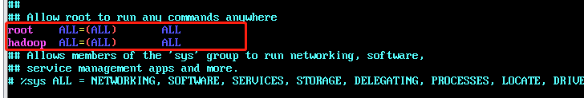

3. 修改所有节点的host

   ```shell
   vim /etc/hosts	
   ```

   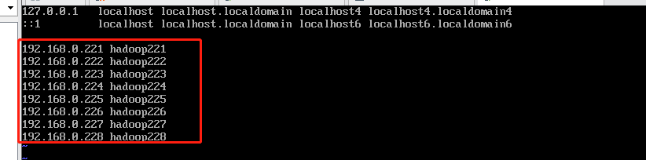

   ```shell
   vim /etc/sysconfig/network
   ```

   

   ```shell
   reboot  #重启  使用hadoop用户登录
   hostname #检测本地hostname是否修改成功
   ```

   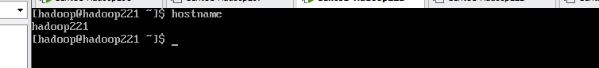

4. 创建包下载目录和安装目录

   ```shell
   mkdir /etc/modules /etc/softwares #创建目录
   chown -g hadoop:hadoop /etc/modules /etc/softwares 修改目录用户组
   
   ```

5. 安装jdk(略)

6. 解压安装包到modules

   ```shell
   tar -zxvf hadoop-2.9.2-linux-64.tar.gz -C /opt/modules/
   ```

7. 配置hadoop环境变量

   ```shell
   vim /etc/profile
   export HADOOP_HOME=/opt/modules/hadoop
   export PATH=$PATH:$HADOOP_HOME/bin:$HADOOP_HOME/sbin
   ```

   ```shell
   source /etc/profile
   hadoop #验证是否配置成功
   ```

8. 编写远程执行脚本和远程同步脚本

   * 所有节点安装rsync 工具

     ```shell
     sudo yum install -y rsync
     ```

     

   ```shell
   #!/bin/bash
   #远程执行脚本
   pcount = $#
   if(($pcount==0)); then
   	echo no args;
   	exit;
   fi
   
   echo --------------localhost----------------
   
   $@
   for((host=221; host<224; host++)); do
   	echo --------------hadoop$host $@-----------------------
   	ssh hadoop$host $@
   done
   ```

   ```shell
   #!/bin/bash
   #远程同步脚本
   pcount=$#
   if((pcount == 0)); then
   	echo no args;
   	exit;
   fi
   
   p1=$1
   fname='basename' $p1
   echo fname=$fname
   
   pdir='cd -P $(dirname $p1); pwd'
   echo pdir=$pdir
   user='whoami'
   for((host=222; host<224; host++)); do
   	echo --------------hadoop$host--------------------
   	rsync -rvl $pdir/$fname $user@hadoop$host:$pdir
   done
   
   ```

   ```shell
   #授权可执行
   sudo chmod 777 xcall xsync
   ```

9. 在各节点生成rsa证书, 节点间设置免密登录

   ```shell
   ssh-keygen -t rsa #生成rsa证书
   ssh-copy-id host #将公钥分别拷贝到当前节点以及其它节点
   ```

10. 在解压xsync 节点 同步hadoop安装包, 并在各节点配置hadoop 和jdk的环境变量

    ```shell
    cd /opt/modules
    xsync hadoop
    ```

11. 配置hadoop配置文件

    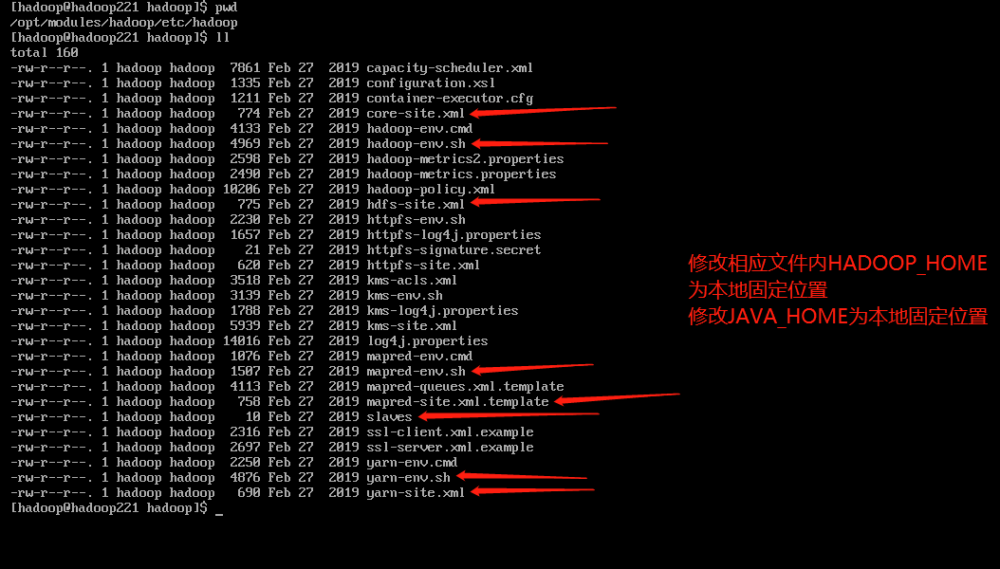

    节点角色分配 

    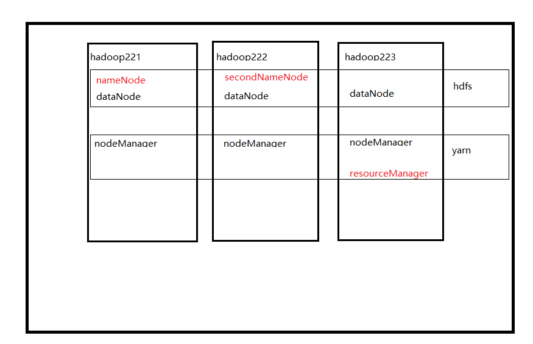

    * 配置集群节点 slaves

      ```shell
      vim slaves
      #添加节点
      hadoop221
      hadoop222
      hadoop223
      ```

    * 配置core-site-xml

      ```xml
      <configuration>
          <!--nameNode 节点和hdfs端口-->
        <property>
          <name>fs.defaultFS</name>
          <value>hdfs://hadoop221:8020</value>
        </property>
          <!--临时文件目录-->
        <property>
          <name>hadoop.tmp.dir</name>
          <value>/opt/modules/hadoop/data/tmp</value>
        </property>
      </configuration>
      ```

    * 配置hdfs-site.xml

      ```xml
      <configuration>
          <!--文件备份数 默认3-->
        <property>
          <name>dfs.replication</name>
          <value>2</value>
        </property>
          <!--secondNameNode节点配置-->
        <property>
          <name>dfs.namenode.secondary.http-address</name>
          <value>hadoop222:50090</value>
        </property>
      </configuration>
      ```

    * 配置mapred-site.xml

      ```xml
          <!--配置以yarn方式运行map-reduce-->
        <property>
          <name>mapreduce.framework.name</name>
          <value>yarn</value>
        </property>
      ```

    * 配置yarn-site.xml

      ```xml
      <configuration>
        <property>
          <name>yarn.nodemanager.aux-services</name>
          <value>mapreduce_shuffle</value>
        </property>
          <!--resourcemanager节点配置-->
        <property>
          <name>yarn-resourcemanager.hostname</name>
          <value>hadoop223</value>
        </property>
      </configuration>
      ```

    * 以上配置完成后同步各节点配置文件

      ```shell
      pwd 
      #路径  /opt/modules/hadoop/etc
      xsync hadoop
      ```

12. 关闭所有节点防火墙

    ```shell
    sudo systemctl stop firewalld
    sudo systemctl disable firewalld
    ```

13. 格式化nameNode节点 启动集群

    ```shell
    hdfs namenode -format #在nameNode节点格式化nameNode
    sbin/start-dfs.sh #在nameNode节点启动hdfs各节点
    ```

    | 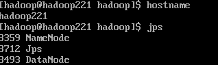 | 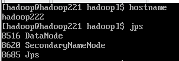 | 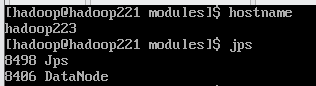 |
    | --------------------------- | --------------------------- | --------------------------- |
    |                             |                             |                             |

    ```shell
    sbin/start-yarn.sh #在resourceManager节点启动执行, 启动所有yarn节点
    ```

    | 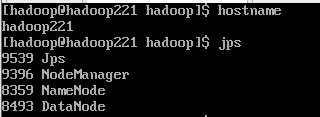 | 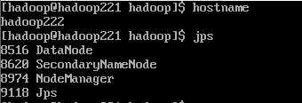 | 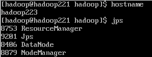 |
    | ---------------------------- | ---------------------------- | ---------------------------- |
    |                              |                              |                              |

14. hadoop 集群安装完成

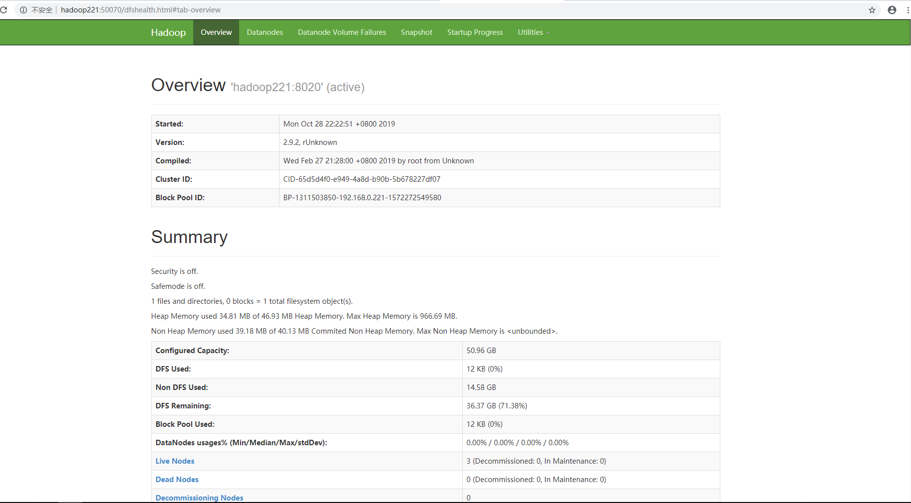


## Hive 安装配置教程

### 准备

* Linux(CentOS7)
* Hadoop集群环境
* hive安装包 [apache-hive-2.3.6-bin.tar.gz](<https://mirrors.tuna.tsinghua.edu.cn/apache/hive/>)
* msyql环境

### 安装

1. 在hadoop集群namenode节点安装hive, 上传安装包, 解压到指定安装位置

   ```shell
   [hadoop@hadoop221 software]$ tar -zxvf apache-hive-2.3.6-bin.tar.gz -C /opt/modules/
   $ mv apache-hive-2.3.6/ hive
   ```

2. 配置hive环境变量

   ```shell
   #hive
   export HIVE_HOME=/opt/modules/hive
   export PATH=$PATH:$HIVE_HOME/bin
   ```

3. 配置hive配置文件

   * 配置hive-site.xml, 拷贝hive-default.xml.template 为hive-site.xml

     修改配置文件中原本是derby的配置为mysql

     ```xml
        <property>
         <name>hive.metastore.warehouse.dir</name>
         <value>/opt/hive/warehouse</value>
       </property>
     
     
       <property>
         <name>javax.jdo.option.ConnectionURL</name>
         <value>jdbc:mysql://mysql152:3306/hive?useSSL=false&amp;characterEncoding=utf8</value>
       </property>
       <property>
         <name>javax.jdo.option.ConnectionDriverName</name>
         <value>com.mysql.jdbc.Driver</value>
       </property>
       <property>
         <name>javax.jdo.option.ConnectionUserName</name>
         <value>hive</value>
       </property>
       <property>
         <name>javax.jdo.option.ConnectionPassword</name>
         <value>hive</value>
       </property>
       <property>
         <name>hive.cli.print.header</name>
         <value>true</value>
       </property>
       <property>
         <name>hive.cli.print.current.db</name>
         <value>true</value>
       </property>
     ```

4. 添加msyql驱动包

5. 确保hadoop集群和mYSQL启动正常

6. 安装完成 确认hive安装

   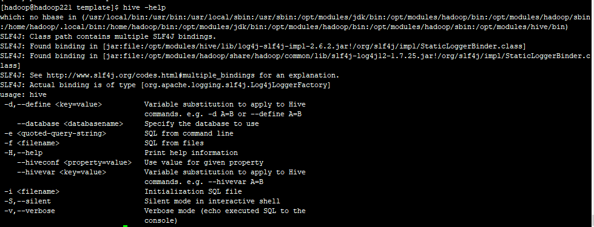

7. 初始化元数据库

   ```shell
   [hadoop@hadoop221 hive]$ bin/schematool -dbType mysql -initSchema
   ```

   hive-site.xml中url如果没有配置自动创建库 可提前自己创建数据库

   ```mysql
   mysql> create database hive;
   ```

8. 初始化数据库执行后, 检查mysql中表的创建

   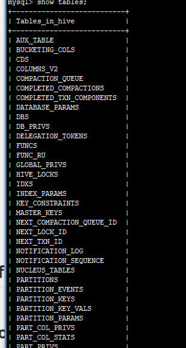

9. 执行hive, 启动hive

   ```shell
   [hadoop@hadoop221 ~]$ hive
   ```

   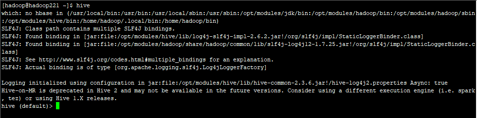

10. 创建数据库test1, hive查看数据库

    ```mysql
    hive (default)> create database test1;
    hive (default)> show databases;
    ```

    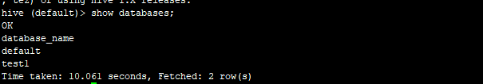

11. 查看hdfs, 会生成相应的文件目录

    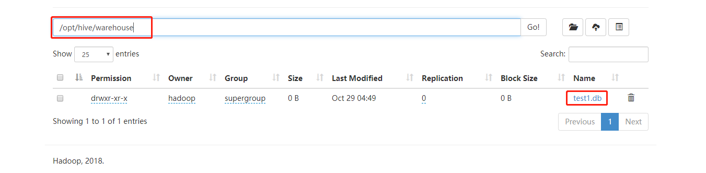


## flume安装配置教程

### 准备

* Linux(CentOS7)
* flume安装包[apache-flume-1.9.0-bin.tar.gz](http://www.apache.org/dyn/closer.lua/flume/1.9.0/apache-flume-1.9.0-bin.tar.gz)


### 安装

1. 解压到指定目录

   ```shell
   [hadoop@hadoop221 flume]$ tar -zxvf apache-flume-1.9.0-bin.tar.gz -C /opt/modules/
   ```

2. 配置环境变量

   ```shell
   #flume
   export FLUME_HOME=/opt/modules/flume
   export PATH=$PATH:$FLUME_HOME/bin
   ```

3. 修改配置文件

   * 修改flume-env.sh

     ```shell
     export JAVA_HOME=/opt/modules/jdk  #增加jdk环境变量配置
     ```

   * 修改flume-site.xml

     flume-配置可参考[官方文档](http://flume.apache.org/releases/content/1.9.0/FlumeUserGuide.html)

     

4. 启动flume 开始采集日志

   ```shell
   bin/flume-ng agent -c conf –f conf /netcat-logger.conf –n a1 -Dflume.root.logger=INFO,console
   ```

   * 解释1：

   -c conf 指定flume自身的配置文件所在目录

   -f conf/netcat-logger.conf 指定我们所描述的采集方案

   -n a1 指定本次启动agent的名字，与采集方案配置文件中一致

   * 解释2：

   -c (或--conf) ： flume自身所需的conf文件路径

   -f (--conf-file) ： 自定义的flume配置文件，也就是采集方案文件

   -n (--name)： 自定义的flume配置文件中agent的name


## oozie 安装配置教程

同类型框架 [azkaban](<https://azkaban.github.io/>)      [zeus](https://github.com/michael8335/zeus2)

### 准备

* 环境: Linux(CentOS 7)

* hadoop 集群环境   (nameNode 节点)

* jdk8

* 关系型数据库(Mysql)

* 安装包

  * oozie  [oozie-4.0.0-cdh5.3.6.tar.gz](http://archive.cloudera.com/cdh5/cdh/5/oozie-4.0.0-cdh5.3.6.tar.gz)
  * ext-2.2.zip [ext-2.2.zip](http://archive.cloudera.com/gplextras/misc/ext-2.2.zip)
  * mysql-connector-java-5.1.45.jar

  下载相应的安装包后

  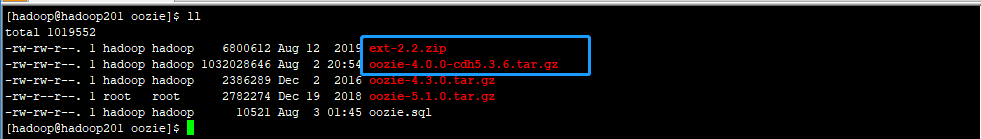

  

**说明:**oozie这里用的安装包是cloudera oozie-4.0.0-cdh5.3.6.tar.gz 版本, 不需要自己编译, 如果想要使用原生版本的可以使用原生oozie 自己编译安装包 [oozie-4.3.1.tar.gz ](https://mirrors.tuna.tsinghua.edu.cn/apache/oozie/4.3.1/oozie-4.3.1.tar.gz)


### 安装

1. 解压oozie-4.0.0-cdh5.3.6.tar.gz到安装目录  并修改解压后的文件夹名为cdh

   ```shell
   tar -zxvf oozie-4.0.0-cdh5.3.6.tar.gz -C /opt/modules/
   cd /opt/modules
   mv oozie-4.0.0-cdh5.3.6 oozie-cdh
   ```

   

5. 在hadoop的配置文件中增加oozie的配置 hadoop: core-site.xml

   ```shell
     <!--oozie-->
     <property>
       <name>hadoop.proxyuser.${userName}.hosts</name>
       <value>*</value>
     </property>
     <property>
       <name>hadoop.proxyuser.${groupName}.groups</name>
       <value>*</value>
     </property>
   ```

   **${}表示操作hadoop的用户和用户组, 配置时替换成服务器的用户和用户组**

   同步core-site.xml 到其它hadoop节点

6. 配置 JobHistory Server 服务(必须)         hadoop:mapred-site.xml

   ```xml
     <!--配置MapReduce JobHistory Server 地址, 默认端口 10020-->
     <property>
       <name>mapreduce.jobhistory.address</name>
       <value>hadoop221:10020</value>
     </property>
     <!--配置 MapReduce JobHistory Server web ui 地址, 默认端口19888-->
     <property>
       <name>mapreduce.jobhistory.webapp.address</name>
       <value>hadoop221:19888</value>
     </property>
   ```

7. 配置yarn-site.xml

   ```xml
     <!--任务历史服务-->
     <property>
       <name>yarn.log.server.url</name>
       <value>hadoop221:19888/jobhistory/logs/</value>
     </property>
   ```

8. 重启hadoop集群并启动jobHistoryserver

   ```shell
   #namenode节点执行
   sbin/start-dfs.sh
   
   #resourcemanager节点执行
   sbin/start-yarn.sh
   
   #nameNode节点执行
   sbin/mr-jobhistory-daemon.sh start historyserver
   ```

9. 解压oozie-hadooplibs-4.0.0-cdh5.3.6.tar.gz包, 将hadooplibs移动到oozie根目录下, 创建libext目录

   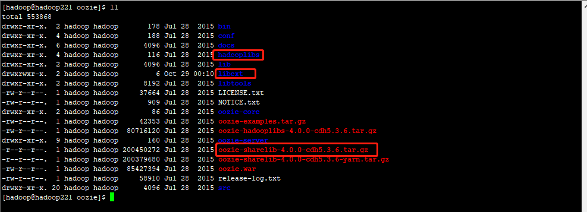

10. 将hadooplibs的包移动到libext下, 并将mysql驱动包放到libext下

    ```shell
    cp hadooplibs/hadooplib-2.5.0-cdh5.3.6.oozie-4.0.0-cdh5.3.6/* libext/
    cp mysql-connector-java-5.1.45.jar /opt/modules/oozie/libext/
    ```

11. 将ext2-2.zip拷贝到libext下

    ```shell
    cp /opt/softwares/oozie/ext-2.2.zip libext/
    ```

9. 在mysql创建用户和数据库

   ```mysql
   GRANT ALL PRIVILEGES ON *.* TO 'oozie'@'%' IDENTIFIED BY 'oozie' WITH GRANT OPTION;
   flush privileges;
   mysql -uoozie -p
   create database oozie;
   ```

10. 修改oozie配置文件   conf/oozie-site.xml   增加配置

    ```shell
       <property>
            <name>oozie.service.HadoopAccessorService.hadoop.configurations</name>
            <value>*=/opt/modules/hadoop/hadoop-2.9.2/etc/hadoop</value>
            <description>hadoop配置文件的位置</description>
        </property>
     
     
        <property>
            <name>oozie.service.JPAService.jdbc.driver</name>
            <value>com.mysql.jdbc.Driver</value>
            <description>数据库驱动类</description>
        </property>
        <property>
            <name>oozie.service.JPAService.jdbc.url</name>
            <value>jdbc:mysql://hadoop201:3306/oozie</value>
            <description>数据库url</description>
        </property>
    
        <property>
            <name>oozie.service.JPAService.jdbc.username</name>
            <value>oozie</value>
            <description>数据库用户名</description>
        </property>
    
        <property>
            <name>oozie.service.JPAService.jdbc.password</name>
            <value>oozie</value>
            <description>数据库密码</description>
        </property>
    ```

    

11. 服务器安装zip 和unzip工具

    ```shell
    #检验工具是否安装
    rpm -qa zip
    rpm -qa unzip
    #如果没有安装过
    yum install -y zip
    yum install -y unzip
    ```

12. 上传oozie-sharelib-4.0.0-cdh5.3.6-yarn.tar.gz压缩包到hdfs上 ,hadoop执行oozie任务所需要的包,( 这个命令会解压上传不用自己解压)

    ```shell
    bin/oozie-setup.sh sharelib create -fs hdfs://hadoop221:8020 -locallib oozie-sharelib-4.0.0-cdh5.3.6-yarn.tar.gz
    ```

    可进入hdfs控制台查看上传

    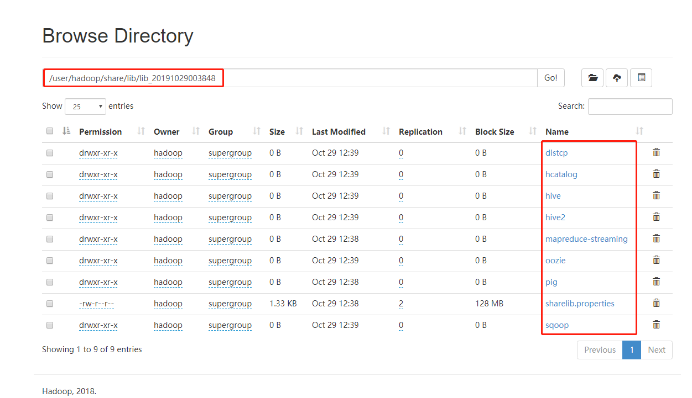

13. 生成 oozie.sql初始化数据库脚本

    ```shell
    $ bin/oozie-setup.sh db create -run -sqlfile oozie.sql
    ```

    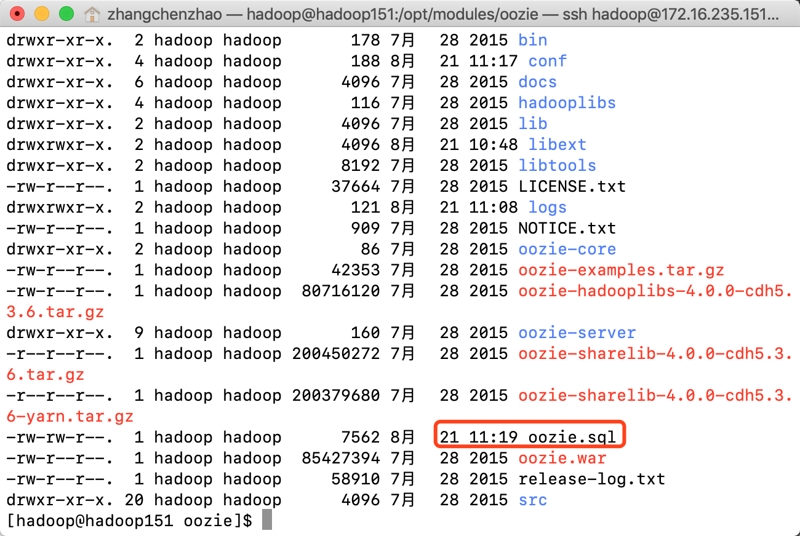

    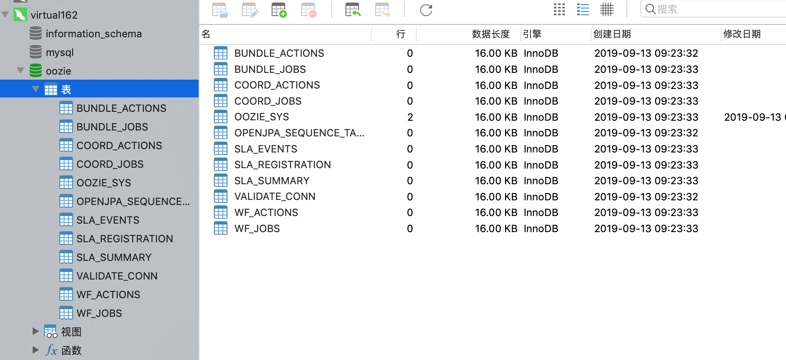

14. oozie 打包

    ```shell
    bin/oozie-setup.sh prepare-war
    ```

    成功后会提示war包位置

    

    **注意: **在oozie-cdh 目录下有两个sharelib包, 上传yarn的包

15. 安装数据库并创建表          **上面使用命令初始化数据库生成脚本不用在此初始化数据库**

    (数据库的安装不在这里表述)   [oozie.sql](./hadoop/oozie/oozie.sql)

    ```
    #创建用户和数据库
    mysql -u root -p
    > CREATE USER 'userName'@'%' IDENTIFIED BY 'password';
    > grant all privileges on *.* to 'dataBaseName'@'%'identified by 'password' with grant option;
    > flush privileges;
    
    使用脚本创建oozie的初始化表
    
    bin/oozie-setup.sh db create -run oozie.sql
    ```

    

16. 最后启动oozie

    ```shell
    bin/oozied.sh start
    ```

    启动成功会提示地址端口号的url

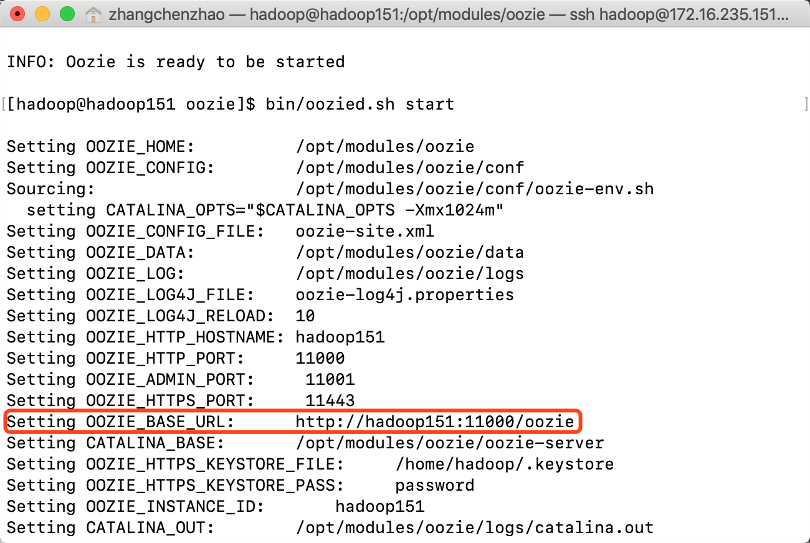

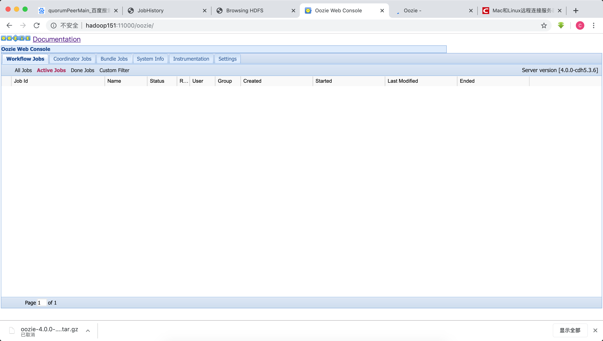

**hadoop和mysql的安装请看其安装文档**


### workflow xml配置

1. 配置文件属性(attribute)及语法(syntax)

```xml
<workflow-app name="foo-test" xmlns="uri:oozie:workflow:0.1">
    <!-- 开始节点 -->
    <start to="hadoop-first-job"/>

    <!-- 终止节点 -->
    <kill name="kill-node-name">
        <message>执行kill节点, 输出的日志信息</message>
    </kill>

    <!-- 判断路由节点 -->
    <decision name="decision-name">
        <switch>
            <case to="hadoop-second-job">${fs:fileSize(secondjobOutputDir) gt 10 * GB}</case>
            <case to="hadoop-third-job">${fs:fileSize(secondjobOutputDir) lt 100 * GB}</case>
            <!-- <case to="hadoop-second-job">${fs:fileSize(secondjobOutputDir) gt 10 * GB}</case> -->
            <default to"end-name">
        </switch>
    </decision>

    <!-- 分支节点 -->
    <fork name="fork-name">
        <path start="next-node-name1" />
        <path start="next-node-name2" />
    </fork>

    <!-- 合并节点 -->
    <join name="join-node-name" to="next-node-name3"/>

    <!-- 结束节点 -->
    <end name="end-name">

<workflow-app/>
```

**注意eg: **oozie默认会对提交的workflow xml配置进行可行性验证, 如果检测出不可运行, 会提示错误, 但是如果你认为这个xml文件没有错误, 可以修改配置关闭可行性校验, 如下

* 修改工作流的job.properties 配置中的属性   oozie.wf.validate.ForkJoin = false  这个工作流就不会进行校验了
* 修改 oozie-site.xml  oozie.validate.ForkJoin = false 所有上传的工作流workflow 都不会进行可行性校验了

以上两个配置默认都是true

 


### 知识点

1. oozie的功能模块
   * `Workflow `顺序执行流程节点
   * `Coordinator `定时出发workflow
   * `Bundle Job  `绑定多个Coordinator
2. 


