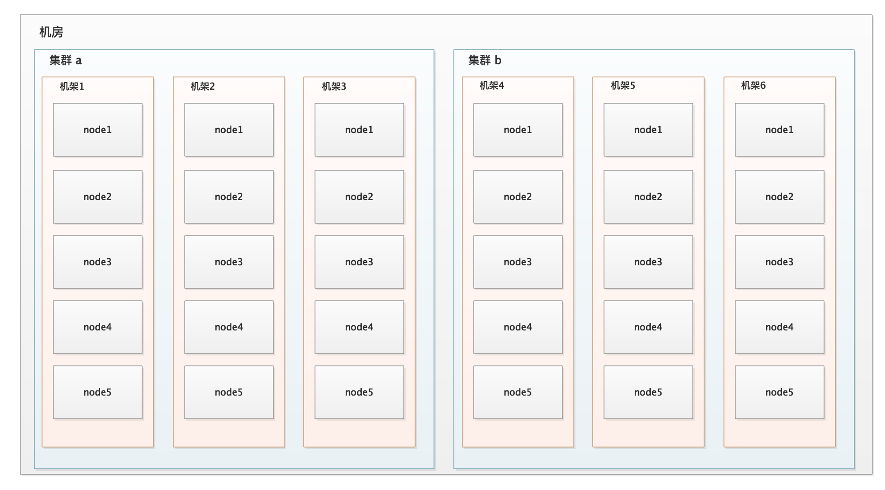

[cdh5](<http://archive.cloudera.com/cdh5/>)

[chd6](<https://archive.cloudera.com/cdh6/>)

# Hadoop环境安装文档

## Hadoop 编译 64 位 

### 准备

jdk8

apache-ant-1.9.14-bin.tar.gz

apache-maven-3.6.3-bin.tar.gz

protobuf-2.5.0.tar.gz

hadoop-2.9.2-src.tar.gz

### 安装环境

1. 配置 jdk

   ```
   tar -zxvf jdk -C /opt/modules/
   配置环境变量 省略...
   ```

2. 配置 配置 maven

   ```
   tar -zxvf apache-maven-3.6.3-bin.tar.gz -C /opt/modules/
   配置环境变量 省略...
   vim conf/setting.xml
   <mirror>
      <id>nexus-aliyun</id>
      <mirrorOf>central</mirrorOf>
      <name>Nexus aliyun</name>
      <url>http://maven.aliyun.com/nexus/content/groups/public</url>
   </mirror>
   ```

3. 配置 ant

   ```
   tar -zxvf apache-ant-1.9.14-bin.tar.gz -C /opt/modules/
   配置环境变量 省略...
   ```

4. 编译安装 protobuf

   ```
   tar -zxvf protobuf-2.5.0.tar.gz -C /opt/modules/
   yum install -y yum install glibc-headers gcc-c++ make cmake openssl-devel ncurses-devel
   cd protobuf-2.5.0/
   ./configure
   make
   make check 
   make install
   ldconfig
   
   配置环境变量
   export LD_LIBRARY_PATH=/opt/module/protobuf-2.5.0
   export PATH=$PATH:$LD_LIBRARY_PATH
   ```

5. 

### 编译

1. 解压 hadoop-2.9.2-src

   ```
   tar -zxvf hadoop-2.9.2-src
   ```

2. 开始编译

   ```
   mvn package -Pdist,native -DskipTests -Dtar
   ```

3. 编译成功后, 包位置

   ```
   /opt/source/hadoop-2.9.2-src/hadoop-dist/target
   ```

   

## hadoop集群

### 准备

* 环境: Linux(CentOS 7)
* jdk8
* 安装包
  * 这里使用hadoop-2.9.2-64.tar.gz

### 安装

1. 创建用户

   ```shell
    groupadd hadoop #创建用户组
    useradd -g hadoop hadoop #创建用户并添加用户组
    passwd hadoop  #修改用户密码
   ```

2. 修改用户权限

   ```shell
   vim /etc/sudoers
   ```

   添加hadoop用户的权限如图

   

3. 修改所有节点的host

   ```shell
   vim /etc/hosts	
   ```

   

   ```shell
   vim /etc/sysconfig/network
   ```

   

   ```shell
   reboot  #重启  使用hadoop用户登录
   hostname #检测本地hostname是否修改成功
   ```

   

4. 创建包下载目录和安装目录

   ```shell
   mkdir /etc/modules /etc/softwares #创建目录
   chown -g hadoop:hadoop /etc/modules /etc/softwares 修改目录用户组
   
   ```

5. 安装jdk(略)

6. 解压安装包到modules

   ```shell
   tar -zxvf hadoop-2.9.2-linux-64.tar.gz -C /opt/modules/
   ```

7. 配置hadoop环境变量

   ```shell
   vim /etc/profile
   export HADOOP_HOME=/opt/modules/hadoop
   export PATH=$PATH:$HADOOP_HOME/bin:$HADOOP_HOME/sbin
   ```

   ```shell
   source /etc/profile
   hadoop #验证是否配置成功
   ```

8. 编写远程执行脚本和远程同步脚本

   * 所有节点安装rsync 工具

     ```shell
     sudo yum install -y rsync
     ```

     

   ```shell
   #!/bin/bash
   #远程执行脚本
   pcount = $#
   if(($pcount==0)); then
   	echo no args;
   	exit;
   fi
   
   echo --------------localhost----------------
   
   $@
   for((host=221; host<224; host++)); do
   	echo --------------hadoop$host $@-----------------------
   	ssh hadoop$host $@
   done
   ```

   ```shell
   #!/bin/bash
   #远程同步脚本
   pcount=$#
   if((pcount == 0)); then
   	echo no args;
   	exit;
   fi
   
   p1=$1
   fname='basename' $p1
   echo fname=$fname
   
   pdir='cd -P $(dirname $p1); pwd'
   echo pdir=$pdir
   user='whoami'
   for((host=222; host<224; host++)); do
   	echo --------------hadoop$host--------------------
   	rsync -rvl $pdir/$fname $user@hadoop$host:$pdir
   done
   
   ```

   ```shell
   #授权可执行
   sudo chmod 777 xcall xsync
   ```

9. 在各节点生成rsa证书, 节点间设置免密登录

   ```shell
   ssh-keygen -t rsa #生成rsa证书
   ssh-copy-id host #将公钥分别拷贝到当前节点以及其它节点
   ```

10. 在解压xsync 节点 同步hadoop安装包, 并在各节点配置hadoop 和jdk的环境变量

    ```shell
    cd /opt/modules
    xsync hadoop
    ```

11. 配置hadoop配置文件

    

    节点角色分配 

    

    * 配置集群节点 slaves

      ```shell
      vim slaves
      #添加节点
      hadoop221
      hadoop222
      hadoop223
      ```

    * 配置core-site-xml

      ```xml
      <configuration>
          <!--nameNode 节点和hdfs端口-->
        <property>
          <name>fs.defaultFS</name>
          <value>hdfs://hadoop221:8020</value>
        </property>
          <!--临时文件目录-->
        <property>
          <name>hadoop.tmp.dir</name>
          <value>/opt/modules/hadoop/data/tmp</value>
        </property>
      </configuration>
      ```

    * 配置hdfs-site.xml

      ```xml
      <configuration>
          <!--文件备份数 默认3-->
        <property>
          <name>dfs.replication</name>
          <value>2</value>
        </property>
          <!--secondNameNode节点配置-->
        <property>
          <name>dfs.namenode.secondary.http-address</name>
          <value>hadoop222:50090</value>
        </property>
      </configuration>
      ```

    * 配置mapred-site.xml

      ```xml
          <!--配置以yarn方式运行map-reduce-->
        <property>
          <name>mapreduce.framework.name</name>
          <value>yarn</value>
        </property>
      ```

    * 配置yarn-site.xml

      ```xml
      <configuration>
        <property>
          <name>yarn.nodemanager.aux-services</name>
          <value>mapreduce_shuffle</value>
        </property>
          <!--resourcemanager节点配置-->
        <property>
          <name>yarn.resourcemanager.hostname</name>
          <value>hadoop223</value>
        </property>
      </configuration>
      ```

    * 以上配置完成后同步各节点配置文件

      ```shell
      pwd 
      #路径  /opt/modules/hadoop/etc
      xsync hadoop
      ```

12. 配置 JobHistory Server 服务(必须)         hadoop:mapred-site.xml (后面 oozie 配置中也提到, 配置过不需要再配置)

    ```xml
      <!--配置MapReduce JobHistory Server 地址, 默认端口 10020-->
      <property>
        <name>mapreduce.jobhistory.address</name>
        <value>hadoop221:10020</value>
      </property>
      <!--配置 MapReduce JobHistory Server web ui 地址, 默认端口19888-->
      <property>
        <name>mapreduce.jobhistory.webapp.address</name>
        <value>hadoop221:19888</value>
      </property>
    ```

13. 配置yarn-site.xml

    ```xml
      <!--任务历史服务-->
      <property>
        <name>yarn.log.server.url</name>
        <value>hadoop221:19888/jobhistory/logs/</value>
      </property>
    ```

14. (重启)hadoop集群并启动jobHistoryserver

    ```shell
    #namenode节点执行
    sbin/start-dfs.sh
    
    #resourcemanager节点执行
    sbin/start-yarn.sh
    
    #nameNode节点执行
    sbin/mr-jobhistory-daemon.sh start historyserver
    ```

15. 日志聚集

    概念: 应用运行完成以后, 将程序运行日志信息上传到 HDFS 系统上.

    好处: 可以方便的查看到程序运行的详情, 方便开发调试.

    **注意: **开启日志聚集功能, 需要重启 NodeManager, ResourceManager, 和 HistoryServer.

    yarn-site.xml

    ```xml
    
    <!-- 开启日志聚集功能 -->
    <property>
    	<name>yarn.log-aggregation-enable</name>
      <value>true</value>
    </property>
    <!-- 日志保留时间设置 7 天 -->
    <property>
    	<name>yarn.log-aggregation.retain-seconds</name>
      <value>604800</value>
    </property>
    
    ```

    

16. 

17. 关闭所有节点防火墙

    ```shell
    sudo systemctl stop firewalld
    sudo systemctl disable firewalld
    ```

18. 格式化nameNode节点 启动集群

    ```shell
    hdfs namenode -format #在nameNode节点格式化nameNode
    sbin/start-dfs.sh #在nameNode节点启动hdfs各节点
    mr-jobhistory-daemon.sh start historyserver #启动历史服务
    ```

    |  |  |  |
    | --------------------------- | --------------------------- | --------------------------- |
    |                             |                             |                             |

    ```shell
    sbin/start-yarn.sh #在resourceManager节点启动执行, 启动所有yarn节点
    ```

    |  |  |  |
    | ---------------------------- | ---------------------------- | ---------------------------- |
    |                              |                              |                              |

19. hadoop 集群安装完成


### 高可用集群

保证普通集群可运行后, 修改配置文件

高可用依赖 zookeeper 集群实现主从切换

先搭建 zookeeper 集群, 详见 zookeeper 集群部署

**core-site.xml**

```xml
<configuration>
  <property>
    <name>fs.defaultFS</name>
    <value>hdfs://nncluster</value>
  </property>
  <property>
    <name>hadoop.tmp.dir</name>
    <value>/opt/modules/hadoop/data/tmp</value>
  </property>

  <property>
    <name>ha.zookeeper.quorum</name>
    <value>hadoop151:2181,hadoop152:2181,hadoop153:2181,hadoop154:2181,hadoop155:2181</value>
  </property>

<!--oozie-->
  <property>
    <name>hadoop.proxyuser.hadoop.hosts</name>
    <value>*</value>
  </property>
  <property>
    <name>hadoop.proxyuser.hadoop.groups</name>
    <value>*</value>
  </property>
</configuration>
```

**hdfs-site.xml**

```xml
<configuration>
  <property>
    <name>dfs.replication</name>
    <value>3</value>
  </property>

  <property>
    <name>dfs.namenode.secondary.http-address</name>
    <value>hadoop155:50090</value>
  </property>

  <property>
    <name>dfs.nameservices</name>
    <value>nncluster</value>
  </property>

  <property>
    <name>dfs.ha.namenodes.nncluster</name>
    <value>nn1,nn2</value>
  </property>
  <property>
    <name>dfs.namenode.rpc-address.nncluster.nn1</name>
    <value>hadoop151:8020</value>
  </property>
  <property>
    <name>dfs.namenode.http-address.nncluster.nn1</name>
    <value>hadoop151:50070</value>
  </property>
  <property>
    <name>dfs.namenode.rpc-address.nncluster.nn2</name>
    <value>hadoop152:8020</value>
  </property>
  <property>
    <name>dfs.namenode.http-address.nncluster.nn2</name>
    <value>hadoop152:50070</value>
  </property>
  <property>
    <name>dfs.namenode.shared.edits.dir</name>
    <value>qjournal://hadoop151:8485;hadoop152:8485;hadoop153:8485;hadoop154:8485;hadoop155:8485/nncluster</value>
  </property>
  <property>
    <name>dfs.journalnode.edits.dir</name>
    <value>/opt/modules/hadoop/journaldata</value>
  </property>
  <property>
    <name>dfs.ha.automatic-failover.enabled</name>
    <value>true</value>
  </property>
  <property>
    <name>dfs.client.failover.proxy.provider.nncluster</name>
    <value>org.apache.hadoop.hdfs.server.namenode.ha.ConfiguredFailoverProxyProvider</value>
  </property>
  <property>
    <name>dfs.ha.fencing.methods</name>
    <value>
        sshfence
        shell(/bin/true)
    </value>
  </property>
  <property>
    <name>dfs.ha.fencing.ssh.private-key-files</name>
    <value>/home/hadoop/.ssh/id_rsa</value>
  </property>
  <property>
    <name>dfs.ha.fencing.ssh.connect-timeout</name>
    <value>30000</value>
  </property>

</configuration>

```

**mapred-site.xml**

```xml
<configuration>
  <property>
    <name>mapreduce.framework.name</name>
    <value>yarn</value>
  </property>

  <!--配置MapReduce JobHistory Server 地址, 默认端口 10020-->
  <property>
    <name>mapreduce.jobhistory.address</name>
    <value>hadoop151:10020</value>
  </property>
  <!--配置 MapReduce JobHistory Server web ui 地址, 默认端口19888-->
  <property>
    <name>mapreduce.jobhistory.webapp.address</name>
    <value>hadoop151:19888</value>
  </property>
</configuration>
```

**yarn-site.xml**

```xml
<configuration>

<!-- Site specific YARN configuration properties -->
  <property>
    <name>yarn.nodemanager.aux-services</name>
    <value>mapreduce_shuffle</value>
  </property>
  
  <property>
    <name>yarn.resourcemanager.ha.enabled</name>
    <value>true</value>
  </property>

  <!-- 指定RM的cluster id -->
  <property>
    <name>yarn.resourcemanager.cluster-id</name>
    <value>rmcluster</value>
  </property>

  <!-- 指定RM的名字 -->
  <property>
    <name>yarn.resourcemanager.ha.rm-ids</name>
    <value>rm1,rm2</value>
  </property>

  <!-- 分别指定RM的地址 -->
  <property>
    <name>yarn.resourcemanager.hostname.rm1</name>
    <value>hadoop153</value>
  </property>
  <property>
    <name>yarn.resourcemanager.hostname.rm2</name>
    <value>hadoop154</value>
  </property>

  <!-- 指定zk集群地址 -->
  <property>
    <name>yarn.resourcemanager.zk-address</name>
    <value>hadoop151:2181,hadoop152:2181,hadoop153:2181,hadoop154:2181,hadoop155:2181</value>
  </property>
  <!-- 开启日志聚集功能 -->
  <property>
    <name>yarn.log-aggregation-enable</name>
    <value>true</value>
  </property>
  <!-- 日志保留时间设置 7 天 -->
  <property>
    <name>yarn.log-aggregation.retain-seconds</name>
    <value>604800</value>
  </property>
</configuration>

```


1. 启动所有 zookeeper 节点, jps 可见进程中有 ` QuorumPeerMain`

   

2. 启动所有 `journalnode` 节点

   ```shell
   $ sbin/hadoop-daemon.sh start journalnode
   ```

   

3. 格式化 `namenode` 节点, 

   * 在任一 namenode 节点执行格式化命令

   ```shell
   $ hdfs namenode -format
   ```

   * 在另一 `namenode` 节点同步格式化数据  core-site.xml 中 `hadoop.tmp.dir` 的值所指向的文件夹

   ```shell
   $ scp -r hadoop@hadoop151:/opt/modules/hadoop/data/ /opt/modules/hadoop/
   ```

   * 或在另一节点执行命令

   ```shell
   $ hdfs namenode -bootstrapStandby
   ```

   

4. 格式化 zkfc, 在 `namenode` 节点执行

   ```shell
   $ hdfs zkfc -formatZK
   ```

   

5. 分别启动 hdfs 和 yarn

   ```shell
   $ sbin/start-dfs.sh
   $ sbin/start-yarn.sh
   ```

6. jps 查看各节点, 

   

7. 访问管理台查看

   

   

   可关闭当前`active`状态 namenode, 刷新`standby` 状态页面, 可看到状态变为 `active`

   

8. 也可手动切换 active 节点

   

   

   
   
   ```shell
$ hdfs haadmin -transitionToActive --forcemanual nn1
   ```

   

## Hadoop shell 命令

### hadoop 与 hdfs

```shell
bin/hadoop fs Command
或 
bin/hdfs dfs Command
```

hadoop 命令包含 hdfs 命令,   dfs 是 fs 的实现类

### FileSystem shell

1. 文件命令 `-help` 查看 hadoop 或 hdfs 命令的参数

   ```shell
   hdfs dfs -help rm
   或
   hadoop fs -help rm
   ```

2. `-ls`: 显示目录信息

   ```shell
   hdfs dfs -ls /
   或
   hadoop fs -ls /
   ```

3. `-mkdir`：HDFS上创建目录, 与 linux 系统命令一样

   ```shell
   hdfs dfs -mkdir -p /user/zcz
   或
   hadoop fs -mkdir -p /user/zcz
   ```

4. `-count` 检查hdfs 文件夹的使用情况和限额

   ```shell
   hdfs dfs -count -q /user/zcz
   或
   hadoop fs -count -q /user/zcz
   ```

5. `-df` 查看目标剩余空间

   ```shell
   hdfs dfs -df -h /user/zcz
   或
   hadoop fs -df -h /user/zcz
   ```

6. `-du` 查看文件或文件夹 占用空间

   ```shell
   hdfs dfs -du -h /user/zcz/zcz.xml
   或
   hadoop fs -du -h /user/zcz/zcz.xml
   ```

   

7. `-moveFromLocal`：从本地剪切到HDFS

   ```shell
   touch test.xml #本地创建文件
   hdfs dfs -moveFromLocal test.xml /user/zcz/
   或
   hadoop fs -moveFromLocal test.xml /user/zcz/
   ```

8. `-appendToFile`：a 文件追加到 b 文件末尾

   ```shell
   hdfs dfs -appendToFile zcz.xml /user/zcz/test.xml
   或
   hadoop fs -appendToFile zcz.xml /user/zcz/test.xml
   
   ```

9. `-cat` 查看文件内容

   ```shell
   hdfs dfs -cat /user/zcz/test.xml
   或
   hadoop fs -cat /user/zcz/test.xml
   
   ```

10. `-chgrp` 修改文件权限

    ```
    hdfs dfs -chgrp hadoop /user/zcz/test.xml
    或
    hadoop fs -chgrp hadoop /user/zcz/test.xml
    
    ```

11. `-chmod` 修改文件执行权限

    ```shell
    hdfs dfs -chmod 666 /user/zcz/test.xml
    或
    hadoop fs -chmod 666 /user/zcz/test.xml
    
    ```

12. `-chown` 修改文件所属用户及用户组

    ```shell
    hdfs dfs -chown -R hadoop:hadoop /user
    或
    hadoop fs -chown -R hadoop:hadoop /user
    
    ```

13. `-copyFromLocal` 从本地 copy 文件到 hdfs, 等同于 `-put`

    ```shell
    hdfs dfs -copyFromLocal zcz.xml /user/zcz/
    或
    hadoop fs -copyFromLocal zcz.xml /user/zcz/
    
    ```

14. `-copyToLocal` 从 hdfs 拷贝文件到本地, 等同于 `-get`

    ```shell
    hdfs dfs -copyToLocal /user/zcz/test.xml ./
    或
    hadoop fs -copyToLocal /user/zcz/test.xml ./
    
    ```

15. `-cp` hdfs 内 copy

    ```
    hdfs dfs -cp /user/zcz/test.xml /user/
    或
    hadoop fs -cp /user/zcz/test.xml /user/
    
    ```

16. `-mv` hdfs 内 移动文件

    ```
    hdfs dfs -mv /user/zcz/test.xml /user/
    或
    hadoop fs -mv/user/zcz/test.xml /user/
    
    ```

17. `-get` 从HDFS下载文件到本地, 等同于`-copyToLocal`

    ```shell
    hdfs dfs -get /user/zcz/test.xml ./
    或
    hadoop fs -get /user/zcz/test.xml ./
    
    ```

18. `-getmerge` 合并下载多个文件到本地

    ```shell
    hdfs dfs -getmerge /user/zcz/* ./
    或
    hdfs dfs -getmerge /user/zcz/zcz.xml /user/zcz/test.xml zzz.xml
    或
    hadoop fs -getmerge /user/zcz/* ./
    或
    hadoop fs -getmerge /user/zcz/zcz.xml /user/zcz/test.xml zzz.xml
    
    ```

19. `-put` 本地文件上传到 hdfs, 等同于`-copyFromLocal`

    ```shell
    hdfs dfs -put zcz.xml /user/zcz/
    或
    hadoop fs -put zcz.xml /user/zcz/
    
    ```

20. `-tail`：显示一个文件的末尾, 只有一个参数 -f 或者不加参数

    ```shell
    hdfs dfs -tail /user/zcz/abc.txt
    或
    hadoop fs -tail /user/zcz/abc.txt
    
    ```

21. `-rm`：删除文件或文件夹

    ```shell
    hdfs dfs -rm -rf /user/zcz
    或
    hadoop fs -rm -rf /user/zcz/abc.txt
    
    ```

22. `-rmdir`: 删除空目录

    ```shell
    hdfs dfs -rmdir /user
    或
    hadoop fs -rmdir /user
    
    ```

23. `-du` 统计文件大小

    ```shell
    hdfs dfs -du -h /abc.txt
    或
    hadoop fs -du -h /abc.txt
    
    ```

24. `-find` 文件查找

    ```shell
    hdfs dfs -find /user/ -name zcz.*
    或
    hadoop fs -find /user/ -name zcz.*
    
    ```

25. `-setrep` 设置 hdfs 中文件的副本数

    ```shell
    hdfs dfs -setrep 2 /abc.txt
    或
    hadoop fs -setrep 2 /abc.txt
    
    ```

26. `-getfacl` 查看文件或文件夹的访问控制列表(读写执行, 用户用户组等权限)

    ```shell
    hdfs dfs -getfacl /user
    或
    hadoop fs -getfacl 2 /user
    
    ```

27. `-stat` 指定格式显示文件信息

28. `-test` 检查文件或文件夹 信息(是否是文件或文件夹, 扩展名, 长度, 是否存在等)

29. `-touchz`: 创建空文件

30. `-truncate` 阶段指定文件 执行长度

### 理解架构后的命令

[createSnapshot](https://hadoop.apache.org/docs/r2.9.2/hadoop-project-dist/hadoop-common/FileSystemShell.html#createSnapshot)

[deleteSnapshot](https://hadoop.apache.org/docs/r2.9.2/hadoop-project-dist/hadoop-common/FileSystemShell.html#deleteSnapshot)

[renameSnapshot](https://hadoop.apache.org/docs/r2.9.2/hadoop-project-dist/hadoop-common/FileSystemShell.html#renameSnapshot)

[expunge](https://hadoop.apache.org/docs/r2.9.2/hadoop-project-dist/hadoop-common/FileSystemShell.html#expunge)

官方文档 [FileSystem shell](https://hadoop.apache.org/docs/r2.9.2/hadoop-project-dist/hadoop-common/FileSystemShell.html#stat)

[中文]([http://hadoop.apache.org/docs/r1.0.4/cn/hdfs_shell.html#lsr](http://hadoop.apache.org/docs/r1.0.4/cn/hdfs_shell.html#lsr))

## hadoop hdfs 开发环境

### 测试

1. 创建项目添加 pom 依赖

   ```xml
    <dependencies>
           <dependency>
               <groupId>org.apache.hadoop</groupId>
               <artifactId>hadoop-common</artifactId>
               <version>2.9.2</version>
           </dependency>
           <dependency>
               <groupId>org.apache.hadoop</groupId>
               <artifactId>hadoop-hdfs</artifactId>
               <version>2.9.2</version>
           </dependency>
           <dependency>
               <groupId>org.apache.hadoop</groupId>
               <artifactId>hadoop-hdfs-client</artifactId>
               <version>2.9.2</version>
           </dependency>
       </dependencies>
   ```

2. 测试代码连接 hdfs 上传文件

   ```java
   public class HdfsClient {
       public static void main(String[] args) throws IOException, URISyntaxException, InterruptedException {
           ioStreamPutHdfs();
       }
   
       /**
        * @author zcz
        * @description io 流方式文件上传
        * @date 2020-03-28
        *
        * @return
        */
       public static void ioStreamPutHdfs() throws URISyntaxException, IOException, InterruptedException {
           Configuration conf = new Configuration();
           FileSystem fs = FileSystem.get(new URI("hdfs://172.16.235.162:8020"), conf, "hadoop");
   
           FileInputStream fileInputStream = new FileInputStream("/Users/zhangchenzhao/Desktop/local/zcz.xml");
   
           FSDataOutputStream fsDataOutputStream = fs.create(new Path("/user/zcz/io.xml"));
   
           IOUtils.copyBytes(fileInputStream, fsDataOutputStream, conf);
   
           fsDataOutputStream.close();
           fileInputStream.close();
           fs.close();
   
       }
   }
   ```

### springboot hadoop

1. pom依赖

   ```xml
      <dependencies>
   <!--        spring boot-->
           <dependency>
               <groupId>org.springframework.boot</groupId>
               <artifactId>spring-boot-test</artifactId>
           </dependency>
   
           <dependency>
               <groupId>org.springframework.boot</groupId>
               <artifactId>spring-boot-starter-actuator</artifactId>
           </dependency>
           <dependency>
               <groupId>org.springframework.boot</groupId>
               <artifactId>spring-boot-starter-web</artifactId>
           </dependency>
   
   <!--        hadoop-hdfs-->
           <dependency>
               <groupId>org.apache.hadoop</groupId>
               <artifactId>hadoop-common</artifactId>
               <version>2.9.2</version>
           </dependency>
           <dependency>
               <groupId>org.apache.hadoop</groupId>
               <artifactId>hadoop-hdfs</artifactId>
               <version>2.9.2</version>
           </dependency>
           <dependency>
               <groupId>org.apache.hadoop</groupId>
               <artifactId>hadoop-hdfs-client</artifactId>
               <version>2.9.2</version>
           </dependency>
   
   
       </dependencies>
   ```

2. 配置文件

   ```properties
   spring.application.name=hadoop-service
   server.port=9100
   
   hdfs.user=hadoop
   hdfs.defaultFS=hdfs://172.16.235.162:8020
   ```

3. 配置类

   ```java
   @Configuration
   public class HadoopConf {
   
   
       @Value("${hdfs.defaultFS}")
       private String defautFS;
   
       @Value("${hdfs.user}")
       private String user;
   
       @Bean
       public org.apache.hadoop.conf.Configuration configuration(){
           return new org.apache.hadoop.conf.Configuration();
       }
   
       @Bean
       public FileSystem fileSystem(org.apache.hadoop.conf.Configuration configuration) throws URISyntaxException, IOException, InterruptedException {
           FileSystem fs = FileSystem.get(new URI(defautFS), configuration, user);
           return fs;
       }
   }
   ```

4. log4j.properties

   ```xml
   log4j.rootLogger=INFO, stdout
   log4j.appender.stdout=org.apache.log4j.ConsoleAppender
   log4j.appender.stdout.layout=org.apache.log4j.PatternLayout
   log4j.appender.stdout.layout.ConversionPattern=%d %p [%c] - %m%n
   log4j.appender.logfile=org.apache.log4j.FileAppender
   log4j.appender.logfile.File=target/spring.log
   log4j.appender.logfile.layout=org.apache.log4j.PatternLayout
   log4j.appender.logfile.layout.ConversionPattern=%d %p [%c] - %m%n
   ```

5. hadoop配置文件的 hdfs-site.xml,core-site.xml, mapred-site.xml, yarn-site.xml 可以放在 resource 下, 优先级高于 hadoop 集群配置

   ```
   <?xml version="1.0" encoding="UTF-8"?>
   <?xml-stylesheet type="text/xsl" href="configuration.xsl"?>
   
   <configuration>
       <!--文件备份数 默认3-->
       <property>
           <name>dfs.replication</name>
           <value>1</value>
       </property>
   </configuration>
   ```

6. 测试

   ```java
   @RestController
   @RequestMapping("/hdfs")
   public class HdfsController {
   
   
       @Autowired
       private FileSystem fileSystem;
       @Autowired
       private Configuration configuration;
   
       @PutMapping("/upload")
       public void get(@RequestParam("filePath") String filePath) throws IOException {
           FileInputStream fileInputStream = new FileInputStream(filePath);
           FSDataOutputStream fsDataOutputStream = fileSystem.create(new Path("/user/zcz/ion.xml"));
   
           IOUtils.copyBytes(fileInputStream, fsDataOutputStream, configuration);
   
           fsDataOutputStream.close();
           fileInputStream.close();
       }
   
   }
   ```


上传文件副本数为 1 了, 表示开发环境副本数优先级高于 hadoop 集群配置

## hdfs 操作原理

### hdfs 文件上传过程

1. 向 namenode 请求上传文件

2. 响应可以上传文件

3. 向 namenode 请求, 上传到哪几台 dataNode

4. Namenode 返回,指定文件上传的 datanode 节点数据

5. 通过获取到的 namenode 节点信息, 客户端向一个节点发送通信, 开通数据通信管道

6. 确认建立通道

7. 创建 FSDataOutputStream

8. 客户端开始向 一个dataNode传递数据, 第一个 dataNode 将数据持久化到磁盘, 并通过内存, 向下一个 dataNode 传递副本, 直到传递最后一个指定 datanode

9. 确认数据传输完成, 向前一个 namenode 或客户端返回确认

10. 客户端将数据存储到那么datanode 节点的元数据信息传递给 namenode 存储

    

### 网络拓扑



namenode 向客户端返回元数据下载位置, 是需要计算网络节点距离的, 根据请求客户端的位置计算最短距离:

1. 计算同节点距离 例如: 集群a-机架 1-node1, distance = 0
2. 计算同机架距离 例如: 集群a-机架 1-node1—> 集群a-机架 1-node2, 机架相同, 各节点向上查找 1 distance=2
3. 计算同集群距离 例如: 集群a-机架 1-node1—>集群a-机架 2-node2, 集群相同, 各节点向上查找 1 到机架, 再向上查找 1 到集群 distance = 4
4. 计算不同集群距离 例如: 集群a-机架 1-node1—>集群b-机架 2-node2,  各节点向上查找 1 到机架, 再向上查找 1到集群, 再向上查找 1  distance=6


### 机架感知(副本存储节点选择)


选择存储副本的节点, 例如有三个副本

1. 副本一:根据 client 所处的客户端, 找到相同节点, 存储一份副本
2. 副本二:根据副本一所处节点, 找到相同机架任意节点, 存储一份副本
3. 副本三:根据副本一所处节点, 找到不同机架任意节点, 存储一份副本


### hdfs 文件读数据过程


1. 客户端向 namenode 请求下载数据
2. namenode 返回目标文件的元数据
3. 客户端创建 FSDataInputStream 向获取到的 dataNode 节点发起blk1数据请求
4. dataNode 返回 blk1 数据
5. 如果整个文件数据大于指定限制, 会有多个 block 块, 向存储了 blk2 的 namenode 发起数据请求
6. namenode 返回数据
7. 客户端将获取到的整个数据存储到指定位置

## NameNode 与 Secondary NameNode元数据操作

### 元数据生成与备份


1. 集群启动 nameNode 节点下会生成 edit 操作日志和 fsImage 元数据文件镜像 两类数据磁盘备份, 并加载到内存中
2. 客户端向 nameNode 请求对数据操作(增删改)
3. nameNode 想 edit 操作日志文件追加操作记录(增删改)
4. 文件数据追加结束后, 将 nameNode 元数据进行修改
5. secondary NameNode 会定期检查 nameNode 中的 fsImage 和 edit 操作日志是否由于长时间追加操作导致数据量过大, 效率降低, (默认 edit 操作日志到达 100 万条, 请求 checkPoint 操作)
6. 开始请求 checkPoint, 对元数据备份进行整理
7. nameNode 将 增加edit 操作日志, 后续操作追加到新的 edit 操作中, 防止数据整理, 不能对数据写的问题
8. nameNode 将 edit 操作日志和 fsImage 文件发送到 secondary NameNode
9. secondary NameNode 将 edit 操作日志和 fsImage 加载到内存合并
10. secondary NameNode 将内存中的数据写入到 fsImage.checkPoint文件中
11. secondary NameNode 将 fsImage.checkPoint 发送到 NameNode 中
12. NameNode 将 fsImage.checkPoint 重命名 fsImage 替换原来的 fsImage 文件

### 磁盘备份文件


1. nameNode 节点元数据磁盘备份位置

2. edits_000000000000001-00000000000000009 操作记录, 每次的操作

3. edits_inprogress_00000000000000000095 累计的操作记录

   转成 xml 查看操作 edits_0000000000000000010-000000000000000055 记录了  55-10 次操作

   ```shell
   hdfs oev -p XML -i edits_0000000000000000010-000000000000000055 -o 55.xml
   ```

   

   第 11 次操作  创建一个新的文件夹   路径/user 空间 15853658…     用户 hadoop 用户组 supergroup

4. fsImage_00000000000000094 元数据镜像

   ```shell
   hdfs oiv -p XML -i fsImage_00000000000000092 -o fs.xml
   ```

5. seen_txid 记录 操作次数 位置


### checkPoint 检查配置

```xml
<!-- hdfs-default.xml -->
<property>
  <name>dfs.namenode.checkpoint.period</name>
  <value>3600</value>
  <description>设置 secondary NameNode 间隔时长 1h 执行 checkPoint 操作</description>
</property>

<property>
  <name>dfs.namenode.checkpoint.txns</name>
  <value>1000000</value>
<description>操作动作次数</description>
</property>

<property>
  <name>dfs.namenode.checkpoint.check.period</name>
  <value>60</value>
<description> 1分钟检查一次操作次数</description>
</property >

```


### nameNode 故障处理

当 nameNode 中的数据丢失或其它原因数据不全时, 可以通过 secondary NameNode 对 NameNode 数据恢复

#### 直接拷贝

1. 停止 nameNode 节点

   ```shell
   kill -9 nameNodeId
   ```

2. 删除 nameNode 中name 数据

   ```shell
   rm -rf /opt/modules/hadoop/data/tmp/dfs/name/*
   ```

3. 拷贝 secondary NameNode 数据到 nameNode 下

   ```shell
   scp -r hadoop@hadoop164:/opt/modules/hadoop/data/tmp/dfs/namesecondary/* /opt/modules/hadoop/data/tmp/dfs/name/
   ```

4. 启动 nameNode 节点

   ```shell
   hadoop-daemon.sh start namenode
   ```

5. 启动时,刷新网页页面提示**安全模式**

#### importCheckPoint 恢复

1. 修改hdfs-site.xml中的配置

   ```xml
   <!--减小检查时间-->
   <property>
     <name>dfs.namenode.checkpoint.period</name>
     <value>120</value>
   </property>
   <!--指定 nameNode 的 name 数据目录-->
   <property>
     <name>dfs.namenode.name.dir</name>
     <value>/opt/module/hadoop/data/tmp/dfs/name</value>
   </property>
   
   ```

2. 停止 nameNode 节点

   ```
   kill -9 nameNodeId
   ```

3. 删除 nameNode 中name 数据

   ```shell
   rm -rf /opt/modules/hadoop/data/tmp/dfs/name/*
   ```

4. secondNameNode 与 nameNode 不在同一节点时, 将 secondaryNameNode中的数据拷贝到 nameNode 下

   ```shell
   scp -r hadoop@hadoop164:/opt/module/hadoop/data/tmp/dfs/namesecondary /opt/module/hadoop/data/tmp/dfs/namesecondary
   ```

5. 删除 in_use.lock

   ```shell
   cd namesecondary/
   rm -f in_use.lock
   ```

6. 导入检查点数据(过一会 ctrl+c)

   ```shell
   hdfs namenode -importCheckpoint
   ```

7. 启动 nameNode 节点

   ```shell
   hadoop-daemon.sh start namenode
   ```

8. 启动时,刷新网页页面提示**安全模式**


### 安全模式

1. NameNode 启动

   NameNode 启动时, 首先将镜像文件(FsImage) 载入内存, 并执行编辑日志(Edits) 中的各项操作, 一旦在内存中成功建立文件系统元数据的映像, 则创建一个新的 FsImage 文件和一个空的编辑日志. 此时, NameNode 开始监听 DataNode 请求. **这个过程期间, NameNode 一直运行在安全模式,即 NameNode 的文件系统对客户端来说是只读的.**

2. DataNode 启动

   系统中的数据块的位置并不是由 NameNode 维护的, 而是以块列表的形式存储在 DataNode 中, 在系统的正常操作期间, NameNode 会在内存中保留所有块位置的映射信息. 在安全模式下, 各个 DataNode 会向 NameNode 发送最新的块列表信息, NameNode 了解到足够多的块位置信息后, 即可高效运行文件系统.

3. 安全模式退出判断

   如果满足"最小副本条件", NameNode 会在 30 秒后退出安全模式. 最小副本条件指的是在整个文件系统中 99.9%的块满足最小副本级别(默认值:dfs.replication.min=1). 在启动一个刚刚格式化的 HDFS 集群时, 因为系统中没有任何块, 所有不会进入安全模式

4. 命令操作

   ```shell
   hdfs dfsadmin -safemode get		（功能描述：查看安全模式状态）
   hdfs dfsadmin -safemode enter  	（功能描述：进入安全模式状态, 此时不允许操作数据）
   hdfs dfsadmin -safemode leave	（功能描述：离开安全模式状态）
   hdfs dfsadmin -safemode wait	（功能描述：等待安全模式状态, 等待安全模式退出后执行后续操作）
   ```


## Hive 安装配置教程

### 准备

* Linux(CentOS7)
* Hadoop集群环境
* hive安装包 [apache-hive-2.3.6-bin.tar.gz](<https://mirrors.tuna.tsinghua.edu.cn/apache/hive/>)
* msyql环境

### 安装

1. 在hadoop集群namenode节点安装hive, 上传安装包, 解压到指定安装位置

   ```shell
   [hadoop@hadoop221 software]$ tar -zxvf apache-hive-2.3.6-bin.tar.gz -C /opt/modules/
   $ mv apache-hive-2.3.6/ hive
   ```

2. 配置hive环境变量

   ```shell
   #hive
   export HIVE_HOME=/opt/modules/hive
   export PATH=$PATH:$HIVE_HOME/bin
   ```

3. 配置hive配置文件

   * 配置hive-site.xml, 拷贝hive-default.xml.template 为hive-site.xml

     修改配置文件中原本是derby的配置为mysql

     ```xml
        <property>
         <name>hive.metastore.warehouse.dir</name>
         <value>/opt/hive/warehouse</value>
       </property>
     
     
       <property>
         <name>javax.jdo.option.ConnectionURL</name>
         <value>jdbc:mysql://mysql152:3306/hive?useSSL=false&amp;characterEncoding=utf8</value>
       </property>
       <property>
         <name>javax.jdo.option.ConnectionDriverName</name>
         <value>com.mysql.jdbc.Driver</value>
       </property>
       <property>
         <name>javax.jdo.option.ConnectionUserName</name>
         <value>hive</value>
       </property>
       <property>
         <name>javax.jdo.option.ConnectionPassword</name>
         <value>hive</value>
       </property>
       <property>
         <name>hive.cli.print.header</name>
         <value>true</value>
       </property>
       <property>
         <name>hive.cli.print.current.db</name>
         <value>true</value>
       </property>
     ```

4. 添加msyql驱动包

5. 确保hadoop集群和mYSQL启动正常

6. 安装完成 确认hive安装

   

7. 初始化元数据库

   ```shell
   [hadoop@hadoop221 hive]$ bin/schematool -dbType mysql -initSchema
   ```

   hive-site.xml中url如果没有配置自动创建库 可提前自己创建数据库

   ```mysql
   mysql> create database hive;
   ```

8. 初始化数据库执行后, 检查mysql中表的创建

   

9. 执行hive, 启动hive

   ```shell
   [hadoop@hadoop221 ~]$ hive
   ```

   

10. 创建数据库test1, hive查看数据库

    ```mysql
    hive (default)> create database test1;
    hive (default)> show databases;
    ```

    

11. 查看hdfs, 会生成相应的文件目录

    


## flume安装配置教程

### 准备

* Linux(CentOS7)
* flume安装包[apache-flume-1.9.0-bin.tar.gz](http://www.apache.org/dyn/closer.lua/flume/1.9.0/apache-flume-1.9.0-bin.tar.gz)


### 安装

1. 解压到指定目录

   ```shell
   [hadoop@hadoop221 flume]$ tar -zxvf apache-flume-1.9.0-bin.tar.gz -C /opt/modules/
   ```

2. 配置环境变量

   ```shell
   #flume
   export FLUME_HOME=/opt/modules/flume
   export PATH=$PATH:$FLUME_HOME/bin
   ```

3. 修改配置文件

   * 修改flume-env.sh

     ```shell
     export JAVA_HOME=/opt/modules/jdk  #增加jdk环境变量配置
     ```

   * 修改flume-site.xml

     flume-配置可参考[官方文档](http://flume.apache.org/releases/content/1.9.0/FlumeUserGuide.html)

     

4. 启动flume 开始采集日志

   ```shell
   bin/flume-ng agent -c conf –f conf /netcat-logger.conf –n a1 -Dflume.root.logger=INFO,console
   ```

   * 解释1：

   -c conf 指定flume自身的配置文件所在目录

   -f conf/netcat-logger.conf 指定我们所描述的采集方案

   -n a1 指定本次启动agent的名字，与采集方案配置文件中一致

   * 解释2：

   -c (或--conf) ： flume自身所需的conf文件路径

   -f (--conf-file) ： 自定义的flume配置文件，也就是采集方案文件

   -n (--name)： 自定义的flume配置文件中agent的name


## oozie 安装配置教程

同类型框架 [azkaban](<https://azkaban.github.io/>)      [zeus](https://github.com/michael8335/zeus2)

### 准备

* 环境: Linux(CentOS 7)

* hadoop 集群环境   (nameNode 节点)

* jdk8

* 关系型数据库(Mysql)

* 安装包

  * oozie  [oozie-4.0.0-cdh5.3.6.tar.gz](http://archive.cloudera.com/cdh5/cdh/5/oozie-4.0.0-cdh5.3.6.tar.gz)
  * ext-2.2.zip [ext-2.2.zip](http://archive.cloudera.com/gplextras/misc/ext-2.2.zip)
  * mysql-connector-java-5.1.45.jar

  下载相应的安装包后

  

  

**说明:**oozie这里用的安装包是cloudera oozie-4.0.0-cdh5.3.6.tar.gz 版本, 不需要自己编译, 如果想要使用原生版本的可以使用原生oozie 自己编译安装包 [oozie-4.3.1.tar.gz ](https://mirrors.tuna.tsinghua.edu.cn/apache/oozie/4.3.1/oozie-4.3.1.tar.gz)


### 安装

1. 解压oozie-4.0.0-cdh5.3.6.tar.gz到安装目录  并修改解压后的文件夹名为cdh

   ```shell
   tar -zxvf oozie-4.0.0-cdh5.3.6.tar.gz -C /opt/modules/
   cd /opt/modules
   mv oozie-4.0.0-cdh5.3.6 oozie-cdh
   ```

   

5. 在hadoop的配置文件中增加oozie的配置 hadoop: core-site.xml

   ```shell
     <!--oozie-->
     <property>
       <name>hadoop.proxyuser.${userName}.hosts</name>
       <value>*</value>
     </property>
     <property>
       <name>hadoop.proxyuser.${groupName}.groups</name>
       <value>*</value>
     </property>
   ```

   **${}表示操作hadoop的用户和用户组, 配置时替换成服务器的用户和用户组**

   同步core-site.xml 到其它hadoop节点

6. 配置 JobHistory Server 服务(必须)         hadoop:mapred-site.xml(前面 hadoop 配置中也提到, 配置过不需要再配置)

   ```xml
     <!--配置MapReduce JobHistory Server 地址, 默认端口 10020-->
     <property>
       <name>mapreduce.jobhistory.address</name>
       <value>hadoop221:10020</value>
     </property>
     <!--配置 MapReduce JobHistory Server web ui 地址, 默认端口19888-->
     <property>
       <name>mapreduce.jobhistory.webapp.address</name>
       <value>hadoop221:19888</value>
     </property>
   ```

7. 配置yarn-site.xml

   ```xml
     <!--任务历史服务-->
     <property>
       <name>yarn.log.server.url</name>
       <value>hadoop221:19888/jobhistory/logs/</value>
     </property>
   ```

8. 重启hadoop集群并启动jobHistoryserver

   ```shell
   #namenode节点执行
   sbin/start-dfs.sh
   
   #resourcemanager节点执行
   sbin/start-yarn.sh
   
   #nameNode节点执行
   sbin/mr-jobhistory-daemon.sh start historyserver
   ```

9. 解压oozie-hadooplibs-4.0.0-cdh5.3.6.tar.gz包, 将hadooplibs移动到oozie根目录下, 创建libext目录

   

10. 将hadooplibs的包移动到libext下, 并将mysql驱动包放到libext下

    ```shell
    cp hadooplibs/hadooplib-2.5.0-cdh5.3.6.oozie-4.0.0-cdh5.3.6/* libext/
    cp mysql-connector-java-5.1.45.jar /opt/modules/oozie/libext/
    ```

11. 将ext2-2.zip拷贝到libext下

    ```shell
    cp /opt/softwares/oozie/ext-2.2.zip libext/
    ```

9. 在mysql创建用户和数据库

   ```mysql
   GRANT ALL PRIVILEGES ON *.* TO 'oozie'@'%' IDENTIFIED BY 'oozie' WITH GRANT OPTION;
   flush privileges;
   mysql -uoozie -p
   create database oozie;
   ```

10. 修改oozie配置文件   conf/oozie-site.xml   增加配置

    ```shell
       <property>
            <name>oozie.service.HadoopAccessorService.hadoop.configurations</name>
            <value>*=/opt/modules/hadoop/hadoop-2.9.2/etc/hadoop</value>
            <description>hadoop配置文件的位置</description>
        </property>
     
     
        <property>
            <name>oozie.service.JPAService.jdbc.driver</name>
            <value>com.mysql.jdbc.Driver</value>
            <description>数据库驱动类</description>
        </property>
        <property>
            <name>oozie.service.JPAService.jdbc.url</name>
            <value>jdbc:mysql://hadoop201:3306/oozie</value>
            <description>数据库url</description>
        </property>
    
        <property>
            <name>oozie.service.JPAService.jdbc.username</name>
            <value>oozie</value>
            <description>数据库用户名</description>
        </property>
    
        <property>
            <name>oozie.service.JPAService.jdbc.password</name>
            <value>oozie</value>
            <description>数据库密码</description>
        </property>
    ```

    

11. 服务器安装zip 和unzip工具

    ```shell
    #检验工具是否安装
    rpm -qa zip
    rpm -qa unzip
    #如果没有安装过
    yum install -y zip
    yum install -y unzip
    ```

12. 上传oozie-sharelib-4.0.0-cdh5.3.6-yarn.tar.gz压缩包到hdfs上 ,hadoop执行oozie任务所需要的包,( 这个命令会解压上传不用自己解压)

    ```shell
    bin/oozie-setup.sh sharelib create -fs hdfs://hadoop221:8020 -locallib oozie-sharelib-4.0.0-cdh5.3.6-yarn.tar.gz
    ```

    可进入hdfs控制台查看上传

    

13. 生成 oozie.sql初始化数据库脚本

    ```shell
    $ bin/oozie-setup.sh db create -run -sqlfile oozie.sql
    ```

    

    

14. oozie 打包

    ```shell
    bin/oozie-setup.sh prepare-war
    ```

    成功后会提示war包位置

    

    **注意: **在oozie-cdh 目录下有两个sharelib包, 上传yarn的包

15. 安装数据库并创建表          **上面使用命令初始化数据库生成脚本不用在此初始化数据库**

    (数据库的安装不在这里表述)   [oozie.sql](./hadoop/oozie/oozie.sql)

    ```
    #创建用户和数据库
    mysql -u root -p
    > CREATE USER 'userName'@'%' IDENTIFIED BY 'password';
    > grant all privileges on *.* to 'dataBaseName'@'%'identified by 'password' with grant option;
    > flush privileges;
    
    使用脚本创建oozie的初始化表
    
    bin/oozie-setup.sh db create -run oozie.sql
    ```

    

16. 最后启动oozie

    ```shell
    bin/oozied.sh start
    ```

    启动成功会提示地址端口号的url


**hadoop和mysql的安装请看其安装文档**

#### 操作

上传执行任务到 hdfs

```shell
$ /opt/modules/cdh/hadoop-2.5.0-cdh5.3.6/bin/hdfs dfs -put /opt/modules/cdh/oozie-4.0.0-cdh5.3.6/oozie-apps /user/admin
```

执行任务

```shell
$ bin/oozie job -oozie http://hadoop-senior01.itguigu.com:11000/oozie -config oozie-apps/shell/job.properties -run
```

杀死某个任务

```shell
$ bin/oozie job -oozie http://hadoop-senior01.itguigu.com:11000/oozie -kill 0000004-170425105153692-oozie-z-W
```


### workflow xml配置

1. 配置文件属性(attribute)及语法(syntax)

```xml
<workflow-app name="foo-test" xmlns="uri:oozie:workflow:0.1">
    <!-- 开始节点 -->
    <start to="hadoop-first-job"/>

    <!-- 终止节点 -->
    <kill name="kill-node-name">
        <message>执行kill节点, 输出的日志信息</message>
    </kill>

    <!-- 判断路由节点 -->
    <decision name="decision-name">
        <switch>
            <case to="hadoop-second-job">${fs:fileSize(secondjobOutputDir) gt 10 * GB}</case>
            <case to="hadoop-third-job">${fs:fileSize(secondjobOutputDir) lt 100 * GB}</case>
            <!-- <case to="hadoop-second-job">${fs:fileSize(secondjobOutputDir) gt 10 * GB}</case> -->
            <default to"end-name">
        </switch>
    </decision>

    <!-- 分支节点 -->
    <fork name="fork-name">
        <path start="next-node-name1" />
        <path start="next-node-name2" />
    </fork>

    <!-- 合并节点 -->
    <join name="join-node-name" to="next-node-name3"/>

    <!-- 结束节点 -->
    <end name="end-name">

<workflow-app/>
```

**注意eg: **oozie默认会对提交的workflow xml配置进行可行性验证, 如果检测出不可运行, 会提示错误, 但是如果你认为这个xml文件没有错误, 可以修改配置关闭可行性校验, 如下

* 修改工作流的job.properties 配置中的属性   oozie.wf.validate.ForkJoin = false  这个工作流就不会进行校验了
* 修改 oozie-site.xml  oozie.validate.ForkJoin = false 所有上传的工作流workflow 都不会进行可行性校验了

以上两个配置默认都是true

 


### 知识点

1. oozie的功能模块
   * `Workflow `顺序执行流程节点
   * `Coordinator `定时出发workflow
   * `Bundle Job  `绑定多个Coordinator
2. 


## Hbase 安装配置教程

### 准备

### 安装

1. 解压到指定文件夹

   ```shell
   $ tar -zxvf hbase-1.2.0-cdh5.9.3.tar.gz -C /opt/modules/
   $ cd /opt/modules/
   $ mv hbase-1.2.0-cdh5.9.3/ hbase
   ```

   

2. 配置hbase-env.sh

   ```shell
   $ cd /hbase/conf
   $ vim hbase-env.sh
   ```

   ```shell
   export JAVA_HOME=/opt/modules/jdk  #配置_JAVA_HOME
   export HBASE_MANAGES_ZK=false    #配置默认不使用hbase 自带的 zookeeper服务
   ```

   

3. 配置 hbase-site.xml

   ```xml
   <!--配置 hbase 数据根节点-->  
     <property>
       <name>hbase.rootdir</name>
       <value>hdfs://hadoop151:8020/hbase</value>
       <!--<value>hdfs://nncluster/hbase</value> 如果是高可用配置 hdfs集群 id-->
     </property>
   <!--配置 hbase 是否支持分布式--> 
     <property>
       <name>hbase.cluster.distributed</name>
       <value>true</value>
     </property>
   <!--配置 hbase master端口号, 如果是单节点需要配置主机地址1.1.1.1:16000, 如果是集群只需要配置端口号-->
     <property>
       <name>hbase.master.port</name>
       <value>16000</value>
     </property>
   <!--配置 zookeeper 集群节点--> 
     <property>
       <name>hbase.zookeeper.quorum</name>
       <value>hadoop151:2181,hadoop152:2181,hadoop153:2181</value>
     </property>
   <!--配置 zookeeper 属性数据目录--> 
     <property>
       <name>hbase.zookeeper.property.dataDir</name>
       <value>/opt/modules/zk3.4.14/data/</value>
     </property>
   ```

   

4. 配置regionservers 

   ```shell
   hadoop151
   hadoop152
   hadoop153
   ```

   

5. 创建 core-site.xml 和 hdfs 软连接

   ```shell
   $ ln -s /opt/modules/hadoop/etc/hadoop/core-site.xml /opt/modules/hbase/conf/core-site.xml
   $ ln -s /opt/modules/hadoop/etc/hadoop/hdfs-site.xml /opt/modules/hbase/conf/hdfs-site.xml
   ```

   

6. hbase适配 hadoop 运行版本与 zookeeper 运行版本

   ```shell
   $ cd /opt/modules/hbase/lib
   $ find -name hadoop*.jar
   $ find -name zookeeper*.jar
   ```

   查询出来的jar包列表 到当前运行的 hadoop 和 zookeeper中查询相应 jar 包, 然后 cp -a 到 hbase/lib 中

7. 启动 hbase 集群

   

   ```shell
   $ cd /opt/modules/hbase
   $ bin/start-hbase.sh 
   ```

   或在每台机器上启动各自的进程

   ```shell
   $ bin/hbase-deamon.sh start master
   $ bin/hbase-deamon.sh start regionServer
   ```

   

8. 配置 hbase Hmaster高可用

   在 conf 中创建配置文件, 添加配置

   ```shell
   $ vim backup-masters
   ```

   ```shell
   hadoop151
   hadoop155
   ```

   重启 hbase 集群

   


**注意**如果启动 hbase 集群后, 其他节点的 HRegionServer 启动消失, 需要同步服务器时间

