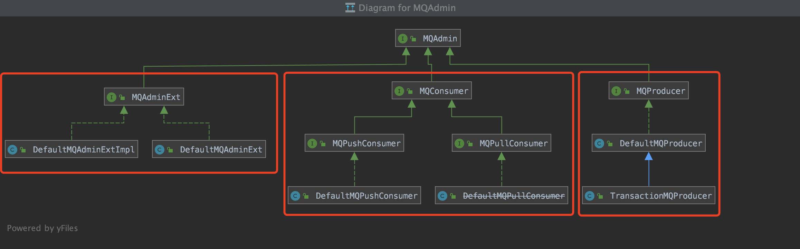
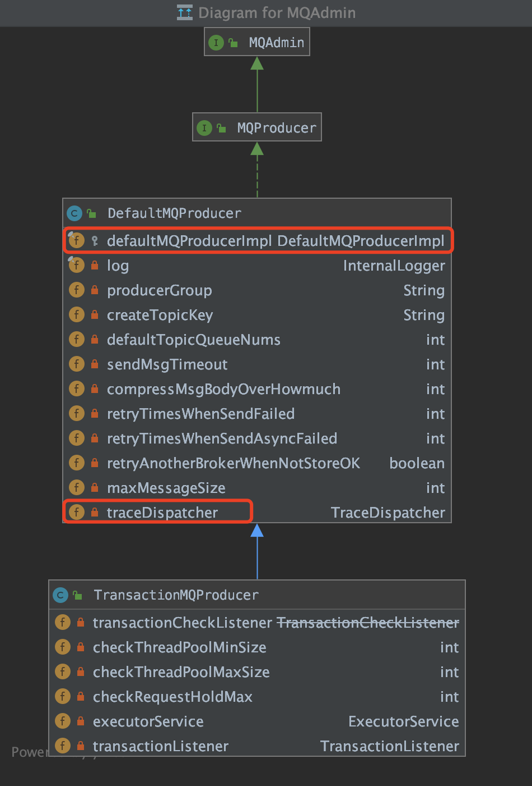
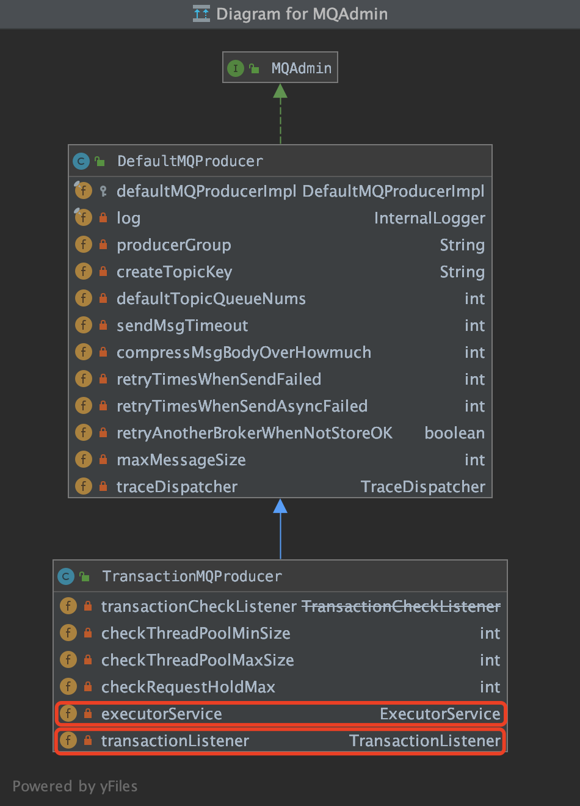

# Rocketmq源码--client

## Question

| 问题                                          | 描述                                                         | 解答                                                         |
| --------------------------------------------- | ------------------------------------------------------------ | ------------------------------------------------------------ |
| producer的操作实际有DefaultMqProducerImpl操作 | DefaultMqProducer对外提供方法, 方法内部调用DefaultMqProducerImpl完成实际工作, 这样的意义在哪 |                                                              |
| unitMode                                      | ClientConfig配置类中存在unitMode属性, 这个属性的意义是什么? 什么时候配置它? | 这个属性是判定是否是单元化部署.默认false, 目前没有用它做任何事! https://github.com/apache/rocketmq/issues/639 |
| checkForbbidenHook                            | 检车禁用钩子, 用一检查`CheckForbiddenContext`对象, 目前没有哪个地方调用, 这个到底是干嘛的 |                                                              |

客户端类继承




## Producer

对外提供的消息生产者接口, 用于将消息发送到代理broker, 有两个生产者实现 `DefaultMqProducer`和`TransactionMqProducer`

* DefaultMqProducer 默认的消息生产者实现类
* TransactionMqProducer  继承自DefaultMqProducer, 主要拓展了消息的事务发送

### MqProducer

* DefaultMqProducer

  

  配置属性

  | 属性                             | 含义                                                         | 默认值                                                |
  | -------------------------------- | ------------------------------------------------------------ | ----------------------------------------------------- |
  | producerGroup                    | 生产者组名, 多个Producer如果属于一个应用，发送同样的消息，则应该将它们归为同一组 | MixAll.DEFAULT_PRODUCER_GROUP = "DEFAULT_PRODUCER"    |
  | createTopickey                   | 默认创建的topic                                              | TopicValidator.AUTO_CREATE_TOPIC_KEY_TOPIC = "TBW102" |
  | defaultTopicQueueNums            | 在发送消息时, 默认创建topic的线程数                          | 4                                                     |
  | sendMsgTimeout                   | 发送消息超时时间                                             | 3000ms                                                |
  | compressMsgBodyOverHowmuch       | 消息超过多大进行消息压缩                                     | 1024*4 = 4k                                           |
  | retryTimesWhenSendFailed         | 消息异步发送失败重试次数                                     | 2                                                     |
  | retryTimesWhenSendAsyncFailed    | 消息同步发送失败重试数                                       | 2                                                     |
  | retryAnotherBrokerWhenNotStoreOK | 是否在发送失败时重试其它代理broker                           | false                                                 |
  | maxMessageSize                   | 限制生产者发送消息的最大数据, 超过报错.服务端也会配置限制, 所以需要配合使用 | 4M                                                    |

  类中有三个重要的操作属性`DefaultMQProducerImpl`,`TraceDispatcher`和`RPCHook`, 其中`RPCHook`非类内部属性, 并且它是remoting模块内容, 放到remoting模块看具体操作,  它在每次执行远程命令时都要执行的RPC挂钩

  

  操作属性

  | 属性                  | 含义                                                         |
  | --------------------- | ------------------------------------------------------------ |
  | DefaultMQProducerImpl | 具体执行生产者操作的对象, MqProducer多外暴露功能方法, 方法内调用的是DefaultMQProducerImpl对消息发送的操作 |
  | TraceDispatcher       | 监测跟踪消息发送的过程                                       |
  | RPCHook               | 在每次执行远程命令时都要执行的RPC挂钩                        |

  

* TransactionMqProducer 

  

  配置属性

  | 属性                   | 含义                                                       | 默认值 |
  | ---------------------- | ---------------------------------------------------------- | ------ |
  | checkThreadPoolMinSize | Broker回查Producer事务状态时，线程池最小线程数             | 1      |
  | checkThreadPoolMaxSize | Broker回查Producer事务状态时，线程池最大线程数             | 1      |
  | checkRequestHoldMax    | Broker回查Producer事务状态时，Producer本地缓冲请求队列大小 | 2000   |

  操作属性

  | 属性                | 含义                     |
  | ------------------- | ------------------------ |
  | ExecutorService     | 执行事务消息发送的线程池 |
  | TransactionListener | 对事务消息的事务监听器   |

  

Producer的所有对消息操作的方法实际都是调用的 `DefaultMqProducerImpl`, 如:

```java
		/**
     * 以同步模式发送消息。仅当发送过程完全完成时，此方法才返回。
     * 此方法具有内部重试机制，即内部实现将重试
     * #retryTimesWhenSendFailed 次才声称失败。结果，可能有多个消息传递给代理。应用程序开发人员应解决潜在的重复问题
     */
    @Override
    public SendResult send(
        Message msg) throws MQClientException, RemotingException, MQBrokerException, InterruptedException {
        Validators.checkMessage(msg, this);
        msg.setTopic(withNamespace(msg.getTopic()));
        return this.defaultMQProducerImpl.send(msg);
    }
```

```java
    @Override
    public TransactionSendResult sendMessageInTransaction(final Message msg,
        final Object arg) throws MQClientException {
        if (null == this.transactionListener) {
            throw new MQClientException("TransactionListener is null", null);
        }
        msg.setTopic(NamespaceUtil.wrapNamespace(this.getNamespace(), msg.getTopic()));
        return this.defaultMQProducerImpl.sendMessageInTransaction(msg, null, arg);
    }
```


#### DefaultMQProducerImpl

* 属性

  | 属性                                                         | 描述                                                         | 默认值                 |
  | ------------------------------------------------------------ | ------------------------------------------------------------ | ---------------------- |
  | DefaultMQProducer                                            | 用于获取DefaultMQProducer的配置属性                          |                        |
  | ConcurrentMap<String , TopicPublishInfo> topicPublishInfoTable | 主题消息队列表, 用于客户端本地管理broker中可用的topic和MessageQueue |                        |
  | ArrayList<SendMessageHook> sendMessageHookList               | 发送消息的钩子集合, 在消息发送前后会调用钩子. 在启用消息跟踪 enableMsgTrace时注册钩子. |                        |
  | RPCHook rpcHook                                              | rpc通信的钩子, 在发送rpc通信时触发                           |                        |
  | BlockingQueue<Runnable> asyncSenderThreadPoolQueue           | 异步线程池队列, 用于创建defaultAsyncSenderExecutor 默认异步发送线程池 | 50000                  |
  | Timer timer                                                  |                                                              |                        |
  | BlockingQueue<Runnable> checkRequestQueue                    | 检查请求线程池队列, 用于创建checkExecutor线程池              |                        |
  | ExecutorService checkExecutor                                | Broker回查Producer事务状态时，Producer本地缓冲请求线程池     |                        |
  | ExecutorService defaultAsyncSenderExecutor;                  | 默认异步消息发送线程池                                       |                        |
  | ExecutorService asyncSenderExecutor;                         | 自定义异步消息发送线程池, 如果没有配置自定义线程池, 使用默认消息发送线程池 |                        |
  | ArrayList<CheckForbiddenHook> checkForbiddenHookList         | 检查服务钩子, 检查对象 `CheckForbiddenContext`, 源码中没有添加检查的实现类, 用户可自定义检查; `DefaultMqProducerImpl::registerCheckForbiddenHook`用来注册钩子;`DefaultMqProducerImpl::executeCheckForbiddenHook`执行钩子;`DefaultMqProducerImpl::hasCheckForbiddenHook`判断是否配置钩子 | 源码中目前没有地方用到 |
  | int zipCompressLevel                                         |                                                              |                        |
  | MQFaultStrategy mqFaultStrategy                              |                                                              |                        |
  | ServiceState serviceState                                    | 服务状态, 服务创建未start, 服务开始运行(start), 服务停止(shutdown), 服务失败(start状态失败) |                        |
  | MQClientInstance mQClientFactory;                            |                                                              |                        |

  

* 

#### TraceDispatcher


