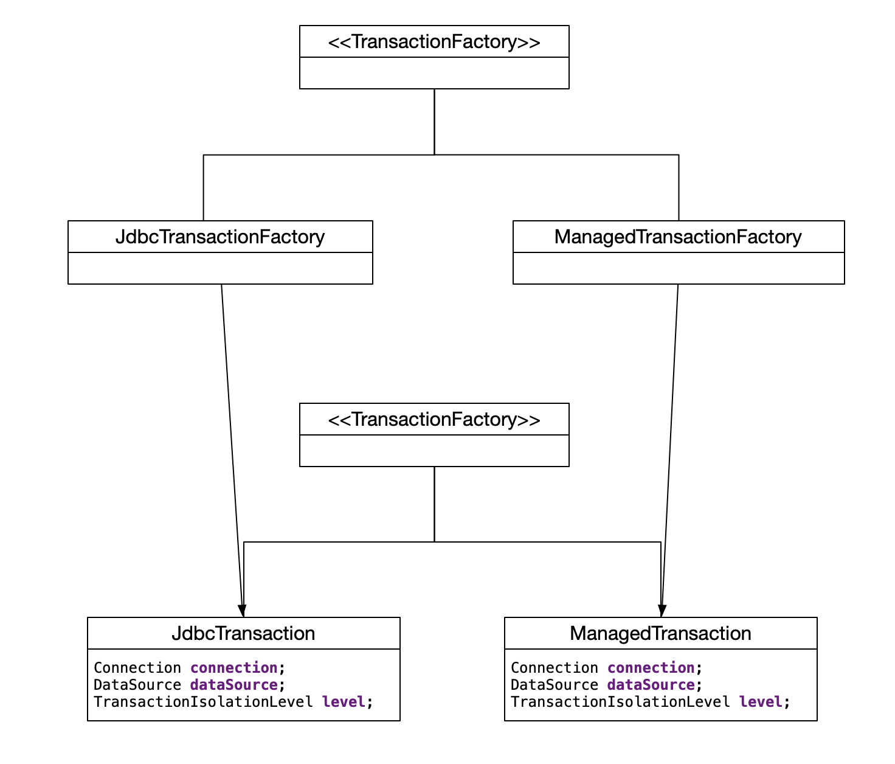
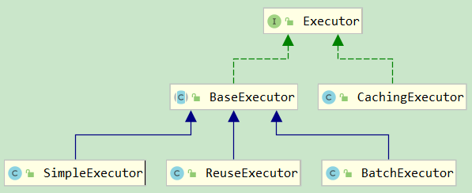
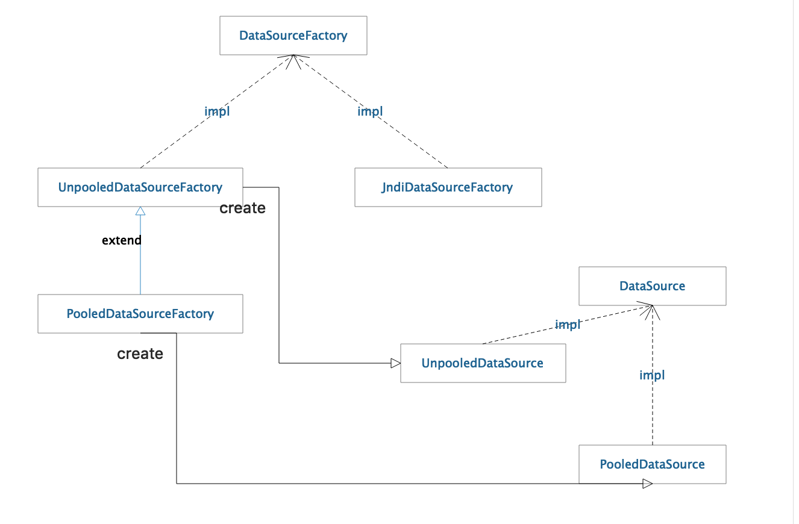

# MyBatis 源码分析


## session

1. SqlSession: interfact, 代表一个连接数据库的会话, 提供了一个默认的 DefaultSqlSession

2. SqlSessionFactory: interfact, 创建 SqlSessionFactory 的工厂, 提供了默认的 DefaultSqlSessionFactory创建 DefaultSqlSession, (这里使用**工厂方法设计模式**)

3. SqlSessionFactoryBuilder: 构建SqlSessionFactory的构建类, 内部读取默认的 Configuration默认配置和读取xml 配置, (此处使用 **外观设计模式**, 将内部组合操作封装, 对外提供统一的操作)

4. sqlSessionManager: 实现了 sqlSession, sqlSessionFactory两个接口;  sqlSession 管理类, 从SqlSessionFactory的创建  到  factory 创建 sqlSession  到   sqlSession执行 SQL 都封装在内, 对外提供了操作方法

   ```java
   public class SqlSessionManager implements SqlSessionFactory, SqlSession {
   
     private final SqlSessionFactory sqlSessionFactory;
     private final SqlSession sqlSessionProxy;
   
     private final ThreadLocal<SqlSession> localSqlSession = new ThreadLocal<>();
   
     /**
      * 构造函数 私有化, 强制使用静态方法创建 SqlSessionManager::newInstance
      */
     private SqlSessionManager(SqlSessionFactory sqlSessionFactory) {
       this.sqlSessionFactory = sqlSessionFactory;
   
       //sqlSession 方法调用使用动态代理, jdk 实现
       this.sqlSessionProxy = (SqlSession) Proxy.newProxyInstance(
           SqlSessionFactory.class.getClassLoader(),
         new Class[]{SqlSession.class},
           new SqlSessionInterceptor());
     }
   
     public static SqlSessionManager newInstance(Reader reader) {
       return new SqlSessionManager(new SqlSessionFactoryBuilder().build(reader, null, null));
     }
     ......
     public void startManagedSession() {
       this.localSqlSession.set(openSession());
     }
     ......
       
     @Override
     public SqlSession openSession(boolean autoCommit) {
       return sqlSessionFactory.openSession(autoCommit);
     }
     ......
     private class SqlSessionInterceptor implements InvocationHandler {
       public SqlSessionInterceptor() {
           // Prevent Synthetic Access
       }
   
       @Override
       public Object invoke(Object proxy, Method method, Object[] args) throws Throwable {
         final SqlSession sqlSession = SqlSessionManager.this.localSqlSession.get();
         if (sqlSession != null) {
           try {
             return method.invoke(sqlSession, args);
           } catch (Throwable t) {
             throw ExceptionUtil.unwrapThrowable(t);
           }
         } else {
           try (SqlSession autoSqlSession = openSession()) {
             try {
               final Object result = method.invoke(autoSqlSession, args);
               autoSqlSession.commit();
               return result;
             } catch (Throwable t) {
               autoSqlSession.rollback();
               throw ExceptionUtil.unwrapThrowable(t);
             }
           }
         }
       }
     }
   }
   ```

   sqlSessionManager 维护了三个属性: 

   ​	SqlSessionFactory sqlSessionFactory、 

   ​	sqlSessionProxy SqlSessionProxy、

   ​	ThreadLocal<SqlSession> localSqlSession

   SqlSessionProxy 是 jdk 实现的动态代理实例, 代理的目标对象是执行的 sqlSession, 如果在执行 sql 前没有调用startManagedSession()方法, 则每次sqlSessionFactory创建一个 sqlSession , 如果调用了, localSqlSession获取当前线程的 sqlSession 执行,  (这里使用了**动态代理设计模式**)

5. Executor: interface, 执行器接口, sqlSessionManager 实现了 sqlSession 的接口, 所有可以提供操作数据库的方法, 内部使用 sqlSessionProxy 代理 sqlSession 执行, sqlSession 的默认实现类是 DefaultSqlSession 类, 内部执行 sql 实际是由 Executor 实现的, 并且提供了多种执行器, 这里多种执行器策略实现(使用了**策略设计模式**)


## Transaction



1. 事务管理有两个实现类, JdbcTransaction 和 ManagedTransaction 内部封装了 connection 和 DataSource

2. 事务管理器的创建使用 TransactionFactory创建, (此处也使用了**工厂方法设计模式**)

3. 事务管理也是在 sqlSession中提供的, 默认使用TRANSACTION_NONE, 客户端不指定事务隔离级别, 使用数据库的默认事务隔离级别

```java
public enum TransactionIsolationLevel {
  NONE(Connection.TRANSACTION_NONE),
  READ_COMMITTED(Connection.TRANSACTION_READ_COMMITTED),
  READ_UNCOMMITTED(Connection.TRANSACTION_READ_UNCOMMITTED),
  REPEATABLE_READ(Connection.TRANSACTION_REPEATABLE_READ),
  SERIALIZABLE(Connection.TRANSACTION_SERIALIZABLE);

  private final int level;

  TransactionIsolationLevel(int level) {
    this.level = level;
  }

  public int getLevel() {
    return level;
  }
}
```

## executor



1. 四个执行器实现类 SimpleExecutor, ReuseExecutor, BatchExecutor 和 CachingExecutor
2. SimpleExecutor提供简单的 statement 执行方法, 每次获取新的 statement, 操作完关闭
3. ReuseExecutor 提供缓存 Statement, 内部维护一个statementMap 以 sql 字符串为 key, 以 statement 为 value 的 hashMap
4. BatchExecutor 提供以 JDBC提供的executeBatch的批量执行功能
5. CachingExecutor 缓存执行器, 内部维护了一个 Executor delegate, 这是最终真正执行操作的执行器, CachingExecutor执行器提供了二级缓存的功能, 更新操作刷新缓存, 查询操作使用缓存, 在 query 方法内, statement 检查是否开启缓存, 如果没开启直接执行delegate.query, 如果开启了 txm 查看是否有缓存, 拿到缓存, 返回, 如果没有执行delegate.query, (这里使用了**装饰设计模式**)

## datasource



1. 提供DataSourceFactory 数据源工厂接口, Mybatis 在使用 sqlSessionManager 构建 session 前, sqlSessionFactoryBuilder会读取 Configuration, 配置内包含数据源的配置, 使用配置内的数据源创建 DataSource
2. 默认 Mybatis 提供了unpooledDataSourceFactory , PooledDataSourceFactory, JndiDataSourceFactory三个工厂类, unpooledDataSource和PooledDataSource两个数据源类, (这里使用了**工厂方法设计模式**)

3. 在 sqlSessionFactoryBuilder 中使用 DataSourceFactory 类读取配置中的工厂类, 所以可以实现DataSourceFactory接口自定义工厂类创建相应的数据源
4. UnpooledDataSource 提供基本的数据源功能, 管理连接, 驱动用户名密码等信息, PooledDataSource 继承UnpooledDataSource, 内部维护UnpooledDataSource, 并且内部管理的数据也是由 UnpooledDataSource管理的, 差别是PooledDataSource还维护了一个 PoolState的池, 管理多个连接

## binding

1. mybatis 的核心配置类 Configuration 中有一个属性MapperRegistry, 这是 Mybatis 默认提供的 Mapper 注册器, 注册器内维护了一个以Class 为 key   Class 对应的 mapperProxyFactory 为 value 的 hashMap, 用来管理 Mapper

   ```java
   
   public class MapperRegistry {
   
     private final Configuration config;
     private final Map<Class<?>, MapperProxyFactory<?>> knownMappers = new HashMap<>();
   
     public MapperRegistry(Configuration config) {
       this.config = config;
     }  
   	
     
     public <T> void addMapper(Class<T> type) {
       if (type.isInterface()) {
         if (hasMapper(type)) {
           throw new BindingException("Type " + type + " is already known to the MapperRegistry.");
         }
         boolean loadCompleted = false;
         try {
           knownMappers.put(type, new MapperProxyFactory<>(type));
           // It's important that the type is added before the parser is run
           // otherwise the binding may automatically be attempted by the
           // mapper parser. If the type is already known, it won't try.
           MapperAnnotationBuilder parser = new MapperAnnotationBuilder(config, type);
           parser.parse();
           loadCompleted = true;
         } finally {
           if (!loadCompleted) {
             knownMappers.remove(type);
           }
         }
       }
     }
   }
   ```

2. MapperRegistry 中可以根据 config 获取到所有定义的 mapper 接口的 MapperProxyFactory, 并作为缓存

3. MapperProxyFactory 会负责创建它对象的接口的MapperProxy 代理, 通过代理调用 mapper 接口的方法

4. 这里使用了**工厂方法设计模式** 和 **动态代理设计模式**


##整体执行流程

1. mybatis 对外提供 sqlSessionManager 的统一操作, 
2. sqlSessionManager 通过 sqlSessionFactoryBuilder 调用 XmlConfigBuilder 读取配置文件获取默认配置和用户配置, 配置内包括: `执行器类型`, `数据源信息`, `事务隔离级别` ,`所有的 mapper 接口` 等信息
3. sqlSessionFactoryBuilder通过读取的配置创建 sqlSessionFactory
4. 此时初始化完成, 通过 sqlSessionManager操作数据库, 包括获取 session, 执行 sql 等
5. sqlSessionManager 通过 sqlSessionFactory创建 sqlSession, 为每个线程提供一个 session
6. sqlSessionManager 操作 sql 是使用内部配置提供的 mapperRegistry管理了所有的 Mapper 的接口
7. 通过MapperProxyFactory 为每个接口提供动态代理类, 这些代理类为 sqlSession 执行的 sql 提供 statement
8. sqlSessionManager调用执行 sqlSessionProxy 代理当前线程的 sqlSession操作 executor 执行 statement
9. 最后返回结果