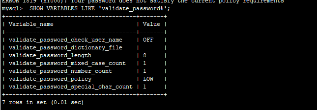
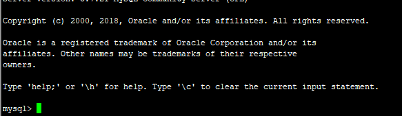
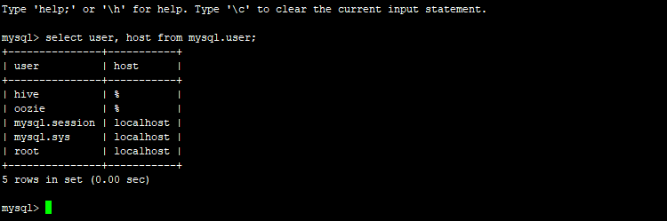
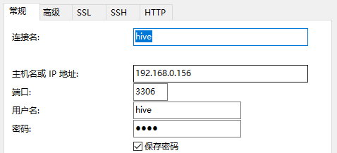
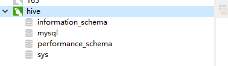

# CentOS 安装mysql

## yum 安装

**1.下载mysql源安装包**

$ wget <http://dev.mysql.com/get/mysql57-community-release-el7-8.noarch.rpm>

 

**2.安装mysql源**

$ yum localinstall mysql57-community-release-el7-8.noarch.rpm 

 

**3.检查mysql源是否安装成功**

$ yum repolist enabled | grep "mysql.*-community.*"

 

**4.安装MySQL** 

这一步才是真正安装mysql

$ yum install mysql-community-server

 

**6.启动MySQL服务并设置开机启动**

$ systemctl start mysqld

$ systemctl enable mysqld

$ systemctl daemon-reload

 

**7.端口开放**

$ firewall-cmd --zone=public --add-port=3306/tcp --permanent

$ firewall-cmd --reload

 

**8.修改root本地登录密码**

 1）查看mysql密码

$ grep 'temporary password' /var/log/mysqld.log

$ mysql -uroot -p

3）修改密码【注意：后面的分号一定要跟上】

mysql> ALTER USER 'root'@'localhost' IDENTIFIED BY 'password';

或者：

mysql> set password for 'root'@'localhost'=password('password'); 

**mysql5.7会提示错误 Your password does not satisfy the current policy requirements**

查看密码策略

```mysql
msyql>  SHOW VARIABLES LIKE 'validate_password%'; 
```



设置允许使用简单密码策略    

```mysql
mysql> set global validate_password_policy=LOW;
```

设置密码长度为4位长度(最小设置为4位)

```mysql
mysql> set global validate_password_length=1; 
```

**9.添加远程登录用户**

```mysql
GRANT ALL PRIVILEGES ON *.* TO 'username'@'%' IDENTIFIED BY 'password' WITH GRANT OPTION;
```


## tar包安装

1. 卸载MariaDB

   ```shell
   # rpm -qa|grep mariadb
   mariadb-5.5.56-2.el7.x86_64
   
   # yum remove -y mariadb-5.5.56-2.el7.x86_64
   ```

   

2. 安装libaio 依赖

   ```shell
   # yum install -y libaio 
   ```

   

3. 解压安装包到指定目录

   ```shell
   # tar -zxvf mysql-5.7.21-linux-glibc2.12-x86_64.tar.gz -C /usr/local/
   # cd /usr/local/
   # mv mysql-5.7.21-linux-glibc2 mysql
   ```

   

4. 创建mysql用户和用户组

   ```shell
   # groupadd mysql
   # useradd -g mysql mysql
   # passwd mysql
   ```

   

5. 修改mysql目录所属用户为mysql

   ```shell
   # chown -R mysql:mysql mysql
   ```

   

6. 修改配置文件/

   ```shell
   # vim /support-files/mysql.server
   ```

   ```shell
   basedir=/usr/local/mysql
   datadir=/usr/local/mysql/data
   mysqld_pid_file_path=/usr/local/mysql/data/mysql.pid
   ```

   ```shell
   cp /support-files/mysql.server /etc/init.d/mysqld
   ```

   

7. 初始化mysql

   ```shell
   ./bin/mysqld --user=mysql --basedir=/usr/local/mysql --datadir=/usr/local/mysql/data --initialize
   ```

   控制台会出现root 初始化密码

8. 使用初始化密码登录mysql

   ```shell
   bin/mysql -u root -p
   ```

   

9. 修改root 初始化密码

   ```mysql
   > alter user 'root'@'localhost' identified by 'newPassword';
   > flush privileges;
   ```

   

10. 增加外网访问用户

    ```mysql
    > grant all privileges on *.* to 'hive'@'%' identifyed by 'hive' with grant option;
    > flush privileges;
    ```

11. 查看用户情况

    ```mysql
    > select user, host from mysql.user;
    ```

    

12.使用navicat在外网访问

 




  