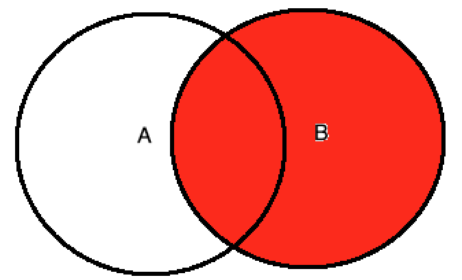

# mysql 进阶笔记

https://www.cnblogs.com/liuyansheng/p/6531915.html

join_buffer_size 默认 512k      8M

read_buffer_size：

```
（数据文件存储顺序）是MySQL读入缓冲区的大小，将对表进行顺序扫描的请求将分配一个读入缓冲区，MySQL会为它分配一段内存缓冲区，read_buffer_size变量控制这一缓冲区的大小，如果对表的顺序扫描非常频繁，并你认为频繁扫描进行的太慢，可以通过增加该变量值以及内存缓冲区大小提高其性能，read_buffer_size变量控制这一提高表的顺序扫描的效率 数据文件顺序。 
```

read_rnd_buffer_size：

```
是MySQL的随机读缓冲区大小，当按任意顺序读取行时（列如按照排序顺序）将分配一个随机读取缓冲区，进行排序查询时，MySQL会首先扫描一遍该缓冲，以避免磁盘搜索，提高查询速度，如果需要大量数据可适当的调整该值，但MySQL会为每个客户连接分配该缓冲区所以尽量适当设置该值，以免内存开销过大。表的随机的顺序缓冲 提高读取的效率。
```

Sort_buffer_size

```
connect级别的参数, 默认大小是 8M 一般够用了, 不要调的特别大, 可能由于高并发耗尽内存,
可以影响 order by   group by 的执行效果
```

tmp_table_size

query_cache_size

innodb_buffer_pool_size     db服务器总内存的60% 到80%

innodb_additional_mem_pool_size  128M

innodb_sort_buffer_size:

```
在创建InnoDB索引时用于指定对数据排序的排序缓冲区的大小。利用这块内存把数据读进来进行内部排序然后写入磁盘。这个参数只会在创建索引的过程中被使用，不会用在后面的维护操作；在索引创建完毕后innodb_sort_buffer会被释放。
```

key_buffer_size


## mysql 架构

### 配置文件

* npm 安装 mysql5.7, 配置文件 /etc/my.cnf

* 修改字符集和数据存储路径

  * ```mysql
    show variables like '%character%';
    ```

    

    修改配置文件

    ```shell
    vim /etc/my.cnf
    ```

    

    重启 mysql

    ```shell
    systemctl restart mysqld
    ```

    

    

    

#### 配置文件

* 二进制日志 log-bin 主从复制
* 错误日志 log-error 默认关闭的, 记录
* 查询日志 log 默认关闭, 记录查询的 sql 语句, 如果开启会减低 msyql 的整体性能, 因为记录日志也是需要消耗系统资源的
* 数据文件  
  * 默认:/var/lib/mysql
  * frm文件 :存放表结构
  * myd文件 :存储数据表数据
  * myi文件: 存放表索引
* 如何配置

### 架构图


* **连接层**

  最上层是一些客户端和连接服务, 包含本地 sock 通信和大多数基于客户端/服务端工具实现的类似于 tcp/ip 的通信, 主要完成一些类似于连接处理、授权认证、及相关的安全方案. 再改层上引入了线程池的概念, 为通过认证安全接入的客户端提供线程. 同样在该层上可以实现基于 SSL 的安全链接. 服务器也会为安全接入的每个客户端验证它所具有的操作权限.

* **服务层**

  第二层架构主要完成核心服务功能, 如 SQL 接口, 并完成缓存的查询, SQL 的分析和优化及部分内置函数的执行, 所有跨存储引擎的功能也在这一层实现, 如过程, 函数等. 在该层, 服务器会解析查询并创建相应的内部解析树, 并对其完成相应的优化, 如确定查询表的顺序, 是否利用索引等, 最后生成相应的执行操作. 如果是 select 语句, 服务器还会查询内部的缓存, 如果缓存控件足够大, 这样在解决大量读操作的环境中能够给很好的提升系统的性能.

* 引擎层

  存储引擎层, 存储引擎真正的负责了 MySQL 中数据的存储和提取, 服务器通过 API 与存储引擎进行通信. 不同的存储引擎具有的功能不同. 这样我们可以根据自己的实际需要进行选取. 后面介绍 MyISAM 和 InnoDB

* 存储层

  数据存储层, 主要是将数据存储在运行于裸设备的文件系统之上, 并完成与存储引擎 的交互

* 

## SQL 分析

* 性能下降 SQL 慢  执行时间长  等待时间长

  * 查询语句写的烂
  * 索引失效
    * 单值索引
    * 复合索引  
  * 关联查询太多join(设计缺陷或不得已的需求)
  * 服务器调优及各个参数设置(缓冲、线程数等)

* **读取 SQL 顺序**

  ```sql
  FROM <left_table>
  ON <join_condition>
  <join_type> JOIN <right_table>
  WHERE <where_condition>
  GROUP BY <group_by_list>
  HAVING <having_condition>
  SELECT
  DISTINCT <select_list>
  ORDER BY <order_by_condition>
  LIMIT <limit_number>
  ```

  

  

* 连接查询

  * 

    select * from A INNER JOIN B on A.key=B.key

  * 

    select * from A LEFT JOIN B on A.key=B.key

  * 

    select * from A RIGHT JOIN B on A.key=B.key

  * 

    select * from A LEFT JOIN B on A.key=B.key Where B.key is null

  * 

    select * from A RIGHT JOIN B on A.key=B.key where A.key is null

  * 

    select * from A FULL OUTTER JOIN B on A.key=B.key

  * 

    select * from A FULL OUTTER JOIN B on A.key=B.key where A.key is null or B.key is null 

    

* ```sql
  CREATE TABLE `tbl_dept` (
    `id` int(11) NOT NULL AUTO_INCREMENT,
    `deptName` varchar(30) DEFAULT NULL,
    `locAdd` varchar(40) DEFAULT NULL,
    PRIMARY KEY (`id`)
  ) ENGINE=InnoDB AUTO_INCREMENT=6 DEFAULT CHARSET=utf8;
  
  CREATE TABLE `tbl_emp` (
    `id` int(11) NOT NULL AUTO_INCREMENT,
    `name` varchar(20) DEFAULT NULL,
    `deptId` int(11) DEFAULT NULL,
    PRIMARY KEY (`id`),
    KEY `fk_dept_id` (`deptId`)
  ) ENGINE=InnoDB AUTO_INCREMENT=9 DEFAULT CHARSET=utf8;
  
  insert into tbl_dept(deptName, locAdd) values('RD', 11);
  insert into tbl_dept(deptName, locAdd) values('HR', 12);
  insert into tbl_dept(deptName, locAdd) values('MK', 13);
  insert into tbl_dept(deptName, locAdd) values('MIS', 14);
  insert into tbl_dept(deptName, locAdd) values('FD', 15);
  
  
  insert into tbl_emp(name, deptId) values('z3', 1);
  insert into tbl_emp(name, deptId) values('z4', 1);
  insert into tbl_emp(name, deptId) values('z5', 1);
  
  insert into tbl_emp(name, deptId) values('w5', 2);
  insert into tbl_emp(name, deptId) values('w6', 2);
  
  insert into tbl_emp(name, deptId) values('s7', 3);
  
  insert into tbl_emp(name, deptId) values('s8', 4);
  
  insert into tbl_emp(name, deptId) values('s9', 5);
  ```


### 索引 

Mysql 官方对索引的定义为: **索引是帮助 MySQL 高效获取数据的数据结构**

***排好序的快速查找数据结构***

* 优势: 
  * 提高数据检索的效率, 降低数据库的 IO 成本;     
  *  降低数据排序的成本, 降低了 CPU 的消耗
* 劣势: 
  * 实际上索引也是一张表, 该表保存了主键与索引字段, 并指向实体表的记录, 所以索引列也是要占用空间的
  * 虽然索引大大提高了查询速度, 同时却会降低更新表的速度, 如对表进行 insert、update、delete; 因为更新表时, MySQL 不仅要保存数据, 还要保存一下索引文件每次更新添加索引列的字段, 都会调整因为更新锁带来的键值变化后的索引信息
  * 索引只是提高效率的一个因素, 如果你的 MySQL 有大数据量的表, 就需要花时间研究建立最优秀的索引, 或优化查询

#### MySQL索引分类

* 单值索引

  * 即一个索引只包含单个列, 一个表可以有多个单值索引

* 唯一索引

  * 索引列的值必须唯一, 但允许空值

* 复合索引

  * 一个索引包含多个列

* 基本语法

  * 创建 

    ```sql
    create [unique] index <indexName> on <tableName> (<columns>)
    ```

    ```sql
    alter <tableName> add [unique] index <indexName> on (<columns>)
    ```

  * 删除索引

    ```sql
    drop index <indexName> on <tableName>;
    ```

  * 查看索引

    ```sql
    show index from <tableName>;
    ```

* **alter table **四种方式添加数据表的索引

  * 添加一个主键, 这意味着索引值必须是唯一的, 且不能为 null

    ```sql
    alter table <tableName> add PRIMARY KEY (<column_list>) 
    ```

  * 创建索引的值必须是唯一的(除了 null 外, null 可能会出现多次)

    ```sql
    alter table <tableName> add UNIQUE index_name (<column_list>)
    ```

  * 添加普通索引, 索引可以出现多次

    ```sql
    alter table <tableName> add INDEX index_name (<column_list>)
    ```

  * 指定索引为 FULLTEXT, 用于全文索引

    ```sql
    alter table <tableName> add FULLTEXT index_name(<column_list>)
    ```

    

#### MySQL 索引结构

* BTree 索引

  * **索引原理 : **真实的情况是, 3 层的 B+ 树可以表示上百万的数据, 如果上百万的数据查找只需要三次I/O, 性能提升将是巨大的, 如果没有索引, 每个数据项都要发生一次 I/O, 那么总共需要百万次的I/O, 显然成本非常非常高.

  * 实际使用的是 B+Tree

  * BTree与 B+Tree

    * BTree

    

    T度的B树，满足以下条件：

    每个节点至多有2T个节点

    除根节点外，其他每个分支节点至少有T子树

    根节点至少有两颗子树

    所有的叶子节点在同一层上

    每个节点有j-1个关键字，j个子节点，关键字按顺序排列

    * B+Tree

    

    T度的B+树，对比B树满足以下条件：

    每个节点有T个关键字，T个子结点

    所有的叶子节点中包含全部关键码的信息，叶子节点按关键码顺序连接

    每个非终端节点，可以看成索引部分，节点中仅仅包含子树的最大或最小关键码

* Hash索引

* FULL-TEXT索引

* RTree索引

#### 那些情况需要创建索引

* 主键自动创建唯一索引
* 频繁作为查询条件的字段应该创建索引
* 查询中与其它表关联的字段, 外键关系建立索引
* 频繁更新的字段不适合创建索引; 因为每次更新不单单是更新了记录还会更新索引
* where 条件里用不到的字段不创建索引
* 单键/组合索引的选择问题? 在高并发下倾向创建组合索引
* 查询中排序的索引, 排序字段若通过索引去访问将大大提高排序速度
* 查询中统计或者分组字段

#### 那些情况不创建索引

* 表记录太少
* 经常增删改的表
* 数据重复且平均分布的表字段, 简历索引的实际效果不大, 比如一个表中字段国籍, 数据中基本都是中国或几个国家的数据, 提高的效率基本没有效果


#### 性能分析

* MySQL query Optimizer
* MySQL 常见瓶颈
  * CPU: CPU 在饱和的时候一般发生在数据装入内存或从磁盘上读取数据时候
  * I/O: 磁盘 I/O瓶颈发生在装入数据远大于内存容量的时候
  * 服务器硬件的性能瓶颈: top, free, iostat 和 vmstat 来查看系统的性能状态
* Explain

#### EXPLAIN

* 作用

  * 表的读取顺序
  * 数据读取操作的操作类型
  * 那些索引可以使用
  * 那些索引被实际使用
  * 表之间的引用
  * 每张表有多少行被优化器查询

* 查询字段

  

  | id   | select_type | table | parititions | type | possible_keys | key  | key_len | ref  | rows | filtered | Extra |
  | ---- | ----------- | ----- | ----------- | ---- | ------------- | ---- | ------- | ---- | ---- | -------- | ----- |
  |      |             |       |             |      |               |      |         |      |      |          |       |

* explain 字段解释

  - id

    - select查询的序列号, 包含一组数字, 表示查询中执行 select 子句或操作表的顺序, 三种情况:

      - id 相同, 执行顺序由上至下
      - 如果是子查询, id 的序号会递增, **id 值越大优先级越高, 越先执行**
      - id 如果相同, 可以认为是一组, 从上往下顺序执行; 在所有组中, id 值越大, 优先级越高, 越先执行

      

    - DERIVED: 衍生表

  | id   | select_type | table      |
  | ---- | ----------- | ---------- |
  | 1    | PRIMARY     | <derived2> |
  | 1    | PRIMARY     | t1         |
  | 2    | DERIVED     | t2         |

  这种表示先执行 t2表再执行 derived2 虚拟表 最后执行t1 表

* select_type

  | id   | select_type  |
  | ---- | ------------ |
  | 1    | SIMPLE       |
  | 2    | PRIMARY      |
  | 3    | SUBQUERY     |
  | 4    | DERIVED      |
  | 5    | UNION        |
  | 6    | UNION_RESULT |

  * 查询类型区别
    * SIMPLE: 简单的 select 查询, 查询中不包含子查询或者 UNION
    * PRIMARY: 查询中若包含任何复杂的子部分, 最外层查询则被标记为 PRIMARY
    * SUBQUERY: 在 SELECT 或 WHERE 列表中包含了子查询
    * DERIVED: 在 FROM 列表中包含的子查询被标记为 DERIVED(衍生),  MySQL 会递归执行这些子查询,把结果放在临时表里.
    * UNION: 若第二个 SELECT 出现在 UNION 之后, 则被标记为 UNION; 若 UNION 包含在 FROM 子句的子查询中, 外层 SELECT 将被标记为 UNION
    * UNION_RESULT: 从 UNION 表获取结果的 SELECT

* type

  | ALL  | index | range | ref  | eq_ref | const | system | NULL |
  | ---- | ----- | ----- | ---- | ------ | ----- | ------ | ---- |
  |      |       |       |      |        |       |        |      |

  显示查询使用了何种类型: 

   `从最好到最差的次序  system > const > eq_ref > ref > range > index > ALL` 

  * system: The table has only one row (= system table)表中只有一行数据或者是空表。
  * const: 表示通过索引一次就找到了, const 用户比较 primary key 或 unique 索引. 因为只匹配一行数据, 所以很快, 如将主键置于 where 列表中, MySQL 就能将该查询转换为一个常量
  * eq_ref: 出现在连表语句中，驱动表的连接字段是主键或唯一性索引，且必须为not null，唯一索引和主键是多列时，只有所有的列都用作比较时才会出现eq_ref。
  * ref: 非唯一性索引扫描, 返回匹配某个单独值的所有行. 本质上也是一种索引访问, 他返回所有匹配某个单独值的行, 然而, 他可能会找到多个复合条件的行, 所以他应该属于查找和扫描的混合体, 一般优化到 ref 就很可以了
  * index: full index scan, index与 ALL 区别为 index 类型只遍历索引树, 全索引扫描
  * ALL: 全表扫描, 大数量很慢


## 索引优化

### 索引分析


##### 单表

```sql
create table if not exists article (
	id int(10) unsigned not null primary key auto_increment,
	author_id int(10) unsigned not null,
	category_id int(10) unsigned not null,
	views int(10) unsigned not null,
	comments	int(10) unsigned not null,
	title varchar(255) not null,
	content TEXT not null
);

insert into article (author_id, category_id, views, comments, title, content) values
(1,1,1,1,'1','1'),
(2,2,2,2,'2','2'),
(3,3,3,3,'3','3'),
(4,4,4,4,'4','4');
```

优化 sql

```sql
explain 
select id, author_id 
from article 
where category_id = 1 and comments > 1 
order by views desc
limit 1;
```

#####多表联查

```sql
create table if not exists class(
	id int(10) unsigned not null auto_increment,
	card int(10) unsigned not null,
	primary key(id)
);

create table if not exists book(
	bookId int(10) unsigned not null auto_increment,
	card int(10) UNSIGNED not null,
	primary key(bookId)
);

insert into class(card) values(floor(1+(rand()*20)));
insert into class(card) values(floor(1+(rand()*20)));
insert into class(card) values(floor(1+(rand()*20)));
insert into class(card) values(floor(1+(rand()*20)));
insert into class(card) values(floor(1+(rand()*20)));
insert into class(card) values(floor(1+(rand()*20)));
insert into class(card) values(floor(1+(rand()*20)));
insert into class(card) values(floor(1+(rand()*20)));
insert into class(card) values(floor(1+(rand()*20)));
insert into class(card) values(floor(1+(rand()*20)));
insert into class(card) values(floor(1+(rand()*20)));

insert into book(card) values(floor(1+(rand()*20)));
insert into book(card) values(floor(1+(rand()*20)));
insert into book(card) values(floor(1+(rand()*20)));
insert into book(card) values(floor(1+(rand()*20)));
insert into book(card) values(floor(1+(rand()*20)));
insert into book(card) values(floor(1+(rand()*20)));
insert into book(card) values(floor(1+(rand()*20)));
insert into book(card) values(floor(1+(rand()*20)));
insert into book(card) values(floor(1+(rand()*20)));
insert into book(card) values(floor(1+(rand()*20)));
insert into book(card) values(floor(1+(rand()*20)));
insert into book(card) values(floor(1+(rand()*20)));
insert into book(card) values(floor(1+(rand()*20)));
insert into book(card) values(floor(1+(rand()*20)));
insert into book(card) values(floor(1+(rand()*20)));
insert into book(card) values(floor(1+(rand()*20)));
insert into book(card) values(floor(1+(rand()*20)));
insert into book(card) values(floor(1+(rand()*20)));


create table if not exists phone(
	phoneId int(10) unsigned not null auto_increment,
	card int(10) UNSIGNED not null,
	primary key(phoneId)
);


insert into phone(card) values(floor(1+(rand()*20)));
insert into phone(card) values(floor(1+(rand()*20)));
insert into phone(card) values(floor(1+(rand()*20)));
insert into phone(card) values(floor(1+(rand()*20)));
insert into phone(card) values(floor(1+(rand()*20)));
insert into phone(card) values(floor(1+(rand()*20)));
insert into phone(card) values(floor(1+(rand()*20)));
insert into phone(card) values(floor(1+(rand()*20)));
insert into phone(card) values(floor(1+(rand()*20)));
insert into phone(card) values(floor(1+(rand()*20)));
insert into phone(card) values(floor(1+(rand()*20)));
insert into phone(card) values(floor(1+(rand()*20)));
insert into phone(card) values(floor(1+(rand()*20)));
insert into phone(card) values(floor(1+(rand()*20)));
insert into phone(card) values(floor(1+(rand()*20)));
insert into phone(card) values(floor(1+(rand()*20)));
insert into phone(card) values(floor(1+(rand()*20)));
insert into phone(card) values(floor(1+(rand()*20)));
insert into phone(card) values(floor(1+(rand()*20)));
insert into phone(card) values(floor(1+(rand()*20)));
insert into phone(card) values(floor(1+(rand()*20)));
insert into phone(card) values(floor(1+(rand()*20)));
insert into phone(card) values(floor(1+(rand()*20)));
insert into phone(card) values(floor(1+(rand()*20)));
insert into phone(card) values(floor(1+(rand()*20)));

```

优化

```sql
select * from book left join class on class.card=book.card left join phone on phone.card = book.card;
```

```sql
select * from class left join book on class.card=book.card left join phone on phone.card = book.card;
```


#####***结论***

尽量能减少 join 语句中的 NestedLoop 的循环总次数, "永远用小结果集驱动大的结果集".

有限优化 NestedLoop 的内层循环;

保证 Join 语句中被驱动表上 Join 条件字段已经被索引;

当无法保证被驱动表的 Join 条件字段被索引 却内存资源充足的前提下, 不要太吝惜 `JoinBuffer` 的设置


### 索引失效

* 全职匹配我最爱
* **最佳左前缀法则**
* 不在索引列上做任何操作(计算, 函数, (自动 or 手动)类型转换), 会导致索引失效而转向全表扫描
* 存储引擎不能使用索引中范围条件右边的列
* 尽量使用覆盖索引(只访问索引的查询(索引列和查询列一致)), 减少 select *
* mysql 在使用不等于(!=或者 <>)的时候无法使用索引会导致全表扫描
* is null, is not null 也无法使用索引
* like 以通配符开头('%abc…')mysql索引失效会变成全表扫描的操作. 问题:解决 like '%字符串%'时索引不被使用的方法
* 字符串不加单引号索引失效
* 少用 or, 用它来连接时会索引失效


```sql
create table staffs(
	id int primary key auto_increment,
	name varchar(24) not null default ''comment '姓名',
	age int not null default 0 comment '年龄',
	pos varchar(20) not null default '' comment '职位',
	add_time TIMESTAMP not null default CURRENT_TIMESTAMP comment '入职时间'
) charset utf8 comment '员工记录表';

insert into staffs (name, age, pos, add_time) values
('z3', 22, 'manager', NOW()),
('July', 23, 'dev', NOW()),
('2000', 23, 'dev', NOW());

alter table staffs add index idx_staffs_nameAgePos(name, age, pos);
```


题目: 视频 44

#### 一般性建议

* 对于单值索引, 尽量选择针对当前 query 过滤更好的索引
* 在选择组合索引的时候, 当前 query 中过滤性最好的字段在索引字段顺序中, 位置越靠前越好.
* 在选择组合索引的时候, 尽量选择可以能够包含当前 query 中的 where字句中更多字段的索引
* 尽可能通过分析统计信息和调整 query 的写法来达到选择合适索引的目的

#### 优化总结口诀

全值匹配我最爱, 最左前缀要遵守;

带头大哥不能死, 中间兄弟不能断;

索引列上少计算, 范围之后全失效; 

LIKE 百分写最右, 覆盖索引不写星;

不等空值还是 or, 索引失效要少用;

VAR 引号不可丢, SQL 高级也不难;


## 查询截取分析

* 查询优化
* 慢查询日志
* 批量数据脚本
* show Profile
* 全局查询日志

———分析----------

1. 观察, 至少跑 1 天, 看看生产的慢 SQL 情况.
2. 开启慢查询日志, 设置阈值, 比如超过 5 秒钟的就是慢 SQL, 并将它抓取出来.
3. explain + 慢 SQL 分析
4. show profile
5. SQL 数据库服务器的参数调优

======总结

1. 慢查询的开启并捕获
2. explain+ 慢 SQL 分析
3. show profile 查询 SQL 在 MySQL 服务器里面的执行细节和生命周期情况
4. SQL 数据库服务器的参数调优


### 查询优化


#### 小表驱动大表

```sql
select * from A where id in (select id from B )
```

等价于

```sql
select id from B;
select * from A where A.id = B.id
```

当 B 表的数据集必须小于 A 表的数据集时, 用 in 优于 exists

```sql
select * from A where exists (select 1 from B where B.id = A.id)
```

等价于

```sql
select * from A;
select * from B where A.id = B.id;
```

当 A 表的数据集小于 B 表的数据集时, 用 exists 优于 in

#### order by 关键字优化

如果由于单路排序问题出现多路排序, 尝试调节`sort_buffer_size`和`max_length_for_sort_data`参数


### 慢查询日志

* **默认情况下, MySQL 数据库没有开启慢查询日志**, 需要手动来设置这个参数

* 当然, **如果不是调优需要的话, 一般不建议启动该参数**, 因为开启慢查询日志会或多或少带来一定的性能影响. 慢查询日志支持将日志记录写入文件

* 查看是否开启及如何开启

  ```sql
  show variables like '%slow_query_log%';
  ```

  

  

  

  临时开启: 只对当前数据库临时开启,数据库重启后失效; 

  ```sql
  set global slow_query_log=1;
  ```

  

  

* 永久开启

  修改 my.cnf 配置文件, 重启

  ```sql
  [mysqld]
  slow_query_log=1
  slow_query_log_file=/var/lib/mysql/#{hostName}-slow.log
  ```

  

  查看慢查询阈值

  ```sql
  show variables like '%long_query_time%';
  ```

  

  修改阈值

  ```sql
  set global long_query_time=5;
  ```

  ```shell
  [mysqld]
  long_query_time=1
  ```

  命令设置`set global long_query_time=5;` 直接查看`show variables like '%long_query_time%'` 还是 10 秒, 需要重新开启一个连接或`show global variables like '%long_query_time%`' 查看

  

* 查看慢查询日志数量

  ```sql
  show status like '%slow_queries%';    show global status like '%slow_queries%';
  ```

  

* **mysqldumpslow 慢查询工具**

  

  

* 

### 批量数据脚本

### show Profile

默认关闭, 查看和开启 show profile命令;

```sql
show variables like '%profiling%';
set profiling=on;
```


执行 sql 后查看 sql 的只执行信息

```sql
show profiles;
```


诊断 SQL

```sql
show profile cpu, block io for query #{QueryID}
```


参数:

ALL: 显示所有的开销信息

BLOCK IO: 显示块 IO 相关开销

CONTEXT SWITCHES: 上下文切换相关开销

CPU: 显示 cpu 相关开销

IPC: 显示发送和接收相关开销信息

MEMORY: 显示内存相关开销信息

PAGE FAULTS: 显示页面错误相关开销信息

SOURCE: 显示和 Source_function, Source_file, Source_line相关的开销信息

SWAPS: 显示交换次数相关开销信息


* 日常开发要注意的结论:

  * converting HEAP to MyISAM: 查询结果太大, 内存都不够用了, 往磁盘上写了
  * Creating tmp table: 创建临时表
  * Copy to tmp table on disk: 把内存中临时表复制到磁盘, 危险!!!
  * locked;

  出现上面四个一定要优化


### 全局查询日志

开启全局查询日志

```sql
set global general_log=1;
set global log_output='TABLE';
```


## 锁

* 读锁, 写锁
* 表锁, 行锁

###  表锁

锁表

```sql
lock table #{tableName1} ${read|write}, #{tableName2} ${read|write}
```

查看所有表锁

```sql
show open tables;
```

解锁

```sql
unlock tables;
```

* MyISAM 再执行查询语句(select) 前, 会自动给设计的所有表加读锁, 再执行增删改操作前, 会自动给设计的表加写锁

分析表锁定, 检查 table_locks_waited和 table_locks_immediate 状态变量来分析系统上的表锁定;

```sql
show status like '%table%';
```

* MyISAM 的读写锁调度是写优先, 这也是 MyISAM 不适合做写为主表的引擎. 因为写锁后, 其他线程不能做任何操作, 大量的更新会使查询很难得到锁, 从而造成永远阻塞

### 行锁

通过检查 InnoDB_row_lock 状态变量来分析系统上的行锁的争夺情况

```sql
show status like '%innodb_row_lock%';
```


Innodb_row_lock_current_waits: 当前正在等待锁定的数量

Innodb_row_lock_time:从系统启动到现在锁定总时间长度

Innodb_row_lock_time_avg:每次等待所花平均时间

Innodb_row_lock_time_max:从系统启动到现在等待最长的一次所花的时间

Innodb_row_lock_waits: 系统启动后到现在总共等待的次数;

`Innodb_row_lock_time`, `Innodb_row_lock_time_avg`,  `Innodb_row_lock_waits` 这三项比较重要


