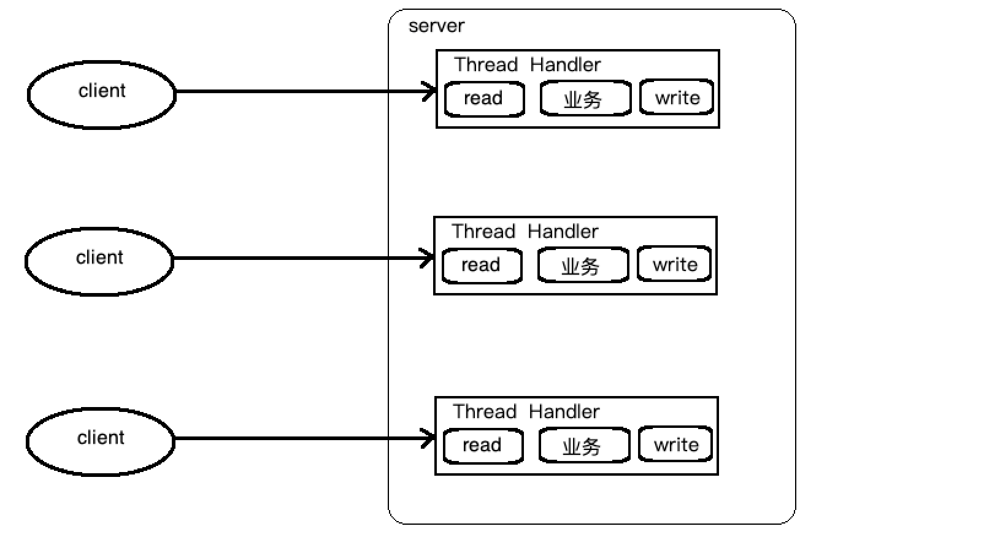
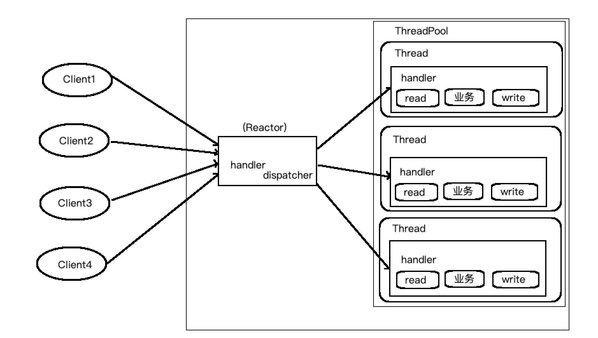
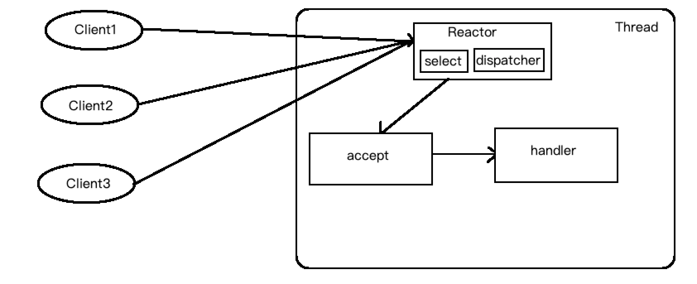
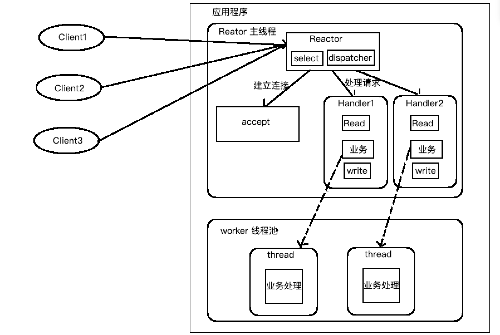
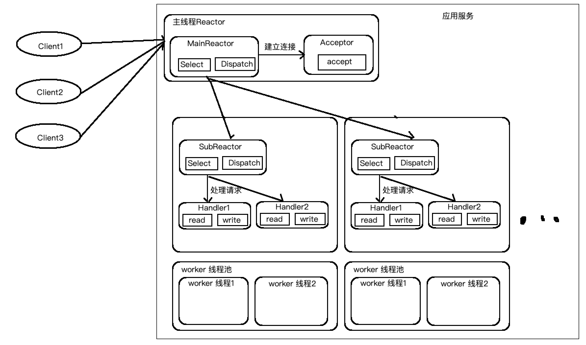
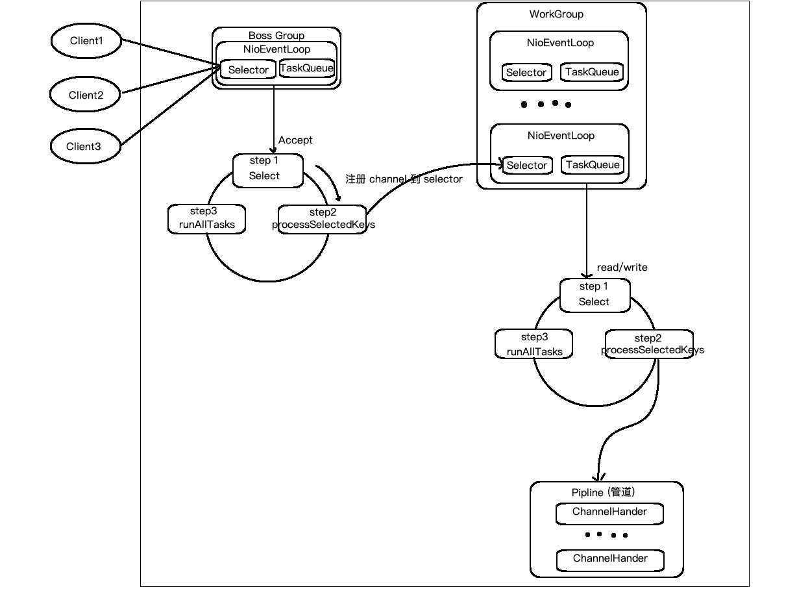

# Netty笔记


## Netty 概述

* 原生 NIO 存在的问题
  * NIO 的类库和 API 复杂, 使用麻烦, 需要掌握 `Selector`, `ServerSocketChannel`, `SocketChannel`, `Bytebuffer`等
  * 需要具备其它的额外技能, 要熟悉 JAVA 多线程编程, 因为 NIO 编程涉及到 Reactor 模式, 必须要对多线程和网络编程非常熟悉, 才能编写出高质量的 NIO 程序.
  * 开发工作量和难度非常大: 面对网络问题, 半包读写, 失败缓存等很难处理
  * JDK NIO 使用:难免会出现空轮训的问题, 处理不当可能 CPU 100%


* Netty 优点: Netty 对 JDK 自带的 NIO 进行了封装, 有效的解决了 NIO 的大部分问题
  * 设计优雅: 适合于各种传输类型的统一, API 阻塞和非阻塞 Socket; 基于灵活可扩展的时间模型, 可以清晰的分离关注点; 高度可定制化的线程模型, --单线程, 一个或多个线程池
  * 使用方便, 其他依赖低, JDK5 (Netty3.x)    JDK6(Netty4.x) 就足够了 
  * 高性能, 高吞吐量; 低延迟, 减少资源消耗; 最小化不必要的内存复制
  * 安全: 完整的 SSL/TLS 和 StartTLS 支持
  * 社区活跃


## 线程模型概述

### 传统 I/O 线程模型



服务端为每 一个客户端请求 单独开辟一条线成进行业务处理, 效率低, 资源消耗较大

### Reactor 线程模型

Reactor 可以分为三种: `单Reactor单线程`,  `单Reactor 多线程`, `主从Reactor模型(netty 基于此模型)`



I/O复用结合线程池, 就是 Reactor 模式设计思想,

* Reactor 模式, 通过一个或多个输入同事传递给服务处理器的模式(基于时间驱动)
* 服务器端程序处理传入的多个请求, 并将他们同步分派到响应的处理线程, 因此 Reactor 模式也叫 Dispatcher 模式
* Reactor 模式使用 I/O复用监听事件, 收到时间后, 分发给某个线程(进程), 这点就是网络服务器高并发处理关键

#### 单Reactor单线程



简单易用, 但并发量低, 不能充分利用 CPU, 容易发生阻塞等等问题

#### 单Reactor 多线程



* Reator 对象通过 select 监控客户端请求事件, 收到事件后, 通过 dispatch 进行分发
* 如果简历连接请求, 则用 accept 通过连接请求处理, 然后创建一个 Handler 对象进行后续事件
* 如果不是连接请求, 则由 Reactor 分发调用连接对应的 handler 来处理
* handler 只负责响应事件, 不做具体的业务处理, 通过该 read 读取数据后,会分发给后面的 worker 线程处理业务
* worker 线程池会分配独立线程完成真正的业务, 并将结果返回 handler
* handler 收到相应通过 write 返回 client

特点, 有效的提高执行效率, 加大并发量, 但是在接收部分还是单线程, 所以对于大并发量还是容易产生性能瓶颈

#### 主从 Reactor 多线程



* Reactor 主线程 MainReactor 对象通过 select 监听连接事件, 收到时间后,通过 Acceptor 处理连接事件
* 当 Acceptor 处理连接事件后, MainReactor 将连接分配给 SubReactor
* SubReactor将连接加入到连接队列进行监听, 并创建 Handler 进行各种事件处理
* 当有新事件发生时, subReactor 就会调用对应的 handler 处理
* handler 通过 read 读取数据, 分发给后面的 worker 线程处理
* work 线程池分配独立的 worker 线程进行业务处理, 并返回结果
* handler 收到相应的结果后, 在通过 send 将结果返回给 client
* Reactor 主线程可以对多个 Reactor 子线程, 及 MainReactor 可以对应多个 SubReactor


### Netty 模型



* Netty抽象出两个线程池: BossEventLoopGroup 专门负责接收客户端的连接; WorkerEventLoopGroup 专门负责网络的读写
* BossEventLoopGroup和 WorkerEventLoopGroup类型都是 NioEventLoopGroup
* NioEventLoopGroup 相当于一个事件的循环组, 这个组中含有多个事件循环, 每一个事件循环是 NioEventLoop
* NioEventLoop 表示一个不断循环的执行处理人物的线程, 每个 NioEventLoop 都有一个 selector, 用于监听绑定在其上的 socket 网络通讯
* NioEventLoop 可以有多个线程, 即可以含有多个 NioEventLoop
* 每个 BossNioEventLoop循环的步骤有三部
  * 轮训 accept 事件
  * 处理 accept 事件, 与 client 建立连接, 生成 NioSocketChannel, 并将其注册到某个 workerNioEventLoop 上的 selector
  * 处理任务队列的任务, 即 runAllTasks
* 每个 WorkerNioEventLoop 循环执行的步骤:
  * 轮训 read/write 事件
  * 处理 I/O 事件, 即 read,write 事件, 在对应的 NioSocketChannel 处理
  * 处理任务队列的任务, 即 runAllTasks
* 每个 workerNioEventLoop 处理业务时, 会使用 pipline(管道), pipeLine 中包含了 channel, 即通过 pipeLine 可以获取到对应的通道, 管道中维护了很多的处理器

#### 简单案例

```java
public class NettyServer {

    public static void main(String[] args) throws Exception {
        //bossGroup 只是处理连接请求 workGroup 会做业务处理
        //两个都有持有无限循环
        EventLoopGroup bossGroup = new NioEventLoopGroup();
        EventLoopGroup workGroup = new NioEventLoopGroup();

        try {
            //创建服务器端的启动对象
            ServerBootstrap serverBootstrap = new ServerBootstrap();
            //使用链式编程对启动对象进行设置
            serverBootstrap.group(bossGroup, workGroup)//绑定接收连接组和工作组
                    .channel(NioServerSocketChannel.class) //设置服务端通道使用 NioServerSocketChannel
                    .option(ChannelOption.SO_BACKLOG, 128)//设置线程队列得到连接个数
                    .childOption(ChannelOption.SO_KEEPALIVE, true) //设置保持活动连接状态
                    .childHandler(new ChannelInitializer<SocketChannel>() {
                        //给 pipeLine 设置处理器
                        @Override
                        protected void initChannel(SocketChannel socketChannel) throws Exception {
                            socketChannel.pipeline().addLast(new ServerHandler());
                        }
                    });// 给 workgroup 里的 eventloop对应的管道设置处理器

            //绑定一个端口并同步 返回一个 ChannelFuture 对象
            ChannelFuture channelFuture = serverBootstrap.bind(7000).sync();
            //监听关闭通道
            channelFuture.channel().closeFuture().sync();
        }finally {
            //优雅关闭
            workGroup.shutdownGracefully();
            bossGroup.shutdownGracefully();
        }

    }
}
```

```java
public class ServerHandler extends ChannelInboundHandlerAdapter {
    //读取客户端发送的数据
    //ChannelHandlerContext ctx 上下文对象, 这是一个复杂对象, 内部基本包括所有想要的东西
    //msg 客户端传递的内容,
    @Override
    public void channelRead(ChannelHandlerContext ctx, Object msg) throws Exception {
        //将 msg 强转为 ByteBuf   ByteBuf 是 netty 封装的, 性能优于 nio 的 ByteBuffer
        ByteBuf byteBuf = (ByteBuf) msg;
        System.out.println("客户端: "+byteBuf.toString(CharsetUtil.UTF_8));
    }

    //数据读取结束
    @Override
    public void channelReadComplete(ChannelHandlerContext ctx) throws Exception {
        //做信息返回给客户端
        ctx.writeAndFlush(Unpooled.copiedBuffer("hello...", CharsetUtil.UTF_8));
    }

    //捕获异常
    @Override
    public void exceptionCaught(ChannelHandlerContext ctx, Throwable cause) throws Exception {
        cause.printStackTrace();
    }
}
```

```java
public class NettyClient {
    public static void main(String[] args) throws Exception {
        EventLoopGroup workGroup = new NioEventLoopGroup();

        try {

            Bootstrap bootstrap = new Bootstrap();
            bootstrap.group(workGroup)
                    .channel(NioSocketChannel.class)
                    .handler(new ChannelInitializer<SocketChannel>() {

                        @Override
                        protected void initChannel(SocketChannel socketChannel) throws Exception {
                            socketChannel.pipeline().addLast(new ClientHandler());
                        }
                    });

            ChannelFuture channelFuture = bootstrap.connect("127.0.0.1", 7000).sync();

            channelFuture.channel().closeFuture().sync();
        }finally {
            workGroup.shutdownGracefully();
        }


    }
}
```

```java
public class ClientHandler extends ChannelInboundHandlerAdapter {


    @Override
    public void channelActive(ChannelHandlerContext ctx) throws Exception {
        ctx.writeAndFlush(Unpooled.copiedBuffer("hello, I'm client ", CharsetUtil.UTF_8));
    }

    @Override
    public void channelRead(ChannelHandlerContext ctx, Object msg) throws Exception {
        ByteBuf byteBuf = (ByteBuf) msg;
        System.out.println("服务端: "+byteBuf.toString(CharsetUtil.UTF_8));
    }

    @Override
    public void exceptionCaught(ChannelHandlerContext ctx, Throwable cause) throws Exception {
        cause.printStackTrace();
    }
}
```

EventLoopGroup 默认创建自身所创建的线程数是`当前系统内核数*2`

#### 自定义 taskQueue

netty业务中如果有耗时任务, 影响到后续业务的执行, 可以将该耗时任务加到 taskQueue 中异步执行, taskQueue 在一个新的线程中执行任务, 可以增加多个任务, 但多个任务是同步执行,

taskQueue有两种: TaskQueue和 ScheduleTaskQueue

`TaskQueue`

```java
ctx.channel().eventLoop().execute(new Runnable(){
  	@Override
  	public void run(){
      sleep(10*1000);
      System.out.println("........");
    }
})
```

`ScheduleTaskQueue`

```java
ctx.channel().eventLoop().schedule(new Runnable(){
  	@Override
  	public void run(){
      sleep(10*1000);
      System.out.println("........");
    }
}, 10, TimeUnit.SECONDS)
```


#### 总结

* Netty 抽象出两个`线程池`, BossGroup 专门负责客户端的连接, WorkGroup 专门负责网络读写操作
* NioEventLoop 表示一个不断循环执行处理任务的线程, 每个 NioEventLoop 都有一个 Selector, 用于监听绑定在其上的 socket 网络通道
* NioEventLoop 内部采用串行化设计, 从消息的读取->解码->处理->编码->发送, 始终有 I/O线程 NioEventLoop 负责
  * NioEventLoopGroup 下包含多个 NioEventLoop
  * 每个 NioEventLoop 中包含一个 Selector, 一个 TaskQueue
  * 每个 NioEventLoop 的 Selector 上可以注册监听多个 NioChannel
  * 每个 NioChannel 只会绑定唯一的 NioEventLoop 上
  * 每个 NioChannel 都绑定有一个自己的 ChannelPipeLine


### 异步模型

* Netty 中的 I/O操作是异步的, 包括 Bind, write, connect 等操作会简单的返回一个 ChannelFuture.
* 调用者并不能立刻获得结果, 而是通过 Future-listener 机制, 用户可以方便的主动获取或者通过通知获得 IO操作结果
* Netty 的异步模型时简历在 future 和 callback 的之上的. 重点说 Future, 他的核心思想是: 假设一个方法 fun, 计算过程可能非常耗时, 等待 fun 返回显然不合适, 那么可以在调用 fun 的时候, 立马返回一个 Future, 后续可以通过 Future 去监控方法 fun 的处理过程(即: Future-Listener 机制)

#### Future-Listener机制

* 当 Future 对象刚刚创建时, 处于非完成状态, 调用者可以通过返回的 ChannelFuture 来获取操作执行的状态, 注册监听函数来执行完成后的操作

* 常见有如下操作

  * 通过 isDone 方法来判断当前操作是否完成
  * 通过 isSuccess 方法来判断完成的当前操作是否成功
  * 通过 getCause 方法来获取完成的当前操作失败的原因
  * 通过 isCannelled 方法来判断已完成的当前操作是否被取消
  * 通过 addListener 方法来注册监听器, 当操作已完成(isDone 方法返回完成, 将会通知指定的监听器); 付过 Future 对象已完成, 则通知指定的监听器

  ```java
  	//绑定一个端口并同步 返回一个 ChannelFuture 对象
              ChannelFuture channelFuture = serverBootstrap.bind(7000).sync();
              //添加异步事件监听
              channelFuture.addListener(new GenericFutureListener<Future<? super Void>>() {
                  @Override
                  public void operationComplete(Future<? super Void> future) throws Exception {
                      if (future.isSuccess()){
  
                      }
                      if (future.isDone()){
  
                      }
  
                  }
              });
  ```

### Netty聊天室

* server

  ```java
  public class ChatServer {
  
      private final int PORT = 7000;
  
      public void run() throws Exception{
          EventLoopGroup bossGroup = new NioEventLoopGroup(1);
          EventLoopGroup workGroup = new NioEventLoopGroup();
  
          try {
              ServerBootstrap serverBootstrap = new ServerBootstrap();
              serverBootstrap.group(bossGroup, workGroup)
                      .channel(NioServerSocketChannel.class)
                      .option(ChannelOption.SO_BACKLOG, 128)
                      .childOption(ChannelOption.SO_KEEPALIVE, true)
                      .childHandler(new MyChatServerInitializer());
  
              ChannelFuture channelFuture = serverBootstrap.bind(PORT).sync();
  
              System.out.println("ChatServer Ready ...");
              channelFuture.channel().closeFuture().sync();
  
  
          }finally {
              workGroup.shutdownGracefully();
              bossGroup.shutdownGracefully();
          }
      }
  
      public static void main(String[] args) throws Exception {
          new ChatServer().run();
      }
  }
  ```

  ```java
  public class MyChatServerInitializer extends ChannelInitializer {
      @Override
      protected void initChannel(Channel channel) throws Exception {
          ChannelPipeline pipeline = channel.pipeline();
  
          pipeline.addLast("decoder", new StringDecoder());
          pipeline.addLast("encoder", new StringEncoder());
          pipeline.addLast(new MyChatServerHandler());
      }
  }
  ```

  ```java
  public class MyChatServerHandler extends SimpleChannelInboundHandler<String> {
      private static ChannelGroup channels = new DefaultChannelGroup(GlobalEventExecutor.INSTANCE);
  
      @Override
      public void handlerAdded(ChannelHandlerContext ctx) throws Exception {
          Channel channel = ctx.channel();
          channels.add(channel);
  
          String address = channel.remoteAddress().toString();
          System.out.println(address+"进入群聊...");
      }
  
      @Override
      public void handlerRemoved(ChannelHandlerContext ctx) throws Exception {
          Channel channel = ctx.channel();
          channels.remove(channel);
  
          String address = channel.remoteAddress().toString();
          System.out.println(address+"离开群聊...");
      }
  
      @Override
      public void channelActive(ChannelHandlerContext ctx) throws Exception {
          Channel channel = ctx.channel();
  
          String address = channel.remoteAddress().toString();
          System.out.println(address+"上线...");
      }
  
      @Override
      public void channelInactive(ChannelHandlerContext ctx) throws Exception {
          Channel channel = ctx.channel();
  
          String address = channel.remoteAddress().toString();
          System.out.println(address+"下线...");
      }
  
      @Override
      protected void channelRead0(ChannelHandlerContext ctx, String msg) throws Exception {
          Channel channel = ctx.channel();
          String address = channel.remoteAddress().toString();
          System.out.println("[客户端 "+address+"]: "+ msg);
  
          channels.forEach(ch->{
              if (ch == channel){
                  channel.writeAndFlush("[自己]: "+msg+"\n");
              }else {
                  ch.writeAndFlush("["+address+"]: "+ msg+"\n");
              }
          });
      }
  
      @Override
      public void exceptionCaught(ChannelHandlerContext ctx, Throwable cause) throws Exception {
          cause.printStackTrace();
      }
  }
  ```

  

* client

  ```java
  public class ChatClient {
  
      private final String HOST = "127.0.0.1";
      private final int PORT = 7000;
  
      public void connect() throws Exception{
  
          EventLoopGroup workGroup = new NioEventLoopGroup();
          try {
              Bootstrap bootstrap = new Bootstrap();
              bootstrap.group(workGroup)
                      .channel(NioSocketChannel.class)
                      .handler(new MyChatClientInitializer());
  
              ChannelFuture channelFuture = bootstrap.connect(HOST, PORT).sync();
              Channel channel = channelFuture.channel();
  
              System.out.println(channel.localAddress()+" ready ...");
              System.out.println();
  
              Scanner scanner = new Scanner(System.in);
              while (scanner.hasNext()){
                  String content = scanner.nextLine();
                  channel.writeAndFlush(content);
  
              }
  
  
          }finally {
              workGroup.shutdownGracefully();
          }
      }
  
  
      public static void main(String[] args) throws Exception {
          new ChatClient().connect();
      }
  }
  ```

  ```java
  public class MyChatClientInitializer extends ChannelInitializer {
      @Override
      protected void initChannel(Channel channel) throws Exception {
          ChannelPipeline pipeline = channel.pipeline();
          pipeline.addLast("decoder", new StringDecoder());
          pipeline.addLast("encoder", new StringEncoder());
  
          pipeline.addLast(new MychatClientHandler());
      }
  }
  ```

  ```java
  public class MychatClientHandler extends SimpleChannelInboundHandler<String> {
  
      @Override
      protected void channelRead0(ChannelHandlerContext ctx, String msg) throws Exception {
          System.out.println(msg);
      }
  }
  ```

### 心跳检测处理

```java
public class Server {
    public static void main(String[] args) throws Exception {
        EventLoopGroup bossGroup = new NioEventLoopGroup(1);
        EventLoopGroup workGroup = new NioEventLoopGroup();

        try {
            ServerBootstrap serverBootstrap = new ServerBootstrap();
            serverBootstrap.group(bossGroup, workGroup)
                    .channel(NioServerSocketChannel.class)
                    .option(ChannelOption.SO_BACKLOG, 128)
                    .childOption(ChannelOption.SO_KEEPALIVE, true)
                    .handler(new LoggingHandler(LogLevel.INFO))
                    .childHandler(new ChannelInitializer<SocketChannel>() {
                        @Override
                        protected void initChannel(SocketChannel socketChannel) throws Exception {
                            ChannelPipeline pipeline = socketChannel.pipeline();
                            pipeline.addLast(new IdleStateHandler(2, 3, 5, TimeUnit.SECONDS));

                            pipeline.addLast(new MyIdleHandler());
                        }
                    });

            ChannelFuture channelFuture = serverBootstrap.bind(7000).sync();

            channelFuture.channel().closeFuture().sync();

        }finally {
            workGroup.shutdownGracefully();
            bossGroup.shutdownGracefully();
        }
    }
}
```

```java
public class MyIdleHandler extends ChannelInboundHandlerAdapter {
    @Override
    public void userEventTriggered(ChannelHandlerContext ctx, Object evt) throws Exception {
        IdleStateEvent event = (IdleStateEvent) evt;

        switch (event.state()){
            case READER_IDLE:
                System.out.println("读空闲");
                break;
            case WRITER_IDLE:
                System.out.println("写空闲");
                break;
            case ALL_IDLE:
                System.out.println("读写空闲");
                break;
        }

        System.out.println("做相应处理...");
    }
}
```

```java
public class Client {
    public static void main(String[] args)throws Exception {
        EventLoopGroup workGroup = new NioEventLoopGroup();

        try {
            Bootstrap bootstrap = new Bootstrap();
            bootstrap.group(workGroup)
                    .channel(NioSocketChannel.class)
                    .handler(new ChannelInitializer<SocketChannel>() {
                        @Override
                        protected void initChannel(SocketChannel socketChannel) throws Exception {

                        }
                    });
            ChannelFuture channelFuture = bootstrap.connect("127.0.0.1", 7000).sync();

            channelFuture.channel().closeFuture().sync();
        }finally {
            workGroup.shutdownGracefully();
        }
    }
}
```


### Http升级为 WebSocket 长连接

```java
public class WebSocketServer {

    public static void main(String[] args) throws Exception {
        EventLoopGroup bossGroup  = new NioEventLoopGroup(1);
        EventLoopGroup workGroup = new NioEventLoopGroup();

        try {

            ServerBootstrap serverBootstrap = new ServerBootstrap()
                    .group(bossGroup, workGroup)
                    .channel(NioServerSocketChannel.class)
                    .option(ChannelOption.SO_BACKLOG, 128)
                    .childOption(ChannelOption.SO_KEEPALIVE, true)
                    .handler(new LoggingHandler(LogLevel.INFO))
                    .childHandler(new MyWebSocketChannelInitializer());

            ChannelFuture channelFuture = serverBootstrap.bind(7000).sync();
            channelFuture.channel().closeFuture().sync();

        }finally {
            workGroup.shutdownGracefully();
            bossGroup.shutdownGracefully();
        }
    }
}
```

```java
public class MyWebSocketChannelInitializer extends ChannelInitializer {
    @Override
    protected void initChannel(Channel channel) throws Exception {
        ChannelPipeline pipeline = channel.pipeline();
        //因为基于 http协议, 所以需要 http 的编解码器
        pipeline.addLast(new HttpServerCodec());
        //是以块方式写, 所以增加ChunkedWriteHandler处理器
        pipeline.addLast(new ChunkedWriteHandler());

        //因为 http 在传输过程中是分段的, HttpObjectAggregator可以将多个段聚合,
        // 这就是为什么当 浏览器发生大量请求是会出现多次 http 请求
        //聚合 http 请求
        pipeline.addLast(new HttpObjectAggregator(8192));

        /*
            1. 对于 webSocket, 它的数据是以帧(frame)形式传递的
            2. webSocketFrame有六个实现类
            3. 浏览器请求时发送  ws://localhost:7000/hello
            4. WebSocketServerProtocolHandler的核心是将 http协议升级为 webSocket, 保持长连接
        */
        //将 http协议 升级为 webSocket 协议
        pipeline.addLast(new WebSocketServerProtocolHandler("/hello"));

        //增加自定义处理器处理业务
        pipeline.addLast(new MyWebSocketHandler());

    }
}
```

```java
public class MyWebSocketHandler extends SimpleChannelInboundHandler<TextWebSocketFrame> {

    @Override
    protected void channelRead0(ChannelHandlerContext ctx, TextWebSocketFrame msgFrame) throws Exception {
        Channel channel = ctx.channel();
        String address = channel.remoteAddress().toString();
        String content = msgFrame.text();
        System.out.println(address+": "+content);


        channel.writeAndFlush(new TextWebSocketFrame("服务器: "+ content));
    }


    @Override
    public void handlerAdded(ChannelHandlerContext ctx) throws Exception {
        Channel channel = ctx.channel();
        System.out.println(channel.id().asLongText());
        System.out.println(channel.id().asShortText());
        String address = channel.remoteAddress().toString();
        System.out.println(address+" 开启连接...");
    }

    @Override
    public void handlerRemoved(ChannelHandlerContext ctx) throws Exception {
        Channel channel = ctx.channel();
        String address = channel.remoteAddress().toString();
        System.out.println(address+" 断开连接...");
    }

    @Override
    public void exceptionCaught(ChannelHandlerContext ctx, Throwable cause) throws Exception {
        cause.printStackTrace();
    }
}
```

```html
<!DOCTYPE html> <html lang="en">
<head>
    <meta charset="UTF-8">
    <title>Title</title>
</head>
<body>
    <script>
        var socket; //判断当前浏览器是否支持websocket
        if(window.WebSocket) {
        //go on
        socket = new WebSocket("ws://localhost:7000/hello");
        //相当于 channelReado, ev 收到服务器端回送的消息
            socket.onmessage = function (ev) {
            var rt = document.getElementById("responseText");
            rt.value = rt.value + "\n" + ev.data; }
        //相当于连接开启(感知到连接开启)
            socket.onopen = function (ev) {
                var rt = document.getElementById("responseText"); rt.value = "连接开启了.."
            }
        //相当于连接关闭(感知到连接关闭)
            socket.onclose = function (ev) {
            var rt = document.getElementById("responseText");
            rt.value = rt.value + "\n" + "连接关闭了.."
            }
        } else {
            alert("当前浏览器不支持 websocket")
        }
        //发送消息到服务器
        function send(message) {
            if(!window.socket) {
                //先判断 socket 是否创建好
                return;
            }
            if(socket.readyState == WebSocket.OPEN) {
                //通过 socket 发送消息
                socket.send(message)
            } else {
                alert("连接没有开启");
            }

        }
    </script>
        <form onsubmit="return false">
            <textarea name="message" style="height: 300px; width: 300px"></textarea>
            <input type="button" value="发生消息" onclick="send(this.form.message.value)">
            <textarea id="responseText" style="height: 300px; width: 300px"></textarea>
            <input type="button" value="清空内容" onclick="document.getElementById('responseText').value=''">
    </form>
</body>
</html>
```


