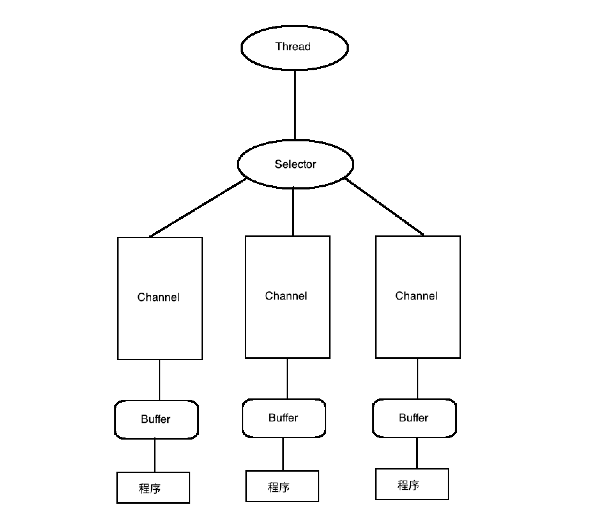
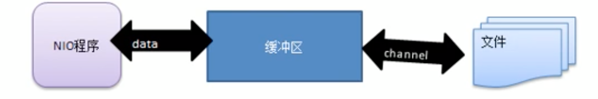
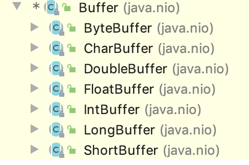
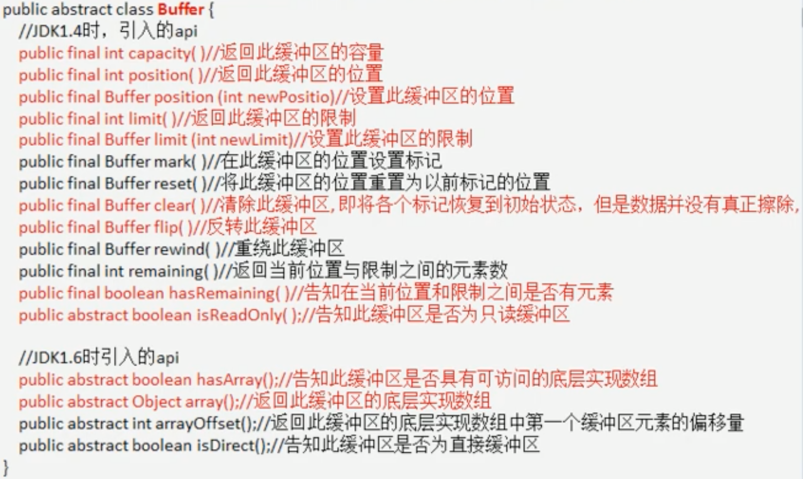
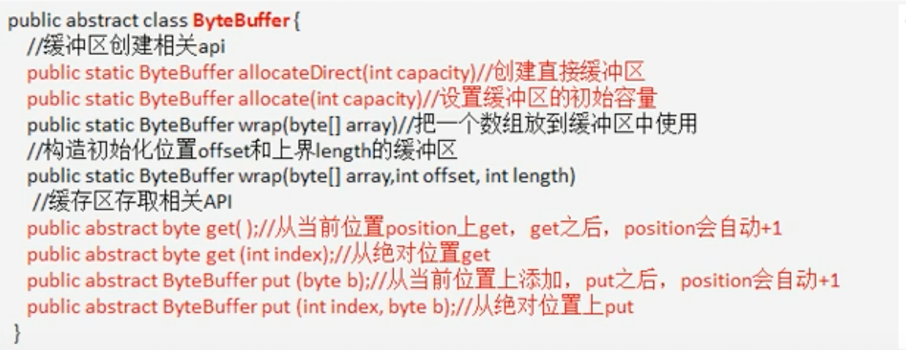
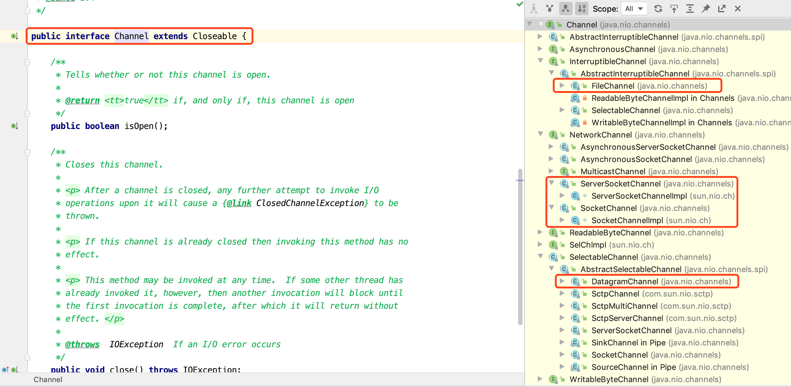
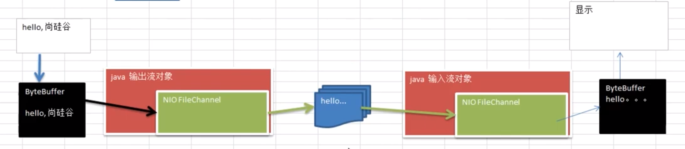

# NIO笔记

### NIO 

* NIO 有三大核心部分: Channel(通道), Buffer(缓冲区), Selector(选择器)

* NIO 是面向 `缓冲区` , 或者面向 `块` 编程的

* Java NIO的非阻塞模式, 是一个线程从某通道发送请求或者读取数据, 但是它仅能得到目前可用的数据, 如果目前没有数据可用时, 就什么都不会获取, 而不是保持线程阻塞, 所以直至数据变的可以读取之前, 该线程可以继续做其他的事情. 非阻塞写也是如此, 一个线程请求写入一些数据到某通道, 但不需要等待他完全写入, 这个线程同时可以去做别的事情.

* Selector, Channel 和 Buffer 的关系图

  * 每个 channel 都会对应一个 Buffer
  * Selector 对应一个线程, 一个线程对应多个 channel
  * 该图反映了有三个 channel 注册到该 selector
  * 程序切换到哪个 channel 是由事件决定的, Event 是一个重要的概念
  * Selector 会根据不同的时间, 在各个通道上切换
  * Buffer 就是一个内存块, 底层是由一个数组
  * 数据的读取写入是通过 Buffer,这个和 BIO, BIO 重要么是输入流, 或者是输出流, 不能双向, 但是 NIO 的 Buffer 是可以读也可以写, 需要 flip 方法切换
  * channel 是双向的, 可以返回底层操作系统的情况, 比如 Linux底层的操作系统通道就是双向的

  


### 缓冲区(Buffer)

* 缓冲区(Buffer): 缓冲区本质上是一个可以读写数据的内存块, 可以理解成是一个`容器对象(含数组)`, 该对象提供了`一组方法`, 可以更轻松的使用内存块, 缓冲区对象内置了一些机制, 能够给跟踪和记录缓冲区的状态变化情况. Channel 提供从文件. 网络读取数据的渠道, 但是读取或写入的数据必须经由 Buffer

  

* Buffer 类及其子类

  

* Buffer 重要属性和方法

  | 属性     | 描述                                                         |
  | -------- | ------------------------------------------------------------ |
  | capacity | 容量. 即可以容纳的最大数量,在缓冲区创建时指定, 并且不能修改  |
  | limit    | 表示缓冲区的当前终点, 不能对缓冲区超过极限的位置进行读写操作,且极限是可以修改的 |
  | position | 位置,下一个要被读或写的元素索引, 每次读写都会改变位置, 未下次做准备 |
  | mark     | 标记                                                         |

  

* 最常用的ByteBuffer

  

### 通道(Channel)

* 基本介绍
  
* BIO 中的 stream 是单向的, 例如 FileInputStream 对象只能进行读取数据的操作, 而 NIO 中的通道(Channel)是双向的, 可以读操作, 也可以写操作
  
* 类继承图

  

* FileChannel 测试写入本地文件

  ```java
  public class ChannelTest1 {
      public static void main(String[] args) throws IOException {
          String str = "hello, Artistic Life";
  
          FileOutputStream fileOutputStream =
                  new FileOutputStream("/Users/zhangchenzhao/Desktop/channnel1.txt");
  
          FileChannel fileChannel = fileOutputStream.getChannel();
  
          ByteBuffer byteBuffer = ByteBuffer.allocate(1024);
  
          byteBuffer.put(str.getBytes());
  
          byteBuffer.flip();
  
          fileChannel.write(byteBuffer);
          fileOutputStream.close();
      }
  }
  ```

* FileChannel测试读取本地文件内容

  ```java
  public class ChannelTest2 {
      public static void main(String[] args) throws IOException {
          File file = new File("/Users/zhangchenzhao/Desktop/channnel1.txt");
  
          FileInputStream fileInputStream = new FileInputStream(file);
  
          FileChannel fileChannel = fileInputStream.getChannel();
  
          ByteBuffer byteBuffer = ByteBuffer.allocate((int) file.length());
  
          fileChannel.read(byteBuffer);
  
          System.out.println(new String(byteBuffer.array()));
      }
  }
  ```

  

* FileChannel 测试读取文件内容到另外一个文件

  ```java
  public class ChannelTest3 {
      public static void main(String[] args) throws IOException {
          File file = new File("/Users/zhangchenzhao/Desktop/channnel2.txt");
  
          FileInputStream fileInputStream
                   = new FileInputStream(file);
          FileOutputStream fileOutputStream
                  = new FileOutputStream("/Users/zhangchenzhao/Desktop/channnel3.txt");
  
  
          FileChannel inFileChannel = fileInputStream.getChannel();
          FileChannel outFIleCHannel = fileOutputStream.getChannel();
  
          ByteBuffer byteBuffer = ByteBuffer.allocate(10);
  
          while (true){
              byteBuffer.clear();
              int read = inFileChannel.read(byteBuffer);
              System.out.println(read);
              if (read == -1){
                  break;
              }
              byteBuffer.flip();
              outFIleCHannel.write(byteBuffer);
          }
  
          fileInputStream.close();
          fileOutputStream.close();
  
      }
  }
  ```

  

* FileChannel管道直接拷贝文件

  ```java
  public class ChannelTest4 {
      public static void main(String[] args) throws IOException {
          FileInputStream fileInputStream
                  = new FileInputStream("/Users/zhangchenzhao/Desktop/channnel3.txt");
          FileOutputStream fileOutputStream
                  = new FileOutputStream("/Users/zhangchenzhao/Desktop/channnel4.txt");
  
          FileChannel fileChannel1 = fileInputStream.getChannel();
          FileChannel fileChannel2 = fileOutputStream.getChannel();
          fileChannel1.transferTo(0, fileChannel1.size(), fileChannel2);
  //        fileChannel2.transferFrom(fileChannel1, 0, fileChannel1.size());
  
  
          fileInputStream.close();
          fileOutputStream.close();
      }
  }
  ```

* MappedByteBuffer 修改文件内容

  ```java
  /**
   * MappedByteBuffer 可以直接在内存中修改文件(堆外内存), 操作系统不需要拷贝一次 
   * */
  public class MappedByteBufferTest {
      public static void main(String[] args) throws IOException {
          RandomAccessFile file
                  = new RandomAccessFile("/Users/zhangchenzhao/Desktop/channnel4.txt", "rw");
  
          FileChannel fileChannel = file.getChannel();
  
          /**
           * 参数 1: ileChannel.MapMode.READ_WRITE 使用的读写模式
           * 参数 2: 0  可以直接修改的其实位置
           * 参数 3: 5  是映射到内存的大小(不是索引位置), 即channnel4.txt的多少个字节映射到内存(堆外内存)
           * 可以修改的范围是 0-4
           * 实际类型 DirectByteBuffer
           * */
          MappedByteBuffer mappedByteBuffer
                  = fileChannel.map(FileChannel.MapMode.READ_WRITE, 0, 5);
  
          mappedByteBuffer.put(1, (byte) 'H');
          mappedByteBuffer.put(3, (byte) '9');
          mappedByteBuffer.put(5, (byte) 's');//IndexOutOfBoundsException
  
          file.close();
  
      }
  ```

  

* Scattering 和 Gathering buffer 数组操作

  ```java
  /**
   * Scattering: 将数据写入到 buffer 时, 可以采用 buffer 数组, 依次写入
   * Gathering: 从 buffer 读取数据是, 可以采用 buffer 数组, 依次读取
   * */
  public class ScatteringAndGatheringBufferTest {
      public static void main(String[] args) throws IOException {
  
          //使用 ServerSocketChannel 和 SockerChannel 网络
          ServerSocketChannel serverSocketChannel = ServerSocketChannel.open();
          InetSocketAddress inetSocketAddress = new InetSocketAddress(7000);
          //绑定端口到 socket, 并启动
          serverSocketChannel.socket().bind(inetSocketAddress);
          //等待客户端连接
          SocketChannel socketChannel = serverSocketChannel.accept();
  
          //创建 buffer 数组
          ByteBuffer[] byteBuffers = new ByteBuffer[2];
          byteBuffers[0] = ByteBuffer.allocate(5);
          byteBuffers[1] = ByteBuffer.allocate(3);
  
  
          int bufferLength = 8;
          while (true){
              int readLength = 0;
              while (readLength < bufferLength){
                  long l = socketChannel.read(byteBuffers);
                  readLength += l;
                  System.out.println("readLength: "+ readLength);
                  Arrays.asList(byteBuffers).stream()
                          .map(buffer-> "position:"+ buffer.position()+", limit:"+buffer.limit())
                          .forEach(System.out::println);
              }
              Arrays.asList(byteBuffers).stream().forEach(byteBuffer -> byteBuffer.flip());
  
              int writeLength = 0;
              while (writeLength < bufferLength){
                  long l = socketChannel.write(byteBuffers);
                  writeLength += l;
                  System.out.println(writeLength);
              }
  
              Arrays.asList(byteBuffers).forEach(buffer-> buffer.clear());
  
              System.out.println("readLength:"+ readLength+" , writeLength:"+ writeLength + " , bufferLength:"+ bufferLength);
  
          }
      }
  }
  ```

  

* FileChannel 常用方法

  ```java
  public abstract int read(ByteBuffer dst) throws IOException;
  public abstract int write(ByteBuffer src) throws IOException;
  public abstract long transferFrom(ReadableByteChannel src,
                                        long position, long count)
  public abstract long transferTo(long position, long count,
                                      WritableByteChannel target) throws IOException;
  ```

  

* 


