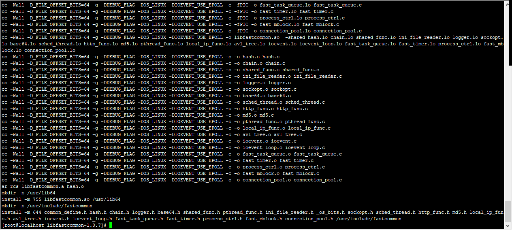
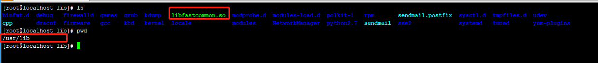
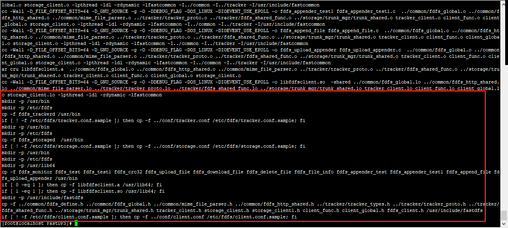
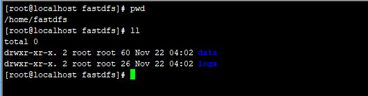
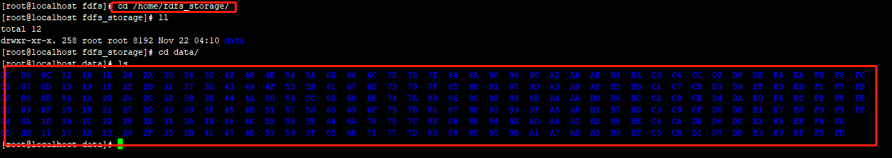
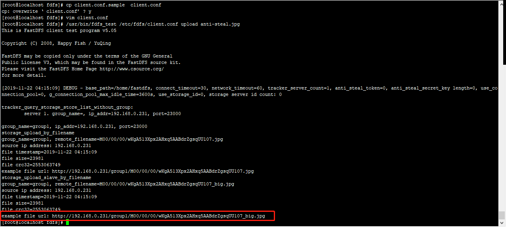
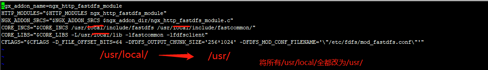
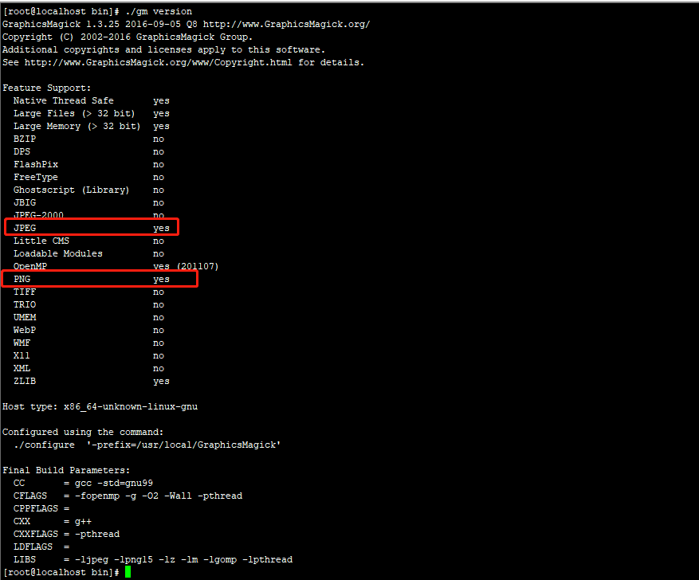
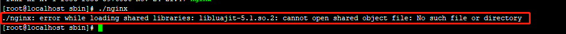
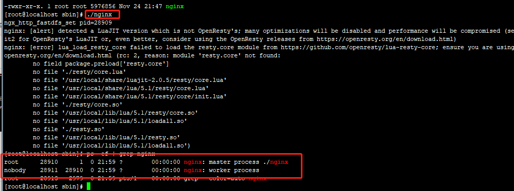

# nginx+fastDFS+lua+graphicMagick部署

## 准备


## 安装

1. 安装FastDFS

   * 安装依赖

     ```shell
     $ yum install -y gcc gcc-c++ libevent
     ```

   * 安装libfastcommon

     ```shell
     $ tar -zxvf libfastcommonV1.0.7.gz -C /usr/local/
     $ cd /usr/local/libfastcommon-1.0.7
     $ ./make
     $ ./make install
     ```

     

     * libfastcommon安装好后会在/usr/lib64 目录下生成  libfastcommon.so 库文件；拷贝到/usr/lib/下

     ```shell
     $ cp /usr/lib64/libfastcommon.so /usr/lib/
     ```

     

   * 安装tracker

     ```shell
     $ tar -zxvf FastDFS_v5.05.tar.gz -C /usr/local/
     $ cd /usr/local/FastDFS/
     $ ./make.sh
     $ ./make.sh install
     ```

     

     * 安装成功将安装目录下的conf下的文件拷贝到/etc/fdfs/下

       ```shell
       $ cp /usr/local/FastDFS/conf/* /etc/fdfs/
       $ cd /etc/fdfs
       ```

     * 配置启动tracker

       ```shell
       $ cp tracker.conf.sample tracker.conf
       $ vim tracker.conf
       ```

       修改配置

       ```shell
       base_path=/home/fastdfs
       http.server_port=80
       ```

       创建fastdfs文件夹

       ```shell
       $ cd /home
       $ mkdir fastdfs
       ```

       启动tracker

       ```shell
       $ /usr/bin/fdfs_trackerd /etc/fdfs/tracker.conf restart
       ```

       *注意：在/home/fastdfs/ 目录下生成两个目录， 一个是数据，一个是日志；*

       

   * 配置启动storage

     ```shell
     $ cd /etc/fdfs
     $ cp storage.conf.sample storage.conf
     ```

     修改storage.conf

     ```shell
     $ vim storage.conf
     ```

     ```shell
     base_path=/home/fastdfs
     store_path0=/home/fdfs_storage
     tracker_server=192.168.0.231:22122
     http.server_port=88
     ```

     创建/home/fdfs_storage

     ```shell
     $ mkdir /home/fdfs_storage
     ```

     启动storage

     ```shell
     /usr/bin/fdfs_storaged /etc/fdfs/storage.conf restart
     ```

     

     

   * 使用fastDFS自带工具测试

     ```shell
     $ cd /etc/fdfs/
     $ cp client.conf.sample client.conf
     $ vim client.conf
     ```

     ```shell
     base_path=/home/fastdfs
     tracker_server=192.168.0.231:22122
     ```

     ```shell
     $ /usr/bin/fdfs_test /etc/fdfs/client.conf upload anti-steal.jpg
     ```

     

2. 安装 fastdfs-nginx-module 整合fastDFS 与Nginx

   * 配置

     ```shell
     $ tar -zxvf fastdfs-nginx-module_v1.16.tar.gz -C /usr/local/
     $ cd /usr/local/fastdfs-nginx-module/src
     $ vim config
     ```

     

     * 将fastdfs-nginx-module/src下的mod_fastdfs.conf拷贝至/etc/fdfs/下

       ```shell
       $ cp mod_fastdfs.conf /etc/fdfs/
       $ cd /etc/fdfs/
       $ vim mod_fastdfs
       ```

       ```shell
       base_path=/home/fastdfs
       tracker_server=192.168.0.231:22122 
       #tracker_server=192.168.0.231:22122 #(多个tracker配置多行)
       url_have_group_name=true        #url中包含group名称
       store_path0=/home/fdfs_storage  #指定文件存储路径（上面配置的store路径）
       ```

       ```shell
       $ cp /usr/lib64/libfdfsclient.so /usr/lib/
       ```

       **最后和lua模块一起整合nginx**
   
       

3. 安装lua 环境

   ```shell
   $ tar -zxvf LuaJIT-2.0.5.tar.gz -C /usr/local/
   $ cd /usr/local/LuaJIT-2.0.5
   $ make && make install
   ```

   * 配置环境变量

     ```shell
     export LUAJIT_LIB=/usr/local/lib 
     export LUAJIT_INC=/usr/local/include/luajit-2.0
     ```

   

4. 安装GraphicsMagick

   ```shell
   $ tar -zxvf GraphicsMagick-1.3.25.tar.gz -C /usr/local/
   $ cd /usr/local/GraphicsMagick-1.3.25
   ```

   * 安装jpeg png支持

     ```shell
     $ yum install -y libpng-devel libpng libjpeg-devel libjpeg
     ```

     

   * 配置编译GraphicsMagick

     ```shell
     $ ./configure -prefix=/usr/local/GraphicsMagick
     $ make && make install
     ```

     ```shell
     $ cd /usr/local/GraphicsMagick
     $ bin/gm version
     ```

     

   * 

5. 解压lua-nginx 模块

   ```shell
   $ tar -zxvf lua-nginx-module-0.10.15.tar.gz -C /usr/local/
   $ tar -zxvf ngx_devel_kit-0.2.18.tar.gz -C /usr/local/
   ```

   

6. 安装nginx并与其它模块整合

   ```shell
   $ yum install -y pcre pcre-devel zlib zlib-devel openssl openssl-devel
   $ tar -zxvf nginx-1.12.2.tar.gz -C /usr/local/
   $ ./configure --add-module=/usr/local/ngx_devel_kit-0.2.18/ --add-module=/usr/local/fastdfs-nginx-module/src/ --add-module=/usr/local/lua-nginx-module-0.10.15/
   $ make && make install
   ```

   ```shell
   $ cd /usr/local/FastDFS/conf
   $ cp http.conf mime.types /etc/fdfs/
   ```

   * 修改nginx配置文件

     ```shell
     pid     /usr/local/nginx/logs/nginx.pid;
         server {
             listen       80;
             server_name  192.168.0.231;
             
             location /group1/M00 {
                     root /home/fdfs_storage/data;
                     ngx_fastdfs_module;
             }
         }
     ```

   * 启动nginx

     ```shell
     $ cd /usr/local/nginx/sbin
     $ ./nginx
     ```

     

   * 处理异常再次启动

     ```shell
     cat /etc/ld.so.conf
     include ld.so.conf.d/*.conf
     echo "/usr/local/lib" >> /etc/ld.so.conf
     ldconfig
     ```

     ```shell
     $ cd /usr/local/nginx/sbin
     $ ./nginx
     ```

     

   安装完成

关闭防火墙

```shell
$ systemctl stop firewalld
$ systemctl disable firewalld
```

浏览器测试


## lua脚本配置

<https://www.jianshu.com/p/d7dab45a6a7d>

<http://192.168.0.231/group1/M00/00/00/wKgA513bRLSAazosAABdrZgsqUU785_big.jpg>