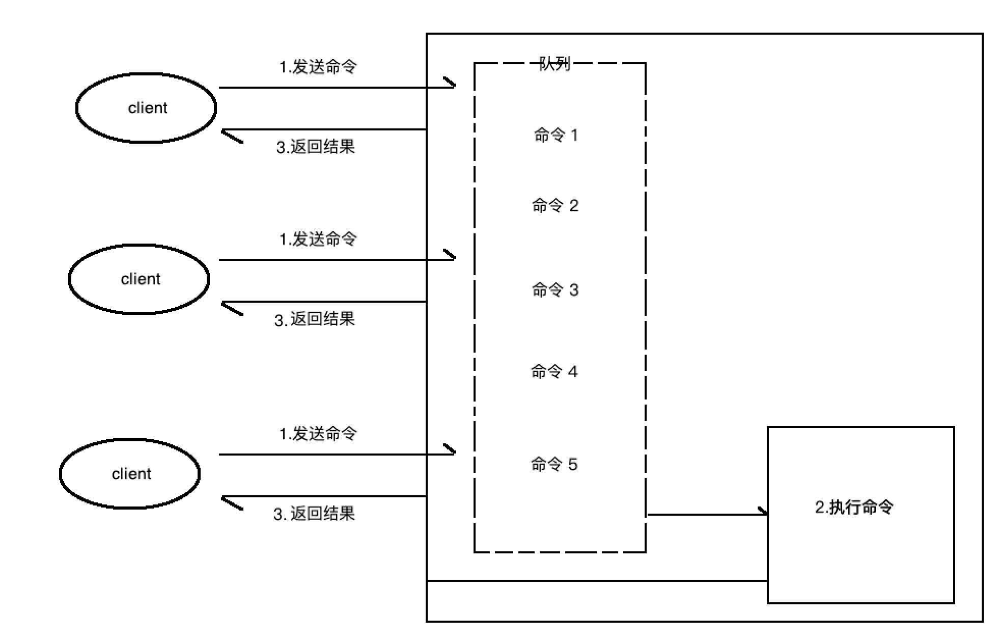
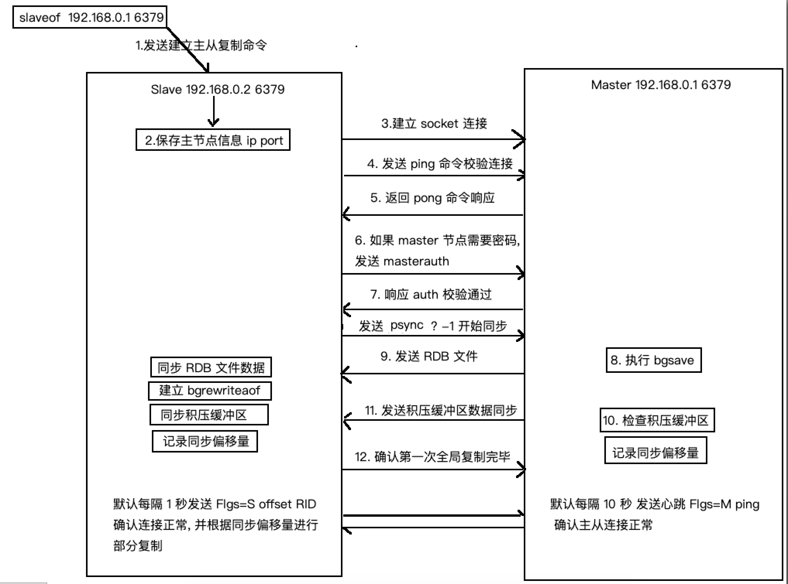

# Redis笔记

## 功能概述

redis 是以键值对形式将数据存储在内存中, 使用了单线程结构和 I/O 多路复用模型实现高性能, 以致于达到存取速度极快的数据存储 Nosql 数据库服务

存储数据类型:

* string 字符串
* hash 哈希
* list 列表
* set 集合
* zset 有序集合
* Bitmaps 位图 (处理字节操作, 本质属于 string 类型)
* HyperLogLog (是用来做基数统计的算法, 本质属于 string 类型)
* GEO 地理信息定位 

redis 的基本数据类型只有 string, hash, list, set, zset 五种, 其它类型都是基于这些类型


附加功能:

* 键过期
* 发布订阅
* 事务
* 流水线
* lua 脚本
* 等


redis 特性

* 存储速度快: 它是由 C 语言编写的, 数据存储在内存中, 单线程防止多线程竞争问题
* 持久化: 提供两种持久化方式:RDB 和 AOF


版本更新

* **Redis2.6**

  Redis2.6在2012年正是发布，经历了17个版本，到2.6.17版本，相对于Redis2.4，主要特性如下：

  * 服务端支持Lua脚本。
  * 去掉虚拟内存相关功能。
  * 放开对客户端连接数的硬编码限制。
  * 键的过期时间支持毫秒。
  * 从节点支持只读功能。
  * 两个新的位图命令：bitcount和bitop。
  * 增强了redis-benchmark的功能：支持定制化的压测，CSV输出等功能。
  * 基于浮点数自增命令：incrbyfloat和hincrbyfloat。
  * redis-cli可以使用--eval参数实现Lua脚本执行。
  * shutdown命令增强。
  * 重构了大量的核心代码，所有集群相关的代码都去掉了，cluster功能将会是3.0版本最大的亮点。
  * info可以按照section输出，并且添加了一些统计项
  * sort命令优化

* **Redis2.8**

  Redis2.8在2013年11月22日正式发布，经历了24个版本，到2.8.24版本，相比于Redis2.6，主要特性如下：

  * 添加部分主从复制的功能，在一定程度上降低了由于网络问题，造成频繁全量复制生成RDB对系统造成的压力。
  * 尝试性的支持IPv6.
  * 可以通过config set命令设置maxclients。
  * 可以用bind命令绑定多个IP地址。
  * Redis设置了明显的进程名，方便使用ps命令查看系统进程。
  * config rewrite命令可以将config set持久化到Redis配置文件中。
  * 发布订阅添加了pubsub。
  * Redis Sentinel第二版，相比于Redis2.6的Redis Sentinel，此版本已经变成生产可用。

 

* **Redis3.0（里程碑）**

  Redis3.0在2015年4月1日正式发布，相比于Redis2.8主要特性如下：

  Redis最大的改动就是添加Redis的分布式实现Redis Cluster。

  * **Redis Cluster：Redis的官方分布式实现**。
  * 全新的embedded string对象编码结果，优化小对象内存访问，在特定的工作负载下载速度大幅提升。
  * Iru算法大幅提升。
  * migrate连接缓存，大幅提升键迁移的速度。
  * migrate命令两个新的参数copy和replace。
  * 新的client pause命令，在指定时间内停止处理客户端请求。
  * bitcount命令性能提升。
  * cinfig set设置maxmemory时候可以设置不同的单位（之前只能是字节）。
  * Redis日志小做调整：日志中会反应当前实例的角色（master或者slave）。
  * incr命令性能提升。

 

* **4.Redis3.2**

  Redis3.2在2016年5月6日正式发布，相比于Redis3.0主要特征如下：

  * 添加GEO相关功能。
  * SDS在速度和节省空间上都做了优化。
  * 支持用upstart或者systemd管理Redis进程。
  * 新的List编码类型：quicklist。
  * 从节点读取过期数据保证一致性。
  * 添加了hstrlen命令。
  * 增强了debug命令，支持了更多的参数。
  * Lua脚本功能增强。
  * 添加了Lua Debugger。
  * config set 支持更多的配置参数。
  * 优化了Redis崩溃后的相关报告。
  * 新的RDB格式，但是仍然兼容旧的RDB。
  * 加速RDB的加载速度。
  * spop命令支持个数参数。
  * cluster nodes命令得到加速。
  * Jemalloc更新到4.0.3版本。

 

* **5.Redis4.0**

  可能出乎很多的意料，Redis3.2之后的版本是4.0，而不是3.4、3.6、3.8。

  一般这种重大版本号的升级也意味着软件或者工具本身发生了重大改革。下面是Redis4.0的新特性：

  * 提供了模块系统，方便第三方开发者拓展Redis的功能。

  * PSYNC2.0：优化了之前版本中，主从节点切换必然引起全量复制的问题。
  * 提供了新的缓存剔除算法：LFU（Last Frequently Used），并对已有算法进行了优化。
  * 提供了非阻塞del和flushall/flushdb功能，有效解决删除了bigkey可能造成的Redis阻塞。
  * 提供了memory命令，实现对内存更为全面的监控统计。
  * 提供了交互数据库功能，实现Redis内部数据库的数据置换。
  * 提供了RDB-AOF混合持久化格式，充分利用了AOF和RDB各自优势。
  * Redis Cluster **兼容NAT和Docker**。

 

* **6.Redis5.0**
  * 新的Stream数据类型。[1]5.0
  * 新的Redis模块API：Timers and Cluster API。
  * RDB现在存储LFU和LRU信息。
  * 集群管理器从Ruby（redis-trib.rb）移植到C代码。可以在redis-cli中。查看`redis-cli —cluster help`了解更多信息。
  * 新sorted set命令：ZPOPMIN / MAX和阻塞变量。
  * 主动碎片整理V2。
  * 增强HyperLogLog实现。
  * 更好的内存统计报告。
  * 许多带有子命令的命令现在都有一个HELP子命令。
  * 客户经常连接和断开连接时性能更好。
  * 错误修复和改进。
  *  Jemalloc升级到5.1版


## redis 使用 

**对于 redis 的命令 参见[redis 命令参考]([http://redisdoc.com/](http://redisdoc.com/))**和 [redis 开发与运维第二章]()

这里会对一些命令的特性, 执行处理过程做一些笔记

* redis 统计建个数有两种方式 `keys *` 和`dbsize` 
  * dbsize 命令的执行是直接获取 redis 内置的键总数变量, 所以时间复杂度是O(1)
  * keys * 会遍历所有键, 所以它的时间复杂度是 O(n) , 当 redis 保存大量键是, 线上环境禁止使用 

* 查看数据类型 `type [key]` 和`object encoding [key]`

  * 我们查看数据类型可以使用 `type key`命令, 会返回 string, list 等五种数据类型中的一个, 但这只是对应与外观表现的数据类型, 在这五种数据类型中, 每个数据类型可能是由其他一种或多种底层的内部编码类型实现的, 我们可以使用

    ```shell
    > set hello word
    > object encoding hello
    "embstr"
    > rpush mylist a b c d e
    > object encoding mylist
    "quicklist"
    ```

    上面的执行说明, string 的底层编码实现类型是 `embstr` list 的底层编码实现是'quicklist' ,但在 redis3.2 之前 list 的实现是由`linkedlist`和`ziplist`实现的, 这两种类型各有优缺点, redis3.2 后改为`quicklist` 结合了两者的有点

### redis 单线程与多路复用

* 多命令执行, 如图:

  

  客户端发送执行命令到 redis 服务, 如果当前有正在执行的命令, 会将当前命令放入队列排队, 然后等待前面所有命令都执行完毕, 再执行这个命令, 返回结果, 因此**redis 不适合处理耗时操作, 这样会导致线程阻塞, redis 是面向快速执行场景的数据库**

  redis 单线程处理速度快的原因

  * 纯内存访问
  * 非阻塞 I/O, redis 使用 epoll 作为 I/O 多路复用技术的实现, 再加上 redis 自身的时间处理模型将 epoll 中的连接, 读写, 关闭都转化为事件, 不在网络 I/O 上浪费时间
  * 单线程避免了线程切换和竞态产生的消耗

### 内部编码

* `string`字符串类型的内部编码有3种

  * `int`: 8 个字节的长整型
  * `embstr`: 小于等于 39 个字节的字符串
  * `raw`: 大于 39 个字节的字符串

* `hash` 哈希类型的内部编码有2种

  * `ziplist`(压缩列表): 当哈希类型元素个数小于 `hash-max-ziplist-entries`配置(默认 512 个)、同时所有值都小于 `hash-max-ziplist-value`配置(默认 64 字节)时, redis 会使用 `ziplist` 作为哈希的内部实现, ziplist 使用更加紧凑结构实现多个元素的连续存储, 所以在节省内存方面比 hashtable 更加优秀
  * `hashtable`(哈希表):当哈希类型无法满足`ziplist`的条件时, redis 会使用 `hashtable` 作为哈希的内部实现,因为此时 `ziplist` 的复写效率会下降, 而`hashtable`的读写时间复杂度为 O(1)

* `list` 列表类型在 redis3.2 前有 2 种, redis3.2 后有一种

  ​	redis3.2 前

  * `ziplist`(压缩列表): 当列表的元素个数小于`list-max-ziplist-entries`配置(默认 512 个), 同时列表中每个列表中每个元素的值都小于`list-max-ziplist-value`配置时(默认 64 字节), redis 会选择 ziplist 作为列表的内部使用.
  * linkedlist(链表): 超过 ziplist 的配置值会选择使用 linkedlist

    Redis3.2后

  * quicklist: 结合 ziplist 和 linkedlist 的优点的新类型

* `set`集合类型的内部编码有 2 种

  * `intset`整数集合: 当集合中的元素都是整数且元素个数小于`set-max-intset-entries`配置(默认 512 个)时, redis 会选择 `intset` 作为内部实现, 减少内存的使用.
  * `hashtable`哈希表: 当集合类型无法满足 intset 的条件时, redis 会使用 hashtable 作为集合的内部实现

* `zset`有序集合类型的内部编码有 2 种

  * `ziplist`(压缩列表): 当有序集合的元素个数小于`zset-max-ziplist-entries`配置(默认 128 个), 同时每个元素的值都小于` zset-max-ziplist-value` 配置(默认 64 字节)时, redis 会用`ziplist`作为有序集合内部实现
  * `skiplist`(跳跃表): 当 zset 不能满足 ziplist 时, 选择使用 `zkiplist`

### 数据库

* redis 同一实例下默认有 16 个数据库  0-15, 客户端连接默认连接 0 数据库, 使用 `select [dbnumber]`选择数据库, flushdb/flushall 可以清楚数据库数据, flushdb 清楚当前数据库的数据, flushall 清楚所有数据库的数据
* 但在 redis3.0 中, 已经开始弱化数据库的概念, redis 的分布式实现 redis cluster 只允许使用0 数据库,  为了向下兼容, 所以数据库的概念没有被废弃
* 废弃理由
  * redis 是单线程的, 如果存在多个数据库操作, 那么他们使用的还是同一个 CPU, 彼此间会受影响
  * 多个数据库的使用可以以同一机器多个实例的方式, 分配不同端口解决
  * 部份 redis 客户端不支持数据库概念


## 阻塞命令与非阻塞命令


## 主从复制

### 复制相关命令

* `saveof [ip] [port]` 
  * 当前节点不是任何节点的从节点时: 
    * 建立与目标节点的主从关系
    * 复制目标节点数据
  * 当前节点是其它节点的从节点时:
    * 断开当前节点与其他节点的主从关系
    * 与新目标节点建立主从关系
    *  清除当前节点数据
    * 复制新主从目标主节点数据
* `saveof no one` 在从节点执行 断开主从复制 
  * 不会清除从节点复制数据
* `sync` redis2.8 以前执行全量复制的命令
* `psync ? -1` redis2.8 后执行全量复制命令
* `psync [runid] [offset]` redis2.8 后执行部分复制命令 
  * [runid] 表示节点 id
  * [offset] 表示当前同步偏移量
* `debug reload` 不更改 runid 重启节点
  * redis 节点重启后 runid 会重新生成, 复制时, 需要校验 runid, 如果不是原来的 id, 会删除当前节点所有数据重新进行全量复制, 避免这种情况发生, 需要不改变 runid 重启命令

### 拓扑结构

有三种复制拓扑结构

* 一主一从
* 一主多从
* 树状主从结构


### 主从复制过程



* 全量复制
* 部分复制
  * 部分复制主要对主节点的积压缓冲区数据复制
* 注意复制数据量过大会发生超时, 导致复制失败