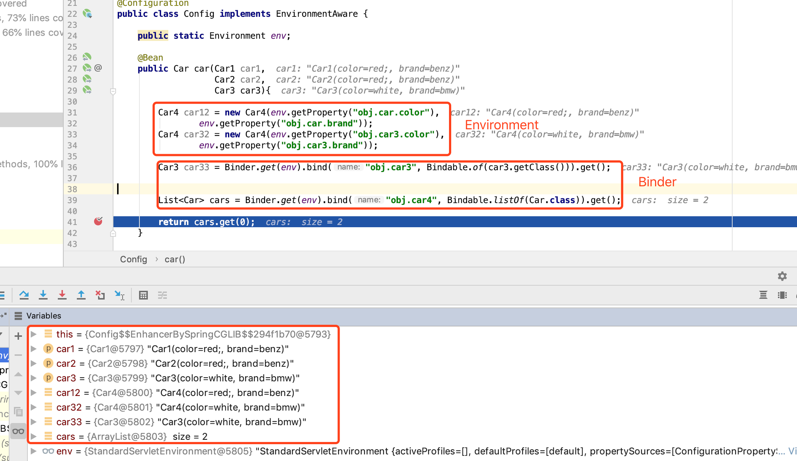
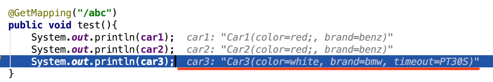
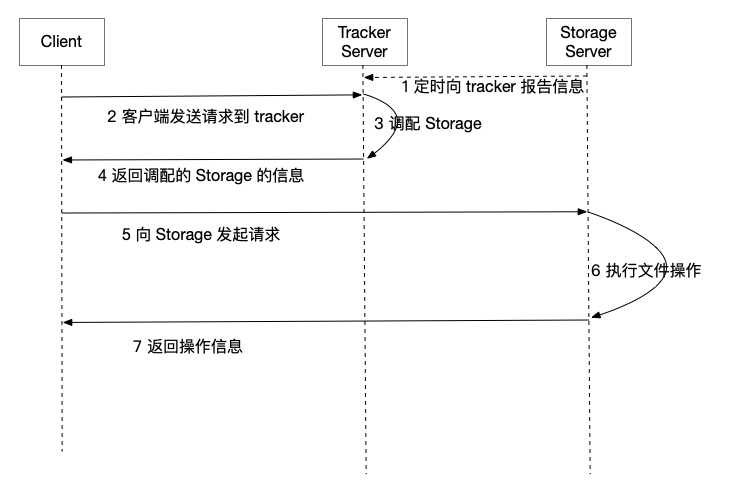
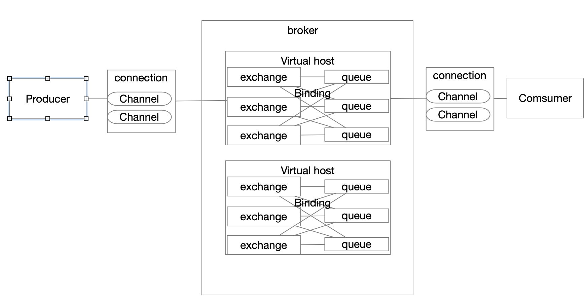

# SpringBoot笔记


| 事务传播行为类型          | 说明                                                         |
| ------------------------- | ------------------------------------------------------------ |
| PROPAGATION_REQUIRED      | 如果当前没有事务，就新建一个事务，如果已经存在一个事务中，加入到这个事务中。这是最常见的选择。 |
| PROPAGATION_REQUIRES_NEW  | 新建事务，如果当前存在事务，把当前事务挂起。                 |
| PROPAGATION_SUPPORTS      | 支持当前事务，如果当前没有事务，就以非事务方式执行。         |
| PROPAGATION_NOT_SUPPORTED | 以非事务方式执行操作，如果当前存在事务，就把当前事务挂起。   |
| PROPAGATION_MANDATORY     | 使用当前的事务，如果当前没有事务，就抛出异常。               |
| PROPAGATION_NEVER         | 以非事务方式执行，如果当前存在事务，则抛出异常。             |
| PROPAGATION_NESTED        | 如果当前存在事务，则在嵌套事务内执行。如果当前没有事务，则执行与PROPAGATION_REQUIRED类似的操作。 |

## springBoot2.0 更新

### springBoot 中的属性绑定

resource目录下配置文件: application.yml

```yaml
server:
  port: 9000

obj:
  car:
    color: red;
    brand: benz

  car4:
    - color: red
      brand: benz
    - color: white
      brand: bmw
```

resource目录下配置文件: car3.properties

```properties
obj.car3.color=white
obj.car3.brand=bmw
```


1. @ConfigurationProperties

   ```java
   @Component
   @ConfigurationProperties(prefix = "obj.car")
   @Data
   public class Car1 {
       private String color;
       private String brand;
   }
   ```

2. @Value

   ```java
   @Component
   @Data
   public class Car2 {
       @Value("${obj.car.color}")
       private String color;
   
       @Value("${obj.car.brand}")
       private String brand;
   }
   ```

3. ```java
   @Data
   @AllArgsConstructor
   public class Car4 {
       private String color;
   
       private String brand;
   
   }
   ```

4. @PropertySource + @ConfigurationProperties

   ```java
   @Component
   @PropertySource("classpath:car3.properties")
   @ConfigurationProperties(prefix = "obj.car3")
   @Data
   public class Car3 {
       private String color;
   
       private String brand;
   }
   ```

5. 使用 Environment 和 Binder

   使用 Binder创建创建对象实例时, 类需要有无参构造函数, 否则实例化失败. 注意lombok 的@AllArgsConstructor注解生成有参构造后, 类就没有了无参构造

   ```java
   @Configuration
   public class Config implements EnvironmentAware {
   
       public static Environment env;
   
       @Bean
       public Car car(Car1 car1,
                      Car2 car2,
                      Car3 car3){
   
           Car4 car12 = new Car4(env.getProperty("obj.car.color"),
                   env.getProperty("obj.car.brand"));
           Car4 car32 = new Car4(env.getProperty("obj.car3.color"),
                   env.getProperty("obj.car3.brand"));
   
           Car3 car33 = Binder.get(env).bind("obj.car3", Bindable.of(car3.getClass())).get();
   
           List<Car> cars = Binder.get(env).bind("obj.car4", Bindable.listOf(Car.class)).get();
   
           return cars.get(0);
       }
   
       @Override
       public void setEnvironment(Environment environment) {
           env = environment;
       }
   }
   ```

   

6. Duration: 在属性想指定@DurationUnit(ChronoUnit.SECONDS)单位为秒或其它, 在配置文件中指定 10 或 10s 或 PT30S 都可以正常注入属性

   ```java
   @Component
   @PropertySource("classpath:car3.properties")
   @ConfigurationProperties(prefix = "obj.car3")
   @Data
   public class Car3 {
       private String color;
   
       private String brand;
   
       @DurationUnit(ChronoUnit.SECONDS)
       private Duration timeout;
   }
   ```

   ```properties
   obj.car3.color=white
   obj.car3.brand=bmw
   obj.car3.timeout=30s
   ```

   

   


### WebMvcConfigurer 代替WebMvcConfigurerAdapter

1. springBoot2.0 中WebMvcConfigurerAdapter 标记为不建议使用, 改用 WebMvcConfigurer, 它是配置 webMVC 的配置类

   ```java
   public interface WebMvcConfigurer {
     
     	//拦截器配置
       default void addInterceptors(InterceptorRegistry registry) {
       }
   		//静态资源处理
       default void addResourceHandlers(ResourceHandlerRegistry registry) {
       }
   		//解决跨域问题
       default void addCorsMappings(CorsRegistry registry) {
       }
   		//视图跳转控制器 
       default void addViewControllers(ViewControllerRegistry registry) {
       }
   		//配置视图解析器
       default void configureViewResolvers(ViewResolverRegistry registry) {
       }
   		//默认静态资源处理器
       default void configureDefaultServletHandling(DefaultServletHandlerConfigurer configurer) {
       }
   		//信息转换器
       default void configureMessageConverters(List<HttpMessageConverter<?>> converters) {
       }
     
       default void configurePathMatch(PathMatchConfigurer configurer) {
       }
   
       default void configureContentNegotiation(ContentNegotiationConfigurer configurer) {
       }
   
       default void configureAsyncSupport(AsyncSupportConfigurer configurer) {
       }
   
       default void addFormatters(FormatterRegistry registry) {
       }
   
       default void addArgumentResolvers(List<HandlerMethodArgumentResolver> resolvers) {
       }
   
       default void addReturnValueHandlers(List<HandlerMethodReturnValueHandler> handlers) {
       }
   
       default void extendMessageConverters(List<HttpMessageConverter<?>> converters) {
       }
   
       default void configureHandlerExceptionResolvers(List<HandlerExceptionResolver> resolvers) {
       }
   
       default void extendHandlerExceptionResolvers(List<HandlerExceptionResolver> resolvers) {
       }
   
       @Nullable
       default Validator getValidator() {
           return null;
       }
   
       @Nullable
       default MessageCodesResolver getMessageCodesResolver() {
           return null;
       }
   }
   ```

2. 例:

   ```java
   public class CustomerWebMvcConfig implements WebMvcConfigurer {
       //添加拦截器
       @Override
       public void addInterceptors(InterceptorRegistry registry) {
           registry.addInterceptor(new HandlerInterceptor() {
               @Override
               public boolean preHandle(HttpServletRequest request, HttpServletResponse response, Object handler) throws Exception {
                   return false;
               }
   
               @Override
               public void postHandle(HttpServletRequest request, HttpServletResponse response, Object handler, ModelAndView modelAndView) throws Exception {
   
               }
   
               @Override
               public void afterCompletion(HttpServletRequest request, HttpServletResponse response, Object handler, Exception ex) throws Exception {
   
               }
           })
                   .addPathPatterns("/**")
                   .excludePathPatterns("exclude/**");
       }
   
       //视图跳转  重定向   返回码   转发视图
       @Override
       public void addViewControllers(ViewControllerRegistry registry) {
           registry.addRedirectViewController("/redirect/**", "https://www.baidu.com");
           registry.addStatusController("/error/**", HttpStatus.INTERNAL_SERVER_ERROR);
           registry.addViewController("/login/**").setViewName("login");
           registry.addViewController("/error/gateway/**").setStatusCode(HttpStatus.BAD_GATEWAY);
       }
   
       //配置静态资源
       @Override
       public void addResourceHandlers(ResourceHandlerRegistry registry) {
           registry.addResourceHandler("/my/**").addResourceLocations("classpath:/my/");
       }
   		
     //配置跨域
       @Override
       public void addCorsMappings(CorsRegistry registry) {
           WebMvcConfigurer.super.addCorsMappings(registry);
           registry.addMapping("/cors/**")
                   .allowedHeaders("*")
                   .allowedMethods("POST","GET", "PUT", "DELETE")
                   .allowedOrigins("*");
       }
   
       //信息转换器, 比如 webmvc 默认使用 jackson 转 json, 想换成 fastjson, 需要在这里增加信息转换器, 转换 web 信息
       @Override
       public void configureMessageConverters(List<HttpMessageConverter<?>> converters) {
           //调用父类的配置
           WebMvcConfigurer.super.configureMessageConverters(converters);
           //创建fastJson消息转换器
           FastJsonHttpMessageConverter fastConverter = new FastJsonHttpMessageConverter();
           //创建配置类
           FastJsonConfig fastJsonConfig = new FastJsonConfig();
           //修改配置返回内容的过滤
           fastJsonConfig.setSerializerFeatures(
                   SerializerFeature.DisableCircularReferenceDetect,
                   SerializerFeature.WriteMapNullValue,
                   SerializerFeature.WriteNullStringAsEmpty
           );
           fastConverter.setFastJsonConfig(fastJsonConfig);
           //将fastjson添加到视图消息转换器列表内
           converters.add(fastConverter);
   
       }
   }
   ```


## spring Boot 测试

```xml
      	<dependency>
            <groupId>org.springframework.boot</groupId>
            <artifactId>spring-boot-starter-test</artifactId>
            <scope>test</scope>
        </dependency>
```

springBoot2.0 的接口单元测试 可以不借助浏览器, url 测试工具, 使用 mockmvc直接在 test 内编写单测来测试

```java
@RunWith(SpringRunner.class)
@SpringBootTest(classes = BootApplication.class)
public class PropertiesControllerTest {

    @Autowired
    private WebApplicationContext wac;

    @Autowired
    private PropertiesController propertiesController;


    private MockMvc mockMvc;

    @Before
    public void setMockMvc(){
        mockMvc = MockMvcBuilders.webAppContextSetup(wac).build();
//        mockMvc = MockMvcBuilders.standaloneSetup(new PropertiesController()).build();
    }

    @Test
    public void testAbc() throws Exception {
        
        
        MvcResult mvcResult = mockMvc.perform(MockMvcRequestBuilders.get("/property/abc")
                .accept(MediaType.APPLICATION_JSON_UTF8)).andReturn();

    }
}
```

1. @RunWith() 启动环境:  SpringRunner启动 spring 的运行容器环境, 否则不能获取 spring 容器管理的类和对象, 依赖注入都为空

2. @SpringBootTest 标记测试类

3. MockMvc: 实现了对Http请求的模拟，能够直接使用网络的形式，转换到Controller的调用, 测试速度快、不依赖网络环境，提供了一套验证的工具，使请求的验证统一而且很方便

   * MockMvcBuilders 是 MockMvc 的构造器

     * MockMvcBuilder是用来构造MockMvc的构造器，其主要有两个实现：StandaloneMockMvcBuilder和DefaultMockMvcBuilder，前者继承了后者。
       ① MockMvcBuilders.webAppContextSetup(WebApplicationContext context)：指定WebApplicationContext，将会从该上下文获取相应的控制器并得到相应的MockMvc；
       ② MockMvcBuilders.standaloneSetup(Object... controllers)：通过参数指定一组控制器，这样就不需要从上下文获取了，比如this.mockMvc = MockMvcBuilders.standaloneSetup(this.controller).build(); 这个是直接调用到控制器, 不会走拦截器

   * MockMvcRequestBuilders 是请求构造器, 供了一个方法buildRequest(ServletContext servletContext)用于构建MockHttpServletRequest;  有两个子类MockHttpServletRequestBuilder和MockMultipartHttpServletRequestBuilder（如文件上传使用, 过期了）

   * mockMvc.perform()调用请求, 拿到 ResultActions结果事件

   * andReturn: ResultActions获取返回结果

   * andDo: ResultActions使用返回结果继续处理内容

   * andExpect: ResultActions验证返回结果

   * MVcResult: 执行完控制器后得到的整个结果，并不仅仅是返回值，其包含了测试时需要的所有信息。

     MockHttpServletRequest getRequest()：得到执行的请求；
     MockHttpServletResponse getResponse()：得到执行后的响应；
     Object getHandler()：得到执行的处理器，一般就是控制器；
     HandlerInterceptor[] getInterceptors()：得到对处理器进行拦截的拦截器；
     ModelAndView getModelAndView()：得到执行后的ModelAndView；
     Exception getResolvedException()：得到HandlerExceptionResolver解析后的异常；
     FlashMap getFlashMap()：得到FlashMap；
     Object getAsyncResult()/Object getAsyncResult(long timeout)：得到异步执行的结果；

## spring Boot web 支持

1. 接口使用参数校验, 方法绑定 BindingResult 参数后, 参数校验无论正确还是错误, 都会进入方法, 将校验结果放入 BindingResult 中继续执行
2. 通过使用@WebFilter注解增加@Order 顺序的过滤器不生效. 使用 FilterRegistrationBean 配置过滤器

3. springBoot 使用 jsp 的web 项目必须实现SpringBootServletInitializer的configure()方法, 才能在外部 web 容器运行, 启动类同目录下创建, 也可以直接在启动类实现SpringBootServletInitializer

4. FastDFS相关概念: 三个角色: 跟踪服务器(Tracker Server), 存储服务器(Storage Server), 客户端(Client)

   * 跟踪服务器(Tracker Server): 负责资源调度

   * 存储服务器(Storage Server): 文件的实际操作: 存储  删除, meta 数据管理等

   * 客户端: 向服务发送请求连接

     

   

   优点: 

   - ⽂文件不不分块存储，上传的⽂文件和 OS ⽂文件系统中的⽂文件⼀一⼀一对应
   - ⽀支持相同内容的⽂文件只保存⼀一份，节约磁盘空间
   - 下载⽂文件⽀支持 HTTP 协议，可以使⽤用内置 Web Server，也可以和其他 Web Server 配合使⽤用
   - ⽀支持在线扩容
   - ⽀支持主从⽂文件
   - 存储服务器器上可以保存⽂文件属性(meta-data)V2.0 ⽹网络通信采⽤用 libevent，⽀支持⼤大并发访问，整体性能更更好

5. RESTful

   * 客户端与服务端之间的互动传递的是**资源的表述**, 客户端无状态, 所有状态在服务端, 通过 GET(获取), POST(创建), PUT(修改), DELETE(删除) 传达服务端对资源状态的操作
     * @PatchMapping，用于更新部分资源 . 它是 PUT 的补充; 修改完整的对象  Put 对象实例, 修改对象某些字段, patch 字段对应的操作. 两种方法中 PUT 是幂等的, PATCH 不能保证幂等

6. WebSocket

   优点:

   * 较少的控制开销: 连接成功后可无限次数据交互, 除消息体外的其它消息部分信息量小
   * 更强的实时性: 全双工协议, 前后台实时主动发送
   * 保持连接状态: 保留状态的长连接
   * 更好的二进制支持: WebSocket 定义了二进制帧, 对二进制数据处理压缩等更友好高效
   * 更好的压缩效果: webSocket 的扩展可以更高效率的对二进制数据压缩

   Stomp和 WebSocket: 

   * STOMP简单文本定向消息协议, 提供了可互操作的连接格式, 由于它的简单性恰巧可以用户定义 WebSocket的消息体格式.

   * STOMP 帧结构 

   ```
   COMMAND 
   header1:value1 
   header2:value2 
   Body^@ 
   ```

   其中，^@ 表示⾏行行结束符。
    ⼀一个 STOMP 帧由三部分组成:命令、Header(头信息)、Body(消息体)。 

   例: 

   ```
    SEND
    destination:/broker/roomId/1
    content-length:57
    
    {“type":"OUT","content":"ossxxxxx-wq-yyyyyyyy"}
   ```

   * 第 1 ⾏:表明此帧为 SEND 帧，是 COMMAND 字段。
   * 第 2 ⾏:Header 字段，消息要发送的目的地址，是相对地址。
   * 第 3 行:Header 字段，消息体字符长度。
   * 第 4 行:空⾏行行，间隔 Header 与 Body。
   * 第 5 行:消息体，为自定义的 JSON 结构。

   

   ### netty-websocket-spring-boot-starter

   首先**netty-websocket-spring-boot-starter** 和**spring-boot-starter-websocket** 的开发方式很像, 都是通过注解实现的 url, 事件监听, 但本质上差别挺大的, **spring-boot-starter-websocket**是基于 tomcat-webSocket, 是基于 http 容器实现的; **netty-websocket-spring-boot-starter** 是基于 netty 的, 他可以更灵活的实现各种基于 netty 的数据流通信协议,

   ```xml
   	<dependency>
   		<groupId>org.yeauty</groupId>
   		<artifactId>netty-websocket-spring-boot-starter</artifactId>
   		<version>0.7.6</version>
   	</dependency>
   ```

   ```java
   @Configuration
   public class WebSocketConfig {
       @Bean
       public ServerEndpointExporter serverEndpointExporter() {
           return new ServerEndpointExporter();
       }
   }
   ```

   ```java
   @ServerEndpoint
   @Component
   public class CustomerSocket {
       @OnOpen
       public void onOpen(Session session, HttpHeaders headers) throws IOException {
           System.out.println("new connection");
   
       }
   
       @OnClose
       public void onClose(Session session) throws IOException {
           System.out.println("one connection closed");
       }
   
       @OnError
       public void onError(Session session, Throwable throwable) {
           throwable.printStackTrace();
       }
   
       @OnMessage
       public void onMessage(Session session, String message) {
           System.out.println(message);
           session.sendText("Hello Netty!");
       }
   
       @OnBinary
       public void onBinary(Session session, byte[] bytes) {
           for (byte b : bytes) {
               System.out.println(b);
           }
           session.sendBinary(bytes);
       }
   
       @OnEvent
       public void onEvent(Session session, Object evt) {
           if (evt instanceof IdleStateEvent) {
               IdleStateEvent idleStateEvent = (IdleStateEvent) evt;
               switch (idleStateEvent.state()) {
                   case READER_IDLE:
                       System.out.println("read idle");
                       break;
                   case WRITER_IDLE:
                       System.out.println("write idle");
                       break;
                   case ALL_IDLE:
                       System.out.println("all idle");
                       break;
                   default:
                       break;
               }
           }
       }
   
   }
   ```

   | 属性                                | 默认值       | 说明                                                         |
   | ----------------------------------- | ------------ | ------------------------------------------------------------ |
   | path                                | “/”          | WebSocket的path,也可以用`value`来设置                        |
   | host                                | “0.0.0.0”    | WebSocket的host,`"0.0.0.0"`即是所有本地地址                  |
   | port                                | 80           | WebSocket绑定端口号。如果为0，则使用随机端口(端口获取可见 [多端点服务](https://blog.csdn.net/moshowgame/article/details/83663018#多端点服务)) |
   | bossLoopGroupThreads                | 0            | bossEventLoopGroup的线程数                                   |
   | workerLoopGroupThreads              | 0            | workerEventLoopGroup的线程数                                 |
   | useCompressionHandler               | false        | 是否添加WebSocketServerCompressionHandler到pipeline          |
   | prefix                              | “”           | 当不为空时，即是使用application.properties进行配置，详情在 [通过application.properties进行配置](https://blog.csdn.net/moshowgame/article/details/83663018#通过APPLICATION.PROPERTIES进行配置) |
   | optionConnectTimeoutMillis          | 30000        | 与Netty的`ChannelOption.CONNECT_TIMEOUT_MILLIS`一致          |
   | optionSoBacklog                     | 128          | 与Netty的`ChannelOption.SO_BACKLOG`一致                      |
   | childOptionWriteSpinCount           | 16           | 与Netty的`ChannelOption.WRITE_SPIN_COUNT`一致                |
   | childOptionWriteBufferHighWaterMark | 64*1024      | 与Netty的`ChannelOption.WRITE_BUFFER_HIGH_WATER_MARK`一致,但实际上是使用`ChannelOption.WRITE_BUFFER_WATER_MARK` |
   | childOptionWriteBufferLowWaterMark  | 32*1024      | 与Netty的`ChannelOption.WRITE_BUFFER_LOW_WATER_MARK`一致,但实际上是使用 `ChannelOption.WRITE_BUFFER_WATER_MARK` |
   | childOptionSoRcvbuf                 | -1(即未设置) | 与Netty的`ChannelOption.SO_RCVBUF`一致                       |
   | childOptionSoSndbuf                 | -1(即未设置) | 与Netty的`ChannelOption.SO_SNDBUF`一致                       |
   | childOptionTcpNodelay               | true         | 与Netty的`ChannelOption.TCP_NODELAY`一致                     |
   | childOptionSoKeepalive              | false        | 与Netty的`ChannelOption.SO_KEEPALIVE`一致                    |
   | childOptionSoLinger                 | -1           | 与Netty的`ChannelOption.SO_LINGER`一致                       |
   | childOptionAllowHalfClosure         | false        | 与Netty的`ChannelOption.ALLOW_HALF_CLOSURE`一致              |
   | readerIdleTimeSeconds               | 0            | 与`IdleStateHandler`中的`readerIdleTimeSeconds`一致，并且当它不为0时，将在`pipeline`中添加`IdleStateHandler` |
   | writerIdleTimeSeconds               | 0            | 与`IdleStateHandler`中的`writerIdleTimeSeconds`一致，并且当它不为0时，将在`pipeline`中添加`IdleStateHandler` |
   | allIdleTimeSeconds                  | 0            | 与`IdleStateHandler`中的`allIdleTimeSeconds`一致，并且当它不为0时，将在`pipeline`中添加`IdleStateHandler` |
   | maxFramePayloadLength               | 65536        | 最大允许帧载荷长度                                           |

   

   多站点服务与配置

   * 在快速启动的基础上，在多个需要成为端点的类上使用@ServerEndpoint、@Component注解即可
   * 可通过ServerEndpointExporter.getInetSocketAddressSet()获取所有端点的地址
   * 当地址不同时(即host不同或port不同)，使用不同的ServerBootstrap实例
   * 当地址相同,路径(path)不同时,使用同一个ServerBootstrap实例
   * 当多个端点服务的port为0时，将使用同一个随机的端口号
   * 当多个端点的port和path相同时，host不能设为"0.0.0.0"，因为"0.0.0.0"意味着绑定所有的host

   ```java
   @ServerEndpoint(prefix="mySocket")
   @Component
   public class CustomerSocket {
     ...
   }
   ```

   application.properties

   ```properties
   mySocket.host=0.0.0.0
   mySocket.port=80
   mySocket.bossLoopGroupThreads=1
   mySocket.workerLoopGroupThreads=10
   ```

   **注意**: 模型情况下 主线程组和工作线程组均为 0;  客户端与服务端连接保持的 session 做全局共享, 内部包装了 netty 的 channel, 提供了 channel 的属性和功能 id, pipline, read, 等

   [学习参考]( https://blog.csdn.net/moshowgame/article/details/83663018)

## springBoot 与数据库操作

1. mybatis

   优点:

   * SQL 被统一提取出来，便于统⼀一管理和优化
   * SQL 和代码解耦，将业务逻辑和数据访问逻辑分离，使系统的设计更清晰、更易维护、更易单元测试
   * 提供映射标签，支持对象与数据库的 ORM 字段关系映射
   * 提供对象关系映射标签，支持对象关系组件维护
   * 灵活书写动态 SQL，⽀支持各种条件来动态生成不不同的 SQL

   缺点

   * 编写 SQL 语句句时工作量很大，尤其是字段多、关联表多时，更是如此
   * SQL 语句句依赖于数据库，导致数据库移植性差

2. mybatis 配置多数据源

   properties

   ```properties
   spring.datasource.test1.driver-Class-Name = com.mysql.jdbc.Driver
   spring.datasource.test1.jdbc-url = jdbc:mysql://172.16.235.121:3306/test1?useUnicode=true&characterEncoding=utf-8
   spring.datasource.test1.username = root
   spring.datasource.test1.password = 123456
   
   .spring.datasource.test2.driver-Class-Name = com.mysql.jdbc.Driver
   spring.datasource.test2.jdbc-url = jdbc:mysql://172.16.235.121:3306/test2?useUnicode=true&characterEncoding=utf-8
   spring.datasource.test2.username = root
   spring.datasource.test2.password = 123456
   ```

   ```java
   @Configuration
   @MapperScan(basePackages = "com.zcz.study.mapper1", sqlSessionTemplateRef  = "test1SqlSessionTemplate")
   public class DataSource1Config {
   
       @Bean(name = "test1DataSource")
       @ConfigurationProperties(prefix = "spring.datasource.test1")
       @Primary
       public DataSource testDataSource() {
           return DataSourceBuilder.create().build();
       }
   
       @Bean(name = "test1SqlSessionFactory")
       @Primary
       public SqlSessionFactory testSqlSessionFactory(@Qualifier("test1DataSource") DataSource dataSource) throws Exception {
           SqlSessionFactoryBean bean = new SqlSessionFactoryBean();
           bean.setDataSource(dataSource);
           //添加XML目录
           ResourcePatternResolver resolver = new PathMatchingResourcePatternResolver();
           try {
               bean.setMapperLocations(resolver.getResources("classpath*:mapper/test1/*.xml"));
               return bean.getObject();
           } catch (Exception e) {
               e.printStackTrace();
               throw new RuntimeException(e);
           }
   
       }
   
       @Bean(name = "test1TransactionManager")
       @Primary
       public DataSourceTransactionManager testTransactionManager(@Qualifier("test1DataSource") DataSource dataSource) {
           return new DataSourceTransactionManager(dataSource);
       }
   
       @Bean(name = "test1SqlSessionTemplate")
       @Primary
       public SqlSessionTemplate testSqlSessionTemplate(@Qualifier("test1SqlSessionFactory") SqlSessionFactory sqlSessionFactory) throws Exception {
           return new SqlSessionTemplate(sqlSessionFactory);
       }
   
   }
   ```

   ```java
   @Configuration
   @MapperScan(basePackages = "com.zcz.study.mapper2", sqlSessionTemplateRef  = "test2SqlSessionTemplate")
   public class DataSource2Config {
   
       @Bean(name = "test2DataSource")
       @ConfigurationProperties(prefix = "spring.datasource.test2")
       public DataSource testDataSource() {
           return DataSourceBuilder.create().build();
       }
   
       @Bean(name = "test2SqlSessionFactory")
       public SqlSessionFactory testSqlSessionFactory(@Qualifier("test2DataSource") DataSource dataSource) throws Exception {
           SqlSessionFactoryBean bean = new SqlSessionFactoryBean();
           bean.setDataSource(dataSource);
           ResourcePatternResolver resolver = new PathMatchingResourcePatternResolver();
           try {
               bean.setMapperLocations(resolver.getResources("classpath*:mapper/test2/*.xml"));
               return bean.getObject();
           } catch (Exception e) {
               e.printStackTrace();
               throw new RuntimeException(e);
           }
       }
   
       @Bean(name = "test2TransactionManager")
       public DataSourceTransactionManager testTransactionManager(@Qualifier("test2DataSource") DataSource dataSource) {
           return new DataSourceTransactionManager(dataSource);
       }
   
       @Bean(name = "test2SqlSessionTemplate")
       public SqlSessionTemplate testSqlSessionTemplate(@Qualifier("test2SqlSessionFactory") SqlSessionFactory sqlSessionFactory) throws Exception {
           return new SqlSessionTemplate(sqlSessionFactory);
       }
   
   }
   ```

   根据扫描的 mapper所在包, 最相应的实例注入不同的 DataSource

   

3. mybatis 注解

   字段映射: **@Results** 和 **@Result** 注解 

   这两个注解配合来使⽤，主要作用是将数据库中查询到的数值转化为具体的字段，修饰返回的结果集，关联
   实体类属性和数据库字段⼀一对应，如果实体类属性和数据库属性名保持⼀一致，就不不需要这个属性来修饰。

   ```java
   @Select("SELECT * FROM users")
   @Results({
        @Result(property = "userSex",  column = "user_sex", javaType = UserSexEnum.cla
    ss),
        @Result(property = "nickName", column = "nick_name")
    })
   List<UserEntity> getAll();
   ```

   动态 sql 

   * 注解: 在@select  @insert @update @delete 后面接\<script>标签, 标签内部使用 XML 的形式写 SQL

   * sql 类: 创建一个组装 sql 的类, 在类中指定方法组合 sql, 对应的 mapper 指定组装类的方法

     ```java
     public class UserSql {
          public String getList(UserParam userParam) {
              StringBuffer sql = new StringBuffer("select id, userName, passWord, user_s
      ex as userSex, nick_name as nickName");
              sql.append(" from users where 1=1 ");
              if (userParam != null) {
                  if (StringUtils.isNotBlank(userParam.getUserName())) {
                      sql.append(" and userName = #{userName}");
                  }
                  if (StringUtils.isNotBlank(userParam.getUserSex())) {
                      sql.append(" and user_sex = #{userSex}");
                  }
              }
              sql.append(" order by id desc");
              sql.append(" limit " + userParam.getBeginLine() + "," + userParam.getPageS
      ize());
              log.info("getList sql is :" +sql.toString());
              return sql.toString();
     } }
     ```

     ```java
     @SelectProvider(type = UserSql.class, method = "getList")
      List<UserEntity> getList(UserParam userParam);
     ```

   

   

## Druid 监控数据源

Druid 首先是一个数据库连接池，但它不仅仅是一个数据库连接池，还包含了一个ProxyDriver，一列内置
的 JDBC 组件库，一个 SQL Parser。在 Java 的世界中 Druid 是**监控做的最好**的数据库连接池，在功能、性
能、扩展性⽅方⾯面，也有不错的表现。

1. Druid 提供的功能
   - 替换其他 Java 连接池，Druid 提供了一个高效、功能强大、可扩展性好的数据库连接池。 
   - 可以监控数据库访问性能，Druid 内置提供了一个功能强大的 StatFilter 插件，能够详细统计 SQL 的执 ⾏行性能，这对于线上分析数据库访问性能有很大帮助。 
   - 数据库密码加密。直接把数据库密码写在配置⽂文件中，这是不好的行为，容易导致安全问题， DruidDruiver 和 DruidDataSource 都支持 PasswordCallback。 
   - SQL 执⾏日志，Druid 提供了不同的 LogFilter，能够支持 Common-Logging、Log4j 和 JdkLog，可以 按需要选择相应的 LogFilter，监控应用的数据库访问情况。
   - 扩展 JDBC，如果你要对 JDBC 层有编程的需求，可以通过 Druid 提供的 Filter 机制，很⽅方便便编写 JDBC 层的 
   - 

##Memcache

是基于 Libevent的事件处理的, 监听包括 poll, select(Windows), epoll(Linux), kqueue(BSD), /dev/pool (Solaris)等事件, 能够保持很大并发情况下, 快速响应

不适用场景:

* 缓存对象大于 1M
* key 的长度大于 250 字节
* 未提供任何安全策略
* 不支持持久化

客户端

* Memcached Client for Java(已经停止更新)
* SpyMemcached(已经停止更新)
* XMemcached(主流使用): 高性能的 NIO客户端, 在 Memcached 协议基础上进行了封装和完善, 提供了线程城池, 集群, 数据压缩, 分布式算法等功能

Memcached Client for Java 比 SpyMemcached 更稳定、更早、更广泛;SpyMemcached 比 MemcachedClient for Java 更高效;XMemcached 比 SpyMemcache并发效果更好

CAS操作

Memcache 使用 CAS 保证原子性, CAS 原子性类似乐观锁, 每次请求存储一个数据时需要验证获取数据的 cas 与当前修改是否一致, 如果不一致 修改直白, 一致, 修改成功

```java
GetsResponse<Integer> result = client.gets("a"); long cas = result.getCas();
//尝试将 a 的值更更新为 2
if (!client.cas("a", 0, 2, cas)) {
     System.err.println("cas error");
 }
```

XMemcached提供了一个 CASOperation 接口简化增强原子操作行为, 提供重试策略

```java
 client.cas("a", 0, new CASOperation<Integer>() {
         public int getMaxTries() {
							return 1; //重试次数
         }
         public Integer getNewValue(long currentCAS, Integer currentValue) {
              return 2;	//设置值
         } 
 });
```

超时操作

XMemcache 是基于 Nio, 所以是异步, 无法确定 client 何时返回结果. 可以设置超时处理, 超时处理是通过 CountDownLatch.await(timeout)实现的, 所以需要处理 InterruptException 异常

```java
value=client.get("hello",3000);
```

Memcache 集群存储

Memcache的服务集群通过客户端实现, 默认数据存储根据key 的 hash 值与客户端请求服务连接数取余作为服务存储节点, 也可以使用一致性 hash


## Redis

spring Data 是 spring 提供连接各种数据库访问的数据库连接框架. spring Data Redis是其中之一; springBoot2.0 使用 lettuce 作为 redis 客户端; lettuce 是基于 Netty NIO 框架, 多个线程可以共享一个 RedisConnection.

```xml
<dependency>
     <groupId>org.springframework.boot</groupId>
     <artifactId>spring-boot-starter-data-redis</artifactId>
 </dependency>
 <dependency>
     <groupId>org.apache.commons</groupId>
     <artifactId>commons-pool2</artifactId>
</dependency>
```

引⼊入 commons-pool 2 是因为 Lettuce 需要使用 commons-pool 2 创建 Redis 连接池。

spring Session 使用 redis 做的 session 共享


## SpringBoot Cache

spring3.1 提供了 Cache 和 CacheManager 接口规范, 可以通过接口实现各种缓存的具体实现, 并提供了一些缓存的实现, 如 redisCache, EhCacheCache, ConcurrentMapCache 等

1. 注解: 除了@CacheConfig注解是类级别的注解, 其它都可以用在类和方法上

   * @Cacheable：能够根据方法的请求参数对其结果进行缓存，多用于查询
     - value: 对应的缓存名
     - key: 对应的缓存 key
     - condition: 根据条件成立进行缓存
     - keyGenerator: 指定 key 生成器
   * @CachePut: 不走缓存, 直接执行方法，并缓存结果, 可以用它刷新缓存 
     * value: 对应的缓存名
     * key: 对应的缓存 key
     * condition: 根据条件成立进行刷新缓存
     * keyGenerator: 指定 key 生成器
   * @CacheEvict:清空缓存
     * value: 对应的缓存名
     * key: 对应的缓存 key
     * keyGenerator: 指定 key 生成器
     * condition: 根据条件成立进行清除缓存
     * allEntries: 默认为 false. 设置 true: 忽略 key, 清除所有 value 下缓存
     * beforeInvocation: 默认 false, 在方法执行成功结束后清除韩村. 设置 true 表示在方法执行前清除缓存
   * @Caching:对Cacheable, CachePut, CacheEvict的组合功能
   * @CacheConfig: 用于抽取缓存的公共配置（类级别）
     * 在类上指定统一的 keyGenerator, cacheManager, cacheResolver等, 方法上标注优先使用方法的配置

   ```java
   @RestController
   public class CacheController {
   
   
       @Cacheable(value = "name", key = "#name")
       @GetMapping("/cacheable")
       public String cacheable(@RequestParam(required = true) String name){
   
           return name;
       }
   
       @CachePut(value = "name", key = "#id")
       @GetMapping("/cacheput")
       public String cacheput(@RequestParam(required = true) String name, @RequestParam(required = true) Integer id){
   
           return name;
       }
   
       @CacheEvict(value = "name", key = "#name")
       @GetMapping("/cacheEvict")
       public String cacheEvict(@RequestParam(required = true) String name){
   
           return name;
       }
   
       @Caching(
               cacheable = {@Cacheable(value="product",key="#name")},
               put = {
                   @CachePut(value="product",key="#id"),
                   @CachePut(value="product",key="#name")
               },
               evict={
                   @CacheEvict(value = "#id")
               }
       )
       @GetMapping("/cacheable")
       public String cacheing(@RequestParam(required = true) String name, @RequestParam(required = true) Integer id ){
   
           return name;
       }
   ```

   

key 是默认使用 KeyGenerator 生成的, 可以自定义 KeyGenerator, 根据具体业务情况自定义功能实现, 它会影响到缓存的存储和缓存的更新

```java
@Configuration
@EnableCaching
public class RedisConfig extends CachingConfigurerSupport{
     @Bean
     public KeyGenerator keyGenerator() {

        return new KeyGenerator() {
            @Override
            public Object generate(Object target, Method method, Object... params)
                StringBuilder sb = new StringBuilder();
                sb.append(target.getClass().getName());
                sb.append(method.getName());
                for (Object obj : params) {
                    sb.append(obj.toString());
                }
                return sb.toString();
            }
        }; 
}
```


## mq

### ActiveMq

ActiveMq 提供 queue 和 topic 两种消息类型, 默认项目集成只支持 queue 一种, 实现支持两种消息可自定义配置

```java
    @Bean("queueJmsListenerContainerFactory")
    public JmsListenerContainerFactory queueJmsListenerContainerFactory(ConnectionFactory connectionFactory){
        DefaultJmsListenerContainerFactory factory = new DefaultJmsListenerContainerFactory();
        factory.setConnectionFactory(connectionFactory);
        factory.setPubSubDomain(false);
        return factory;
    }
    @Bean("topicJmsListenerContainerFactory")
    public JmsListenerContainerFactory topicJmsListenerContainerFactory(ConnectionFactory connectionFactory){
        DefaultJmsListenerContainerFactory factory = new DefaultJmsListenerContainerFactory();
        factory.setConnectionFactory(connectionFactory);
        factory.setPubSubDomain(false);
        return factory;
    }
```

```java
    @JmsListener(destination = "zcz.queue", containerFactory = "queueJmsListenerContainerFactory")
    public void reciveQueue(String msg){
        System.out.println(msg);
    }

    @JmsListener(destination = "zcz.topic", containerFactory = "topicJmsListenerContainerFactory")
    public void reciveTopic(String msg){
        System.out.println(msg);
    }
```

### RabbitMq

1. AMQP: 是应用层协议的一个开放标准, 面向消息, 队列, 路由, 可靠性, 安全

2. RabbitMq 概念

   * broker: 安装消息队列的服务器实体
   * Virtual host: 虚拟主机; 一组安装了 RabbitMq 的服务器可以有多个 Virtual host, Vitrual host 之间的 exchange queue 等都是隔离的, 同一组 Virtual host 使用同一份认证, 加密环境, 一个 Virtual host 可以看成一个虚拟的小 RabbitMq
   * Exchange: 交换机, 生产者将消息发送到交换机, 交换机是一个转发组件, 不负责存储, 根据规则转发给绑定自己的 queue
   * queue: 队列, 可以存储消息, 直到被消费
   * binding: 绑定, queue 需要绑定到 Exchange, 代表 queue 与 Exchange 的绑定关系
   * Channel: 管道, 是建立在 TCP 连接之上的多路复用双向通信, 生产者发布消息, 消费者订阅消息都是通过 channel 对消息进行的传输
   * Connection : 网络连接
   * producer: 消息生产者
   * comsumer: 消息消费者
   * Message: 消息

   

3. 发送模式

   * work: 直接发送到对类, 不通过 exchange
   * fanout: 通过交换机, 一个交换机与一个 queue 通过一个 key 绑定 binding
   * direct: 通过交换机, 一个 exchange 与一个 queue 可以通过多个 key 绑定多个 binding
   * topic: 通过交换机, 一个 exchange 与一个 queue 可以通过多个不同规则的 key 绑定多个 binding; *代表一个, #代表一个或多个

4. ack 确认模式开启

   生产者指定消息发送的处理方式: `ConfirmCallback`和`ReturnCallback`

   * 如果消息没有到exchange,则ConfirmCallback回调,ack=false,
   * 如果消息到达exchange,则ConfirmCallback回调,ack=true
   * exchange到queue成功,则不回调ReturnCallback

   ```java
   @Autowired
       private RabbitTemplate rabbitTemplate;
   
       private void sendSimplqQueue(String msg) {
   
           rabbitTemplate.setConfirmCallback(new RabbitTemplate.ConfirmCallback() {
               @Override
               public void confirm(CorrelationData correlationData, boolean ack, String cause) {
                   System.out.println("消息唯一标识: "+ correlationData);
                   System.out.println("确认状态: "+ ack);
                   System.out.println("造成原因: "+ cause);
               }
           });
   
           rabbitTemplate.setReturnCallback(new RabbitTemplate.ReturnCallback() {
               @Override
               public void returnedMessage(Message message, int replyCode, String replyText, String exchange, String routingKey) {
                   System.out.println("消息主体: "+ message);
                   System.out.println("回复编码: "+ replyCode);
                   System.out.println("回复内容: "+ replyText);
                   System.out.println("交换器: "+ exchange);
                   System.out.println("路由键: "+ routingKey);
               }
           });
   
           rabbitTemplate.convertAndSend("simple", msg);
       }
   ```

   ```java
   @RabbitListener
   @RabbitListener(queues = "simple")
   public class Comsumer {
   
       @RabbitHandler
       public void process(String msg, Channel channel, Message message){
   
           try {
               //确认消息 告诉服务器收到这条消息 无需再发了
               channel.basicAck(message.getMessageProperties().getDeliveryTag(), false);
           } catch (IOException e) {
               e.printStackTrace();
           }
   
       }
   }
   ```

   

5. rabbitmq 集群模式

   * 主备模式: 一主多备,  主节点提供读写, 备用节点备份, 主节点挂了, 备用节点升级为主节点
   * 远程模式: 两个异地的 mq 集群, 实现两个集群间的数据复制能力, A 集群负载过高可复制到 B 集群处理业务,  提供高可用情况下提高吞吐量
   * 镜像模式: 保证 100%数据不丢失, 实现简单, 实现多节点的数据同步; 用 KeepAlived 做了 HA-Proxy 的高可用，然后有 3 个节点的 MQ 服务，消息发送到主节点上，主节点通过 mirror 队列把数据同步到其他的 MQ 节点，这样来实现其高可靠
   * 多活模式: 这种模式需要依赖 rabbitMQ 的 federation 插件，可以实现持续的，可靠的 AMQP 数据通信，多活模式在实际配置与应用非常的简单 

6. TTL(Time To Live): 生存时间. 消息的过期时间

   * 消息发送时指定. 配置消息体的 properties, 指定消息过期时间
   * 创建 exchange 时指定: 从进入 queue 开始计算, 超过队列超时时间清除

7.  死信队列

   消息队列中产生的死信进入死信交换机, 死信交换机绑定的死信队列, 通过监听死信队列对死信进行处理

   死信交换机和死信队列都是普通的交换机和队列, 只是被指定为 x-dead-letter . 创建的正常对列配置死信队列参数

   ```java
   @Bean
       public Queue testQueue() {
           Map<String, Object> args = new HashMap<>(4);
           // x-dead-letter-exchange 声明 死信交换机
           args.put("x-dead-letter-exchange", "test_exchange");
           // x-dead-letter-routing-key 声明死信路由键
           args.put("x-dead-letter-routing-key", "test_dead_rout");
           return new Queue("test_queue", true, false, false, args);
   ```

8. 保证可靠性

   * 保证生产者发出消息, confirmListener 监听是否发送到 Broker
   * 保证消息到大交换器路由到 queue 监听 returnListener
   * 数据库记录消息状态, 确保消息的发送消费
   * 提供重试策略和延迟发送确认


### MongoDB

spring 提供两种操作方式: 1. 注入 MongoTemplate    2. 继承 MongoRepository 内部提供多个基础方法

提供数据与 DomainObject 的映射

### ElasticSearch

概念:

* document: 文档,    
* index: 索引,    
* type: 类型, 7.0 版本前可以指定,    7.0 之后统一为_doc 类型
* shards: 存储的分片数
* replicas: 存储的副本数

spring-boot-starter-data-elasticsearch是 spring data 中提供的操作 elasticSearch 的API 库, 和 jdbs, JPS, mongoDB 一样提供数据访问的操作功能

### Quartz

springBoot 自带定时注意: 任务同步执行, 前一个任务未执行结束 影响后面任务的执行

Quartz 优点:

* 丰富的 Job 操作 API; 
* 支持多种配置;
*  Spring Boot 无缝集成; 
* 支持持久化; 
* 支持集群; 
* Quartz 还支持开源，是一个功能丰富的开源作业调度库，可以集成到几乎任何 Java 应用程序中。 

概念:

* Job:任务. 接口, 只定义了一个execute(JobExecutionContext var1)方法, 在实现 Job 接口的方法中编写需要执行的 任务, JobExecutionContext提供了任务执行时的上下文信息, 运行时数据存储在 JobDataMap中
* JobDetail: 任务信息. quartz 每次调度任务都会重新创建一个 Job, 它接收一个能描述任务的类, 通过 newInstance 进行实例化 job
* Trigger: 触发器. 描述任务执行的时间规则, SimpleTrigger 和 CronTrigger 两个子类. 只调用一次或固定时间间隔执行调度, 使用 simpleTrigger. 通过 Cron 表达式规定时间规则使用 CronTrigger
* Scheduler:调度器. 是一个装载 Trigger 和 jobDetail 的调度容器, Trigger 和 JobDetail 拥有各自的组及名称, 在各自的组中组及名称必须唯一. scheduler 通过组和名称定位对象. Scheduler 定义了多个接口和类, 允许外部通过组和名称访问控制 Trigger 和 JobDetail

触发定时任务

1. 启动时调用 scheduleJobs()

   ```java
   @Component
    public class MyStartupRunner implements CommandLineRunner {
        @Autowired
        public CronSchedulerJob scheduleJobs;
        @Override
        public void run(String... args) throws Exception {
            scheduleJobs.scheduleJobs();
   				System.out.println(">>>>>>>>>>>>>>>定时任务开始执⾏行行<<<<<<<<<<<<<"); 
        }
   }
   ```

2. 特定时间启动定时任务

   ```java
    @Configuration
    @EnableScheduling
    @Component
    public class SchedulerListener {
        @Autowired
        public CronSchedulerJob scheduleJobs;
        @Scheduled(cron="0 30 11 25 11 ?")
        public void schedule() throws SchedulerException {
            scheduleJobs.scheduleJobs();
         }
   }
   ```

一般使用启动时调用 scheduleJobs(), 特定时间启动可能会重复启动, 重复启动会报错


## security

url级别认证

配置类实现 WebSecurityConfigurerAdapter, 重载方法实现安全功能

1. configure(WebSecurity)：通过重载该方法，可配置Spring Security的Filter链。
2. configure(HttpSecurity)：通过重载该方法，可配置如何通过拦截器保护请求。

```java
@Configuration
@EnableWebSecurity
public class SecurityConfig extends WebSecurityConfigurerAdapter {
	  //配置 spring security 的 filter 链
    @Override
    public void configure(WebSecurity web) throws Exception {

    }
		//配置通过拦截器保护请求
    @Override
    protected void configure(HttpSecurity http) throws Exception {
        http.authorizeRequests()
                .antMatchers("/no").authenticated()
                .antMatchers("/admin").hasRole("ADMIN")
                .anyRequest().permitAll()
                .and()
                .formLogin()
                // .loginPage("/login")
                .permitAll()
                .and()
                .logout()
                .permitAll()
                .and()
                .csrf()
                .ignoringAntMatchers("/logout");
    }

    //配置 user-detail(用户详细信息) 可以通过内存   jdbc   ldap
    @Override
    protected void configure(AuthenticationManagerBuilder auth) throws Exception {
        auth.inMemoryAuthentication()
                .passwordEncoder(new BCryptPasswordEncoder())
                .withUser("user")
                .password(new BCryptPasswordEncoder()
                        .encode("123456")).roles("USER")
                .and()
                .withUser("admin")
                .password(new BCryptPasswordEncoder().encode("admin"))
                .roles("ADMIN", "USER");
			//auth.jdbcAuthentication()
      //auth.ldapAuthentication()
    }
    
}
```

* @EnableWebSecurity，开启 Spring Security 权限控制和认证功能。
* antMatchers("/", "/home")匹配部分 url
* permitAll() 配置不需要通过验证, 全部通过
* anyRequest()，匹配所有请求。
* authenticated() 配置请求需要通过验证
* formLogin()，定制登录信息。
* loginPage("/login")，自定义登录地址，若注释掉则使⽤用默认登录页面。
* logout()，退出功能，Spring Security 自动监控了了 /logout。
* ignoringAntMatchers("/logout")，Spring Security 默认启⽤了同源请求控制，在这里选择忽略退出请求的同源限制

配置方法

| 方法名                     | 解释                                          |
| -------------------------- | --------------------------------------------- |
| access(String)             | Spring EL 表达式结果为 true 时可访问          |
| anonymous()                | 匿名可访问,()                                 |
| denyAll()                  | 用户不不可以访问                              |
| fullyAuthenticated()       | 用户完全认证可访问(非 remember me 下自动登录) |
| hasAnyAuthority(String...) | 参数中任意权限的用户可访问                    |
| hasAnyRole(String...)      | 参数中任意角色的用户可访问                    |
| hasAuthority(String)       | 某一权限的用户可访问                          |
| hasRole(String)            | 某一角色的用户可访问                          |
| permitAll()                | 所有⽤用户可访问                              |
| rememberMe()               | 允许通过 remember me 登录的⽤用户访问         |
| authenticated()            | ⽤用户登录后可访问                            |
| hasIpAddress(String)       | 用户来自参数中的 IP 时可访问                  |
| anyRequest()               | 匹配所有请求                                  |

SpEL 表达式

| 安全表达式                | 计算结果                                 |
| ------------------------- | ---------------------------------------- |
| authentication            | 用户认证对象                             |
| denyAll                   | 结果始终为false                          |
| hasAnyRole(list of roles) | 如果用户被授权指定的任意权限，结果为true |
| hasRole(role)             | 如果用户被授予了指定的权限，结果 为true  |
| hasIpAddress(IP Adress)   | 用户地址                                 |
| isAnonymous()             | 是否为匿名用户                           |
| isAuthenticated()         | 不是匿名用户                             |
| isFullyAuthenticated      | 不是匿名也不是remember-me认证            |
| isRemberMe()              | remember-me认证                          |
| permitAll                 | 始终true                                 |
| principal                 | 用户主要信息对象                         |

3. configure(AuthenticationManagerBuilder)：通过重载该方法，可配置user-detail（用户详细信息）服务。

   | 方法                           | 描述                       |
   | ------------------------------ | -------------------------- |
   | accountExpired(boolean)        | 定义账号是否已经过期       |
   | accountLocked(boolean)         | 定义账号是否已经锁定       |
   | and()                          | 用来连接配置               |
   | authorities(GrantedAuthority…) | 授予某个用户一项或多项权限 |
   | authorities(List)              | 授予某个用户一项或多项权限 |
   | authorities(String…)           | 授予某个用户一项或多项权限 |
   | credentialsExpired(boolean)    | 定义凭证是否已经过期       |
   | disabled(boolean)              | 定义账号是否已被禁用       |
   | password(String)               | 定义用户的密码             |
   | roles(String…)                 | 授予某个用户一项或多项角色 |


方法级别的验证

三种注解

1. security 自带: @Secured({"USER", "ADMIN"}) 验证拥有权限的才能执行 否则抛 AccessDenied异常
2. JSR-250:  @RolesAllowed
3. 表达式驱动
   * @PreAuthorize("hasAuthority('ADMIN')") 在方法执行前校验
   * @PostAuthorize("hasAuthority('ADMIN')") 在方法执行后校验
   * @PostFilter
   * @PreFilter

启动注解配置

```java
@Configuration
@EnableGlobalMethodSecurity(securedEnabled = true, jsr250Enabled = true, prePostEnabled = true)
public class MethodSecurityConfig extends GlobalMethodSecurityConfiguration {
    //继承 GlobalMethodSecurityConfiguration 实现相应方法
}
```


## Actuator

提供对应用系统的检查和监控的集成, 查看应用配置的详细信息

1. 原生端点

   * 应⽤配置类，可以查看应⽤在运⾏期的静态信息，例如⾃动配置信息、加载的 springbean 信息、yml ⽂ 件配置信息、环境信息、请求映射信息；
   * 度量指标类，主要是运⾏期的动态信息，如堆栈、请求连、⼀些健康指标、metrics 信息等；
   * 操作控制类，主要是指 shutdown，⽤户可以发送⼀个请求将应⽤的监控功能关闭。

   actuator 提供的接口

   | **HTTP****⽅方法** | **路路径**      | **描述**                                                     |
   | ------------------ | --------------- | ------------------------------------------------------------ |
   | GET                | /auditevents    | 显示应用暴露的审计事件（如认证进⼊入、订单失败）             |
   | GET                | /beans          | 描述应⽤用程序上下⽂里全部的 Bean 以及它们的关系             |
   | GET                | /conditions     | 就是 1.0 的 /autoconfig，提供一份自动配置生效的条件情况，记录哪些自动配置条件通过了，哪些没通过 |
   | GET                | /configprops    | 描述配置属性（包含默认值）如何注⼊入 Bean                    |
   | GET                | /env/**         | 获取全部环境属性                                             |
   | GET                | /env/{name}     | 根据名称获取特定的环境属性值                                 |
   | GET                | /flyway         | 提供一份 Flyway 数据库迁移信息                               |
   | GET                | /liquidbase     | 显示 Liquibase 数据库迁移的纤细信息                          |
   | GET                | /health         | 报告应用程序的健康指标，这些值由 HealthIndicator 的实现类提供 |
   | GET                | /heapdump       | dump 一份应用的 JVM 堆信息                                   |
   | GET                | /httptrace      | 显示 HTTP ⾜足迹，最近 100 个 HTTP request/repsponse         |
   | GET                | /info           | 获取应用程序的定制信息，这些信息由 info 打头的属性提供       |
   | GET                | /logfile        | 返回 log file 中的内容（如果 logging.file 或者 logging.path 被设置） |
   | GET                | /loggers        | 显示和修改配置的 loggers                                     |
   | GET                | /metrics        | **重要指标: 报告各种应用程序度量信息,比如  JVM GC 类加载信息，内存用量和 HTTP 请求计数** |
   | GET                | /metrics/{name} | 报告指定名称的应用程序度量值                                 |
   | GET                | /scheduledtasks | 展示应用中的定时任务信息                                     |
   | GET                | /sessions       | 如果我们使用了 Spring Session 展示应用中的 HTTP Sessions 信息 |
   | POST               | /shutdown       | 关闭应用程序，要求 endpoints.shutdown.enabled 设置为 true    |
   | GET                | /mappings       | 描述全部的 URI 路路径，以及它们和控制器器（包含 Actuator 端点）的映射关系 |
   | GET                | /threaddump     | 获取线程活动的快照                                           |

   springBoot2.x 中只开放了两个端点/actuator/health 和 /actuator/info

   ```properties
   # 配置开启所有端点
   management.endpoints.web.exposure.include=*  
   # 配置开启部分端点
   management.endpoints.web.exposure.exclude=beans,trace
   # 配置端点路径, 默认是在/actuator/*下
   management.endpoints.web.base-path=/manage
   # 关闭特定的健康指标 默认使用某些中间件会自动增加健康检查指标
   management.health.redise.enabled=false
   # 添加详细的监控指标信息
   management.endpoint.health.show-details=always
   ```

   

   特别重要的是/metrics, 监控 jvm  gc   类加载等信息

   | **分类**     | **前缀**                                                | **报告内容**                                                 |
   | ------------ | ------------------------------------------------------- | ------------------------------------------------------------ |
   | 垃圾收集器器 | gc.*                                                    | 已经发生过的垃圾收集次数，以及垃圾收集所耗费的时间，适⽤于标记—清理垃圾收集器和并行垃圾收集器（数据源自java.lang.management.GarbageCollectorMXBean |
   | 内存         | mem.*                                                   | 分配给应⽤程序的内存数量和空闲的内存数量（数据源⾃自 java.lang. Runtime） |
   | 堆           | heap.*                                                  | 当前内存⽤用量（数据源⾃ java.lang.management.MemoryUsage）  |
   | 类加载器器   | classes.*                                               | JVM 类加载器加载与卸载的类的数量（数据源自 java.lang. management.ClassLoadingMXBean） |
   | 系统         | processors、instance.uptime、uptime、systemload.average | 系统信息，如处理器数量（数据源自java.lang.Runtime、运行时间<（数据源⾃java.lang.management.RuntimeMXBean）、平均负载（数据源⾃java.lang.management.OperatingSystemMXBean） |
   | 线程池       | thread.*                                                | 线程、守护线程的数量，以及 JVM 启动后的线程数量峰值（数据源⾃ java.lang .management.ThreadMXBean） |
   | 数据源       | datasource.*                                            | 数据源连接的数量（源自数据源的元数据，仅当 Spring  应⽤用程序上下⽂里存在 DataSource Bean 的时候才会有这个信息） |
   | Tomcat会话   | httpsessions.*                                          | Tomcat 的活跃会话数和最大会话数（数据源⾃自嵌⼊入式 Tomcat 的Bean，仅在使用嵌入式 Tomcat 服务器运行应用程序时才有这个信息） |
   | HTTP         | counter.status._、gauge.response._                      | 多种应用程序服务 HTTP 请求的度量值与计数器                   |

   

2. 自定义端点: 直接定义接口监控程序指标提供自定义的关心内容

3. spring Boot Admin 是基于 Actuator 提供的前端展示, spring2.x 使用 vue 

   由于 Actuator 中包含敏感信息, 所以可以继承 security 对 Admin 进行安全验证. 

   部署方式: 客户端服务端直连   和注册中心自动发现

   * 客户端服务端直连

     添加一个模块项目 依赖 spring-boot-admin-starter-server 启动

     每个需要监控的项目应用依赖 spring-boot-admin-starter-client, 并配置 Server 信息, 即可监控

   * 注册中心自动发现

     直接将模块应用与 admin-Server 注册到注册中心, 即可由 Server 获取所有服务应用进行监控

   集成 security 后配置安全验证, 需要在 Server 和 client 配置用户密码进行验证

   Spring-boot-admin-server 改造依赖  spring-boot-starter-mail 进行邮件发送配置, 可以使用邮件提醒项目异常与关注点

   ```properties
   spring.mail.host=smtp.qq.com
    spring.mail.username=xxx@qq.com
    spring.mail.password=xxx
    spring.mail.properties.mail.smtp.auth=true
    spring.mail.properties.mail.smtp.starttls.enable=true
    spring.mail.properties.mail.smtp.starttls.required=true
    spring.boot.admin.notify.mail.from=yyyy@qq.com
    spring.boot.admin.notify.mail.to=zzz@qq.com
    
   ```


## spring Boot Test

集成了 7 种框架

* JUnit，⼀个 Java 语言的单元测试框架;
* Spring Test，为 Spring Boot 应用提供集成测试和工具支持;
* AssertJ，支持流式断言的 Java 测试框架;
* Hamcrest，一个匹配器库;
* Mockito，一个 Java Mock 框架;
* JSONassert，一个针对 JSON 的断⾔言库;
* JsonPath，JSON XPath库


OutputCapture类能够捕获System.out 和 System.err的输出, 可以判断程序是否执行

Mockito

* perform 构建一个请求，并且返回 ResultActions 实例例，该实例则可以获取到请求的返回内容。

* params 构建请求时候的参数，也支持 param(key,value) 的方式连续添加。

* contentType(MediaType.APPLICATION_JSON_UTF8) 代表发送端发送的数据格式。

* accept(MediaType.APPLICATION_JSON_UTF8) 代表客户端希望接受的数据类型格式。 mockMvc.perform() 建⽴立 Web 请求。 

* andExpect(...) 可以在 perform(...) 函数调用后多次调用，表示对多个条件的判断。

*  status().isOk() 判断请求状态是否返回 200。

*  andReturn 该⽅方法返回 MvcResult 对象，该对象可以获取到返回的视图名称、返回的 Response 状态、 获取拦截请求的拦截器集合等。

   

Junit

* @Test，把⼀个方法标记为测试方法
* @Before，每一个测试方法执行前自动调⽤一次
* @After，每一个测试方法执⾏完自动调⽤一次 @BeforeClass，所有测试方执行前执⾏一次，在测试类还没有实例化就已经被加载，因此用 static 修 饰 
* @AfterClass，所有测试⽅执行前执行一次，在测试类还没有实例化就已经被加载，因此用 static 修 饰
*  @Ignore，暂不执行该测试方法
*  @RunWith 当一个类用 @RunWith 注释或继承⼀个用 @RunWith 注释的类时，JUnit 将调⽤它所引用的 类来运行该类中的测试而不是开发者再去 JUnit 内部去构建它。我们在开发过程中使用这个特性看看 


## Docker部署

1. 在 pom.xml 添加 docker支持

   ```xml
   <properties>
        <docker.image.prefix>springboot</docker.image.prefix>
    </properties>
   ```

2. plugins中添加 Docker 构建插件

   ```xml
   <build>
       <plugins>
           <plugin>
               <groupId>org.springframework.boot</groupId>
               <artifactId>spring-boot-maven-plugin</artifactId>
           </plugin>
           <!-- Docker maven plugin -->
           <plugin>
               <groupId>com.spotify</groupId>
               <artifactId>docker-maven-plugin</artifactId>
               <version>1.0.0</version>
               <configuration>
                 <imageName>${docker.image.prefix}/${project.artifactId}</imageName>
                   <dockerDirectory>src/main/docker</dockerDirectory>
                   <resources>
                       <resource>
                           <targetPath>/</targetPath>
                           <directory>${project.build.directory}</directory>
                           <include>${project.build.finalName}.jar</include>
                       </resource>
                   </resources>
               </configuration>
           </plugin>
           <!-- Docker maven plugin -->
       </plugins>
   </build>
   ```

   * ${docker.image.prefix}，自定义的镜像名称
   * \${project.artifactId}，项⽬的 artifactId
   * \${project.build.directory}，构建目录，缺省为 target
   * \${project.build.finalName}，产出物名称，缺省为 ​\${project.artifactId}-$\{project.version}

3. 在 src/main/docker 下创建 Dockerfile 文件, 构建 Docker 镜像 image

   ```
   FROM openjdk:8-jdk-alpine
    VOLUME /tmp
    ADD ${project.build.finalName}.jar app.jar
    ENTRYPOINT ["java","-Djava.security.egd=file:/dev/./urandom","-jar","/app.jar"]
   ```

4. Dockerfile构建镜像

   ```shell
   mvn package docker:build
   ```

5. 通过 IDEA 配置私有镜像仓库, 将镜像上传到镜像仓库

6. 服务器 docker pull 镜像进行部署

