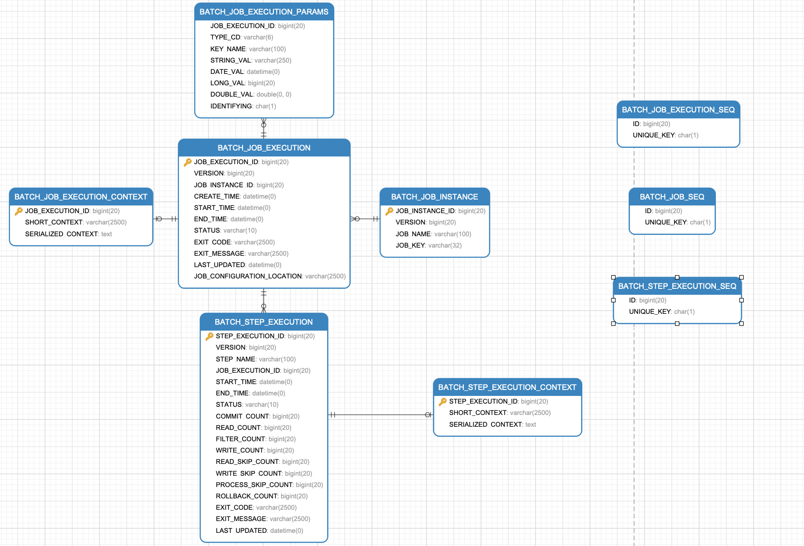

# spring batch 批处理框架

##spring batch 概念

**Job: **作业, 有多个 Step 组成, 封装整个批处理操作

**Step: **作业步, Job 的一个执行环节, 有多个或者一个 Step 组装成 Job, 封装了批处理任务中的一个独立的连续阶段

**Flow:** 

**StepExecution: ** 作业步执行器, 它负责具体的 Step 的执行, 每次运行 Step 都会启动一个新的执行器

**JobBuilderFactory**

**StepBuilderFactory**

**TaskLet: **Step 中具体执行逻辑的操作, 可以重复执行,可以设置具体的同步、异步操作等

**chunk:** 给定数量 Item的集合, 可以定义对 Chunk的读操作、处理操作、写操作, 提交间隔等, 这是 Spring Batch 框架的一个重要特性

**Item:** 一条数据记录

**ItemReader:** 从数据源(文件系统、数据库、队列)中读取 Item.

**ItemProcessor: ** 在 Item 写入数据源之前, 对数据进行处理(如: 数据清洗, 数据转换, 数据过滤, 数据校验等)

**ItemWriter:** 将 Item 批量写入数据源(文件系统、数据库、队列)

**JobRepository:** 作业仓库, 腐恶存储作业执行过程层中的状态数据及结果, 为 JobLauncher, Job, Step提供标准的 CRUD实现

**JobOperator:  **作业状态查询类, 执行作业类, 返回作业状态的简单类型, 如 JobExecution 的 id, JobInstance 的 id, StepExecution 的 id 等

**JobLauncher:** 执行作业类(最常用的)

**JobExplorer: **作业状态查询类, 返回作业状态的复杂对象, 如 JobExecution, JobInstance, StepExecution 等

**JobInstance:** 作业实例. 每个作业执行时, 都会生成一个实例, 实例会被存放在 JobRepository 中, 如果作业失败, 下次重新执行该作业的时候,会使用同一个作业实例了对于 Job 和 JobInstance 的关系, 可以认为是类与对象实例的关系

**JobParameters: ** 作业参数: 他是一组用来启动批处理任务的参数, 在启动 Job 时候, 可以设置任何需要的作业参数, 需要注意作业参数会用来标识作业实例, 即不同的 Job 实例是通过 JobParameters来区分的

**JobRegistry:** jobRegistry 中存放 spring配置的所有 job,可以通过它来获取 job

**PlatformTransactionManager**

**JobExecution: **作业执行器, 其负责具体 Job 的执行, 每次运行 Job 都会启动一个新的 JobExecution

**JobExecutionDecider:** 决策器, 判断 job 流程的执行流程判断 

**Partitioner:** 分区接口


## spring batch

### springBatch 架构


* 每个作业 Job 有 1 个或者多个作业步 Step; 
* 每个 Step 对应一个 ItemReader 、ItemProcessor、ItemWriter;

* 通过 JobLauncher 可以启动 Job, 启动 Job 时需要从 JobRepository获取存在的 JobExecution; 
* 当前运行的 Job 及 Step 的结果及状态会保存在 JobRepository 中;


###整体架构

####Job 


* Job 通过 JobLauncher 驱动, 以执行的 JobParameters 和 JobName 生成 JobInstance 和 JobExecution;
* 同一个 Job 可以根据不同的 JobName 和 JobParameters 生成不同的 JobInstance, 可以想做类与对象的关系;
* JobExecution 是 JobInstance 的执行器, 负责 JobInstance 的执行操作;
* JobInstance 的每次执行会对应一个新的 JobExecution;

```java
    @Bean("playbackJob")
    public Job playbackJob(PlaybackJobNotificationListener listener, Step playbackStep){
        Job job = jobBuilderFactory.get("playbackJob")
                .incrementer(new RunIdIncrementer())
                .listener(listener)
                .flow(playbackStep)
                .end()
                .build();
        return job;
    }
```

```java
    @Override
    public PlaybackDTO springBatchPlayback(){
        PlaybackDTO playbackDTO = new PlaybackDTO();
        
      //jobParameters 构建器
        JobParametersBuilder jobParametersBuilder = new JobParametersBuilder();
        jobParametersBuilder.addString("1", Instant.now().toString());

        try {
          //jobLauncher驱动 Job 执行
            JobExecution jobExecution = jobLauncher.run(job, jobParametersBuilder.toJobParameters());
          //获取执行的 JobInstance
            JobInstance jobInstance = jobExecution.getJobInstance();
          //根据不同的 JobParemeters 或 Job 会产生不同的 InstanceId, 相同则InstanceId相同
            System.out.println(jobInstance.getInstanceId());
          //每次执行的 jobExecutionId 都不同, 无论 InstanceId 是否相同
            System.out.println(jobExecution.getId());
            ExecutionContext executionContext = jobExecution.getExecutionContext();
        } catch (JobExecutionAlreadyRunningException e) {
            e.printStackTrace();
        } catch (JobRestartException e) {
            e.printStackTrace();
        } catch (JobInstanceAlreadyCompleteException e) {
            e.printStackTrace();
        } catch (JobParametersInvalidException e) {
            e.printStackTrace();
        }
        return playbackDTO;
    }
```


JobExecution 属性说明

| 属性             | 说明                                                         |
| ---------------- | ------------------------------------------------------------ |
| status           | BatchStatus对象表示执行状态, STARTED 表示运行时, FAULED 表示执行失败, COMPLETED 表示任务成功结束, ABANDONED表示任务已放弃, STOPPED表示已暂停;<br />COMPLETED, STARTING, STARTED, STOPPING, STOPPED, FAILED, ABANDONED, UNKNOWN; |
| startTime        | 表示任务开始时的系统时间;                                    |
| endTime          | 表示任务结束时的系统时间;                                    |
| exitStatus       | ExitStatus 表示任务的运行结果, 包含返回给调用者的退出代码    |
| createTime       | 表示 JobExecution 第一次持久化时的系统时间. 一个任务可能还没有启动 |
| lastUpdated      | 表示最近一次 JobExecution 被持久化的系统时间:                |
| executionContext | 包含运行过程中所有需要被持久化的用户数据                     |
| failureExecption | 在任务执行过程中例外异常的列表                               |


####Step


* 一个 Job 可以由多个 Step 组成;
* 每个 Step 内部包含一组 reader,processor, writer
* 一个 Step 对应一个或多个 StepExecution, 一次执行对应一个 StepExecution
* 一次 Job 的 JobExecution 可以有多个 StepExecution
* Step 中可以配置 tasklet, partition, job, flow等

```java
@Bean("compareItemReader")
    public JdbcPagingItemReader<PlaybackResult> compareItemReader(@Qualifier("compareUtilsDataSource")DataSource dataSource){
        JdbcPagingItemReader<PlaybackResult> jdbcPagingItemReader = new JdbcPagingItemReader<>();
        jdbcPagingItemReader.setDataSource(dataSource);
        jdbcPagingItemReader.setPageSize(10);

        MySqlPagingQueryProvider provider = new MySqlPagingQueryProvider();
        provider = new MySqlPagingQueryProvider();
        provider.setSelectClause("id, trans_name, flow_num, new_json, old_json, success");

        provider.setFromClause("from playback_result");
//
        Map<String, Order> map = new HashMap<>(1);
        map.put("id", Order.ASCENDING);
        provider.setSortKeys(map);
        jdbcPagingItemReader.setQueryProvider(provider);

        jdbcPagingItemReader.setRowMapper(new RowMapper<PlaybackResult>() {
            @Override
            public PlaybackResult mapRow(ResultSet resultSet, int i) throws SQLException {
                PlaybackResult playbackResult = new PlaybackResult();
                playbackResult.setId(resultSet.getInt(1));
                playbackResult.setTransName(resultSet.getString(2));
                playbackResult.setFlowNum(resultSet.getString(3));
                playbackResult.setNewJson(resultSet.getString(4));
                playbackResult.setOldJson(resultSet.getString(5));
                playbackResult.setSuccess(resultSet.getShort(6));
                return playbackResult;
            }
        });

        return jdbcPagingItemReader;
    }
```

```java
 @Bean("compareItemProcessor")
    public FunctionItemProcessor<PlaybackResult, List<CompareDiff>> compareItemProcessor(@Qualifier("compareFunction")CompareFunction compareFunction){
        FunctionItemProcessor processor = new FunctionItemProcessor<>(compareFunction);
        return processor;
    }
```

```java
@Component("compareItemWriter")
public class CompareItemWriter implements ItemWriter<List<CompareDiff>> {
    @Autowired
    private CompareDiffMapper compareDiffMapper;

    @Override
    public void write(List<? extends List<CompareDiff>> diffslist) throws Exception {
        List<CompareDiff> diffs = new ArrayList<>();
        for (List<CompareDiff> diffList: diffslist) {
            diffs.addAll(diffList);
        }
        compareDiffMapper.insertBatch(diffs);
    }
}
```

```java
    @Bean("compareStep")
    public Step compareStep(@Qualifier("compareItemReader") JdbcPagingItemReader<PlaybackResult> reader,
                            @Qualifier("compareItemProcessor") FunctionItemProcessor processor,
                            @Qualifier("compareItemWriter") CompareItemWriter writer){
        TaskletStep step = stepBuilderFactory.get("compareStep")
                //TODO 处理常量为全局 final
                .chunk(10)
                .reader(reader)
                .processor(processor)
                .writer(writer)
                .build();
        return step;
    }
```

```java
    @Override
    public CompareResultDTO springBatchCompare()throw Exception {
        CompareResultDTO dto = new CompareResultDTO();
        JobParametersBuilder jobParametersBuilder = new JobParametersBuilder();
        jobParametersBuilder.addString("date", Instant.now().toString());
      
        JobExecution jobExecution = jobLauncher.run(job, jobParametersBuilder.toJobParameters());
      
        jobExecution.getJobInstance();
      //通过 jobExecution 获取所有 StepExecution
      	Collection<StepExecution> stepExecutions = jobExecution.getStepExecutions();
            stepExecutions.forEach(execution->{
                execution.getStepName();
            });
        return dto;
    }
```


StepExecution 属性说明

| 属性             | 说明                                                      |
| ---------------- | --------------------------------------------------------- |
| startTime        | 表示任务步开始时的系统时间,                               |
| endTime          | 表示任务步结束时的系统时间,                               |
| exitStatus       | ExitStatus 表示任务的运行结果, 包含返回给调用者的退出代码 |
| executionContext | 再执行过程中任何需要进行持久化的用户数据                  |
| redCount         | 成功读取的记录数                                          |
| writeCount       | 成功写入的记录数                                          |
| commitCount      | 执行过程的任务中成功提交次数                              |
| rollbackCount    | 执行过程的事务中回滚次数                                  |
| readSkipCount    | 读取失败而略过的记录数                                    |
| processSkipCount | 处理失败而略过的记录数                                    |
| filterCount      | 被 ItemProcessor 过滤的记录数                             |
| writerSkipCount  | 写入失败而略过的记录数                                    |


####ExecutionContext

* executionContext分两类: jobExecution 和 StepExecution 分别对应一种;

* 同一个 Job 中的 step 对应的 StepExecution 共用此 Job 的 JobExecution, 可以使用 JobExecution的 ExecutionContext 做数据共享


####JobRepository 元数据增删改查接口 1.x

默认提供两种数据存储方案: 内存, 数据库

* 配置 JobRepository 方法一: 继承DefaultBatchConfigurer 重写方法

```java
@Configuration
public class BatchConfigurerConfig extends DefaultBatchConfigurer {
  @Override
    public JobRepository createJobRepository() throws Exception {
        JobRepositoryFactoryBean factory = new JobRepositoryFactoryBean();
        factory.setDataSource(dataSource);
        factory.setTransactionManager(getTransactionManager());
        factory.setIsolationLevelForCreate("ISOLATION_SERIALIZABLE");
        factory.setTablePrefix("BATCH_");
        factory.setMaxVarCharLength(1000);
        return factory.getObject();
    }
```

此方法不仅可以修改 JobRepositry, 还可以重写其他方法修改其它配置 如下

```java
	@Override
	public JobRepository getJobRepository() {
		return jobRepository;
	}

	@Override
	public PlatformTransactionManager getTransactionManager() {
		return transactionManager;
	}

	@Override
	public JobLauncher getJobLauncher() {
		return jobLauncher;
	}

	@Override
	public JobExplorer getJobExplorer() {
		return jobExplorer;
	}
```

* 配置 JobRepository 方法二: 继承DefaultBatchConfigurer 重写方法

```java

    @Bean("customerRepository")
    public JobRepository jobRepository(DataSource dataSource) throws Exception {
        JobRepositoryFactoryBean factory = new JobRepositoryFactoryBean();
        factory.setDataSource(dataSource);
//        factory.setTransactionManager(getTransactionManager());
        factory.setIsolationLevelForCreate("ISOLATION_SERIALIZABLE");
        factory.setTablePrefix("BATCH_");
        factory.setMaxVarCharLength(1000);
        return factory.getObject();
    }

```

```java
    @Bean("compareJob")
    public Job compareJob(CompareJobNotificationListener listener,
                          @Qualifier("compareStep") Step step,
                          @Qualifier("customerRepository") JobRepository jobRepository){
        Job job = jobBuilderFactory.get("compareJob")
                .incrementer(new RunIdIncrementer())
                .listener(listener)
                .repository(jobRepository)
                .flow(step)
                .end()
                .build();

        return job;
    }
```

这种配置更灵活, 可以单独为 job 配置不同的 repository	

####数据库表模型




#### JobLauncher

* JobLauncher(作业调度器)是 springbatch 框架基础设施层提供的运行 Job 的能力;
* 可以通过给定的 Job 和 JobParameters执行 job
* 通过 JobLauncher 可以在 java 程序中调用批处理任务, 也可以通过命令行或者其它框架(如定时 Quartz)中调用批处理任务
* Spring Batch 提供了 JobLauncher 的简单实现 SimpleJobLauncher


#### ItemReader

Step中对资源的读处理(有很多默认实现)

#### ItemProcessor

Step 中对读阶段读取数据的处理(有很多默认实现)

#### ItemWriter

Step 中对处理后数据的写处理(有很多默认实现)


####JobExplorer 元数据访问接口2.x


#### JobOperator 元数据访问接口2.x


### 内部实现

#### Job配置

job 主要属性包括 id(作业唯一标识), `repository`(指定作业仓库), `incrementer`(作业参数递增器), `restartable`(作业是否可以重启), `parent`(指定该作业的父作业), `abstract`(定义作业是否是抽象的)

job主要子元素包含`step`(作业步), `split`(并行作业步), `flow`(引用独立定义的作业步), `decision`(定义作业步执行的条件执行器, 用于判断后续执行的作业步), `listeners`(定义作业监听器), `validator`(作业参数校验器)

1. restartable: 定义当前作业是否可重启, 默认是 true 可以重启; 如果不需要重启需要设置 false; 如果设置了 false, 又让 job 进行重启操作, 会抛出JobRestartException 异常; 即使配置了可以重启, 也一定要保证 JobInstance 的状态不能为 COMPLETED, 完成状态不能重启

   ```java
       @Bean("compareJob")
       public Job compareJob(CompareJobNotificationListener listener,
                             @Qualifier("compareStep") Step step){
           Job job = jobBuilderFactory
                   .get("compareJob")
             			//配置不可重启
                   .preventRestart()
                   .flow(step)
                   .end()
                   .build();
         //可以直接对 job 设置是否可重启
         ////强制转化为 Flow 类型
           //FlowJob flowJob = (FlowJob)job;
         ////设置 flowJob 不可重启
           //flowJob.setRestartable(false);
           return job;
       }
   ```

   *Job 是接口, 它没有 restartable 属性, 这个属性在 AbstractJob 抽象类中, 实现类有三个`FlowJob`, `simpleJob`, `JsrFlowJob`*

2. job 监听器: 

   * 实现 JobExecutionListener 接口或继承默认实现类
   * 监听 Job 的执行, 对 Job 的执行前和执行后增加处理操作
   * 可以配置多个监听器, 监听器的前处理按照配置顺序执行, 监听器的后处理按照配置顺序的逆序执行
   * 监听器的处理发生异常会影响 Job 的执行为 FAILURE 状态, 注意对监听器异常的处理
   *  无论 Job 执行是否成功, AfterJob 方法一定会执行
   * 监听器可以使用注解实现 @BeforeJob   @AfterJob

   ```java
   @Slf4j
   @Component
   public class CompareJobNotificationListener extends JobExecutionListenerSupport {
       @Autowired
       private UnifyRequestAnalysisMapper unifyRequestAnalysisMapper;
       //监听文件解析 后处理校验
       @Override
       public void afterJob(JobExecution jobExecution) {
           if(jobExecution.getStatus() == BatchStatus.COMPLETED) {
               log.info("!!! 回放任务结束, 进行校验");
               //TODO 查询校验
   //            unifyRequestAnalysisMapper
           }
       }
   }
   ```

   

3. JobParameters 校验器

   * 实现JobParametersValidator接口
   * spring Batch提供了两个实现类 `CompositeJobParametersValidator`和`DefaultJobParametersValidator`

   ```java
       @Bean("defaultJobParametersValudator")
       public DefaultJobParametersValidator defaultJobParametersValidator(){
           DefaultJobParametersValidator validator = new DefaultJobParametersValidator();
           validator.setOptionalKeys(new String[]{"abc","def"});
           validator.setRequiredKeys(new String[]{"aaa","bbb"});
           return validator;
       }
       
   
       @Bean("compareJob")
       public Job compareJob(CompareJobNotificationListener listener,
                             @Qualifier("compareStep") Step step,
                             @Qualifier("defaultJobParametersValudator") DefaultJobParametersValidator validator){
           Job job = jobBuilderFactory
                   .get("compareJob")
                   .listener(listener)
                   .preventRestart()
             //配置参数校验器
                   .validator(validator)
                   .flow(step)
                   .end()
                   .build();
           return job;
       }
   ```

   

4. Job 抽象与继承

   目前只看到 xml 中的配置方式, 可以设置 Job 是否是抽象的,  如果是抽象的, 只能由其它 Job 来继承, 不能直接执行此 Job, 其它 Job 可以指定 parent 来继承 Job 的属性, 并且可以使用 merge=true 来合并父 Job 和子 Job 的属性与能力, 如果是 false 则子 Job 覆盖父 Job 的属性

   没有看到 javaBean 配置继承与抽象!!!!!    ┭┮﹏┭┮呜呜呜

5. StepScope

   * 将 Spring Batch 的对象生命周期交给 spring IOC 管理, 并且 每次执行时绑定新的实例, 并不是单例, 这样可以保证多线程或多任务时 Spring Batch 对象的内部属性不会产生冲突
   * 在使用 StepScope作用域时, 创建的 SpringBatch 对象配置应该为实际的实现类, 不能返回接口, 否则影响监听器前处理, 如下不能返回 Step   应该返回 TaskletStep

   ```java
   		@StepScope
   		@Bean("compareStep")
       public TaskletStep compareStep(@Qualifier("compareItemReader") JdbcPagingItemReader<PlaybackResult> reader,
                               @Qualifier("compareItemProcessor") FunctionItemProcessor processor,
                               @Qualifier("compareItemWriter") CompareItemWriter writer){
           TaskletStep step = stepBuilderFactory.get("compareStep")
                   //TODO 处理常量为全局 final
                   .chunk(10)
                   .reader(reader)
                   .processor(processor)
                   .writer(writer)
                   .build();
           return step;
       }
   ```

   

6. Late Binding 属性后期绑定

   通过表达式可以获取到 JobParameters, JobExecutionContext, StepExecutionContext 中的属性值, 在运行期间进行数据绑定

   `@Value("#{jobParameters[filePath]}")`

   ```java
       @Bean("requestAnalysisItemReader")
       @StepScope
       public FlatFileItemReader<UnifyRequestAnalysis> reader(@Value("#{jobParameters[filePath]}") String filePath) throws IOException {
           File file = new File(filePath);
   
           FlatFileItemReader<UnifyRequestAnalysis> reader = new FlatFileItemReader<>();
           reader.setResource(new FileSystemResource(file));
           reader.setLineMapper(new DefaultLineMapper<UnifyRequestAnalysis>() {{
               setLineTokenizer(new DelimitedLineTokenizer(GlobalProperties.SPLIT) {{
                   setNames(new String[]{"transName", "flowNum", "protocol", "path", "headers", "method", "body"});
               }});
               setFieldSetMapper(new BeanWrapperFieldSetMapper<UnifyRequestAnalysis>() {{
                   setTargetType(UnifyRequestAnalysis.class);
               }});
           }});
   
           return reader;
   
       }
   ```

   

7. 运行 Job

   

   * JobLauncher:

      是 Spring Batch 框架基础设施层提供的运行 Job 的能力. 通过给定的 Job 名称和作业参数 JobParameters, 可以通过 JobLauncher 执行 Job. 通过 JobLauncher 执行 Job 时, Job 执行的状态信息通过 JobRepository持久到数据库中. 

     

   * JobExplorer: 

     主要负责从 JobRepository 中过去执行的信息, 包括获取作业实例, 获取作业执行器, 获取作业步执行器, 获取正在运行的作业执行器, 获取作业列表等操作. 

     

   * JobOperator: 

     包含了 JobLauncher 和 JobExplorer 中的大部分操作

     

   * 异步调度

     ```java
     SimpleJobLauncher simpleJobLauncher = new SimpleJobLauncher();
     simpleJobLauncher.setTaskExecutor(taskExecutor);
     jobExecution = simpleJobLauncher.run(job, jobParametersBuilder.toJobParameters());
     ```

     

   * 命令行执行

     

   * 停止执行中的 jobExecution

     使用 jobOperator停止 job

     由 jobOperator.stop(JobExecutionId id); 发送给 Spring Batch 框架停止 job

     ```java
             try {
                 Set<Long> jobExecutionIds = jobOperator.getRunningExecutions("compareJob");
                 Iterator<Long> iterator = jobExecutionIds.iterator();
                 while (iterator.hasNext()){
                     jobOperator.stop(iterator.next());
                 }
     
             } catch (NoSuchJobException e) {
                 e.printStackTrace();
             } catch (JobExecutionNotRunningException e) {
                 e.printStackTrace();
             } catch (NoSuchJobExecutionException e) {
                 e.printStackTrace();
             }
     ```

     使用 stepExecution 停止 Job

     在执行业务中通过stepExecution.setTerminateOnly(); 发送给 Spring Batch 框架停止当前 Job

     ```java
     @Component("analysisStepListener")
     public class RequestAnalysisStepListener extends StepExecutionListenerSupport {
     
         @Override
         public ExitStatus afterStep(StepExecution stepExecution) {
             stepExecution.setTerminateOnly();
             return super.afterStep(stepExecution);
         }
     
         @Override
         public void beforeStep(StepExecution stepExecution) {
             super.beforeStep(stepExecution);
         }
     }
     ```

     


#### Step 配置

1. 与 Job 配置的监听器, 抽象, 继承类似

2. Tasklet配置

   Tasklet 元素定义任务的具体执行逻辑, 执行逻辑可以自定义实现, 也可以使用 Spring Batch 的 chunk 操作, 提供标准的读, 处理, 写三步操作, 通过 Tasklet 元素同样可以定义事务, 处理线程, 启动控制, 回滚控制, 监听器等功能

   配置线程池异步执行,  配置已完成的任务允许重启, 配置允许重启次数, 事务管理, 事务属性, 

   ```java
       @Bean("requestAnalysisStep")
       public Step requestAnalysisStep(@Qualifier("requestAnalysisItemWriter") JdbcBatchItemWriter<UnifyRequestAnalysis> writer,
                                       @Qualifier("restartAnalysisReader") RestartAnalysisReader reader,
                                       @Qualifier("stepTaskExecutor") TaskExecutor taskExecutor,
                                       PlatformTransactionManager platformTransactionManager,
                                       TransactionAttribute transactionAttribute) {
           return stepBuilderFactory.get("requestAnalysisStep")
   
                   .tasklet(new MethodInvokingTaskletAdapter())
                   //指定 Step 启动次数限制
                   .startLimit(10)
                   //配置 Step 已完成的步骤也可以重新启动
                   .allowStartIfComplete(true)
                   //配置事务管理器
                   .transactionManager(platformTransactionManager)
                   //配置 Step 的线程池异步执行
                   .taskExecutor(taskExecutor)
                   //配置执行 Step的最大线程数
                   .throttleLimit(6)
                   //配置事务属性: 传播行为, 事务级别
                   .transactionAttribute(transactionAttribute)
                   .build();
       }
   
       @Bean("stepTaskExecutor")
       public TaskExecutor taskExecutor(){
           ThreadPoolTaskExecutor executor = new ThreadPoolTaskExecutor();
           executor.setCorePoolSize(10);
           executor.setKeepAliveSeconds(10);
           executor.setMaxPoolSize(20);
           executor.setQueueCapacity(30);
           return executor;
       }
   
       @Autowired
       private PlatformTransactionManager platformTransactionManager;
   
       @Bean
       public TransactionAttribute transactionAttribute(){
           DefaultTransactionAttribute transactionAttribute = new DefaultTransactionAttribute();
           transactionAttribute.setIsolationLevel(TransactionDefinition.ISOLATION_REPEATABLE_READ);
           transactionAttribute.setPropagationBehavior(TransactionDefinition.PROPAGATION_REQUIRED);
   
           return transactionAttribute;
       }
   ```

3. 自定义 Tasklet

   

4. Chunk

   * 异常处理: 重试策略, 重试次数, 异常跳过, 异常不跳过, 事务回滚, 事务不会滚等操作

     主要都是在 faultToLerant()方法返回的FaultTolerantStepBuilder 步骤容错处理构造器中配置的

     ```java
      @Bean("playbackStep")
         public Step playbackStep(@Qualifier("playbackItemReader") JdbcCursorItemReader<UnifyRequestAnalysis> reader,
                                  @Qualifier("playbackItemProcessor") FunctionItemProcessor processor,
                                  @Qualifier("playbackItemWriter") JdbcBatchItemWriter<PlaybackResult> writer){
             Step step = stepBuilderFactory.get("playbackStep")
                     .chunk(1)
                     .reader(reader)
                     .processor(processor)
                     .writer(writer)
                     //容错
                     .faultTolerant()
                     //跳过异常
                     .skip(RuntimeException.class)
                     //跳过次数
                     .skipLimit(5)
                     //跳过策略
                     .skipPolicy(new SkipPolicy() {
                         @Override
                         public boolean shouldSkip(Throwable t, int skipCount) throws SkipLimitExceededException {
                             return false;
                         }
                     })
               			//错误跳过监听器
               			.listener(new SkipListener() {
                         @Override
                         public void onSkipInRead(Throwable t) {
                             
                         }
     
                         @Override
                         public void onSkipInWrite(Object item, Throwable t) {
     
                         }
     
                         @Override
                         public void onSkipInProcess(Object item, Throwable t) {
     
                         }
                     })
                     //不跳过
                     .noSkip(CustomerExecption.class)
                     .build();
             return step;
         }
     ```

     

   * 重试策略

     ```java
         @Bean("playbackStep")
         public Step playbackStep(@Qualifier("playbackItemReader") JdbcCursorItemReader<UnifyRequestAnalysis> reader,
                                  @Qualifier("playbackItemProcessor") FunctionItemProcessor processor,
                                  @Qualifier("playbackItemWriter") JdbcBatchItemWriter<PlaybackResult> writer){
             Step step = stepBuilderFactory.get("playbackStep")
                     .chunk(1)
                     .reader(reader)
                     .processor(processor)
                     .writer(writer)
                     //容错
                     .faultTolerant()
                     //重试异常
                     .retry(RuntimeException.class)
                     //重试次数
                     .retryLimit(5)
                     //重试策略
     //                .retryPolicy()
                     .build();
             return step;
         }
     ```

     

   * 完成策略 CompletionPolicy, 定义 chunk 完成的间隔定义处理, chunk(Policy)与 chunk(commit-interval) 不能同时配置, 且必须配置其中一个

     

   * Reader, Processor事务

     .readerIsTransactionalQueue()

     是否从一个事务性的队列读取数据, 当 reader 从 JMS 的消息对类获取数据的时候, 此属性生效, 默认值为 false

     true 表示从一个事务性的队列中读取数据, 一旦发生异常会导致事务回滚, 从队列中读取的数据同样会被重新放回到队列中; false 表示从一个没有事务的对类获取数据, 一旦发生异常回滚, 消费掉的数据不会重新放置到队列中

     processor 事务

5. Step 监听器

   | Chunk               | 功能说明                                                     |
   | ------------------- | ------------------------------------------------------------ |
   | ChunkListener       | 批操作监听器, 主要操作, chunk 执行前, chunk 执行后  ChunkListenenr |
   | ItemProcessListener | 处理器监听器, 主要啊哦做                                     |
   | ItemReaderListener  | 读操作监听器, 读之前, 读之后, 读发生异常                     |
   | ItemWriterListener  | 写操作监听器, 写之前, 写之后, 写发生异常                     |
   |                     |                                                              |
   |                     |                                                              |
   |                     |                                                              |
   |                     |                                                              |
   |                     |                                                              |

   

6. 


### 远程分块

###分区

### ORM 框架集成

### 配置方式

1. xml
2. java bean
   * @EnableBatchProcessing 会依赖默认的 Spring Bean 对象, 包括 JobRepository、JobLauncher、JobRegistry、PlatformTransactionManager、JobBuilderFactory、StepBuilderFactory


### 重试 Spring Retry


##spring batch admin


## 问题   

### 实现 javaBean 方式的 Job 继承 抽象   

###实现 javaBean 方式的 CommandLineJobRunner 命令行实现

###实现 JavaBean 方式的 no-rollback-exception-class 遇到某种异常不回滚


###实现 javaBean 方式的 Processor 事务