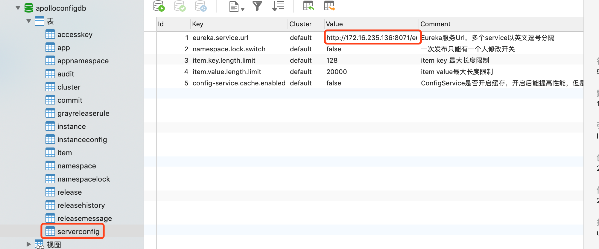
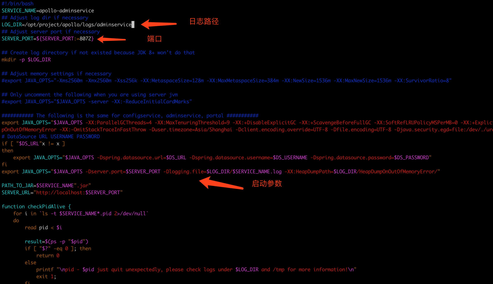
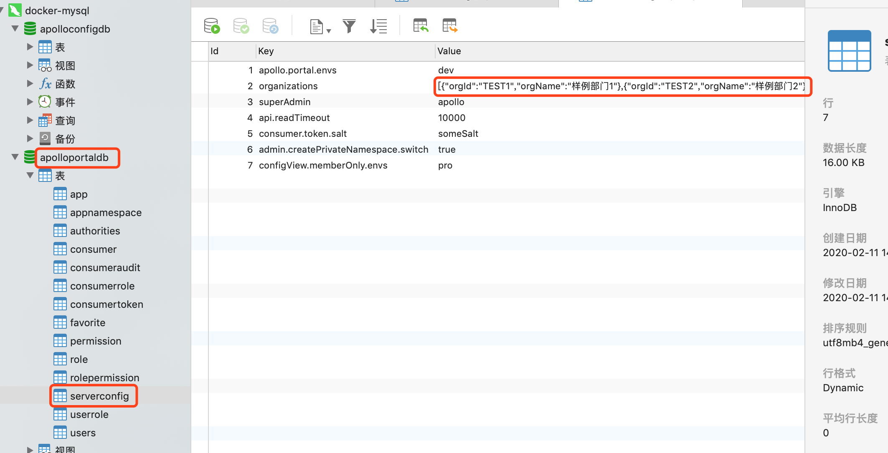
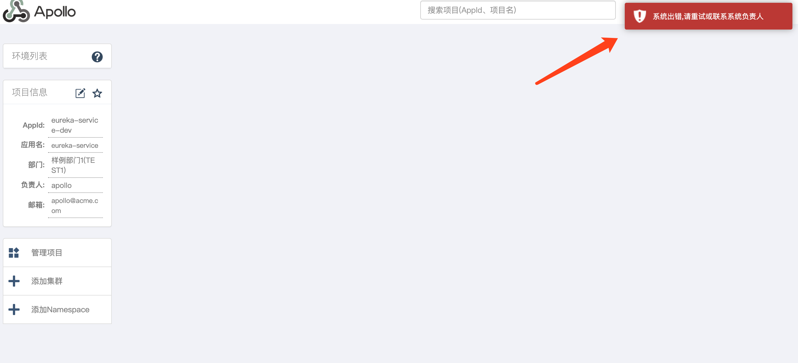
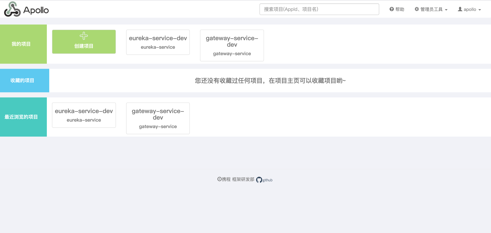
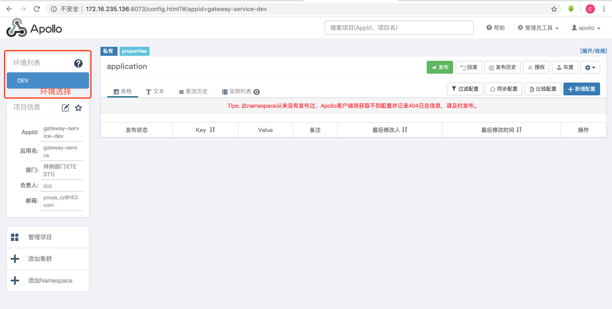

# Apollo 部署配置

角色: Portal, mateServer, configServer, adminServer


[apollo安装文档](https://github.com/ctripcorp/apollo/wiki/分布式部署指南#22-获取安装包)


通过上述文档安装, 初始化数据库, sql都在上面

* 修改 sql 内容

  `apolloconfigdb` 数据库中 `serverconfig` 表`eureka.serivce.url`地址为相应的 `configServer` url

  

* 修改 application-github.properties

  ```properties
  spring.datasource.url = jdbc:mysql://172.16.235.142:3306/ApolloPortalDB?useSSL=false&characterEncoding=utf8
  spring.datasource.username = dbuser
  spring.datasource.password = dbpwd
  ```

* 修改每个应用的 startup.sh

  

* Portal中修改apollo-env.properties  配置所有环境的 meta 地址

  ```properties
  #local.meta=http://localhost:8080
  dev.meta=http://172.16.235.136:8071
  #fat.meta=http://fill-in-fat-meta-server:8080
  #uat.meta=http://fill-in-uat-meta-server:8080
  #lpt.meta=${lpt_meta}
  #pro.meta=http://fill-in-pro-meta-server:8080
  ```

* 登录 portal  默认用户密码是 `apollo`   `admin`

* 部门管理

  

* 创建项目后界面报错    "系统出错, 请重试或联系系统负责人"

  原因是读取配置信息错误

  

  将 eureka.service.url地址改为 configService 的地址, 然后全部重启

  

  

* 删除 apollo 项目

  ```sql
  -- ApolloPortalDB
  set @appId = 'bb';
   
  Use `ApolloPortalDB`;
   
  update `App` set `IsDeleted` = 1 where `AppId` = @appId and `IsDeleted` = 0;
  update `AppNamespace` set `IsDeleted` = 1 where `AppId` = @appId and `IsDeleted` = 0;
  update `Favorite` set `IsDeleted` = 1 where `AppId` = @appId and `IsDeleted` = 0;
   
  # handle roles and permissions
  create temporary table `PermissionIds` as select `Id` from `Permission` where (`TargetId` = @appId or `TargetId` like CONCAT(@appId, '+%'))  and `IsDeleted` = 0;
  update `Permission` set `IsDeleted` = 1 where `Id` in (select `Id` from `PermissionIds`);
  update `RolePermission` set `IsDeleted` = 1 where `PermissionId` in (select `Id` from `PermissionIds`);
  drop temporary table `PermissionIds`;
   
  create temporary table `RoleIds` as select `Id` from `Role` where (`RoleName` = CONCAT('Master+', @appId) or `RoleName` like CONCAT('ModifyNamespace+', @appId, '+%') or `RoleName` like CONCAT('ReleaseNamespace+', @appId, '+%')) and `IsDeleted` = 0;
  update `Role` set `IsDeleted` = 1 where `Id` in (select `Id` from `RoleIds`);
  update `UserRole` set `IsDeleted` = 1 where `RoleId` in (select `Id` from `RoleIds`);
  update `ConsumerRole` set `IsDeleted` = 1 where `RoleId` in (select `Id` from `RoleIds`);
  drop temporary table `RoleIds`;
  ```

  ```sql
  -- ApolloConfigDB
  set @appId = 'bb';
   
  Use `ApolloConfigDB`;
   
  update `App` set `IsDeleted` = 1 where `AppId` = @appId and `IsDeleted` = 0;
  update `AppNamespace` set `IsDeleted` = 1 where `AppId` = @appId and `IsDeleted` = 0;
  update `Cluster` set `IsDeleted` = 1 where `AppId` = @appId and `IsDeleted` = 0;
  update `Commit` set `IsDeleted` = 1 where `AppId` = @appId and `IsDeleted` = 0;
  update `GrayReleaseRule` set `IsDeleted` = 1 where `AppId` = @appId and `IsDeleted` = 0;
  update `Release` set `IsDeleted` = 1 where `AppId` = @appId and `IsDeleted` = 0;
  update `ReleaseHistory` set `IsDeleted` = 1 where `AppId` = @appId and `IsDeleted` = 0;
  delete from `Instance` where `AppId` = @appId;
  delete from `InstanceConfig` where `ConfigAppId` = @appId;
  delete from `ReleaseMessage` where `Message` like CONCAT(@appId, '+%');
   
  # handle namespaces and items
  create temporary table `NamespaceIds` as select `Id` from `Namespace` where `AppId` = @appId and `IsDeleted` = 0;
  update `Namespace` set `IsDeleted` = 1 where `Id` in (select `Id` from `NamespaceIds`);
  update `Item` set `IsDeleted` = 1 where `NamespaceId` in (select `Id` from `NamespaceIds`);
  delete from `NamespaceLock` where `NamespaceId` in (select `Id` from `NamespaceIds`);
  drop temporary table `NamespaceIds`;
  ```

  

* spring boot 项目整合 apollo 多环境控制

  1.增加 jar包依赖

  *             <!--apollo-->
                <dependency>
                    <groupId>com.ctrip.framework.apollo</groupId>
                    <artifactId>apollo-client</artifactId>
                    <version>1.4.0</version>
                </dependency>
                <dependency>
                    <groupId>com.google.guava</groupId>
                    <artifactId>guava</artifactId>
                    <version>21.0</version>
                </dependency>

  * pom 配置多环境变量, 与本地多环境配置相同

    ```xml
    <profiles>
            <profile>
                <id>dev</id>
                <properties>
                    <env>dev</env>
                </properties>
                <activation>
                    <activeByDefault>true</activeByDefault>
                </activation>
            </profile>
            <profile>
                <id>test</id>
                <properties>
                    <env>test</env>
                </properties>
            </profile>
            <profile>
                <id>pro</id>
                <properties>
                    <env>pro</env>
                </properties>
            </profile>
        </profiles>
    ```

    

  * application.properties 增加环境使用配置

    ```xml
    spring.profiles.active=@env@    
    ```

  * 相应环境下配置application.application    key/value    key为 env   value 为 apollo 中对应的环境

    例如resource/dev/application.properties

    ```properties
    env=DEV  环境
    # 应用全局唯一的身份标识
    app.id=study-basic-service
    # Apollo Meta Server 地址
    apollo.meta=http://metaIp:port
    # 自定义本地配置文件缓存路径
    apollo.cacheDir = ./config
    # 设置在应用启动阶段就加载 Apollo 配置
    apollo.bootstrap.enabled = true
    # 注入 application namespace
    apollo.bootstrap.namespaces = application
    # 托管 logback 配置  将 Apollo 配置加载提到初始化日志系统之前，需要托管日志配置时开启
    apollo.bootstrap.eagerLoad.enabled = true
    ```

    

* 