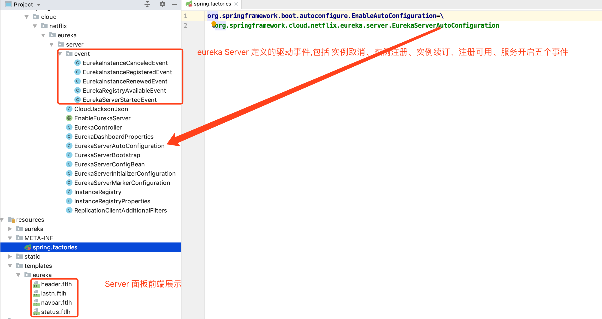

# SpringCloud 源码分析

springCloud 是基于 springBoot 实现的一套微服务工具, 它组合了很多其他中间件、工具得以实现, 阅读 spring 源码找到阅读入口, 在`Resource/MATE-INF`下会有 `application.factories`文件, 这里标记了自动配置类, 然后查看整体源码目录结构, 已确定适合自己的阅读方式]

## eureka



### eurekaServer

#### server node节点同步

`EurekaServerBootstrap`类, EurekaServer 节点的启动初始化与结束销毁功能在这个类中实现

```java
	protected void initEurekaServerContext() throws Exception {
		// For backward compatibility
		JsonXStream.getInstance().registerConverter(new V1AwareInstanceInfoConverter(),
				XStream.PRIORITY_VERY_HIGH);
		XmlXStream.getInstance().registerConverter(new V1AwareInstanceInfoConverter(),
				XStream.PRIORITY_VERY_HIGH);

		if (isAws(this.applicationInfoManager.getInfo())) {
			this.awsBinder = new AwsBinderDelegate(this.eurekaServerConfig,
					this.eurekaClientConfig, this.registry, this.applicationInfoManager);
			this.awsBinder.start();
		}

		EurekaServerContextHolder.initialize(this.serverContext);

		log.info("Initialized server context");

		// Copy registry from neighboring eureka node
    //同步其他EurekaServer 节点的注册信息
		int registryCount = this.registry.syncUp();
    //开启当前节点的注册通信信道默认是 1,
		this.registry.openForTraffic(this.applicationInfoManager, registryCount);

		// Register all monitoring statistics.
		EurekaMonitors.registerAllStats();
	}
```

初始化 EurekaServer 上下文环境, 兼容两种数据流 mxl 和 json, 都是最高优先级, (共四种优先级 最高 10000; 一般 20; 低 -10; 最低 -20)

这里会通信到其他 EurekaServer 同步各个节点的注册信息

```java
int registryCount = this.registry.syncUp();
```

`this.registry`是`InstanceRegistry`的实例, 继承自`Eureka` 的`PeerAwareInstanceRegistryImpl`,InstanceRegistry 没有重写`syncUp()`方法, 此方法在父类的实现为

```java
//同步其它 EurekaServer 节点的实例注册信息
public int syncUp() {
        int count = 0;
				//循环控制拷贝失败次数,Eureka 中给定默认次数为 5 次, springCloud 设置eureka.server.registry-sync-retries属性配置修改重试次数
        for(int i = 0; i < this.serverConfig.getRegistrySyncRetries() && count == 0; ++i) {
            if (i > 0) {
                try {
                  	//第一次拷贝数据失败后,进行后续重复拷贝前要等待一段时间, Eureka中给定默认时间 30s,springCloud 设置eureka.server.registry-sync-retry-wait-ms属性配置修改等待时间
                    Thread.sleep(this.serverConfig.getRegistrySyncRetryWaitMs());
                } catch (InterruptedException var10) {
                    logger.warn("Interrupted during registry transfer..");
                    break;
                }
            }
						//eurekaClient获取所有应用遍历每个 eurekaServer, 再遍历 eurekaServer 中的注册应用实例,注册当当前 EurekaServer 中
            Applications apps = this.eurekaClient.getApplications();
            Iterator var4 = apps.getRegisteredApplications().iterator();

            while(var4.hasNext()) {
                Application app = (Application)var4.next();
                Iterator var6 = app.getInstances().iterator();

                while(var6.hasNext()) {
                    InstanceInfo instance = (InstanceInfo)var6.next();

                    try {
                      //判断应用实例是否可注册
                        if (this.isRegisterable(instance)) {
                            this.register(instance, instance.getLeaseInfo().getDurationInSecs(), true);
                            ++count;
                        }
                    } catch (Throwable var9) {
                        logger.error("During DS init copy", var9);
                    }
                }
            }
        }

        return count;
    }
```

应用注册节点拷贝过程

* 启动当前 EurekaServer 初始化时调用 syncUp, 开始同步注册节点
* 读取设定的失败重复次数,开始同步
* 使用 EurekaClient 获取全部注册中心节点, 再遍历注册中心中的注册节点,  遍历每个注册节点实例是否允许注册到当前注册中心,若允许注册进来, 增加注册的记录数
* 如果第一次同步后, 注册记录数为0, 表示没有将其它注册中心数据同步到本节点, 重新尝试同步
* 第一次同步失败后的其余尝试同步均需要等待一定时间
* 直到有数据同步成功或全部尝试次数用尽退出同步

**注意:** 

* 这里的 EurekaServer 注册数据同步是通过 `EurekaClient` 实现的

* ```properties
  #将当前节点注册到 eurekaServer
  eureka.client.register-with-eureka=true
  #获取注册中心的注册信息
  eureka.client.fetch-registry=true
  ```

* 上面两个配置属性一定是 true, 否则不能同步, 它是通过先将自己(eurekaServer)作为客户端注册到注册中心中,然后拉取注册中心的数据到本地, 再将本地 eurekaClient 中获取的注册节点同步到当前注册中心

  this.eurekaClient.getApplications();  调用的是 AtomicReference<Applications>::get(), 返回的是 EurekaClient 中定义的EurekaApplications

#### server Node 节点注册

先说 eureka 的节点通信使用 http, 那么对于 注册中心就应该会提供相应的接口; `InstanceRegistry` 是 springCloud 实现的实例注册类, 实现的功能是 实例注册, 实例续租, 实例删除 等功能, 对于真正的注册功能应该在 `netflix` 的实现中, `InstanceRegistry`继承了`PeerAwareInstanceRegistryImpl`类

一路向上找吧!!! 累!

在 eureka-core.jar 中找到了 `resource` 接口定义, 源码如下:

```java
@Path("/{version}/apps")
@Produces({"application/xml", "application/json"})
public class ApplicationsResource {
  
      /**
     * Gets information about a particular {@link com.netflix.discovery.shared.Application}.
     *
     * @param version
     *            the version of the request.
     * @param appId
     *            the unique application identifier (which is the name) of the
     *            application.
     * @return information about a particular application.
     */
    @Path("{appId}")
    public ApplicationResource getApplicationResource(
            @PathParam("version") String version,
            @PathParam("appId") String appId) {
        CurrentRequestVersion.set(Version.toEnum(version));
        return new ApplicationResource(appId, serverConfig, registry);
    }
}


@Produces({"application/xml", "application/json"})
public class ApplicationResource {
  @POST
    @Consumes({"application/json", "application/xml"})
    public Response addInstance(InstanceInfo info,
                                @HeaderParam(PeerEurekaNode.HEADER_REPLICATION) String isReplication) {
      
        registry.register(info, "true".equals(isReplication));
        return Response.status(204).build();  // 204 to be backwards compatible
    }
}
```

```java

public class InstanceRegistry extends PeerAwareInstanceRegistryImpl
		implements ApplicationContextAware {
		//注册
	@Override
	public void register(InstanceInfo info, int leaseDuration, boolean isReplication) {
		handleRegistration(info, leaseDuration, isReplication);
		super.register(info, leaseDuration, isReplication);
	}

	//注册
	@Override
	public void register(final InstanceInfo info, final boolean isReplication) {
		handleRegistration(info, resolveInstanceLeaseDuration(info), isReplication);
		super.register(info, isReplication);
	}
	
	
	//处理应用注册
	private void handleRegistration(InstanceInfo info, int leaseDuration,
			boolean isReplication) {
		log("register " + info.getAppName() + ", vip " + info.getVIPAddress()
				+ ", leaseDuration " + leaseDuration + ", isReplication "
				+ isReplication);
		publishEvent(new EurekaInstanceRegisteredEvent(this, info, leaseDuration,
				isReplication));
	}

}
```

```java
@Singleton
public class PeerAwareInstanceRegistryImpl extends AbstractInstanceRegistry implements PeerAwareInstanceRegistry {    
  @Override
      public void register(final InstanceInfo info, final boolean isReplication) {
          int leaseDuration = Lease.DEFAULT_DURATION_IN_SECS;
          if (info.getLeaseInfo() != null && info.getLeaseInfo().getDurationInSecs() > 0) {
              leaseDuration = info.getLeaseInfo().getDurationInSecs();
          }
          super.register(info, leaseDuration, isReplication);
          replicateToPeers(Action.Register, info.getAppName(), info.getId(), info, null, isReplication);
      }
}
```

```java
public abstract class AbstractInstanceRegistry implements InstanceRegistry {

  /**
       * Registers a new instance with a given duration.
       *
       * @see com.netflix.eureka.lease.LeaseManager#register(java.lang.Object, int, boolean)
       */
      public void register(InstanceInfo registrant, int leaseDuration, boolean isReplication) {
          try {
              read.lock();
              Map<String, Lease<InstanceInfo>> gMap = registry.get(registrant.getAppName());
              REGISTER.increment(isReplication);
              if (gMap == null) {
                  final ConcurrentHashMap<String, Lease<InstanceInfo>> gNewMap = new ConcurrentHashMap<String, Lease<InstanceInfo>>();
                  gMap = registry.putIfAbsent(registrant.getAppName(), gNewMap);
                  if (gMap == null) {
                      gMap = gNewMap;
                  }
              }
              Lease<InstanceInfo> existingLease = gMap.get(registrant.getId());
              // Retain the last dirty timestamp without overwriting it, if there is already a lease
              if (existingLease != null && (existingLease.getHolder() != null)) {
                  Long existingLastDirtyTimestamp = existingLease.getHolder().getLastDirtyTimestamp();
                  Long registrationLastDirtyTimestamp = registrant.getLastDirtyTimestamp();
                  logger.debug("Existing lease found (existing={}, provided={}", existingLastDirtyTimestamp, registrationLastDirtyTimestamp);

                  // this is a > instead of a >= because if the timestamps are equal, we still take the remote transmitted
                  // InstanceInfo instead of the server local copy.
                  if (existingLastDirtyTimestamp > registrationLastDirtyTimestamp) {
                      logger.warn("There is an existing lease and the existing lease's dirty timestamp {} is greater" +
                              " than the one that is being registered {}", existingLastDirtyTimestamp, registrationLastDirtyTimestamp);
                      logger.warn("Using the existing instanceInfo instead of the new instanceInfo as the registrant");
                      registrant = existingLease.getHolder();
                  }
              } else {
                  // The lease does not exist and hence it is a new registration
                  synchronized (lock) {
                      if (this.expectedNumberOfClientsSendingRenews > 0) {
                          // Since the client wants to register it, increase the number of clients sending renews
                          this.expectedNumberOfClientsSendingRenews = this.expectedNumberOfClientsSendingRenews + 1;
                          updateRenewsPerMinThreshold();
                      }
                  }
                  logger.debug("No previous lease information found; it is new registration");
              }
              Lease<InstanceInfo> lease = new Lease<InstanceInfo>(registrant, leaseDuration);
              if (existingLease != null) {
                  lease.setServiceUpTimestamp(existingLease.getServiceUpTimestamp());
              }
              gMap.put(registrant.getId(), lease);
              synchronized (recentRegisteredQueue) {
                  recentRegisteredQueue.add(new Pair<Long, String>(
                          System.currentTimeMillis(),
                          registrant.getAppName() + "(" + registrant.getId() + ")"));
              }
              // This is where the initial state transfer of overridden status happens
              if (!InstanceStatus.UNKNOWN.equals(registrant.getOverriddenStatus())) {
                  logger.debug("Found overridden status {} for instance {}. Checking to see if needs to be add to the "
                                  + "overrides", registrant.getOverriddenStatus(), registrant.getId());
                  if (!overriddenInstanceStatusMap.containsKey(registrant.getId())) {
                      logger.info("Not found overridden id {} and hence adding it", registrant.getId());
                      overriddenInstanceStatusMap.put(registrant.getId(), registrant.getOverriddenStatus());
                  }
              }
              InstanceStatus overriddenStatusFromMap = overriddenInstanceStatusMap.get(registrant.getId());
              if (overriddenStatusFromMap != null) {
                  logger.info("Storing overridden status {} from map", overriddenStatusFromMap);
                  registrant.setOverriddenStatus(overriddenStatusFromMap);
              }

              // Set the status based on the overridden status rules
              InstanceStatus overriddenInstanceStatus = getOverriddenInstanceStatus(registrant, existingLease, isReplication);
              registrant.setStatusWithoutDirty(overriddenInstanceStatus);

              // If the lease is registered with UP status, set lease service up timestamp
              if (InstanceStatus.UP.equals(registrant.getStatus())) {
                  lease.serviceUp();
              }
              registrant.setActionType(ActionType.ADDED);
              recentlyChangedQueue.add(new RecentlyChangedItem(lease));
              registrant.setLastUpdatedTimestamp();
              invalidateCache(registrant.getAppName(), registrant.getVIPAddress(), registrant.getSecureVipAddress());
              logger.info("Registered instance {}/{} with status {} (replication={})",
                      registrant.getAppName(), registrant.getId(), registrant.getStatus(), isReplication);
          } finally {
              read.unlock();
          }
      }
}
```


* 上面的接口路径是`/{version}/apps/` `post` 请求 
* 由 `ApplicationsResource`转到`ApplicationResource`调用方法`addInstance()`, 大部分都是校验, 有用的就`registry.register(info, "true".equals(isReplication));`这一句
* `registry` 是注入的 `InstanceRegistry`
* `InstanceRegistry::register()` 调用 `super.register()`到 `PeerAwareInstanceRegistryImpl`
* `PeerAwareInstanceRegistryImpl::register`最后调用抽象类`AbstractInstanceRegistry::register`

找到了方法调用链:

 **ApplicationResource::addInstance —> InstanceRegistry::register —> PeerAwareInstanceRegistryImpl::register —> AbstractInstanceRegistry::register**


//todo 未完待续  读整体整体注册过程  从 InstanceRegistry 到  AbstractInstanceRegistry(重点)


#### 客户端服务节点安全保护


