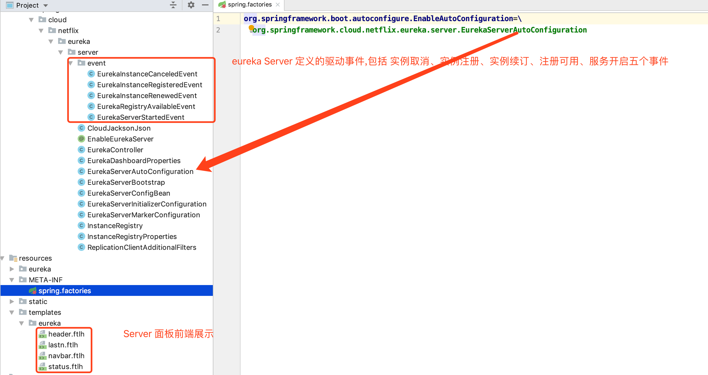

# eureka 源码分析

springCloud 是基于 springBoot 实现的一套微服务工具, 它组合了很多其他中间件、工具得以实现, 阅读 spring 源码找到阅读入口, 在`Resource/MATE-INF`下会有 `application.factories`文件, 这里标记了自动配置类, 然后查看整体源码目录结构, 已确定适合自己的阅读方式]



eurekaServer

#### server node节点同步

`EurekaServerBootstrap`类, EurekaServer 节点的启动初始化与结束销毁功能在这个类中实现

```java
	protected void initEurekaServerContext() throws Exception {
		// For backward compatibility
		JsonXStream.getInstance().registerConverter(new V1AwareInstanceInfoConverter(),
				XStream.PRIORITY_VERY_HIGH);
		XmlXStream.getInstance().registerConverter(new V1AwareInstanceInfoConverter(),
				XStream.PRIORITY_VERY_HIGH);

		if (isAws(this.applicationInfoManager.getInfo())) {
			this.awsBinder = new AwsBinderDelegate(this.eurekaServerConfig,
					this.eurekaClientConfig, this.registry, this.applicationInfoManager);
			this.awsBinder.start();
		}

		EurekaServerContextHolder.initialize(this.serverContext);

		log.info("Initialized server context");

		// Copy registry from neighboring eureka node
    //同步其他EurekaServer 节点的注册信息
		int registryCount = this.registry.syncUp();
    //开启当前节点的注册通信信道默认是 1,
		this.registry.openForTraffic(this.applicationInfoManager, registryCount);

		// Register all monitoring statistics.
		EurekaMonitors.registerAllStats();
	}
```

初始化 EurekaServer 上下文环境, 兼容两种数据流 mxl 和 json, 都是最高优先级, (共四种优先级 最高 10000; 一般 20; 低 -10; 最低 -20)

这里会通信到其他 EurekaServer 同步各个节点的注册信息

```java
int registryCount = this.registry.syncUp();
```

`this.registry`是`InstanceRegistry`的实例, 继承自`Eureka` 的`PeerAwareInstanceRegistryImpl`,InstanceRegistry 没有重写`syncUp()`方法, 此方法在父类的实现为

```java
//同步其它 EurekaServer 节点的实例注册信息
public int syncUp() {
        int count = 0;
				//循环控制拷贝失败次数,Eureka 中给定默认次数为 5 次, springCloud 设置eureka.server.registry-sync-retries属性配置修改重试次数
        for(int i = 0; i < this.serverConfig.getRegistrySyncRetries() && count == 0; ++i) {
            if (i > 0) {
                try {
                  	//第一次拷贝数据失败后,进行后续重复拷贝前要等待一段时间, Eureka中给定默认时间 30s,springCloud 设置eureka.server.registry-sync-retry-wait-ms属性配置修改等待时间
                    Thread.sleep(this.serverConfig.getRegistrySyncRetryWaitMs());
                } catch (InterruptedException var10) {
                    logger.warn("Interrupted during registry transfer..");
                    break;
                }
            }
						//eurekaClient获取所有应用遍历每个 eurekaServer, 再遍历 eurekaServer 中的注册应用实例,注册当当前 EurekaServer 中
            Applications apps = this.eurekaClient.getApplications();
            Iterator var4 = apps.getRegisteredApplications().iterator();

            while(var4.hasNext()) {
                Application app = (Application)var4.next();
                Iterator var6 = app.getInstances().iterator();

                while(var6.hasNext()) {
                    InstanceInfo instance = (InstanceInfo)var6.next();

                    try {
                      //判断应用实例是否可注册
                        if (this.isRegisterable(instance)) {
                            this.register(instance, instance.getLeaseInfo().getDurationInSecs(), true);
                            ++count;
                        }
                    } catch (Throwable var9) {
                        logger.error("During DS init copy", var9);
                    }
                }
            }
        }

        return count;
    }
```

应用注册节点拷贝过程

* 启动当前 EurekaServer 初始化时调用 syncUp, 开始同步注册节点
* 读取设定的失败重复次数,开始同步
* 使用 EurekaClient 获取全部注册中心节点, 再遍历注册中心中的注册节点,  遍历每个注册节点实例是否允许注册到当前注册中心,若允许注册进来, 增加注册的记录数
* 如果第一次同步后, 注册记录数为0, 表示没有将其它注册中心数据同步到本节点, 重新尝试同步
* 第一次同步失败后的其余尝试同步均需要等待一定时间
* 直到有数据同步成功或全部尝试次数用尽退出同步

**注意:** 

* 这里的 EurekaServer 注册数据同步是通过 `EurekaClient` 实现的

* ```properties
  #将当前节点注册到 eurekaServer
  eureka.client.register-with-eureka=true
  #获取注册中心的注册信息
  eureka.client.fetch-registry=true
  ```

* 上面两个配置属性一定是 true, 否则不能同步, 它是通过先将自己(eurekaServer)作为客户端注册到注册中心中,然后拉取注册中心的数据到本地, 再将本地 eurekaClient 中获取的注册节点同步到当前注册中心

  this.eurekaClient.getApplications();  调用的是 AtomicReference<Applications>::get(), 返回的是 EurekaClient 中定义的EurekaApplications

#### server Node 节点注册

先说 eureka 的节点通信使用 http, 那么对于 注册中心就应该会提供相应的接口; `InstanceRegistry` 是 springCloud 实现的实例注册类, 实现的功能是 实例注册, 实例续租, 实例删除 等功能, 对于真正的注册功能应该在 `netflix` 的实现中, `InstanceRegistry`继承了`PeerAwareInstanceRegistryImpl`类

一路向上找吧!!! 累!

在 eureka-core.jar 中找到了 `resource` 接口定义, 源码如下:

```java
@Path("/{version}/apps")
@Produces({"application/xml", "application/json"})
public class ApplicationsResource {
  
      /**
     * Gets information about a particular {@link com.netflix.discovery.shared.Application}.
     *
     * @param version
     *            the version of the request.
     * @param appId
     *            the unique application identifier (which is the name) of the
     *            application.
     * @return information about a particular application.
     */
    @Path("{appId}")
    public ApplicationResource getApplicationResource(
            @PathParam("version") String version,
            @PathParam("appId") String appId) {
        CurrentRequestVersion.set(Version.toEnum(version));
        return new ApplicationResource(appId, serverConfig, registry);
    }
}


@Produces({"application/xml", "application/json"})
public class ApplicationResource {
  @POST
    @Consumes({"application/json", "application/xml"})
    public Response addInstance(InstanceInfo info,
                                @HeaderParam(PeerEurekaNode.HEADER_REPLICATION) String isReplication) {
      
        registry.register(info, "true".equals(isReplication));
        return Response.status(204).build();  // 204 to be backwards compatible
    }
}
```

```java

public class InstanceRegistry extends PeerAwareInstanceRegistryImpl
		implements ApplicationContextAware {
		//注册
	@Override
	public void register(InstanceInfo info, int leaseDuration, boolean isReplication) {
		handleRegistration(info, leaseDuration, isReplication);
		super.register(info, leaseDuration, isReplication);
	}

	//注册
	@Override
	public void register(final InstanceInfo info, final boolean isReplication) {
		handleRegistration(info, resolveInstanceLeaseDuration(info), isReplication);
		super.register(info, isReplication);
	}
	
	
	//处理应用注册
	private void handleRegistration(InstanceInfo info, int leaseDuration,
			boolean isReplication) {
		log("register " + info.getAppName() + ", vip " + info.getVIPAddress()
				+ ", leaseDuration " + leaseDuration + ", isReplication "
				+ isReplication);
		publishEvent(new EurekaInstanceRegisteredEvent(this, info, leaseDuration,
				isReplication));
	}

}
```

```java
@Singleton
public class PeerAwareInstanceRegistryImpl extends AbstractInstanceRegistry implements PeerAwareInstanceRegistry {    
  @Override
      public void register(final InstanceInfo info, final boolean isReplication) {
          int leaseDuration = Lease.DEFAULT_DURATION_IN_SECS;
          if (info.getLeaseInfo() != null && info.getLeaseInfo().getDurationInSecs() > 0) {
              leaseDuration = info.getLeaseInfo().getDurationInSecs();
          }
          super.register(info, leaseDuration, isReplication);
          replicateToPeers(Action.Register, info.getAppName(), info.getId(), info, null, isReplication);
      }
}
```

```java
public abstract class AbstractInstanceRegistry implements InstanceRegistry {

  /**
       * Registers a new instance with a given duration.
       *
       * @see com.netflix.eureka.lease.LeaseManager#register(java.lang.Object, int, boolean)
       */
      public void register(InstanceInfo registrant, int leaseDuration, boolean isReplication) {
          try {
              read.lock();
              Map<String, Lease<InstanceInfo>> gMap = registry.get(registrant.getAppName());
              REGISTER.increment(isReplication);
              if (gMap == null) {
                  final ConcurrentHashMap<String, Lease<InstanceInfo>> gNewMap = new ConcurrentHashMap<String, Lease<InstanceInfo>>();
                  gMap = registry.putIfAbsent(registrant.getAppName(), gNewMap);
                  if (gMap == null) {
                      gMap = gNewMap;
                  }
              }
              Lease<InstanceInfo> existingLease = gMap.get(registrant.getId());
              // Retain the last dirty timestamp without overwriting it, if there is already a lease
              if (existingLease != null && (existingLease.getHolder() != null)) {
                  Long existingLastDirtyTimestamp = existingLease.getHolder().getLastDirtyTimestamp();
                  Long registrationLastDirtyTimestamp = registrant.getLastDirtyTimestamp();
                  logger.debug("Existing lease found (existing={}, provided={}", existingLastDirtyTimestamp, registrationLastDirtyTimestamp);

                  // this is a > instead of a >= because if the timestamps are equal, we still take the remote transmitted
                  // InstanceInfo instead of the server local copy.
                  if (existingLastDirtyTimestamp > registrationLastDirtyTimestamp) {
                      logger.warn("There is an existing lease and the existing lease's dirty timestamp {} is greater" +
                              " than the one that is being registered {}", existingLastDirtyTimestamp, registrationLastDirtyTimestamp);
                      logger.warn("Using the existing instanceInfo instead of the new instanceInfo as the registrant");
                      registrant = existingLease.getHolder();
                  }
              } else {
                  // The lease does not exist and hence it is a new registration
                  synchronized (lock) {
                      if (this.expectedNumberOfClientsSendingRenews > 0) {
                          // Since the client wants to register it, increase the number of clients sending renews
                          this.expectedNumberOfClientsSendingRenews = this.expectedNumberOfClientsSendingRenews + 1;
                          updateRenewsPerMinThreshold();
                      }
                  }
                  logger.debug("No previous lease information found; it is new registration");
              }
              Lease<InstanceInfo> lease = new Lease<InstanceInfo>(registrant, leaseDuration);
              if (existingLease != null) {
                  lease.setServiceUpTimestamp(existingLease.getServiceUpTimestamp());
              }
              gMap.put(registrant.getId(), lease);
              synchronized (recentRegisteredQueue) {
                  recentRegisteredQueue.add(new Pair<Long, String>(
                          System.currentTimeMillis(),
                          registrant.getAppName() + "(" + registrant.getId() + ")"));
              }
              // This is where the initial state transfer of overridden status happens
              if (!InstanceStatus.UNKNOWN.equals(registrant.getOverriddenStatus())) {
                  logger.debug("Found overridden status {} for instance {}. Checking to see if needs to be add to the "
                                  + "overrides", registrant.getOverriddenStatus(), registrant.getId());
                  if (!overriddenInstanceStatusMap.containsKey(registrant.getId())) {
                      logger.info("Not found overridden id {} and hence adding it", registrant.getId());
                      overriddenInstanceStatusMap.put(registrant.getId(), registrant.getOverriddenStatus());
                  }
              }
              InstanceStatus overriddenStatusFromMap = overriddenInstanceStatusMap.get(registrant.getId());
              if (overriddenStatusFromMap != null) {
                  logger.info("Storing overridden status {} from map", overriddenStatusFromMap);
                  registrant.setOverriddenStatus(overriddenStatusFromMap);
              }

              // Set the status based on the overridden status rules
              InstanceStatus overriddenInstanceStatus = getOverriddenInstanceStatus(registrant, existingLease, isReplication);
              registrant.setStatusWithoutDirty(overriddenInstanceStatus);

              // If the lease is registered with UP status, set lease service up timestamp
              if (InstanceStatus.UP.equals(registrant.getStatus())) {
                  lease.serviceUp();
              }
              registrant.setActionType(ActionType.ADDED);
              recentlyChangedQueue.add(new RecentlyChangedItem(lease));
              registrant.setLastUpdatedTimestamp();
              invalidateCache(registrant.getAppName(), registrant.getVIPAddress(), registrant.getSecureVipAddress());
              logger.info("Registered instance {}/{} with status {} (replication={})",
                      registrant.getAppName(), registrant.getId(), registrant.getStatus(), isReplication);
          } finally {
              read.unlock();
          }
      }
}
```


* 上面的接口路径是`/{version}/apps/` `post` 请求 
* 由 `ApplicationsResource`转到`ApplicationResource`调用方法`addInstance()`, 大部分都是校验, 有用的就`registry.register(info, "true".equals(isReplication));`这一句
* `registry` 是注入的 `InstanceRegistry`
* `InstanceRegistry::register()` 调用 `super.register()`到 `PeerAwareInstanceRegistryImpl`
* `PeerAwareInstanceRegistryImpl::register`最后调用抽象类`AbstractInstanceRegistry::register`

找到了方法调用链:

 **ApplicationResource::addInstance —> InstanceRegistry::register —> PeerAwareInstanceRegistryImpl::register —> AbstractInstanceRegistry::register**


//todo 未完待续  读整体整体注册过程  从 InstanceRegistry 到  AbstractInstanceRegistry(重点)


#### 服务注册

```java
/**
 * Registers a new instance with a given duration.
 *
 * @see com.netflix.eureka.lease.LeaseManager#register(java.lang.Object, int, boolean)
 */
public void register(InstanceInfo registrant, int leaseDuration, boolean isReplication) {
    try {
        read.lock();
        //注册器获取实例注册信息
        Map<String, Lease<InstanceInfo>> gMap = registry.get(registrant.getAppName());
        REGISTER.increment(isReplication);
        if (gMap == null) {
            final ConcurrentHashMap<String, Lease<InstanceInfo>> gNewMap = new ConcurrentHashMap<String, Lease<InstanceInfo>>();
            gMap = registry.putIfAbsent(registrant.getAppName(), gNewMap);
            if (gMap == null) {
                gMap = gNewMap;
            }
        }
        Lease<InstanceInfo> existingLease = gMap.get(registrant.getId());
        // Retain the last dirty timestamp without overwriting it, if there is already a lease
        if (existingLease != null && (existingLease.getHolder() != null)) {
            Long existingLastDirtyTimestamp = existingLease.getHolder().getLastDirtyTimestamp();
            Long registrationLastDirtyTimestamp = registrant.getLastDirtyTimestamp();
            logger.debug("Existing lease found (existing={}, provided={}", existingLastDirtyTimestamp, registrationLastDirtyTimestamp);

            // this is a > instead of a >= because if the timestamps are equal, we still take the remote transmitted
            // InstanceInfo instead of the server local copy.
            if (existingLastDirtyTimestamp > registrationLastDirtyTimestamp) {
                logger.warn("There is an existing lease and the existing lease's dirty timestamp {} is greater" +
                        " than the one that is being registered {}", existingLastDirtyTimestamp, registrationLastDirtyTimestamp);
                logger.warn("Using the existing instanceInfo instead of the new instanceInfo as the registrant");
                registrant = existingLease.getHolder();
            }
        } else {
            // The lease does not exist and hence it is a new registration
            synchronized (lock) {
                if (this.expectedNumberOfClientsSendingRenews > 0) {
                    // Since the client wants to register it, increase the number of clients sending renews
                    this.expectedNumberOfClientsSendingRenews = this.expectedNumberOfClientsSendingRenews + 1;
                    updateRenewsPerMinThreshold();
                }
            }
            logger.debug("No previous lease information found; it is new registration");
        }
        Lease<InstanceInfo> lease = new Lease<InstanceInfo>(registrant, leaseDuration);
        if (existingLease != null) {
            lease.setServiceUpTimestamp(existingLease.getServiceUpTimestamp());
        }
        gMap.put(registrant.getId(), lease);
        synchronized (recentRegisteredQueue) {
            recentRegisteredQueue.add(new Pair<Long, String>(
                    System.currentTimeMillis(),
                    registrant.getAppName() + "(" + registrant.getId() + ")"));
        }
        // This is where the initial state transfer of overridden status happens
        if (!InstanceStatus.UNKNOWN.equals(registrant.getOverriddenStatus())) {
            logger.debug("Found overridden status {} for instance {}. Checking to see if needs to be add to the "
                            + "overrides", registrant.getOverriddenStatus(), registrant.getId());
            if (!overriddenInstanceStatusMap.containsKey(registrant.getId())) {
                logger.info("Not found overridden id {} and hence adding it", registrant.getId());
                overriddenInstanceStatusMap.put(registrant.getId(), registrant.getOverriddenStatus());
            }
        }
        InstanceStatus overriddenStatusFromMap = overriddenInstanceStatusMap.get(registrant.getId());
        if (overriddenStatusFromMap != null) {
            logger.info("Storing overridden status {} from map", overriddenStatusFromMap);
            registrant.setOverriddenStatus(overriddenStatusFromMap);
        }

        // Set the status based on the overridden status rules
        InstanceStatus overriddenInstanceStatus = getOverriddenInstanceStatus(registrant, existingLease, isReplication);
        registrant.setStatusWithoutDirty(overriddenInstanceStatus);

        // If the lease is registered with UP status, set lease service up timestamp
        if (InstanceStatus.UP.equals(registrant.getStatus())) {
            lease.serviceUp();
        }
        registrant.setActionType(ActionType.ADDED);
        recentlyChangedQueue.add(new RecentlyChangedItem(lease));
        registrant.setLastUpdatedTimestamp();
        invalidateCache(registrant.getAppName(), registrant.getVIPAddress(), registrant.getSecureVipAddress());
        logger.info("Registered instance {}/{} with status {} (replication={})",
                registrant.getAppName(), registrant.getId(), registrant.getStatus(), isReplication);
    } finally {
        read.unlock();
    }
}
```

**注册信息容器存储结构**


eureka 注册器(AbstractInstanceRegistry)中 维护了一个ConcurrentHashMap 作为注册器容器registry来管理实例注册信息, 上图为注册容器内部结构:
1.以appName为key, ConcurrentHashMap类型的容器为值存储相同应用不同实例集合
2.内部ConcurrentHashMap集合再以 instanceId(实例id) 为key, 每个实例应用的注册信息为值存储, 注册信息包括 应用名, id, 端口, 地址, 注册时间, 续约时常......等等,

json结构:

```json
{
    "appName1":{
        "instanceId1":{
            "port": 8080,
            "host": 192.168.0.1
        },
        "instanceId2":{

        }
    },
    "appName2":{
        "instanceId3":{
            
        },
        "instanceId14":{

        }
    },
    "appName3":{
        "instanceId5":{
            
        },
        "instanceId6":{

        }
    }
}
```


#### 服务下架

服务下架是由Eureka的`PeerAwareInstanceRegistryImpl`注册器管理的, 源码调用入口如下:

```java
EurekaServerBootStrap
protected void initEurekaServerContext() throws Exception {
   ...
   //在启动定时器前同步了个节点注册数据
   int registryCount = this.registry.syncUp();
   this.registry.openForTraffic(this.applicationInfoManager, registryCount);
   ...
}
```

```java
PeerAwareInstanceRegistryImpl
@Override
public void openForTraffic(ApplicationInfoManager applicationInfoManager, int count) {
	...
    super.postInit();
}
```

```java
AbstractInstanceRegistry
protected void postInit() {
    renewsLastMin.start();
    if (evictionTaskRef.get() != null) {
        evictionTaskRef.get().cancel();
    }
    //设置定时任务, 任务内会定时清理过期的注册节点
    evictionTaskRef.set(new EvictionTask());
    evictionTimer.schedule(evictionTaskRef.get(),
            serverConfig.getEvictionIntervalTimerInMs(),//设置定时时间, springcloud配置默认是60s
            serverConfig.getEvictionIntervalTimerInMs());
}
```

```
/**
 * Evicts everything in the instance registry that has expired, if expiry is enabled.
 *
 * @see com.netflix.eureka.lease.LeaseManager#evict()
 */
@Override
public void evict() {
    evict(0l);
}

public void evict(long additionalLeaseMs) {
    logger.debug("Running the evict task");

    if (!isLeaseExpirationEnabled()) {
        logger.debug("DS: lease expiration is currently disabled.");
        return;
    }

    // We collect first all expired items, to evict them in random order. For large eviction sets,
    // if we do not that, we might wipe out whole apps before self preservation kicks in. By randomizing it,
    // the impact should be evenly distributed across all applications.
    List<Lease<InstanceInfo>> expiredLeases = new ArrayList<>();
    for (Entry<String, Map<String, Lease<InstanceInfo>>> groupEntry : registry.entrySet()) {
        Map<String, Lease<InstanceInfo>> leaseMap = groupEntry.getValue();
        if (leaseMap != null) {
            for (Entry<String, Lease<InstanceInfo>> leaseEntry : leaseMap.entrySet()) {
                Lease<InstanceInfo> lease = leaseEntry.getValue();
                if (lease.isExpired(additionalLeaseMs) && lease.getHolder() != null) {
                    expiredLeases.add(lease);
                }
            }
        }
    }

    // To compensate for GC pauses or drifting local time, we need to use current registry size as a base for
    // triggering self-preservation. Without that we would wipe out full registry.
    int registrySize = (int) getLocalRegistrySize();
    int registrySizeThreshold = (int) (registrySize * serverConfig.getRenewalPercentThreshold());
    int evictionLimit = registrySize - registrySizeThreshold;

    int toEvict = Math.min(expiredLeases.size(), evictionLimit);
    if (toEvict > 0) {
        logger.info("Evicting {} items (expired={}, evictionLimit={})", toEvict, expiredLeases.size(), evictionLimit);

        Random random = new Random(System.currentTimeMillis());
        for (int i = 0; i < toEvict; i++) {
            // Pick a random item (Knuth shuffle algorithm)
            int next = i + random.nextInt(expiredLeases.size() - i);
            Collections.swap(expiredLeases, i, next);
            Lease<InstanceInfo> lease = expiredLeases.get(i);

            String appName = lease.getHolder().getAppName();
            String id = lease.getHolder().getId();
            EXPIRED.increment();
            logger.warn("DS: Registry: expired lease for {}/{}", appName, id);
            internalCancel(appName, id, false);
        }
    }
}
```

```java
AbstractInstanceRegistry.EvictionTask (内部类) 继承TimerTask
public void evict(long additionalLeaseMs) {
    logger.debug("Running the evict task");

    if (!isLeaseExpirationEnabled()) {
        logger.debug("DS: lease expiration is currently disabled.");
        return;
    }

    // 首先收集所有过期节点，以随机顺序删除,
    // 如果不这样, 可能会将整个应用组直接删除,
    // 随机处理, 可以将项目的影响均匀的分布到各个模块接待你.
    List<Lease<InstanceInfo>> expiredLeases = new ArrayList<>();
    for (Entry<String, Map<String, Lease<InstanceInfo>>> groupEntry : registry.entrySet()) {
        Map<String, Lease<InstanceInfo>> leaseMap = groupEntry.getValue();
        if (leaseMap != null) {
            for (Entry<String, Lease<InstanceInfo>> leaseEntry : leaseMap.entrySet()) {
                Lease<InstanceInfo> lease = leaseEntry.getValue();
                if (lease.isExpired(additionalLeaseMs) && lease.getHolder() != null) {
                    expiredLeases.add(lease);
                }
            }
        }
    }

    // To compensate for GC pauses or drifting local time, we need to use current registry size as a base for
    // triggering self-preservation. Without that we would wipe out full registry.
    //为了补偿GC暂停或本地时间漂移，我们需要使用当前注册表大小作为,触发自我保护。如果没有这些，我们将抹去完整的注册表。
    int registrySize = (int) getLocalRegistrySize();
    int registrySizeThreshold = (int) (registrySize * serverConfig.getRenewalPercentThreshold());
    int evictionLimit = registrySize - registrySizeThreshold;

    int toEvict = Math.min(expiredLeases.size(), evictionLimit);
    if (toEvict > 0) {
        logger.info("Evicting {} items (expired={}, evictionLimit={})", toEvict, expiredLeases.size(), evictionLimit);

        Random random = new Random(System.currentTimeMillis());
        for (int i = 0; i < toEvict; i++) {
            // Pick a random item (Knuth shuffle algorithm)
            int next = i + random.nextInt(expiredLeases.size() - i);
            Collections.swap(expiredLeases, i, next);
            Lease<InstanceInfo> lease = expiredLeases.get(i);

            String appName = lease.getHolder().getAppName();
            String id = lease.getHolder().getId();
            EXPIRED.increment();
            logger.warn("DS: Registry: expired lease for {}/{}", appName, id);
            internalCancel(appName, id, false);
        }
    }
}
```

```java
AbstractInstanceRegistry
/**
 * {@link #cancel(String, String, boolean)} method is overridden by {@link PeerAwareInstanceRegistry}, so each
 * cancel request is replicated to the peers. This is however not desired for expires which would be counted
 * in the remote peers as valid cancellations, so self preservation mode would not kick-in.
 */
 /**
  * 对于取消请求需要同步到其他注册中心节点, 但对于超时的取消, 不需要, 因为对于超时, 其他节点做的处理与当前节点是一样的
  * 
 */
protected boolean internalCancel(String appName, String id, boolean isReplication) {
    try {
        read.lock();
        CANCEL.increment(isReplication);
        Map<String, Lease<InstanceInfo>> gMap = registry.get(appName);
        Lease<InstanceInfo> leaseToCancel = null;
        if (gMap != null) {
            leaseToCancel = gMap.remove(id);
        }
        synchronized (recentCanceledQueue) {
            recentCanceledQueue.add(new Pair<Long, String>(System.currentTimeMillis(), appName + "(" + id + ")"));
        }
        InstanceStatus instanceStatus = overriddenInstanceStatusMap.remove(id);
        if (instanceStatus != null) {
            logger.debug("Removed instance id {} from the overridden map which has value {}", id, instanceStatus.name());
        }
        if (leaseToCancel == null) {
            CANCEL_NOT_FOUND.increment(isReplication);
            logger.warn("DS: Registry: cancel failed because Lease is not registered for: {}/{}", appName, id);
            return false;
        } else {
            leaseToCancel.cancel();
            InstanceInfo instanceInfo = leaseToCancel.getHolder();
            String vip = null;
            String svip = null;
            if (instanceInfo != null) {
                instanceInfo.setActionType(ActionType.DELETED);
                recentlyChangedQueue.add(new RecentlyChangedItem(leaseToCancel));
                instanceInfo.setLastUpdatedTimestamp();
                vip = instanceInfo.getVIPAddress();
                svip = instanceInfo.getSecureVipAddress();
            }
            invalidateCache(appName, vip, svip);
            logger.info("Cancelled instance {}/{} (replication={})", appName, id, isReplication);
            return true;
        }
    } finally {
        read.unlock();
    }
}
```

#### 自我保护

eureka Server 在一定时间内没有收到客户端发来的心跳会认为客户端实现, 将注册信息删除, 但是在短时间内丢失大量的心跳, eureka Server 会触发自我保护, 认为实例都是健康的, 可能会由于网络或其他原因问题没有收到心跳, 所以就不会再删除注册的实例, 认为所有实例都是健康的

Renews threshold 与 Renews (last min)


服务器端的续约阀值（Renews threshold）

```
this.expectedNumberOfRenewsPerMin = count * 2; this.numberOfRenewsPerMinThreshold = (int) (this.expectedNumberOfRenewsPerMin * serverConfig.getRenewalPercentThreshold());
```


其中 ， count 为 服务器的数量 。 2 为每 30 秒 1 个心跳 ， 每分钟 2 个心跳的固定频率因。

归纳出的公式为： 2M * renewalPercentThreshold ， M 为服务器的个数 ， renewalPercentThreshold 默认为 0.85（可以通过 eureka .server . renewal-percent-threshold 配置） ， 计算结果只保留整数位 。

其实这就是个固定值 ， 对于每个 Eureka Server 来说 ， M 只能取 1 。 代码达到的效果是：

1．expectedNumberOfRenewsPerMin 重置为固定值 2；

2．numberOfRenewsPerMinThreshold 的值被设置为 1；

客户端的续约阀值（Renews threshold）

if (this.expectedNumberOfRenewsPerMin > 0) { this.expectedNumberOfRenewsPerMin = this.expectedNumberOfRenewsPerMin + 2; this.numberOfRenewsPerMinThreshold = (int) (this.expectedNumberOfRenewsPerMin * serverConfig.getRenewalPercentThreshold()); }

注：上面贴出的 PeerAwareInstanceRegistryImpl 继承自 AbstractInstanceRegistry 。

它们共享 expectedNumberOfRenewsPerMin 和 numberOfRenewsPerMinThreshold 属性，

具体可自行翻阅源码。

设有 N 个客户端：服务器端先启动 ， expectedNumberOfRenewsPerMin 被重置为固定值 2 。 接着客户端依次启动：

N = 1 –> (2 + 2) * renewalPercentThreshold

N = 2 –> (2 + 2 + 2) * renewalPercentThreshold

N = 3 –> (2 + 2 + 2 + 2) * renewalPercentThreshold

归纳出的公式为： 2(N + 1) * renewalPercentThreshold ， 计算结果只保留整数位 。

即 ， 如果只有 1 个 Eureka Server 或者有多个 Eureka Server 但它们之间没有相互注册：

当 N = 0 时 ， 只计算服务器端 。 Renews threshold = 1 。 由于没有客户端向服务器发送心跳 ， Renews (last min) < Renews threshold ， Eureka 自我保护模式被激活；

当 N ≠ 0 时 ， 服务器端的计算结果被客户端覆盖 ， 即只计算客户端；

当 N = 2 时 ， Renews threshold = 2(N + 1) * renewalPercentThreshold = 2 * 3 * 0.85 = 5 。 2 个客户端以每 30 秒发送 1 个心跳 ， 1 分钟后总共向服务器发送 4 个心跳 ， Renews (last min) < Renews threshold ， Eureka 自我保护模式被激活；

所以如果 N < 3 ， 在 1 分钟后 ， 服务器端收到的客户端实例续约的总数总是小于期望的阀值 ， 因此 Eureka 的自我保护模式自动被激活 。 首页会出现警告信息：

EMERGENCY! EUREKA MAY BE INCORRECTLY CLAIMING INSTANCES ARE UP WHEN THEY’RE NOT. RENEWALS ARE LESSER THAN THRESHOLD AND HENCE THE INSTANCES ARE NOT BEING EXPIRED JUST TO BE SAFE.

这种情况下 ， 由于 Eureka Server 没有对等的节点 ， 同步不到服务注册信息 ， 默认需等待 5 分钟（可以通过 eureka.server.wait-time-in-ms-when-sync-empty 配置） 。 即 5 分钟之后你应该看到此警告信息 。

为避免这种情况发生 ， 你可以：

关闭自我保护模式（ eureka.server.enable-self-preservation 设为 false）

降低 renewalPercentThreshold 的比例（ eureka.server.renewal-percent-threshold 设置为 0.5 以下 ， 比如 0.49）

部署多个 Eureka Server 并开启其客户端行为（ eureka.client.register-with-eureka 不要设为 false ， 默认为 true）

如果是采取部署多个 Eureka Server 并开启其客户端行为使其相互注册 。 假设有 M 个 Eureka Server ， 那么 ， 每个 Eureka Server 每分钟可以额外收到 2 * (M – 1) 个心跳 。 例如：

当 M = 1 ， N = 2 时 ， Renews threshold = 2(N + 1) * renewalPercentThreshold = 2 * 3 * 0.85 = 5 ， 2 个客户端以每 30 秒发送 1 个心跳 ， 1 分钟后总共向服务器发送 4 个心跳 ， Renews (last min) < Renews threshold ；

当 M = 2 ， N = 2 时 ， Renews threshold = 2(N + 1) * renewalPercentThreshold = 2 * 3 * 0.85 = 5 ， 2 个客户端以每 30 秒发送 1 个心跳 ， 1 分钟后总共向服务器发送 4 个心跳 ， 另外还有 1 个 M 发来的 2 个心跳 ， 总共是 6 个心跳 ， Renews (last min) > Renews threshold ；

Eureka 的自我保护模式是有意义的 ， 该模式被激活后 ， 它不会从注册列表中剔除因长时间没收到心跳导致租期过期的服务 ， 而是等待修复 ， 直到心跳恢复正常之后 ， 它自动退出自我保护模式 。 这种模式旨在避免因网络分区故障导致服务不可用的问题 。 例如 ， 两个客户端实例 C1 和 C2 的连通性是良好的 ， 但是由于网络故障 ， C2 未能及时向 Eureka 发送心跳续约 ， 这时候 Eureka 不能简单的将 C2 从注册表中剔除 。 因为如果剔除了 ， C1 就无法从 Eureka 服务器中获取 C2 注册的服务 ， 但是这时候 C2 服务是可用的 。 所以 ， Eureka 的自我保护模式最好还是开启它 。


