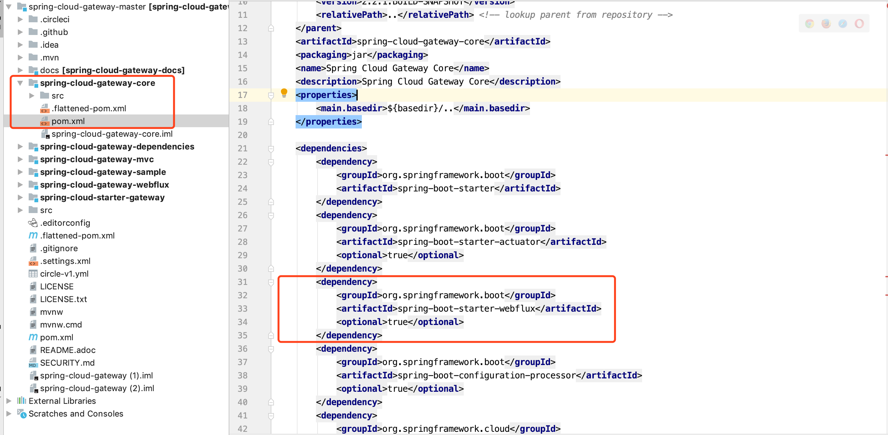
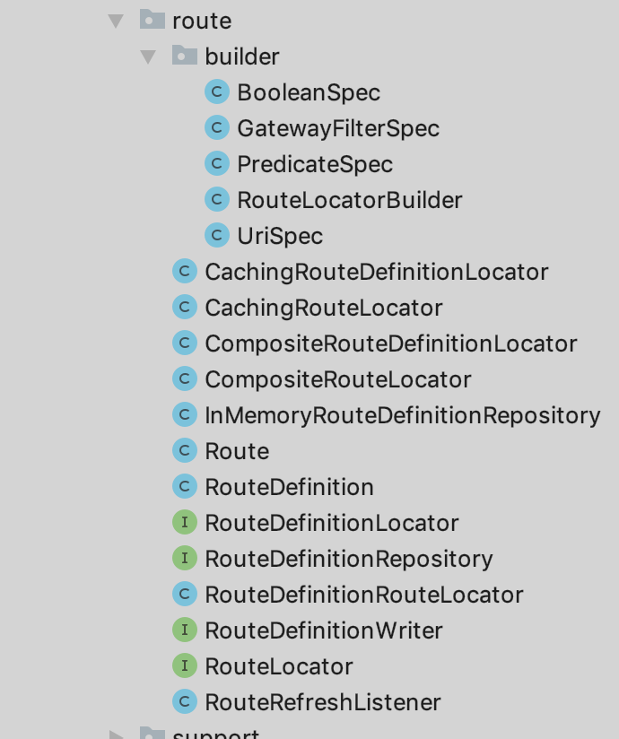
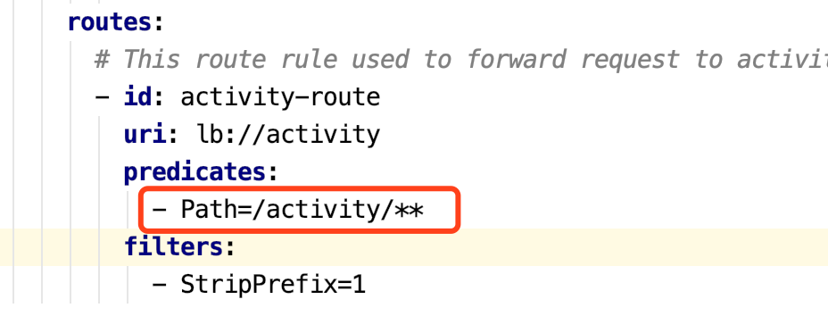
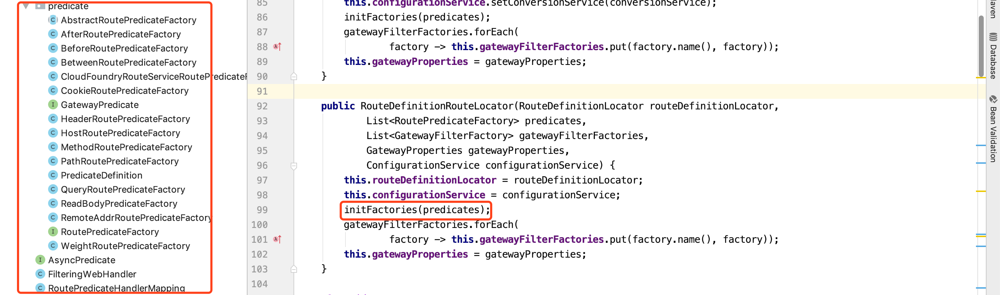
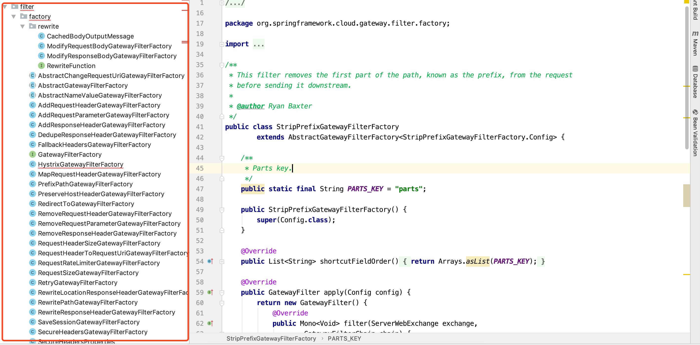
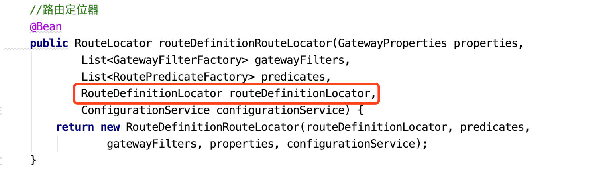
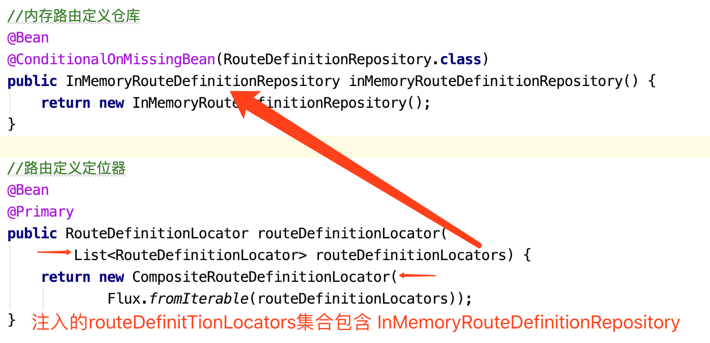
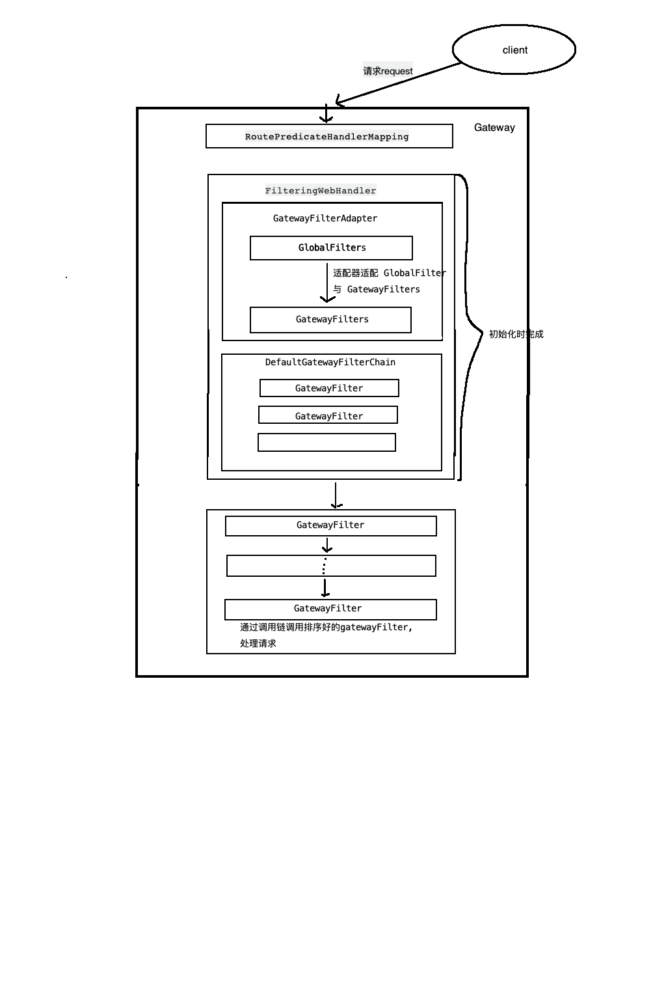

# spring Cloud Gateway 源码分析

老样子, 查看factories内配置如下

```properties
# Auto Configure
org.springframework.boot.autoconfigure.EnableAutoConfiguration=\
#  依赖包校验配置
org.springframework.cloud.gateway.config.GatewayClassPathWarningAutoConfiguration,\
#  Gateway核心配置
org.springframework.cloud.gateway.config.GatewayAutoConfiguration,\
# Gateway的Hystrix断路器配置
org.springframework.cloud.gateway.config.GatewayHystrixCircuitBreakerAutoConfiguration,\
# Gateway的Resilience4J断路器配置
org.springframework.cloud.gateway.config.GatewayResilience4JCircuitBreakerAutoConfiguration,\
#  gateway负载均衡客户端配置
org.springframework.cloud.gateway.config.GatewayLoadBalancerClientAutoConfiguration,\
#
org.springframework.cloud.gateway.config.GatewayNoLoadBalancerClientAutoConfiguration,\
#  路由度量配置
org.springframework.cloud.gateway.config.GatewayMetricsAutoConfiguration,\
#  流控的依赖配置信息
org.springframework.cloud.gateway.config.GatewayRedisAutoConfiguration,\
#  服务发现相关的依赖配置
org.springframework.cloud.gateway.discovery.GatewayDiscoveryClientAutoConfiguration,\
#  url全局处理映射配置
org.springframework.cloud.gateway.config.SimpleUrlHandlerMappingGlobalCorsAutoConfiguration,\
#
org.springframework.cloud.gateway.config.GatewayReactiveLoadBalancerClientAutoConfiguration

#网关环境后处理器
org.springframework.boot.env.EnvironmentPostProcessor=\
org.springframework.cloud.gateway.config.GatewayEnvironmentPostProcessor
```


### 依赖包校验配置 

配置文件 **GatewayClassPathWarningAutoConfiguration.java**

```java
@Configuration(proxyBeanMethods = false)
@AutoConfigureBefore(GatewayAutoConfiguration.class)
public class GatewayClassPathWarningAutoConfiguration {

	private static final Log log = LogFactory
			.getLog(GatewayClassPathWarningAutoConfiguration.class);

	private static final String BORDER = "\n\n**********************************************************\n\n";

	@Configuration(proxyBeanMethods = false)
	@ConditionalOnClass(name = "org.springframework.web.servlet.DispatcherServlet")
	protected static class SpringMvcFoundOnClasspathConfiguration {

		public SpringMvcFoundOnClasspathConfiguration() {
			log.warn(BORDER
					+ "Spring MVC found on classpath, which is incompatible with Spring Cloud Gateway at this time. "
					+ "Please remove spring-boot-starter-web dependency." + BORDER);
		}

	}

	@Configuration(proxyBeanMethods = false)
	@ConditionalOnMissingClass("org.springframework.web.reactive.DispatcherHandler")
	protected static class WebfluxMissingFromClasspathConfiguration {

		public WebfluxMissingFromClasspathConfiguration() {
			log.warn(BORDER + "Spring Webflux is missing from the classpath, "
					+ "which is required for Spring Cloud Gateway at this time. "
					+ "Please add spring-boot-starter-webflux dependency." + BORDER);
		}

	}

}
```

* 第一个校验提示 *Spring MVC found on classpath, which is incompatible with Spring Cloud Gateway at this time. Please remove spring-boot-starter-web dependency.*

  意思是在上下文中发现有 spring MVC的踪影(引入了 springmvc 包), 它不能与 Gateway 相容, 请移除` spring-boot-starter-web`这个依赖

* 第二个校验提示 *Spring Webflux is missing from the classpath,which is required for Spring Cloud Gateway at this time. Please add spring-boot-starter-webflux dependency.*

  意思是在上下文中没有发现 webflux 的踪迹(没有引入 webflux包), 这个包是 gateway 必须的, 请引入 `spring-boot-starter-webflux`依赖

再看 spring-cloud-gateway 源码包结构, 发现在 core 包中的 pom 文件已经包含了 webflux 文件



所以基本上不会出现第二个提示, 除非在引入 gateway 包时, 排除 webflux, 然而, 第一个提示却是时有发生, 但这是不应该的, 因为 gateway 本身就不是一个业务模块, 这个模块中, 不应该存有接收其它你需要的业务的功能, 如果实在必要, 也可以使用 webflux 接收请求, 而且可以扩大请求量

**总结:** 

* gateway依赖webflux, 所以 gateway 是通过 netty 容器启动的, 协议是 socket
* gateway 与 springmvc 不兼容, 但不表示 webflux 与 springMVC 不兼容
* 对于熟悉 springMVC 的人都知道它是基于`org.springframework.web.servlet.DispatcherServlet`作为请求接收核心,再转到其它处理器处理的! webflux 基于 Socket, 使用的也不是 web 容器, 所以它的核心并不是servlet, webflux 使用`org.springframework.web.reactive.DispatcherHandler`作为接收器, 以长连接的形式接收请求,作出相应, 以后有时间再详细看看 `webflux 源码`

### Gateway核心配置 

配置文件 **GatewayAutoConfiguration.java**

这个配置bean 中的内容还是挺多的, 一个一个来吧!!! 

```java
@Configuration(proxyBeanMethods = false)
@ConditionalOnProperty(name = "spring.cloud.gateway.enabled", matchIfMissing = true)
@EnableConfigurationProperties
@AutoConfigureBefore({ HttpHandlerAutoConfiguration.class,
		WebFluxAutoConfiguration.class })
@AutoConfigureAfter({ GatewayLoadBalancerClientAutoConfiguration.class,
		GatewayClassPathWarningAutoConfiguration.class })
@ConditionalOnClass(DispatcherHandler.class)
public class GatewayAutoConfiguration {
	...

	//路由定位器构造器
	@Bean
	public RouteLocatorBuilder routeLocatorBuilder(
			ConfigurableApplicationContext context) {
		return new RouteLocatorBuilder(context);
	}
  ...
}
```

看加类加载依赖, gateway 的自动配置加载顺序

1. `HttpHandlerAutoConfiguration`和`WebFluxAutoConfiguration` 
2. `GatewayAutoConfiguration`
3. `GatewayLoadBalancerClientAutoConfiguration`和`GatewayClassPathWarningAutoConfiguration`

没别的感悟, 就是这个加载顺序...

#### 路由构造器

gateway 匹配路由的方式有多种, 此处显示, gateway 以建造者模式, 配置不同的路由定位器



```java

public class RouteLocatorBuilder {
  ...
		/**
		 * Creates a new {@link Route}
		 * @param id the unique id for the route
		 * @param fn a function which takes in a {@link PredicateSpec} and returns a
		 * {@link Route.AsyncBuilder}
		 * @return a {@link Builder}
		 */
		public Builder route(String id, Function<PredicateSpec, Route.AsyncBuilder> fn) {
			Route.AsyncBuilder routeBuilder = fn.apply(new RouteSpec(this).id(id));
			add(routeBuilder);
			return this;
		}

		/**
		 * Creates a new {@link Route}
		 * @param fn a function which takes in a {@link PredicateSpec} and returns a
		 * {@link Route.AsyncBuilder}
		 * @return a {@link Builder}
		 */
		public Builder route(Function<PredicateSpec, Route.AsyncBuilder> fn) {
			Route.AsyncBuilder routeBuilder = fn.apply(new RouteSpec(this).randomId());
			add(routeBuilder);
			return this;
		}
  
		/**
		 * 创建一个路由定位器
		 */
		public RouteLocator build() {
			return () -> Flux.fromIterable(this.routes)
					.map(routeBuilder -> routeBuilder.build());
		}
...
  
    public static class RouteSpec {

      private final Route.AsyncBuilder routeBuilder = Route.async();

      private final Builder builder;

      RouteSpec(Builder builder) {
        this.builder = builder;
      }

      public PredicateSpec id(String id) {
        this.routeBuilder.id(id);
        return predicateBuilder();
      }

      public PredicateSpec randomId() {
        return id(UUID.randomUUID().toString());
      }

      private PredicateSpec predicateBuilder() {
        return new PredicateSpec(this.routeBuilder, this.builder);
      }

    }
}
```

创建构造器的方法, 这里注意, 一个带有 id, 一个不带有 id, 对应的是配置路由时的 id, id可以不配置, 会通过`RouteSpec`随机生成 UUID 作为 路由id, 此时构造的构造器都是 `AsyncBuilder extend AbstractBuilder`,

通过 `RouteSpec`将 `PredicateSpec extend UriSpec`  放进 builder 中

#### 初始化路由定位器与自定义路由定位器

```java

public class GatewayAutoConfiguration {
	...
    //路由定位器
    @Bean
    public RouteLocator routeDefinitionRouteLocator(GatewayProperties properties,
        List<GatewayFilterFactory> gatewayFilters,
        List<RoutePredicateFactory> predicates,
        RouteDefinitionLocator routeDefinitionLocator,
        ConfigurationService configurationService) {
      return new RouteDefinitionRouteLocator(routeDefinitionLocator, predicates,
          gatewayFilters, properties, configurationService);
    }
  ...
}
```

初始化 bean, 将多有已经初始化过的`RoutePredicateFactory` 注入到集合中传入此初始化方法, 创建`RouteDefinitionRouteLocator`, 进入构造函数

```java

public class RouteDefinitionRouteLocator
		implements RouteLocator, BeanFactoryAware, ApplicationEventPublisherAware {
  
  ...
	private final Map<String, RoutePredicateFactory> predicates = new LinkedHashMap<>();

	private final Map<String, GatewayFilterFactory> gatewayFilterFactories = new HashMap<>();
  
 	...
  	public RouteDefinitionRouteLocator(RouteDefinitionLocator routeDefinitionLocator,
        List<RoutePredicateFactory> predicates,
        List<GatewayFilterFactory> gatewayFilterFactories,
        GatewayProperties gatewayProperties,
        ConfigurationService configurationService) {
      this.routeDefinitionLocator = routeDefinitionLocator;
      this.configurationService = configurationService;
      initFactories(predicates);
      gatewayFilterFactories.forEach(
          factory -> this.gatewayFilterFactories.put(factory.name(), factory));
      this.gatewayProperties = gatewayProperties;
    }
  	...
  	private void initFactories(List<RoutePredicateFactory> predicates) {
      predicates.forEach(factory -> {
        String key = factory.name();
        if (this.predicates.containsKey(key)) {
          this.logger.warn("A RoutePredicateFactory named " + key
              + " already exists, class: " + this.predicates.get(key)
              + ". It will be overwritten.");
        }
        this.predicates.put(key, factory);
        if (logger.isInfoEnabled()) {
          logger.info("Loaded RoutePredicateFactory [" + key + "]");
        }
		});
	}
  ...
}
```

看`initFactories(predicates);`方法, 遍历所有 `RoutePredicateFactory`, 定义对每一个factory 定义 key 放进`predicates`这个 map中,进行缓存,`factory.name()`这个名字作为 key, **这个是 LinkedHashMap是有顺序的**由`NameUtils.normalizeFilterFactoryName(getClass());`中实现如下

```java
	public static String normalizeRoutePredicateName(
			Class<? extends RoutePredicateFactory> clazz) {
		return removeGarbage(clazz.getSimpleName()
				.replace(RoutePredicateFactory.class.getSimpleName(), ""));
	}
```

名称规则为真实实例类名截掉RoutePredicateFactory所剩部分为 key 例如:

`PathRoutePredicateFactory`类被初始化后的 key 为 `Path`, 在启动 Gateway模块时,控制台会打印上面的日志

```log
2019-05-20 20:24:09.325  INFO 3448 --- [           main] o.s.c.g.r.RouteDefinitionRouteLocator    : Loaded RoutePredicateFactory [User]
2019-05-20 20:24:09.325  INFO 3448 --- [           main] o.s.c.g.r.RouteDefinitionRouteLocator    : Loaded RoutePredicateFactory [After]
2019-05-20 20:24:09.325  INFO 3448 --- [           main] o.s.c.g.r.RouteDefinitionRouteLocator    : Loaded RoutePredicateFactory [Before]
2019-05-20 20:24:09.325  INFO 3448 --- [           main] o.s.c.g.r.RouteDefinitionRouteLocator    : Loaded RoutePredicateFactory [Between]
2019-05-20 20:24:09.326  INFO 3448 --- [           main] o.s.c.g.r.RouteDefinitionRouteLocator    : Loaded RoutePredicateFactory [Cookie]
2019-05-20 20:24:09.326  INFO 3448 --- [           main] o.s.c.g.r.RouteDefinitionRouteLocator    : Loaded RoutePredicateFactory [Header]
2019-05-20 20:24:09.326  INFO 3448 --- [           main] o.s.c.g.r.RouteDefinitionRouteLocator    : Loaded RoutePredicateFactory [Host]
2019-05-20 20:24:09.326  INFO 3448 --- [           main] o.s.c.g.r.RouteDefinitionRouteLocator    : Loaded RoutePredicateFactory [Method]
2019-05-20 20:24:09.326  INFO 3448 --- [           main] o.s.c.g.r.RouteDefinitionRouteLocator    : Loaded RoutePredicateFactory [Path]
2019-05-20 20:24:09.326  INFO 3448 --- [           main] o.s.c.g.r.RouteDefinitionRouteLocator    : Loaded RoutePredicateFactory [Query]
2019-05-20 20:24:09.326  INFO 3448 --- [           main] o.s.c.g.r.RouteDefinitionRouteLocator    : Loaded RoutePredicateFactory [ReadBodyPredicateFactory]
2019-05-20 20:24:09.326  INFO 3448 --- [           main] o.s.c.g.r.RouteDefinitionRouteLocator    : Loaded RoutePredicateFactory [RemoteAddr]
2019-05-20 20:24:09.326  INFO 3448 --- [           main] o.s.c.g.r.RouteDefinitionRouteLocator    : Loaded RoutePredicateFactory [Weight]
2019-05-20 20:24:09.326  INFO 3448 --- [           main] o.s.c.g.r.RouteDefinitionRouteLocator    : Loaded RoutePredicateFactory [CloudFoundryRouteService]

```

这代表了所加载的所有 predicates, 配置的 gateway 路由匹配规则中, 就是路由规则类型






这个包下是 gateway 提供的所有 predicate, 在 `GatewayAutoConfiguration`中都通过 Bean 进行了实例化, 通过上面的规则, 我们可以定义我们自己的请求匹配规则!

定义`predicate` 继承 `AbstractRoutePredicateFactory`, 并定义内部类 `Config`, 如下:

```java
public class CustomerRoutePredicateFactory extends AbstractRoutePredicateFactory<PathRoutePredicateFactory.Config> {
    public PathRoutePredicateFactory() {
			super(Config.class);
		}
  	
    @Override
    public Predicate<ServerWebExchange> apply(Config config) {
				//此处实现校验内容
        return exchange -> {
						exchange.getRequest()....
        }
    }
    @Validated
    public static class Config {
				public Config setPatterns() {
						//配置属性
        }
    }
}
```

进行初始化配置, 可以增加`@component` 注解或加`@Bean` 配置 等使其能注入到 `RouteDefinitionRouteLocator`中

这个在配置文件中的配置类似于: - Customer=…..

#### 初始化路由过滤器与自定义路由过滤器

还是上面的源码

```java
public class RouteDefinitionRouteLocator
		implements RouteLocator, BeanFactoryAware, ApplicationEventPublisherAware {
  
  ...
	private final Map<String, RoutePredicateFactory> predicates = new LinkedHashMap<>();

	private final Map<String, GatewayFilterFactory> gatewayFilterFactories = new HashMap<>();
  
 	...
  	public RouteDefinitionRouteLocator(RouteDefinitionLocator routeDefinitionLocator,
        List<RoutePredicateFactory> predicates,
        List<GatewayFilterFactory> gatewayFilterFactories,
        GatewayProperties gatewayProperties,
        ConfigurationService configurationService) {
      this.routeDefinitionLocator = routeDefinitionLocator;
      this.configurationService = configurationService;
      initFactories(predicates);
      gatewayFilterFactories.forEach(
          factory -> this.gatewayFilterFactories.put(factory.name(), factory));
      this.gatewayProperties = gatewayProperties;
    }
  ...
}
```

```java
gatewayFilterFactories.forEach(
          factory -> this.gatewayFilterFactories.put(factory.name(), factory));
```

这句代码遍历所有已初始化的过滤器, 然后放进`gatewayFilterFactories`这个 map 属性中缓存, 规则同样是根据类实例的类名截掉根接口名, 不过这个接口是`GatewayFilterFactory`

```java
	public static String normalizeFilterFactoryName(
			Class<? extends GatewayFilterFactory> clazz) {
		return removeGarbage(clazz.getSimpleName()
				.replace(GatewayFilterFactory.class.getSimpleName(), ""));
	}
```

spring cloud 也提供了很多过滤器



自定义过滤器:

```java
public class CustomerGatewayFilterFactory extends AbstractGatewayFilterFactory<CustomerGatewayFilterFactory.Config> {

    @Override
    public GatewayFilter apply(Config config) {
        return new GatewayFilter() {
            @Override
            public Mono<Void> filter(ServerWebExchange exchange, GatewayFilterChain chain) {
                //内容实现
                return null;
            }
        };
    }

    public class Config {
        public Config() {
            //参数接收实现
        }
    }
}
```

同样需要在初始化`RouteLocator`前对这个类进行初始化`@Component` 或`@bean`

#### 动态路由与自定义动态路由

```java
public class GatewayAutoConfiguration {
...
   //内存路由定义仓库
    @Bean
    @ConditionalOnMissingBean(RouteDefinitionRepository.class)
    public InMemoryRouteDefinitionRepository inMemoryRouteDefinitionRepository() {
       return new InMemoryRouteDefinitionRepository();
    }
...
}
```

```java
public class InMemoryRouteDefinitionRepository implements RouteDefinitionRepository {

	private final Map<String, RouteDefinition> routes = synchronizedMap(
			new LinkedHashMap<String, RouteDefinition>());

	@Override
	public Mono<Void> save(Mono<RouteDefinition> route) {
		return route.flatMap(r -> {
			if (StringUtils.isEmpty(r.getId())) {
				return Mono.error(new IllegalArgumentException("id may not be empty"));
			}
			routes.put(r.getId(), r);
			return Mono.empty();
		});
	}

	@Override
	public Mono<Void> delete(Mono<String> routeId) {
		return routeId.flatMap(id -> {
			if (routes.containsKey(id)) {
				routes.remove(id);
				return Mono.empty();
			}
			return Mono.defer(() -> Mono.error(
					new NotFoundException("RouteDefinition not found: " + routeId)));
		});
	}

	@Override
	public Flux<RouteDefinition> getRouteDefinitions() {
		return Flux.fromIterable(routes.values());
	}

}
```

在自动配置中配置了这么个实例: 他可以删除路由,添加路由, 获取所有路由, 这个类里还实现了一个`LinkedHashMap<String, RouteDefinition>` 的map缓存, 与类实例共生; 再向上找, 又有惊奇发现

```java
public class AbstractGatewayControllerEndpoint implements ApplicationEventPublisherAware {
	protected RouteDefinitionWriter routeDefinitionWriter;
  
  /*
	 * http POST :8080/admin/gateway/routes/apiaddreqhead uri=http://httpbin.org:80
	 * predicates:='["Host=**.apiaddrequestheader.org", "Path=/headers"]'
	 * filters:='["AddRequestHeader=X-Request-ApiFoo, ApiBar"]'
	 */
  @PostMapping("/routes/{id}")
	@SuppressWarnings("unchecked")
	public Mono<ResponseEntity<Object>> save(@PathVariable String id, 
			@RequestBody RouteDefinition route) {
		return Mono.just(route).filter(this::validateRouteDefinition)
				.flatMap(routeDefinition -> this.routeDefinitionWriter
						.save(Mono.just(routeDefinition).map(r -> {
							r.setId(id);
							log.debug("Saving route: " + route);
							return r;
						}))
						.then(Mono.defer(() -> Mono.just(ResponseEntity
								.created(URI.create("/routes/" + id)).build()))))
				.switchIfEmpty(
						Mono.defer(() -> Mono.just(ResponseEntity.badRequest().build())));
	}

	@DeleteMapping("/routes/{id}")
	public Mono<ResponseEntity<Object>> delete(@PathVariable String id) {
		return this.routeDefinitionWriter.delete(Mono.just(id))
				.then(Mono.defer(() -> Mono.just(ResponseEntity.ok().build())))
				.onErrorResume(t -> t instanceof NotFoundException,
						t -> Mono.just(ResponseEntity.notFound().build()));
	}
}
```

`AbstractGatewayControllerEndpoint`提供 `rest API`接口,向内存中添加, 删除路由配置, `routeDefinitionWriter`是`InMemoryRouteDefinitionRepository`的实例

再从自动配置开始看





```java
public class CompositeRouteDefinitionLocator implements RouteDefinitionLocator {

   private static final Log log = LogFactory
         .getLog(CompositeRouteDefinitionLocator.class);

   private final Flux<RouteDefinitionLocator> delegates;

   private final IdGenerator idGenerator;

   public CompositeRouteDefinitionLocator(Flux<RouteDefinitionLocator> delegates) {
      this(delegates, new AlternativeJdkIdGenerator());
   }

   public CompositeRouteDefinitionLocator(Flux<RouteDefinitionLocator> delegates,
         IdGenerator idGenerator) {
      this.delegates = delegates;
      this.idGenerator = idGenerator;
   }

   @Override
   public Flux<RouteDefinition> getRouteDefinitions() {
      return this.delegates.flatMap(RouteDefinitionLocator::getRouteDefinitions)
            .flatMap(routeDefinition -> Mono.justOrEmpty(routeDefinition.getId())
                  .defaultIfEmpty(idGenerator.generateId().toString())
                  .publishOn(Schedulers.elastic()).map(id -> {
                     if (routeDefinition.getId() == null) {
                        routeDefinition.setId(id);
                        if (log.isDebugEnabled()) {
                           log.debug("Id set on route definition: "
                                 + routeDefinition);
                        }
                     }
                     return routeDefinition;
                  }));
   }

}
```

1. 初始化RouteLocator时, 注入了 RouteDefinitionLocator

2. 初始化RouteDefinitionLocator时, 已经注入了InMemoryRouteDefinitionRepository

3. RouteLocator可以通过RouteDefinitionLocator, 拿到InMemoryRouteDefinitionRepository里面的所有路由配置, 并且也是这么做的

   ```java
   
   public class RouteDefinitionRouteLocator
   		implements RouteLocator, BeanFactoryAware, ApplicationEventPublisherAware {
     ...
   		@Override
       public Flux<Route> getRoutes() {
         return this.routeDefinitionLocator.getRouteDefinitions().map(this::convertToRoute)
             // TODO: error handling
             .map(route -> {
               if (logger.isDebugEnabled()) {
                 logger.debug("RouteDefinition matched: " + route.getId());
               }
               return route;
             });
   
         /*
          * TODO: trace logging if (logger.isTraceEnabled()) {
          * logger.trace("RouteDefinition did not match: " + routeDefinition.getId()); }
          */
       }
     ...
   }
   ```

   返回值`Flux<Route>`是`RouteDefinitionLocator`中所有`RouteDefinitionLocator`的所有路由定义, 让然也包括`InMemoryRouteDefinitionRepository`的

这个路径走通的话, 是不是就可以动态的向 gateway 中增加和删除路由了呢!!!!!!!!!! 我觉得是的!!!!!!!!!!!!


在`AbstractGatewayControllerEndpoint`中的接口可以看到, 通过 json 传递`RouteDefinition`对象就可以了, 然后就会通过`this.routeDefinitionWriter`这个属性增加到内存中

那么这是 spring cloud 实现的, 内存方案的特点就是处理速度快, 但是重启后会丢失, 那么是不是重启后, 之前配的什么路由就不知道了, 还得重新找要配哪些, 是的, 就是这么 high!!!!

* 设想, 增加数据库存储, 文件存储, nosql 存储, 是不是就能解决这个问题了

* redis 自带RDB和 AOF备份, 再加上 mysql, 这样应该没问题

  伪代码如下:

  ```java
  @Component
  public class InRedisRouteDefinitionRepository implements RouteDefinitionRepository {
      @Autowired
      private RedisTemplate redisTemplate;
  
      @Autowired
      private RouteDefinitionDao routeDefinitionDao;
  
      public InRedisRouteDefinitionRepository() {
          super();
          Flux<RouteDefinition> dbRouteDefinitions = routeDefinitionDao.getAll();
          Flux<RouteDefinition> rdRouteDefinitions = redisTemplate.getAll();
          //获取差集
          Flux<RouteDefinition> dsRouteDefinitions = differenceSet(dbRouteDefinitions, rdRouteDefinitions);
          //同步两库数据
          routeDefinitionDao.same();
          redisTemplate.same();
      }
  
      @Override
      public Flux<RouteDefinition> getRouteDefinitions() {
          //从 redis 中获取所有路由配置
          Flux<RouteDefinition> rdRouteDefinitions = redisTemplate.getAll();
          return rdRouteDefinitions;
      }
  
      @Override
      public Mono<Void> save(Mono<RouteDefinition> route) {
          //向 redis 和 db 中增加路由配置
          routeDefinitionDao.insert(route);
          redisTemplate.add(route);
          return Mono.empty();
      }
  
      @Override
      public Mono<Void> delete(Mono<String> routeId) {
          //redis 和 db 中删除路由配置
          routeDefinitionDao.delete(route);
          redisTemplate.del(route);
          return Mono.empty();
      }
  }
  ```

  `InRedisRouteDefinitionRepository`增加自动注入配置, 会和InMemoryRouteDefinitionRepository`一样注入

  可以使用 webFlux接口, 支持 http 和 socket, 以流的方式或者 json 方式控制路由, 

  也可以使用触发器监听文件或其它行为, 只要能触发这些方法, 就可以, OK


#### 初始化全局过滤器与自定义全局过滤器

```java
public class GatewayAutoConfiguration {
  	//路由谓词处理映射(路径匹配)
    @Bean
    public RoutePredicateHandlerMapping routePredicateHandlerMapping(
        FilteringWebHandler webHandler, RouteLocator routeLocator,
        GlobalCorsProperties globalCorsProperties, Environment environment) {
      return new RoutePredicateHandlerMapping(webHandler, routeLocator,
          globalCorsProperties, environment);
    }
  
  	//web 过滤处理器
    @Bean
    public FilteringWebHandler filteringWebHandler(List<GlobalFilter> globalFilters) {
      return new FilteringWebHandler(globalFilters);
    }
  
    //路由谓词处理映射(路径匹配)
    @Bean
    public RoutePredicateHandlerMapping routePredicateHandlerMapping(
        FilteringWebHandler webHandler, RouteLocator routeLocator,
        GlobalCorsProperties globalCorsProperties, Environment environment) {
      return new RoutePredicateHandlerMapping(webHandler, routeLocator,
          globalCorsProperties, environment);
    }
  
}
```

```java
//过滤器处理器, 初始化注入所有全局过滤器放到globalFilters
public class FilteringWebHandler implements WebHandler {
	private final List<GatewayFilter> globalFilters;
	public FilteringWebHandler(List<GlobalFilter> globalFilters) {
		this.globalFilters = loadFilters(globalFilters);
	}
  //通过适配器转化为 GatewayFilter, 进行操作
	private static List<GatewayFilter> loadFilters(List<GlobalFilter> filters) {
		return filters.stream().map(filter -> {
			GatewayFilterAdapter gatewayFilter = new GatewayFilterAdapter(filter);
			if (filter instanceof Ordered) {
				int order = ((Ordered) filter).getOrder();
				return new OrderedGatewayFilter(gatewayFilter, order);
			}
			return gatewayFilter;
		}).collect(Collectors.toList());
	}
  
  //创建调用链, 根据实现的 Ordered排序
  @Override
	public Mono<Void> handle(ServerWebExchange exchange) {
		Route route = exchange.getRequiredAttribute(GATEWAY_ROUTE_ATTR);
		List<GatewayFilter> gatewayFilters = route.getFilters();
		
		return new DefaultGatewayFilterChain(combined).filter(exchange);
	}
  
  //创建调用链, 根据实现的 Ordered排序
  private static class DefaultGatewayFilterChain implements GatewayFilterChain {
		private final List<GatewayFilter> filters;
		@Override
		public Mono<Void> filter(ServerWebExchange exchange) {
			return Mono.defer(() -> {
				if (this.index < filters.size()) {
					GatewayFilter filter = filters.get(this.index);
					DefaultGatewayFilterChain chain = new DefaultGatewayFilterChain(this,
							this.index + 1);
					return filter.filter(exchange, chain);
				}
				else {
					return Mono.empty(); // complete
				}
			});
		}
	}
  
	private static class GatewayFilterAdapter implements GatewayFilter {
		private final GlobalFilter delegate;

		GatewayFilterAdapter(GlobalFilter delegate) {
			this.delegate = delegate;
		}

		@Override
		public Mono<Void> filter(ServerWebExchange exchange, GatewayFilterChain chain) {
			return this.delegate.filter(exchange, chain);
		}
	}
}
```

初始化过程:

* 自动注入, 加载所有实现`GlobalFilter`的过滤器, 注入到过滤器处`FilteringWebHandler`理器中
* 通过过滤器处理器构造器初始化, 调用内部类适配器适配所有 `GlobalFilter`为`GatewayFilter`,并创建调用链, 调用链的顺序由过滤器实现的 Orderd接口排序
* 最后将`FilteringWebHandler`注入到`RoutePredicateHandlerMapping`中, 每个请求, 都会通过这个处理器映射器, 然后由处理器映射器调用`FilteringWebHandler`中的`GlobalFilter` 的 filter 方法  对 exchange 进行处理
设计模式:
* 代理设计模式
* 适配器设计模式



自定义全局过滤器

实现` GlobalFilter, Ordered, ApplicationListener<EnableBodyCachingEvent>`接口

实现`onApplicationEvent` `filter` `getOrder` 三个方法

```java
	@Override
	public void onApplicationEvent(EnableBodyCachingEvent event) {
		this.routesToCache.putIfAbsent(event.getRouteId(), true);
	}
```

固定实现

filter 方法处理 exchange的 request 请求

getOrder返回整数, 表示调用链的调用顺序,

使用@Compnent 或@Bean 自动自动注入
