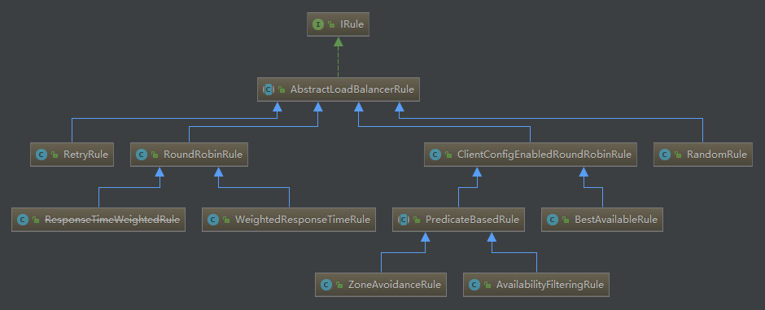

# springCloud-ribbon 源码分析

源码阅读入口 **MATE-INF/spring.factories**

```properties
org.springframework.boot.autoconfigure.EnableAutoConfiguration=\
org.springframework.cloud.netflix.ribbon.RibbonAutoConfiguration
```


## 饥饿加载

每个service服务调用其它服务时, 会为每个请求目标创建各自的Client, 并会以serviceId为 key, Client实例作为value, 存储在`ConcurrenthashMap`中, 默认这些client会在第一次调用目标服务时创建(懒加载), 但是会发生, 某些时候会在调用第一次目标服务时超时, 我们可以通过配置修改ribbonClient加载模式为**饥饿加载** 

```properties
#对全部ribbonClient都启动饥饿加载配置
ribbon.eager-load.enabled = true //启动饥饿加载
#对某些特定service的ribbonClient 启动饥饿加载
ribbon.eager-load.clients= service1, service2, ...
```

源码:

```java
	
	/**
	 * ribbon 客户端规范
	 */
	@Autowired(required = false)
	private List<RibbonClientSpecification> configurations = new ArrayList<>();

	/**
	 * 工厂设计模式
	 * spring 请求客户端工厂,
	 */
	@Bean
	public SpringClientFactory springClientFactory() {
		SpringClientFactory factory = new SpringClientFactory();
		factory.setConfigurations(this.configurations);
		return factory;
	}
```

1. 查看代码中有这个配置, 猜想 ribbonClient是通过这个`SpringClientFactory`实例创建的

```java
public class SpringClientFactory extends NamedContextFactory<RibbonClientSpecification> {
	/**
	 * 通过name获取restClient
	 * @param name 作为搜索条件
	 * @param clientClass 是client的实例类型
	 */
	public <C extends IClient<?, ?>> C getClient(String name, Class<C> clientClass) {
		return getInstance(name, clientClass);
	}

	@Override
	public <C> C getInstance(String name, Class<C> type) {
		C instance = super.getInstance(name, type);
		if (instance != null) {
			return instance;
		}
		IClientConfig config = getInstance(name, IClientConfig.class);
		return instantiateWithConfig(getContext(name), type, config);
	}
}
```

```java
public abstract class NamedContextFactory<C extends NamedContextFactory.Specification> implements DisposableBean, ApplicationContextAware {
    private Map<String, AnnotationConfigApplicationContext> contexts = new ConcurrentHashMap();
    
	public <T> T getInstance(String name, Class<T> type) {
        AnnotationConfigApplicationContext context = this.getContext(name);
        return BeanFactoryUtils.beanNamesForTypeIncludingAncestors(context, type).length > 0 ? context.getBean(type) : null;
    }
    //从context中获取获取restClient
    protected AnnotationConfigApplicationContext getContext(String name) {
        /'/如果不包含这个key, 这里通过name为key 创建restClient环境, 然后再在contex中缓存一份, 将restClient返回. 这里用了双检锁. 
        if (!this.contexts.containsKey(name)) {
            synchronized(this.contexts) {
                if (!this.contexts.containsKey(name)) {
                    this.contexts.put(name, this.createContext(name));
                }
            }
        }

        return (AnnotationConfigApplicationContext)this.contexts.get(name);
    }

}
```

以上代码能表示:

1. 所有的restClient 通过name为key, 存储在`ConcurrentHashMap` 中, 并且是在使用时才创建加载, 这里显示的`restClient` 是懒加载, name应该是各个为服务的name属性, 存取属于线程安全的, 

再回到`RibbonAutoConfiguration`,查看饥饿加载配置

```java
	/**
	 * ribbon饥饿加载属性
	 */
	@Autowired
	private RibbonEagerLoadProperties ribbonEagerLoadProperties;

	/**
	 * ribbon的饥饿加载设置为true, 启动时就会初始化ribbon的上下文环境
	 */
	@Bean
	@ConditionalOnProperty("ribbon.eager-load.enabled")
	public RibbonApplicationContextInitializer ribbonApplicationContextInitializer() {
		return new RibbonApplicationContextInitializer(springClientFactory(),
				ribbonEagerLoadProperties.getClients());
	}

```

```java
@ConfigurationProperties(prefix = "ribbon.eager-load")
public class RibbonEagerLoadProperties {

	private boolean enabled = false;

	private List<String> clients;

	public boolean isEnabled() {
		return enabled;
	}

	public void setEnabled(boolean enabled) {
		this.enabled = enabled;
	}

	public List<String> getClients() {
		return clients;
	}

	public void setClients(List<String> clients) {
		this.clients = clients;
	}

}
```

1. RibbonEagerLoadProperties作为ribbon的饥饿加载配置属性, 配置属性的前缀是`ribbon.eager-load`, 属性有`enabled`和 `clients`, 默认饥饿加载不生效(生效懒加载 )

```java
public class RibbonApplicationContextInitializer
		implements ApplicationListener<ApplicationReadyEvent> {

	private final SpringClientFactory springClientFactory;

	// List of Ribbon client names
	private final List<String> clientNames;

	public RibbonApplicationContextInitializer(SpringClientFactory springClientFactory,
			List<String> clientNames) {
		this.springClientFactory = springClientFactory;
		this.clientNames = clientNames;
	}

	protected void initialize() {
		if (clientNames != null) {
			for (String clientName : clientNames) {
				this.springClientFactory.getContext(clientName);
			}
		}
	}

	@Override
	public void onApplicationEvent(ApplicationReadyEvent event) {
		initialize();
	}
}
```

2. 看`RibbonApplicationContextInitializer`的构造器,  `clientNames` 这个就是`RibbonEagerLoadProperties` 中的clients属性, 并且`RibbonApplicationContextInitializer`是一个监听器, 监听的事件是`ApplicationReadyEvent`, 当应用加载完成, 调用`onApplicationEvent` 进行client初始化, 初始化调用了`springClientFactory.getContext()`, 那么这时候会将配置的所有客户端就加载到上面提到来的`ConcurrentHashMap`中

   也就是说加载顺序如下

   * 如果发现配置了`ribbon.eager-load.enabled`, 就会加载 `RibbonEagerLoadProperties`
   * 通过`RibbonEagerLoadProperties` 初始化`RibbonApplicationContextInitializer`, 并注入`springClientFactory`
   * 监听`ApplicationReadyEvent`事件表示应用启动, 准备完成, 开始初始化各个应用的restClient, 并存入ConcurrentHashMap中,

   至此, restClient 加载完毕

此部分用到的设计模式: 工厂设计模式


## 负载均衡

查看`RibbonAutoConfiguration` 中的自动配置

```java

public class RibbonAutoConfiguration {	
	/**
	 * 负载均衡客户端, 注入spring客户端工厂
	 */
	@Bean
	@ConditionalOnMissingBean(LoadBalancerClient.class)
	public LoadBalancerClient loadBalancerClient() {
		return new RibbonLoadBalancerClient(springClientFactory());
	}
}
```

这里是返回的spring cloud实现的`LoadBalancerClient`接口实现, 先看这个接口

```java
public interface ServiceInstanceChooser {
    ServiceInstance choose(String serviceId);
}

public interface LoadBalancerClient extends ServiceInstanceChooser {
    <T> T execute(String serviceId, LoadBalancerRequest<T> request) throws IOException;

    <T> T execute(String serviceId, ServiceInstance serviceInstance, LoadBalancerRequest<T> request) throws IOException;

    URI reconstructURI(ServiceInstance instance, URI original);
}
```

`LoadBalancerClient`接口与其继承的`ServiceInstanceChooser`有三类抽象方法 `execute``reconstructURI`和`choose`

* `choose`选择所使用的service
* `reconstructURI`通过选择的service, 获取到相应的host, port等信息重构URI

* `execute`执行uri发送请求

查看choose在`RibbonLoadBalancerClient`实现

```java
public class RibbonLoadBalancerClient implements LoadBalancerClient {
	@Override
	public ServiceInstance choose(String serviceId) {
		return choose(serviceId, null);
	}
    
    /**
	 * New: Select a server using a 'key'.
	 * @param serviceId of the service to choose an instance for
	 * @param hint to specify the service instance
	 * @return the selected {@link ServiceInstance}
	 */
	public ServiceInstance choose(String serviceId, Object hint) {
		Server server = getServer(getLoadBalancer(serviceId), hint);
		if (server == null) {
			return null;
		}
		return new RibbonServer(serviceId, server, isSecure(server, serviceId),
				serverIntrospector(serviceId).getMetadata(server));
	}
    
	protected ILoadBalancer getLoadBalancer(String serviceId) {
		return this.clientFactory.getLoadBalancer(serviceId);
	}
}
```

上面的代码是通过传入的serviceId查询ServiceInstance, 下面获取服务时调用了

```java
	protected ILoadBalancer getLoadBalancer(String serviceId) {
		return this.clientFactory.getLoadBalancer(serviceId);
	}
```

这个`getLoadBancer()`是初始化加载时的ClientFactory的行为, 根据serviceId为key存储在ConcurrentHashMap中的数据返回服务, 这就与之前的ribbonClient关联上了


在`LoadBalancerClient`接口同目录下查看到一个比较熟悉的名字:`LoadBalanced`注解,  不难想象, 我们在直接使用ribbon时, 就是用这个注解为spring的`restTemplate`增加负载均衡功能的, 所以认定我们源码阅读的路线还是表正确的!

同目录下看到有`LoadBalancerAutoConfiguration` 这个应该是负载均衡自动配置了, 往下看

```java
public class LoadBalancerAutoConfiguration {
        @ConditionalOnMissingClass({"org.springframework.retry.support.RetryTemplate"})
    static class LoadBalancerInterceptorConfig {
        LoadBalancerInterceptorConfig() {
        }

        @Bean
        public LoadBalancerInterceptor ribbonInterceptor(LoadBalancerClient loadBalancerClient, LoadBalancerRequestFactory requestFactory) {
            return new LoadBalancerInterceptor(loadBalancerClient, requestFactory);
        }

        @Bean
        @ConditionalOnMissingBean
        public RestTemplateCustomizer restTemplateCustomizer(final LoadBalancerInterceptor loadBalancerInterceptor) {
            return (restTemplate) -> {
                List<ClientHttpRequestInterceptor> list = new ArrayList(restTemplate.getInterceptors());
                list.add(loadBalancerInterceptor);
                restTemplate.setInterceptors(list);
            };
        }
    }
}
```

自动配置中有这么个内部类, 这个内部类中最后的拿个配置方法是对restTemplate增加了一个拦截器, 这个拦截器是`LoadBalancerInterceptor`, 顾名思义. 负载均衡拦截器

查看拦截器源码

```java
public class LoadBalancerInterceptor implements ClientHttpRequestInterceptor {
    private LoadBalancerClient loadBalancer;
    private LoadBalancerRequestFactory requestFactory;

    public LoadBalancerInterceptor(LoadBalancerClient loadBalancer, LoadBalancerRequestFactory requestFactory) {
        this.loadBalancer = loadBalancer;
        this.requestFactory = requestFactory;
    }

    public LoadBalancerInterceptor(LoadBalancerClient loadBalancer) {
        this(loadBalancer, new LoadBalancerRequestFactory(loadBalancer));
    }

    public ClientHttpResponse intercept(final HttpRequest request, final byte[] body, final ClientHttpRequestExecution execution) throws IOException {
        URI originalUri = request.getURI();
        String serviceName = originalUri.getHost();
        Assert.state(serviceName != null, "Request URI does not contain a valid hostname: " + originalUri);
        return (ClientHttpResponse)this.loadBalancer.execute(serviceName, this.requestFactory.createRequest(request, body, execution));
    }
}
```

惊喜呀, 拦截器中的拦截方法调用的就是`LoadBalancerClient::execute`方法. 这样就回归到了负载均衡客户端执行请求的时刻了

我们再回顾`LoadBalancerClient`的 execute方法

```java
public class RibbonLoadBalancerClient implements LoadBalancerClient {
    @Override
	public <T> T execute(String serviceId, LoadBalancerRequest<T> request)
			throws IOException {
		return execute(serviceId, request, null);
	}
    
    public <T> T execute(String serviceId, LoadBalancerRequest<T> request, Object hint)
			throws IOException {
		ILoadBalancer loadBalancer = getLoadBalancer(serviceId);
		Server server = getServer(loadBalancer, hint);
		if (server == null) {
			throw new IllegalStateException("No instances available for " + serviceId);
		}
		RibbonServer ribbonServer = new RibbonServer(serviceId, server,
				isSecure(server, serviceId),
				serverIntrospector(serviceId).getMetadata(server));

		return execute(serviceId, ribbonServer, request);
	}
    
    protected Server getServer(ILoadBalancer loadBalancer, Object hint) {
		if (loadBalancer == null) {
			return null;
		}
		// Use 'default' on a null hint, or just pass it on?
		return loadBalancer.chooseServer(hint != null ? hint : "default");
	}
    
```

最下面的这句

```java
loadBalancer.chooseServer(hint != null ? hint : "default");
```

便是负载均衡算法的实现了

loadBalancer是`ZoneAwareLoadBalancer`的实例


最终是由这个实现的负载均衡, 通过serviceName查询到所有service, 选择其中一个service返回的过程, 详细内容参考[这里](<https://blog.csdn.net/chengqiuming/article/details/81209131>)

内部负载均衡是通过Irule实现的

ribbon提供了七种负载均衡规则



| 策略名                    | 策略声明                                                     | 策略描述                                                     | 实现说明                                                     |
| ------------------------- | ------------------------------------------------------------ | ------------------------------------------------------------ | ------------------------------------------------------------ |
| BestAvailableRule         | public class BestAvailableRule extends ClientConfigEnabledRoundRobinRule | 选择一个最小的并发请求的server                               | 逐个考察Server，如果Server被tripped了，则忽略，在选择其中ActiveRequestsCount最小的server |
| AvailabilityFilteringRule | public class AvailabilityFilteringRule extends PredicateBasedRule | 过滤掉那些因为一直连接失败的被标记为circuit tripped的后端server，并过滤掉那些高并发的的后端server（active connections 超过配置的阈值） | 使用一个AvailabilityPredicate来包含过滤server的逻辑，其实就就是检查status里记录的各个server的运行状态 |
| WeightedResponseTimeRule  | public class WeightedResponseTimeRule extends RoundRobinRule | 根据相应时间分配一个weight，相应时间越长，weight越小，被选中的可能性越低。 | 一个后台线程定期的从status里面读取评价响应时间，为每个server计算一个weight。Weight的计算也比较简单responsetime 减去每个server自己平均的responsetime是server的权重。当刚开始运行，没有形成statas时，使用roubine策略选择server. |
| RetryRule                 | public class RetryRule extends AbstractLoadBalancerRule      | 对选定的负载均衡策略机上重试机制。                           | 在一个配置时间段内当选择server不成功，则一直尝试使用subRule的方式选择一个可用的server |
| RoundRobinRule            | public class RoundRobinRule extends AbstractLoadBalancerRule | roundRobin方式轮询选择server                                 | 轮询index，选择index对应位置的server                         |
| RandomRule                | public class RandomRule extends AbstractLoadBalancerRule     | 随机选择一个server                                           | 在index上随机，选择index对应位置的server                     |
| ZoneAvoidanceRule         | public class ZoneAvoidanceRule extends PredicateBasedRule    | 复合判断server所在区域的性能和server的可用性选择server       | 默认规则;<br />使用ZoneAvoidancePredicate和AvailabilityPredicate来判断是否选择某个server，前一个判断判定一个zone的运行性能是否可用，剔除不可用的zone（的所有server），AvailabilityPredicate用于过滤掉连接数过多的Server。 |


我们也可以实现自己的负载均衡规则

如下:

```java

/**
 * 该类为Ribbon的配置类
 * 该类不能被@ComponentScan扫描到
 * @author nicker
 * @description
 * @date 2018/5/16 18:25
 * @
 */
@Configuration
public class RibbonConfiguration {
 
    @Bean
    public IRule ribbonRule() {
        // 负载均衡规则，改为随机
        return new RandomRule();
    }
}
```


## 自定义负载均衡规则

继承`AbstractLoadBalancerRule`抽象类或其子类实现

```java
Server choose(Object var1);
public abstract void initWithNiwsConfig(IClientConfig clientConfig);
```

这两个抽象方法

```java
public class MyCustomerRule extends AbstractLoadBalancerRule
{
    @Override
    public Server choose(Object key)
    {
    	ILoadBalancer loadBalancer = getLoadBalancer();
        return loadBalancer.choose(Key);//实现获取server的算法
    }

    @Override
    public void initWithNiwsConfig(IClientConfig clientConfig)
    {
        // TODO Auto-generated method stub

    }

}
```

配置生效:两种

1. javaConfig

   ```java
   @Configuration
   public class MyCustomerRuleConfiguration
   {
       @Bean
       public IRule myCustomerRule()
       {
           return new MyCustomerRule();// 我自定义为每台机器5次
       }
   }
   ```

   **注意: 在Ribbon的文档中有这样一段话：**

   The FooConfiguration has to be @Configuration but take care that it is not in a @ComponentScan for the main application context, otherwise it will be shared by all the @RibbonClients. If you use @ComponentScan (or @SpringBootApplication) you need to take steps to avoid it being included (for instance put it in a separate, non-overlapping package, or specify the packages to scan explicitly in the @ComponentScan).

   大体意思是对于Ribbon的配置必须用@Configuration注解标识，并且不能被@Component注解或者@SpringBootApplication（因为里面包含了@Component）扫描到。因为如果被@ComponetScan扫描到会导致所有的RibbonClient都去共享这个配置。

2. 使用application配置文件

   ```java
   service-provider-user:
     ribbon:
       NFLoadBalancerRuleClassName: com.zcz.study.MyCustomerRule
   ```

   

