# spring Cloud 微服务

## 1.consul 集成spring cloud 注册中心

### 部署安装consul

#### 准备

* [consul安装包](<https://www.consul.io/downloads.html>)
* linux(CentOS7)

#### 部署

1. 安装zip, unzip 工具

   ```shell
   yum install -y zip unzip
   ```

   

2. 解压安装包zip 到指定目录

   ```shell
   $ mkdir -p /opt/modules/consul/bin
   $ unzip consul_1.5.0_linux_amd64.zip -d /opt/modules/consul/bin
   ```

3. 配置环境变量

   ```shell
   $ vim /etc/profile
   ```

   ```shell
   #consul
   export CONSUL_HOME=/opt/modules/consul
   export PATH=$PATH:$CONSUL_HOME/bin
   ```

   ```shell
   $ source /etc/profile
   ```

4. 在consul 目录下创建 data , log目录

   ```shell
   $ mkdir data log
   ```

   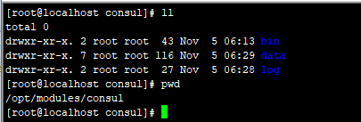

5. 在bin目录内编写启动脚本

   ```shell
   $ vim start_consul.sh
   ```

   ```shell
   #!/bin/bash
   log_dir=$CONSUL_HOME/log
   rm -rf $log_dir/*
   
   current=`date "+%Y-%m-%d %H:%M:%S"`
   timeStamp=`date -d "$current" +%s`
   currentTimeStamp=$((timeStamp*1000+10#`date "+%N"`/1000000))
   
   touch $log_dir/$currentTimeStamp
   nohup consul agent -server -bind=192.168.0.122 -client=0.0.0.0 -ui -bootstrap-expect=1 -data-dir=$CONSUL_HOME/data -node=server-1 > $log_dir/$currentTimeStamp 2>&1 &
   tail -f $log_dir/$currentTimeStamp
   ```

   ```shell
   $ shmod 777 start_consul.sh
   ```

   [consul命令说明](# 启动consul命令说明)

6. 启动consul

   ```shell
   $ start_consul.sh
   ```

   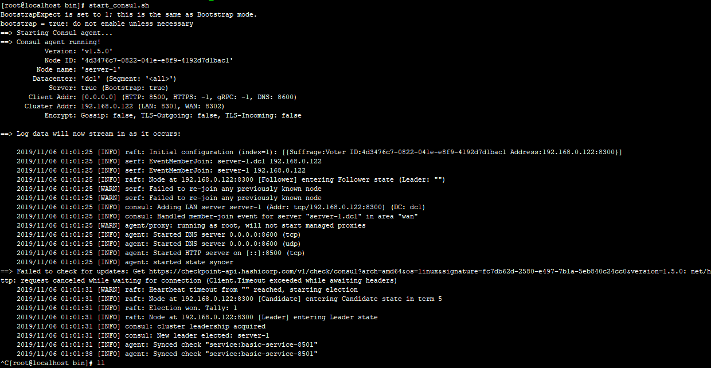

7. 开启8500 端口

   ```shell
   $ firewall-cmd --zone=public --add-port=8500/tcp --permanent
   $ firewall-cmd --reload
   ```

8. 浏览器查看consul     host:8500

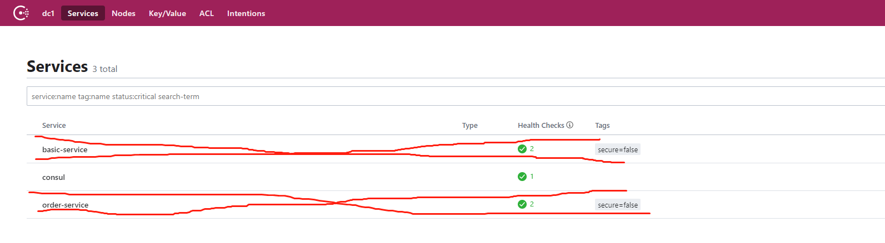


consul 单节点安装完成

**下面是集群部署 **

1. 接着上面的步骤, 准备两台Linux(CentOS7) 服务器, 做相同的操作部署

2. 修改启动脚本

   ```shell
   #!/bin/bash
   log_dir=$CONSUL_HOME/log
   rm -rf $log_dir/*
   
   current=`date "+%Y-%m-%d %H:%M:%S"`
   timeStamp=`date -d "$current" +%s`
   currentTimeStamp=$((timeStamp*1000+10#`date "+%N"`/1000000))
   
   touch $log_dir/$currentTimeStamp
   nohup consul agent -server -bind=192.168.0.122 -client=0.0.0.0 -ui -bootstrap-expect=3 -data-dir=$CONSUL_HOME/data -node=server-2 > $log_dir/$currentTimeStamp 2>&1 &
   ```

   * 将节点数改为3    `-bootstrap-expect=3`
   * 配置独立的节点名称 `-node=server-2`
   * 各个节点绑定独立的ip `-bind=192.168.0.122`

3. 三台服务器分别启动

4. 查看consul启动状态

   ```shell
   $ consul members
   ```

   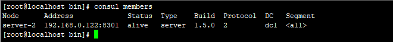

5. 开启各个节点8301端口, 集群以此端口通信

   ```shell
   $ firewall-cmd --zone=publi --add-port=8301/tcp --permanent
   $ firewall-cmd --reload
   ```

   

6. 将各个节点添加到集群

   ```shell
   $ consul join 192.168.0.121
   ```

   

7. 查看集群节点

   ```shell
   $ consul members
   ```

   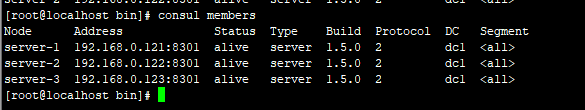

8. 查看控制台

   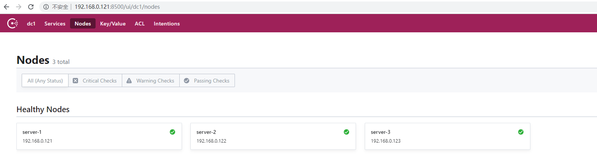

   集群搭建完成

9. 如果要删除节点, 则在相应节点使用命令移除当前节点

   ```shell
   $ consul leave
   ```


### spring cloud 集成consul

1. 创建项目并创建两个模块 basic-service  和order-service

   父级pom

   ```xml
   
   
       <parent>
           <groupId>org.springframework.boot</groupId>
           <artifactId>spring-boot-parent</artifactId>
           <version>2.0.2.RELEASE</version>
       </parent>
   
       <dependencyManagement>
           <dependencies>
               <dependency>
                   <groupId>org.springframework.cloud</groupId>
                   <artifactId>spring-cloud-dependencies</artifactId>
                   <version>Finchley.RELEASE</version>
                   <type>pom</type>
                   <scope>import</scope>
               </dependency>
           </dependencies>
       </dependencyManagement>
   ```

   basic-service 的pom

   ```xml
   <properties>
           <project.build.sourceEncoding>UTF-8</project.build.sourceEncoding>
           <java.version>1.8</java.version>
       </properties>
   
       <dependencies>
           <!--spring boot-->
           <dependency>
               <groupId>org.springframework.boot</groupId>
               <artifactId>spring-boot-starter-web</artifactId>
           </dependency>
           <dependency>
               <groupId>org.springframework.boot</groupId>
               <artifactId>spring-boot-starter-test</artifactId>
           </dependency>
           <dependency>
               <groupId>org.springframework.boot</groupId>
               <artifactId>spring-boot-starter-actuator</artifactId>
           </dependency>
   
           <!--spring cloud-->
           <dependency>
               <groupId>org.springframework.cloud</groupId>
               <artifactId>spring-cloud-starter-consul-discovery</artifactId>
               <version>2.1.1.RELEASE</version>
           </dependency>
   
           <dependency>
               <groupId>org.springframework.cloud</groupId>
               <artifactId>spring-cloud-starter-openfeign</artifactId>
               <version>2.1.1.RELEASE</version>
           </dependency>
       </dependencies>
   ```

   basic-service 的application.yml

   ```yaml
   server:
     port: 8501
     servlet:
       context-path: /basic
   spring:
     application:
       name: basic-service
     cloud:
       consul:
         host: 192.168.0.121 # 注册地址
         port: 8500
         discovery:
           enabled: true
           register: true
           register-health-check: true
           service-name: ${spring.application.name}
           health-check-path: ${server.servlet.context-path}/actuator/health
           health-check-interval: 15s
           instance-id: ${spring.application.name}:${server.port}
           hostname: 192.168.56.1
   ```

   

   

   order-service 的pom

   ```xml
   <properties>
           <project.build.sourceEncoding>UTF-8</project.build.sourceEncoding>
           <java.version>1.8</java.version>
       </properties>
   
   
       <dependencies>
           <!--spring boot-->
           <dependency>
               <groupId>org.springframework.boot</groupId>
               <artifactId>spring-boot-starter-test</artifactId>
           </dependency>
           <dependency>
               <groupId>org.springframework.boot</groupId>
               <artifactId>spring-boot-starter-web</artifactId>
           </dependency>
           <dependency>
               <groupId>org.springframework.boot</groupId>
               <artifactId>spring-boot-starter-actuator</artifactId>
           </dependency>
   
           <!--spring cloud-->
   
           <dependency>
               <groupId>org.springframework.cloud</groupId>
               <artifactId>spring-cloud-starter-consul-discovery</artifactId>
               <version>2.1.1.RELEASE</version>
           </dependency>
           <dependency>
               <groupId>org.springframework.cloud</groupId>
               <artifactId>spring-cloud-starter-openfeign</artifactId>
               <version>2.1.1.RELEASE</version>
           </dependency>
   ```

   order-service 的application.yml

   ```yaml
   server:
     port: 8502
     servlet:
       context-path: /order
   spring:
     application:
       name: order-service
     cloud:
       consul:
         host: 192.168.0.121
         port: 8500
         discovery:
           enabled: true
           register: true
           register-health-check: true
           service-name: ${spring.application.name}
           health-check-path: ${server.servlet.context-path}/actuator/health
           health-check-interval: 15s
           instance-id: ${spring.application.name}:${server.port}
           hostname: 192.168.56.1
   
   ```

2. 创建主函数, 类上增加`@SpringBootApplication` `@EnableAutoDiscoveryClient` `@EnableFeignClients`注解

   basic-service

   ```java
   @EnableFeignClients
   @EnableDiscoveryClient
   @SpringBootApplication
   public class BasicApplication {
       public static void main(String[] args) {
           SpringApplication.run(BasicApplication.class, args);
       }
   }
   
   ```

   

   order-service

   ```java
   @EnableFeignClients
   @EnableDiscoveryClient
   @SpringBootApplication
   public class OrderApplication {
       public static void main(String[] args) {
           SpringApplication.run(OrderApplication .class, args);
       }
   }
   ```

3. 增加`controller`接口

   Basic-service

   ```java
   @RestController
   public class TestController {
   
       @Autowired
       private OrderDataClient orderDataClient;
   
   
       @GetMapping("/get/basic")
       public String getString(){
           return "basic";
       }
   
   
       @GetMapping("/get/basic/order")
       public String getString2(){
           return orderDataClient.getString();
       }
   
   
   }
   ```

   

   Order-service

   ```java
   @RestController
   public class TestController {
   
       @Autowired
       private BasicDataClient basicDataClient;
   
       @GetMapping("/get/order")
       public String getString(){
           return "order";
       }
   
   
       @GetMapping("/get/order/basic")
       public String getString2(){
   
           return basicDataClient.getString();
       }
   }
   
   ```

   

4. 增加feign调用接口和fallback回调

   basic-service

   ```java
   @FeignClient(value = "order-service", fallback = OrderDataFallBack.class)
   public interface OrderDataClient {
   
       @GetMapping("/get/order")
       String getString();
   }
   ```

   ```java
   @Component
   public class OrderDataFallBack implements OrderDataClient {
   
       public String getString() {
           return "xxxxxx";
       }
   }
   
   ```

   

   order-service

   ```java
   @FeignClient(value = "basic-service", fallback = BasicDataFallBack.class)
   public interface BasicDataClient {
   
       @GetMapping("/get/basic")
       String getString();
   }
   ```

   ```java
   @Component
   public class BasicDataFallBack implements BasicDataClient {
   
       public String getString() {
           return "xxxxx";
       }
   }
   ```

   

5. 


### 启动consul命令说明

```shell
$ consul agent -server -bind=192.168.0.122 -client=0.0.0.0 -ui -bootstrap-expect=1 -data-dir=$CONSUL_HOME/data -node=server-1 > $log_dir/$currentTimeStamp 2>&1 &
```

```shell
$ consul
```

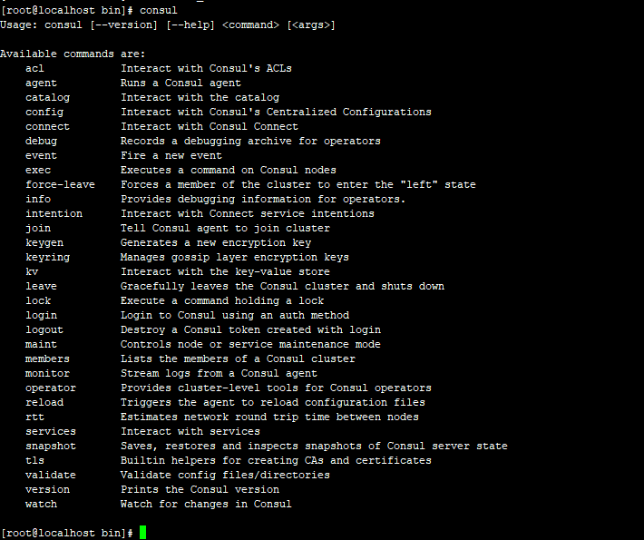

| 参数名 |      |      |
| ------ | ---- | ---- |
| agent  |      |      |


## 2. Gateway 路由

1. maven 引入jar包

   ```xml
   <dependencies>
           <dependency>
               <groupId>org.springframework.boot</groupId>
               <artifactId>spring-boot-starter-actuator</artifactId>
           </dependency>
           <dependency>
               <groupId>org.springframework.boot</groupId>
               <artifactId>spring-boot-starter-test</artifactId>
           </dependency>
   
           <dependency>
               <groupId>org.springframework.cloud</groupId>
               <artifactId>spring-cloud-starter-consul-discovery</artifactId>
               <version>2.1.1.RELEASE</version>
           </dependency>
           <dependency>
               <groupId>org.springframework.cloud</groupId>
               <artifactId>spring-cloud-starter-gateway</artifactId>
               <version>2.1.1.RELEASE</version>
           </dependency>
   </dependencies>
   ```

2. application.yml 配置注册中心, 模块路由

   ```yaml
   server:
     port: 8503
   spring:
     application:
       name: gateway-service
     cloud:
       consul:
         host: 192.168.0.121
         port: 8500
         discovery:
           register: true
           service-name: ${spring.application.name}
           health-check-path: /actuator/health
           health-check-interval: 15s
           enabled: true
           instance-id:  ${spring.application.name}:${server.port}
           register-health-check: true
           hostname: 192.168.0.121
   
   
       gateway:
         discovery:
           locator:
             enabled: true
         routes:
         - id: basic-service
           uri: lb://basic-service
           predicates:
             - Path=/basic/**
           filters:
             - StripPrefix=1
   
         - id: order-service
           uri: lb://order-service
           predicates:
             - Path=/order/**
           filters:
             - StripPrefix=1
   ```

   gateway的路由是由 id    uri   predicates(断言)    filters(过滤器) 四个部分组成


## 3. 集成swagger  bootstrap-ui

### 子模块集成swagger

1. maven引入swagger相应包

   ```xml
   		<!--swagger-->
           <dependency>
               <groupId>io.springfox</groupId>
               <artifactId>springfox-swagger2</artifactId>
               <version>2.9.2</version>
           </dependency>
           <dependency>
               <groupId>io.springfox</groupId>
               <artifactId>springfox-swagger-ui</artifactId>
               <version>2.9.2</version>
           </dependency>
   ```

   

2. 增加javaBean配置

   ```java
   @Configuration
   @EnableSwagger2
   @ConditionalOnProperty(prefix = "swagger", name = "open", havingValue = "true")
   public class SwaggerConfig {
   
       @Bean
       public Docket createRestApi() {
           return new Docket(DocumentationType.SWAGGER_2)
                   .apiInfo(apiInfo())
                   .select()
             .apis(RequestHandlerSelectors.withMethodAnnotation(ApiOperation.class))
                   .paths(PathSelectors.any())
                   .build();
       }
       
       
       private ApiInfo apiInfo() {
           return new ApiInfoBuilder()
                   .title("Swagger API")
                   .description("basic")
                   .termsOfServiceUrl("")
                   .version("2.0")
                   .build();
       }
   }
   
```
   
**@ConditionalOnProperty(prefix = "swagger", name = "open", havingValue = "true")注解:**
   
配置swagger是否生效, 由于项目会经历 开发, 测试, 生产等多个环境, 但是在生产环境又不会允许有文档相关内容, 所以在此处设置swagger根据不同环境是否生效,在application中配置相应属性, 改变生效
   
   ```yaml
   swagger:
     open: true
```
   
此时swagger已经可以在各个模块显示了, mosulehost:port/swagger-ui.html
   
   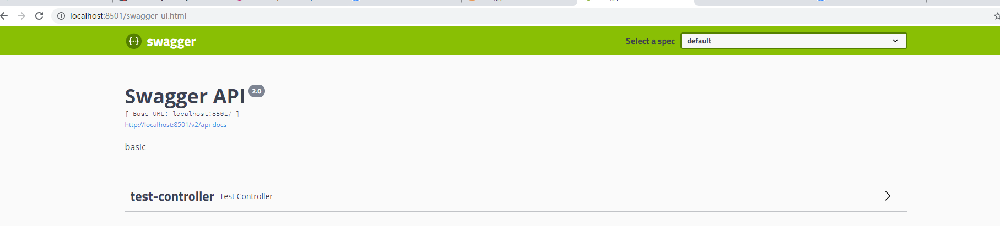

### Gateway 聚合swagger文档

1. gateway模块引入相应包

   ```xml
   		<!--swagger-->
           <dependency>
               <groupId>io.springfox</groupId>
               <artifactId>springfox-swagger2</artifactId>
               <version>2.9.2</version>
           </dependency>
           <dependency>
               <groupId>io.springfox</groupId>
               <artifactId>springfox-swagger-ui</artifactId>
               <version>2.9.2</version>
           </dependency>
   ```

   

2. javaBean配置swagger

   ```java
   @Component
   public class SwaggerResourceProvider implements SwaggerResourcesProvider {
   
       /**
        * swagger2默认的url后缀
        */
       private static final String SWAGGER2URL = "/v2/api-docs";
   
       /**
        * 网关路由
        */
       private final RouteLocator routeLocator;
   
       /**
        * 网关应用名称
        */
       @Value("${spring.application.name}")
       private String self;
   
       public SwaggerResourceProvider(RouteLocator routeLocator) {
           this.routeLocator = routeLocator;
       }
   
       @Override
       public List<SwaggerResource> get() {
           List<SwaggerResource> resources = new ArrayList<>();
           List<String> routeHosts = new ArrayList<>();
           // 获取所有可用的host：serviceId
           routeLocator.getRoutes().filter(route -> route.getUri().getHost() != null)
                   .filter(route -> !self.equals(route.getUri().getHost()))
                   .subscribe(route -> routeHosts.add(route.getUri().getHost()));
   
           // 记录已经添加过的server，存在同一个应用注册了多个服务在注册中心上(Eureka  consul)
           Set<String> dealed = new HashSet<>();
           routeHosts.forEach(instance -> {
               // 拼接url, 根据gateway路由规则, 拼接相应模块路由url
               String url = "/" + instance.toLowerCase().split("-")[0] + SWAGGER2URL;
               if (!dealed.contains(url)) {
                   dealed.add(url);
                   SwaggerResource swaggerResource = new SwaggerResource();
                   swaggerResource.setUrl(url);
                   swaggerResource.setName(instance);
                   resources.add(swaggerResource);
               }
           });
           return resources;
       }
   }
   ```

   

3. 提供swagger控制器

   ```java
   @RestController
   @RequestMapping("/swagger-resources")
   public class SwaggerResourceController {
   
       private SwaggerResourceProvider swaggerResourceProvider;
   
       @Autowired
       public SwaggerResourceController(SwaggerResourceProvider swaggerResourceProvider) {
           this.swaggerResourceProvider = swaggerResourceProvider;
       }
   
       @RequestMapping(value = "/configuration/security")
       public ResponseEntity<SecurityConfiguration> securityConfiguration() {
           return new ResponseEntity(SecurityConfigurationBuilder.builder().build(), HttpStatus.OK);
       }
   
       @RequestMapping(value = "/configuration/ui")
       public ResponseEntity<UiConfiguration> uiConfiguration() {
           return new ResponseEntity(UiConfigurationBuilder.builder().build(), HttpStatus.OK);
       }
   
       @RequestMapping
       public ResponseEntity<List<SwaggerResource>> swaggerResources() {
           return new ResponseEntity(swaggerResourceProvider.get(), HttpStatus.OK);
       }
   }
```
   
现在可以通过gateway查看各个模块的api文档了
   
   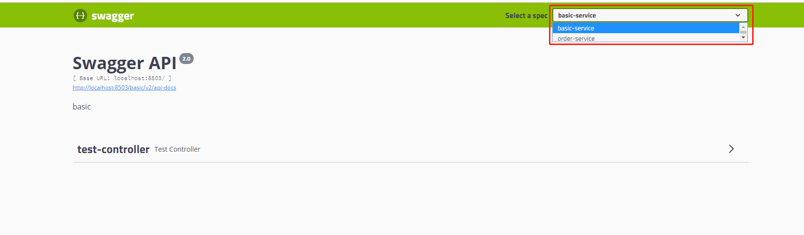

### 集成bootstrap-ui 界面

1. 修改各个模块的maven包

   ```xml
   		<!--swagger-->
           <dependency>
               <groupId>io.springfox</groupId>
               <artifactId>springfox-swagger2</artifactId>
               <version>2.9.2</version>
           </dependency>
           <dependency>
               <groupId>com.github.xiaoymin</groupId>
               <artifactId>swagger-bootstrap-ui</artifactId>
               <version>1.9.4</version>
           </dependency>
   ```

   

2. 修改各个模块的javabean配置

    

   现在各个子模块可以查看各自的新界面swagger了   moduleshost:port/doc.html

   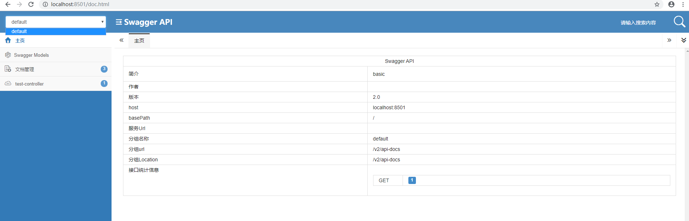

3. gateway不需要修改, 直接访问 gatewayhost:port/doc.html

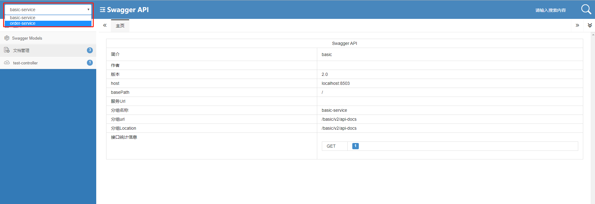