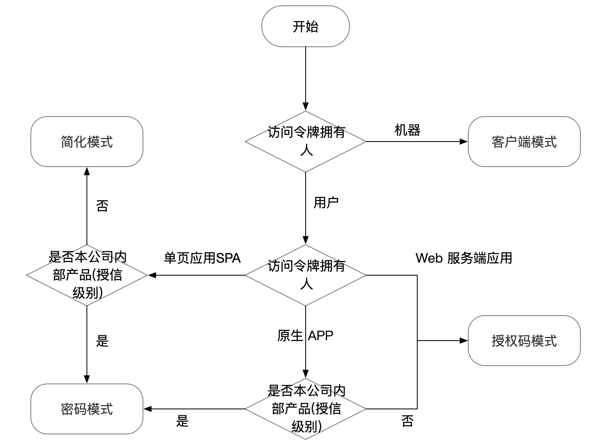

#1.微服务安全架构与实战

[代码: GitHub](https://github.com/spring2go/oauth2lab)

## 问题域和场景

###多应用间的授信访问


用户在 应用 A 中有属于自己的资源, 希望同步到 应用 B 中   或 希望应用 B 的功能使用 应用 A 中的资源进行操作等类似场景. 那么对于不同的应用间, 就需要有一个安全的控制访问.

1. 如果安全级别不需要太高, 类似于两个应用同属于一家企业内部使用, 那么可以直接通过传递用户名密码等验证信息 直接获取
2. 如果是合作企业, 相互授信程度较高, 可以通过双方协定 developerKey 通信授权
3. 如果应用间无关联, 只是需要使用自己的资源, 那么安全级别就需要更高, 确保数据, 应用 的安全性, 所以需要一种特殊的交互方式提供特殊的 token 凭证 验证应用授信.

###微服务间的授信访问


1. 现在互联网下, 产生的微服务架构, 客户端可以分为  移动端, 网页端, 其他服务等多种形式的存在, 并且服务与服务之间的协作调用频繁, 需要进行服务间的授信处理


## Oauth2 定义和原理


1. 什么是 OAuth2.0

   * 用 REST/APIs的代理授权框架(deletgate authorization framework)
   * 基于**令牌 Token** 的授权, 在无需暴露用户密码的情况下, 是应用能获取对用户数据的有限访问权限
   * 解耦认证和授权, 
   * 事实上的标准安全框架, 支持多种用例场景
     * 服务器端 webApp
     * 浏览器单页 SPA
     * 无线/原生 APP
     * 服务器对服务器之间

2. 优势;

   * OAuth2.0比 OAuth1.0 易于实现
   * 更安全, 客户端不接触用户密码, 服务器端更易集中保护
   * 广泛传播并被持续采用
   * 短寿命和封装的 token: 可以设置 token 有效期, 并且在 token 内封装部分数据
   * 资源服务器和授权服务器解耦
   * 集中式授权, 简化客户端
   * HTTP/JSON 友好, 易于请求传输
   * 考虑多客户端架构场景: 客户端形式多样  移动端, web , service
   * 客户可以具有不同的信任级别

3. 不足

   * 协议框架太宽泛, 造成各种实现的兼容性和互操作性差
   * 和 OAuth1.0 不兼容
   * **OAuth2.0 不是一个认证协议**, OAuth2.0本身不能告诉你任何用户信息, 是一个**授权协议**

4. 主要角色

   

   * 资源拥有者: 资源的拥有人, 想要分享某些资源给第三方应用
   * 客户应用: 通常是一个 Web 或者无线应用, 他需要访问用户的受保护资源
   * 授权服务器: 在客户应用成功认证并获取授权之后, 向客户应用颁发访问令牌 Access Token
   * 资源服务器: 是一个 web 站点或者 web service API, 用户的受保护数据保存于此

5. OAuth术语

   * 客户凭证: 客户的 clientId 和密码用于认证客户
   * 令牌: 授权服务器在接受到客户请求后, 办法的访问令牌
   * 作用域: 客户请求访问令牌时有资源拥有者额外指定的细分权限(permission)

6. OAuth 令牌类型

   * 访问令牌(Access Token): 用与代表一个用户或服务直接去访问受保护的资源
   * 刷新令牌(Refresh Token): 用于去授权服务器获取一个新的访问令牌
   * 授权码(Authorization Code Token): 仅用于授权码授权类型, 用于交换获取访问令牌和刷新令牌, 属于中间转换数据
   * Bearer Token: 不管谁拿到 Token 都可以访问资源, 不校验令牌所有者
   * Proof of Possession(PoP) Token 可以校验 client 是否对 Token 有明确的拥有权

7. OAuth2.0 误解

   * OAuth 并没有支持 HTTP 以外的协议
   * OAuth 并不是一个认证协议, 他是一个授权协议, 可以通过补充功能实现认证
   * OAuth 并没有定义授权处理机制
   * OAuth 并没有定义 Token 格式
   * OAuth2.0 并没有定义加密方法
   * OAuth2.0 并不是单个协议
   * OAuth2.0 仅是授权框架, 仅用于授权代理

8. 总结

   * OAuth本质: 如何获取 token, 如何使用 token
   * OAuth是一种在系统之间的代理授权协议(delegation authoriztion protocol)
   * OAuth 提供一个宽泛的协议框架, 具体安全场景需要定制
   * OAuth 使用代理协议的方式解决密码共享反模式问题

## 典型 Auth Flow 和选型

6749规范: Https://tools.ietf.org/html/rfc6749   

阮一峰: [http://www.ruanyifeng.com/blog/2014/05/oauth_2_0.html](http://www.ruanyifeng.com/blog/2014/05/oauth_2_0.html)

### OAuth2 授权模式

1.  授权码模式（authorization code）:  是功能最完整、流程最严密的授权模式。它的特点就是通过客户端的后台服务器，与"服务提供商"的认证服务器进行互动。

   

   (A). 用户访问客户端, 客户端导向授权页代理, 向授权服务器发送 客户端 id 和 redirectUri 

   (B).授权页代理提供用户授权按钮或登录页面功能, 用户操作授权页代理进行授权

   (C). 授权服务器返回授权码给客户端

   (D). 客户端拿着授权码去找授权服务器换取访问令牌

   (E). 授权服务器发送访问令牌和刷新令牌给客户端

   **注: client 客户端代表第三方应用, 不具体指前端**

   

2. 简化模式（implicit grant type）: 不通过第三方应用程序的服务器，直接在浏览器中向认证服务器申请令牌，跳过了"授权码"这个步骤，因此得名。所有步骤在浏览器中完成，令牌对访问者是可见的，且客户端不需要认证。

   

   (A). 用户访问客户端, 客户端导向用户代理页面, 将客户端 id , 重定向 uri 发送给授权服务器

   (B). 用户通过用户代理页面 向授权服务器确认授权

   (C). 授权服务器返回重定向 URI 和 hash 加密的访问令牌(Access Token)  给用户代理页面

   (D). 用户代理页面 发送重定向 URI 给资源服务器

   (E). 资源服务器返回一段脚本

   (F). 执行脚本 提取 hash 中的Access Token

   (G). 将 Access Token 返回给客户端

   

3. 密码模式: 在这种模式中，用户必须把自己的密码给客户端，但是客户端不得储存密码。这通常用在用户对客户端高度信任的情况下，比如客户端是操作系统的一部分，或者由一个著名公司出品。而认证服务器只有在其他授权模式无法执行的情况下，才能考虑使用这种模式。

   

   (A). 用户访问客户端, 输入用户名密码或其它凭证

   (B). 客户端将用户名密码发送给授权服务器

   (C). 授权服务器返回 Access Token 给客户端

   

4. 客户端模式:指客户端以自己的名义，而不是以用户的名义，向"服务提供商"进行认证。严格地说，客户端模式并不属于OAuth框架所要解决的问题。在这种模式中，用户直接向客户端注册，客户端以自己的名义要求"服务提供商"提供服务，其实不存在授权问题。

   

   (A). 客户端向授权服务器请求授权

   (B). 授权服务器返回 Access Token

   

5. 刷新令牌

   
   
   (E). 客户端通过 Access Token 向资源服务器请求资源
   
   (F). 资源服务器验证 Access Token 过期, 返回给客户端
   
   (G). 客户端拿着之前保存的 Refresh Token 向授权服务器请求新的 Access Token
   
   (H). 授权服务器返回新的有效 Access Token 给客户端

### OAuth 流程概念与选型

1. 客户应用类型: 没有资源服务器参与的流程

   * 公开性: 单页应用(SPA), 原生 APP, 不能保留客户信息, 只能保留客户标识
   * 私密性: web 服务器端应用, 服务/API, 可以保留客户信息

2. 选型:

   

## Oauth2授权服务器和资源服务器案例实操(lab)

### 授权服务器

授权服务器由四个端点组成

* 授权端点
* token 端点
* 校验端点
* 吊销端点


## OAuth2 客户端案例实操

依赖 jar包, 最重要的是 spring-boot-starter-security 和 spring-security-oauth2,

spring boot 使用版本为 2.2.1  对应 security5

```xml
<dependencies>
        <dependency>
            <groupId>org.springframework.boot</groupId>
            <artifactId>spring-boot-starter</artifactId>
        </dependency>
        <dependency>
            <groupId>org.springframework.boot</groupId>
            <artifactId>spring-boot-starter-test</artifactId>
        </dependency>
        <dependency>
            <groupId>org.springframework.boot</groupId>
            <artifactId>spring-boot-starter-web</artifactId>
        </dependency>
        <dependency>
            <groupId>org.springframework.boot</groupId>
            <artifactId>spring-boot-starter-actuator</artifactId>
        </dependency>
        <dependency>
            <groupId>org.springframework.boot</groupId>
            <artifactId>spring-boot-starter-security</artifactId>
        </dependency>
        <dependency>
            <groupId>org.springframework.security.oauth</groupId>
            <artifactId>spring-security-oauth2</artifactId>
            <version>2.3.4.RELEASE</version>
        </dependency>
    </dependencies>
```


### 授权码模式 authorize_code

```java
// 授权服务器配置
@Configuration
@EnableAuthorizationServer
public class AuthorizationServerConfig extends AuthorizationServerConfigurerAdapter {

    @Autowired
    private BCryptPasswordEncoder bCryptPasswordEncoder;

    @Override
    public void configure(ClientDetailsServiceConfigurer clients) throws Exception {
        clients.inMemory()
                .withClient("clientapp")
                .secret(bCryptPasswordEncoder.encode("123456"))
                .redirectUris("http://localhost:8889/callback")
                // 授权码模式
                .authorizedGrantTypes("authorization_code")
                .scopes("read_userinfo", "read_contacts")
        .authorizedGrantTypes("refresh_token");
    }
}
```

```java
//资源服务器配置
@Configuration
@EnableResourceServer
public class ResourceServerConfig extends ResourceServerConfigurerAdapter {

    @Override
    public void configure(HttpSecurity http) throws Exception {
        http.authorizeRequests()
                .anyRequest()
                .authenticated()
                .and()
                .requestMatchers()
                .antMatchers("/api/**");
    }
}
```

```java
//security5 必须配置 密码加密, 否则报错   这与 security4 不同
@Configuration
public class SecurityConfig {
    @Bean
    public BCryptPasswordEncoder bCryptPasswordEncoder(){
        return new BCryptPasswordEncoder();
    }
}

@Configuration
@EnableWebSecurity
public class WebSecurityConfig extends WebSecurityConfigurerAdapter {

    @Autowired
    private BCryptPasswordEncoder bCryptPasswordEncoder;
    @Override
    protected void configure(AuthenticationManagerBuilder auth) throws Exception {
        auth.inMemoryAuthentication()
              .withUser("zcz").password(bCryptPasswordEncoder.encode("123456")).roles("zcz")
              .and()
           .withUser("user").password(bCryptPasswordEncoder.encode("123456")).roles("user");
    }
}
```

1. 启动项目 

2. 执行 get 请求, 客户端开始请求 AccessToken 流程, 

   ```
   http://localhost:8880/oauth/authorize?client_id=clientapp&redirect_uri=http://localhost:9001/callback&response_type=code&scop=read_userinfo
   ```

   * security会在这里进行拦截, 输入用户名密码

     

   授权服务器返回代理 client 页面, 用户操作是否授权

   

3. 确认授权回显redirecturi 和授权码

   ```
   http://localhost:8889/callback?code=gcvsy5
   ```

4. 客户端发起 post 请求, 用授权码 向授权服务器换取 Access Token

   ```
   curl -X POST --user clientapp:123456 http://localhost:8880/oauth/token -H "content-type: application/x-www-form-urlencoded" -d "code=gcvsy5&grant_type=authorization_code&redirect_uri=http://localhost:8889/callback&scope=read_userinfo"
   ```

   


### 简单模式 implicit

代码与授权码模式基本一致, 授权模式改为 `implicit`

```java
@Configuration
@EnableAuthorizationServer
public class OauthServerConfig extends AuthorizationServerConfigurerAdapter {

    @Autowired
    private BCryptPasswordEncoder bCryptPasswordEncoder;


    @Override
    public void configure(ClientDetailsServiceConfigurer clients) throws Exception {
        clients.inMemory()
                .withClient("zczclient").secret(bCryptPasswordEncoder.encode("123456"))
                .redirectUris("http://localhost:8889/callback")
                .scopes("read_info")
                .authorizedGrantTypes("implicit");

    }
}
```

发起 post 请求获取 access ,返回的重定向地址中包含 access_token

```
http://localhost:8880/oauth/authorize?client_id=zczclient&redirect_uri=http://localhost:8889/callback&response_type=token&scope=read_info
```

```
http://localhost:8889/callback#access_token=4abfd84d-5234-4208-8b58-63d590c8b674&token_type=bearer&expires_in=43199
```


### 密码模式 password

在 web 安全配置中增加AuthenticationManager的 bean 配置, 授权服务器开启密码模式认证需要授权管理器AuthenticationManager

```java
@Configuration
@EnableWebSecurity
public class WebSecurityConfig extends WebSecurityConfigurerAdapter {

    @Autowired
    private BCryptPasswordEncoder bCryptPasswordEncoder;
    @Override
    protected void configure(AuthenticationManagerBuilder auth) throws Exception {
        auth.inMemoryAuthentication()
                .withUser("zcz").password(bCryptPasswordEncoder.encode("123456")).roles("ZCZ")
                .and()
                .withUser("admin").password(bCryptPasswordEncoder.encode("admin")).roles("ADMIN");
    }

    @Bean
    @Override
    public AuthenticationManager authenticationManagerBean() throws Exception {
        return super.authenticationManagerBean();
    }
}
```

在授权服务器中增加授权管理器配置, 授权默认改为`password` 其它与授权码模式一致

```java
@Configuration
@EnableAuthorizationServer
public class OauthServerConfig extends AuthorizationServerConfigurerAdapter {

    @Autowired
    private BCryptPasswordEncoder bCryptPasswordEncoder;

    @Autowired
    private AuthenticationManager authenticationManager;

    @Override
    public void configure(AuthorizationServerEndpointsConfigurer endpoints) throws Exception {
        endpoints.authenticationManager(authenticationManager);
    }

    @Override
    public void configure(ClientDetailsServiceConfigurer clients) throws Exception {
        clients.inMemory()
                .withClient("zczclient").secret(bCryptPasswordEncoder.encode("123456"))
                .scopes("read_info")
                .authorizedGrantTypes("password");

    }
}
```

发起 post 请求, 返回 json 中包含 access token

```
curl -X POST --user zczclient:123456 http://localhost:8880/oauth/token -H "accept: application/json" -H "content-type: application/x-www-form-urlencoded" -d "grant_type=password&username=zcz&password=123456&scope=read_info"
```

```json
{
    "access_token": "58a02fd5-87f5-44ff-bbdd-d429cf6a2f60",
    "token_type": "bearer",
    "expires_in": 43199,
    "scope": "read_info"
}
```

### 客户端模式 client_credentials

代码与授权码模式基本一致, 授权模式改为 `client_credentials`

```java
@Configuration
@EnableAuthorizationServer
public class OAuth2ServerConfig extends AuthorizationServerConfigurerAdapter {


    @Autowired
    private BCryptPasswordEncoder bCryptPasswordEncoder;


    @Override
    public void configure(ClientDetailsServiceConfigurer clients) throws Exception {
        clients.inMemory()
                .withClient("zczclient").secret(bCryptPasswordEncoder.encode("123456"))
                .redirectUris("http://localhost:8889/callback")
                .authorizedGrantTypes("client_credentials")
                .scopes("read_into");
    }
}
```

发送请求后, 在返回的 json 中包含 access Token 

```
curl -X POST "http://localhost:8889/oauth/token" --user zczclient:123456 -d "grant_type=client_credentials&scope=read_info"
```


**注意: **

1. security5 必须增加 WebSecurityConfigurerAdapter 配置用户请求拦截, 并设置用户权限等信息

2. security5 中配置的 secret, password 等凭证密码必须加密, 否则服务不可用

3. 授权服务器中设置 .authorizedGrantTypes("refresh_token") 才会返回refresh Token

4. 在实际开发中, 授权服务器与资源服务器一般是分开的, 

5. 注意 security4 与 security5 的区别, 网上的资源很多都是基于 security 4提供的 demo

    

## JWT令牌原理

##JWT案例实操(lab)

## Android 无线应用接入 OAuth2 案例实操

##Angularjs 单页应用接入 OAuth2案例实操

##GitHub 社交登录案例实操

##OAuth2 安全风险和案例实操

##OpenId Connect 简介

##下一代微服务安全架构

##参考资料+后续课程预览

书: 《OAuth2 in Action》, 《OAuth2.0 Cookbook》 没有中文版 